# DocuThinker — AI/ML Architecture Deep Dive

This document provides a comprehensive, visual guide to how DocuThinker's AI and machine-learning subsystems work — from the moment a request enters the orchestrator to the final enriched response returned to the client.

---

## Table of Contents

- [High-Level Architecture](#high-level-architecture)
- [Request Lifecycle](#request-lifecycle)
- [Orchestrator Layer (Node.js)](#orchestrator-layer-nodejs)
  - [Supervisor & Intent Routing](#supervisor--intent-routing)
  - [Agent Loop (Tool-Use Cycle)](#agent-loop-tool-use-cycle)
  - [Tool Registry](#tool-registry)
  - [Python Bridge](#python-bridge)
  - [Resilience Stack](#resilience-stack)
  - [Context Management](#context-management)
  - [MCP Integration](#mcp-integration)
- [AI/ML Pipeline (Python)](#aiml-pipeline-python)
  - [DocumentIntelligenceService](#documentintelligenceservice)
  - [LangGraph RAG Pipeline](#langgraph-rag-pipeline)
  - [CrewAI Multi-Agent Collaboration](#crewai-multi-agent-collaboration)
  - [Vector & Graph Stores](#vector--graph-stores)
  - [LLM Provider Registry](#llm-provider-registry)
  - [Processing Modules](#processing-modules)
- [Data Flow Examples](#data-flow-examples)
  - [Document Upload & Analysis](#document-upload--analysis)
  - [Document Chat with Agent Loop](#document-chat-with-agent-loop)
  - [Batch Processing](#batch-processing)
- [Model Configuration Reference](#model-configuration-reference)
- [Environment Variables](#environment-variables)
- [API Surface](#api-surface)

---

## High-Level Architecture

DocuThinker uses a **two-layer agentic architecture** that cleanly separates orchestration logic (Node.js) from heavy AI/ML execution (Python).

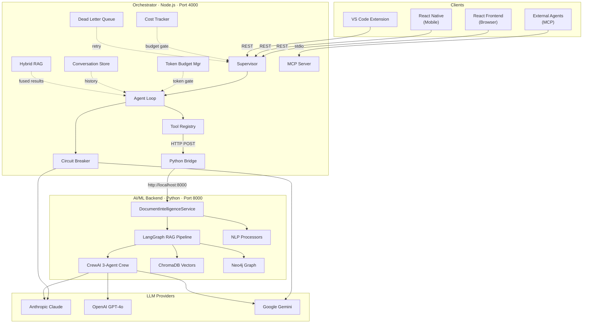

### Layer Responsibilities

| Layer | Runtime | Port | What It Does |
|-------|---------|------|--------------|
| **Orchestrator** | Node.js 18+ / Express | `4000` | Intent classification, task decomposition, agent tool-use loops, cost/token budgeting, circuit breaking, prompt caching, MCP server/client |
| **AI/ML Backend** | Python 3.10+ / FastAPI | `8000` | LangGraph stateful RAG, CrewAI multi-agent validation, embeddings, vector search, knowledge graph, NER, sentiment, translation |

---

## Request Lifecycle

Every request through the orchestrator follows this flow:

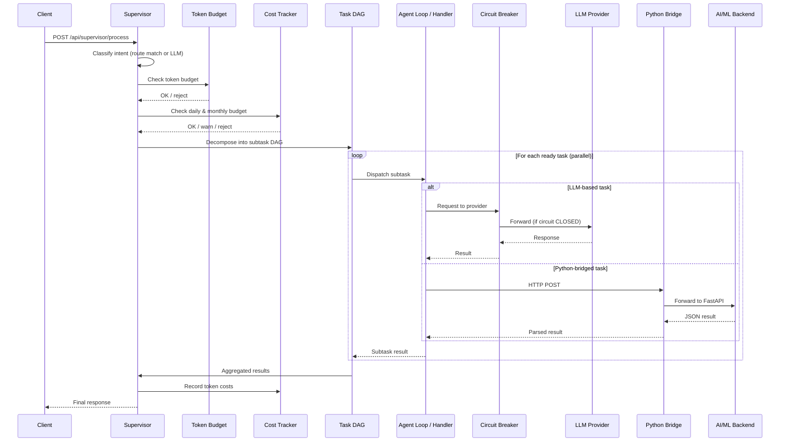

---

## Orchestrator Layer (Node.js)

### Supervisor & Intent Routing

The Supervisor is the orchestrator's brain. It classifies every incoming request into one of 18+ intent types and builds an execution plan.

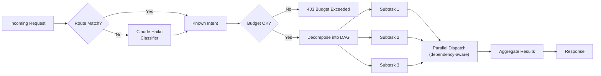

**Intent categories:**

| Category | Intent Types |
|----------|-------------|
| Document Ops | `document.upload`, `document.summarize`, `document.keyIdeas`, `document.sentiment`, `document.bulletSummary`, `document.rewrite`, `document.recommendations`, `document.discussionPoints` |
| Chat | `chat.document`, `chat.voice`, `chat.general` |
| Batch | `batch.process` |
| System | `system.health`, `system.costs` |
| Knowledge | `rag.query`, `graph.query` |

**Task decomposition example — `document.upload`:**

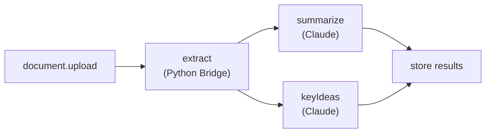

### Agent Loop (Tool-Use Cycle)

The Agent Loop implements the **ReAct pattern** — iteratively calling an LLM that can request tool executions, feeding results back until the model produces a final answer.

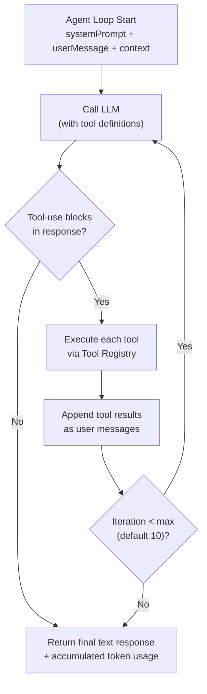

**Key properties:**
- Max 10 iterations by default (configurable)
- Accumulates token usage across all iterations
- Injects document text, title, previous summary, and user preferences into context
- Supports both Claude and Gemini providers (Gemini has tool-use stripped for compatibility)

### Tool Registry

The Tool Registry manages all tools available to the Agent Loop, in Anthropic tool-use schema format.

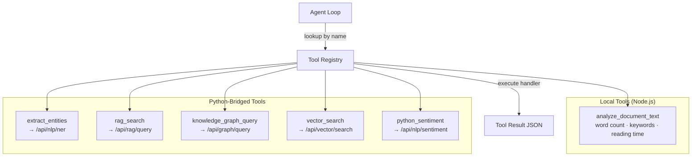

### Python Bridge

The Python Bridge is the HTTP client connecting the orchestrator to the AI/ML backend.

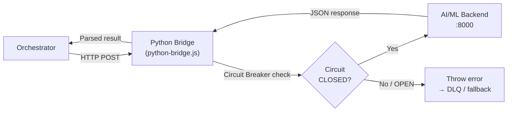

**Endpoints called by the bridge:**

| Bridge Method | AI/ML Endpoint | Payload | Purpose |
|---------------|---------------|---------|---------|
| `analyzeDocument()` | `POST /api/analyze` | `{text, operations[], provider}` | Full document analysis pipeline |
| `queryRAG()` | `POST /api/rag/query` | `{query, top_k}` | Semantic search across indexed docs |
| `crewAnalyze()` | `POST /api/crew/analyze` | `{text, task_type}` | CrewAI multi-agent analysis |
| `extractEntities()` | `POST /api/nlp/ner` | `{text}` | Named entity recognition |
| `analyzeSentiment()` | `POST /api/nlp/sentiment` | `{text}` | Sentiment analysis |
| `searchVectors()` | `POST /api/vector/search` | `{query, top_k}` | ChromaDB semantic search |
| `queryGraph()` | `POST /api/graph/query` | `{cypher}` | Neo4j Cypher queries |
| `healthCheck()` | `GET /health` | — | Service health check |

### Resilience Stack

The orchestrator wraps every external call in multiple layers of fault tolerance.

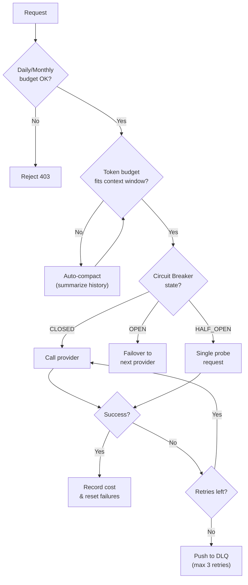

**Components:**

| Component | What It Does |
|-----------|-------------|
| **Circuit Breaker** | Per-provider CLOSED→OPEN→HALF_OPEN state machine. Trips after N failures (default 3), recovers after cooldown (default 60s). |
| **Cost Tracker** | Real token pricing for Claude, GPT-4, Gemini. Enforces daily ($10) and monthly ($200) budgets. Warns at 80%. |
| **Dead Letter Queue** | Retries failed ops up to 3 times, then stores for inspection. Exposes stats via `/api/dlq`. |
| **Token Budget Manager** | Estimates tokens for 7+ models, checks context windows (200K Claude, 2M Gemini), auto-compacts via summarization. |

### Context Management

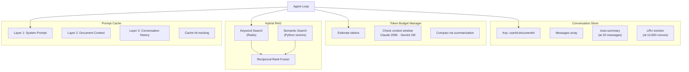

### MCP Integration

The orchestrator exposes and consumes tools via the **Model Context Protocol**.

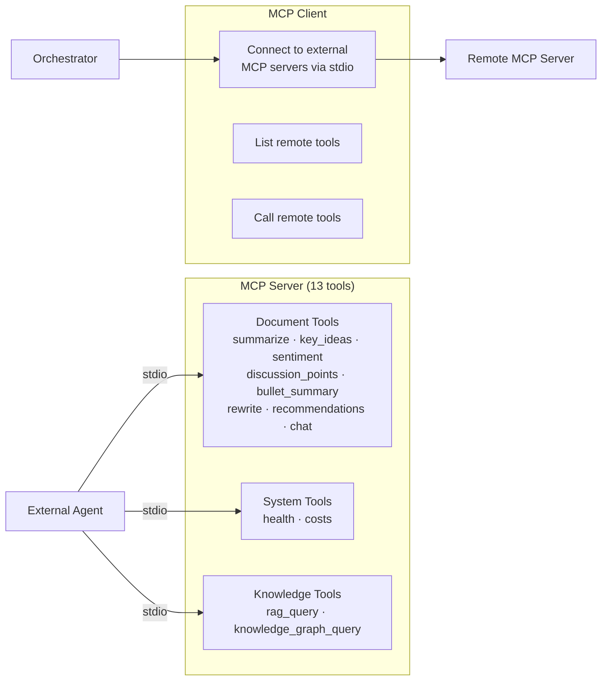

---

## AI/ML Pipeline (Python)

### DocumentIntelligenceService

The `DocumentIntelligenceService` is the central facade that orchestrates all AI/ML capabilities. Every request flows through it.

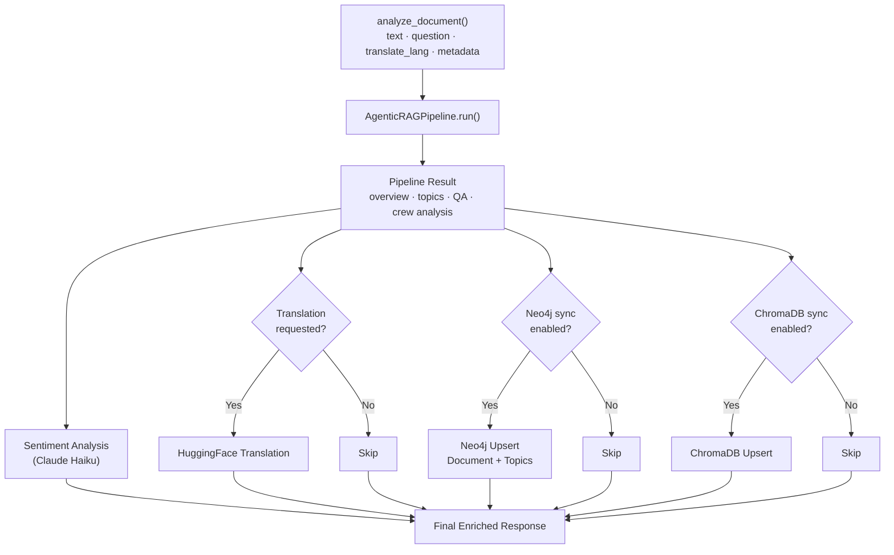

### LangGraph RAG Pipeline

The heart of the AI/ML layer is a **4-node LangGraph state machine** that processes documents through ingestion, retrieval, multi-agent validation, and finalization.

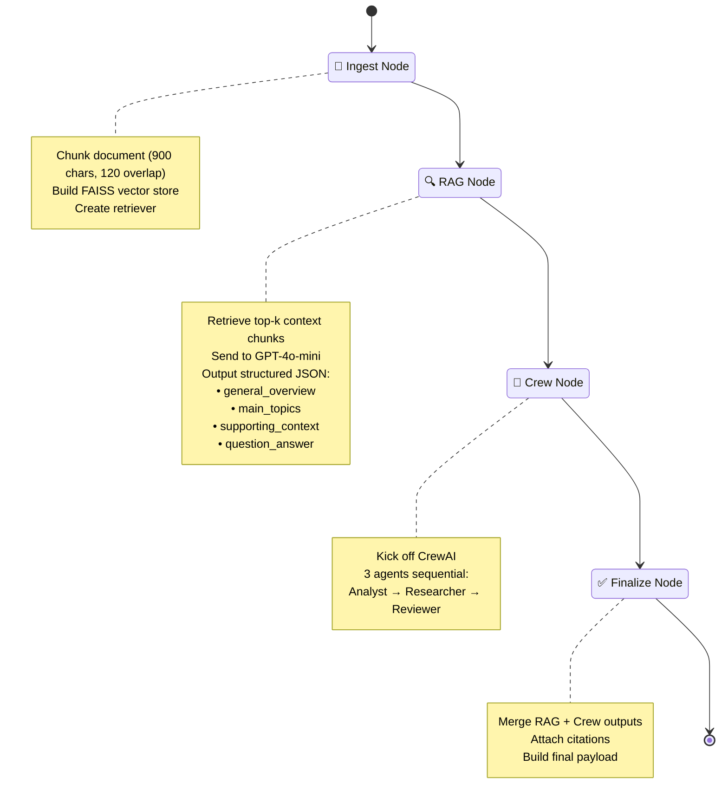

**Detailed node-by-node:**

```mermaid
flowchart LR
    subgraph "1 · Ingest"
        DOC["Raw Document Text"]
        CHUNK["RecursiveCharacterTextSplitter<br/>900 chars · 120 overlap"]
        EMBED["sentence-transformers<br/>all-MiniLM-L6-v2"]
        FAISS["FAISS In-Memory<br/>Vector Store"]
        DOC --> CHUNK --> EMBED --> FAISS
    end

    subgraph "2 · RAG"
        QUERY["User Question<br/>(or default prompt)"]
        RETR["Retrieve top-k<br/>from FAISS"]
        PROMPT["Build RAG prompt<br/>with context"]
        GPT["GPT-4o-mini<br/>temp 0.05"]
        JSON["Structured JSON<br/>output"]
        QUERY --> RETR --> PROMPT --> GPT --> JSON
    end

    subgraph "3 · Crew"
        ANALYST["Document Analyst<br/>(GPT-4o)"]
        XREF["Cross-Referencer<br/>(Gemini 1.5 Pro)"]
        CURATOR["Insights Curator<br/>(Claude 3.5 Sonnet)"]
        ANALYST -->|sequential| XREF -->|sequential| CURATOR
    end

    subgraph "4 · Finalize"
        MERGE["Merge RAG + Crew"]
        CITE["Attach Citations"]
        OUT["Final Payload"]
        MERGE --> CITE --> OUT
    end

    FAISS -.->|retriever| RETR
    JSON --> ANALYST
    CURATOR --> MERGE
```

### CrewAI Multi-Agent Collaboration

Three specialized agents work sequentially, each using a different LLM provider for diversity of perspective.

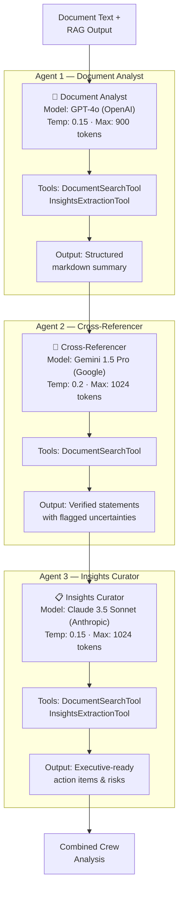

**Why three different providers?**

Each model brings different strengths — OpenAI for structured analysis, Gemini for broad factual grounding, and Claude for nuanced reasoning. Running them sequentially creates a **validation pipeline** where each agent can build on and challenge the previous agent's work.

### Vector & Graph Stores

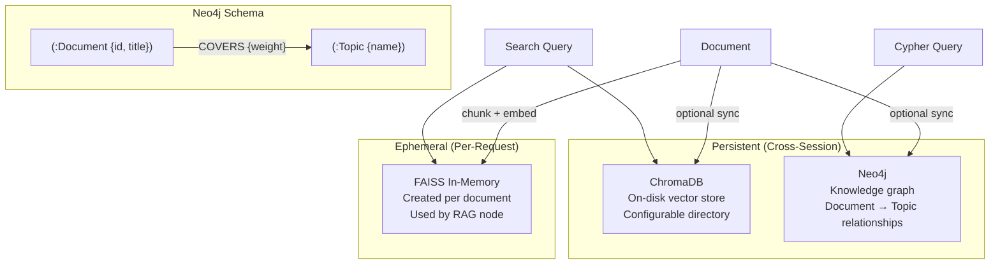

**Vector store options:**

| Store | Type | Scope | Use Case |
|-------|------|-------|----------|
| **FAISS** | In-memory | Per-request | Fast retrieval during RAG pipeline execution |
| **ChromaDB** | On-disk | Cross-session | Persistent semantic recall across conversations |
| **Neo4j** | Graph DB | Cross-session | Relationship mapping, topic clustering, Cypher queries |

### LLM Provider Registry

The `LLMProviderRegistry` provides lazy-loaded, cached access to all LLM and embedding models.

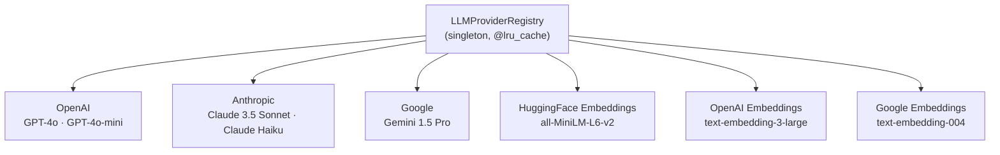

### Processing Modules

Thin wrappers around the `DocumentIntelligenceService` for specific tasks:

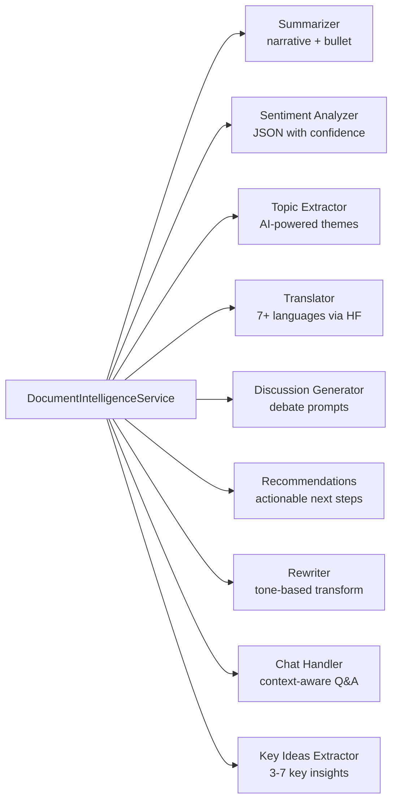

---

## Data Flow Examples

### Document Upload & Analysis

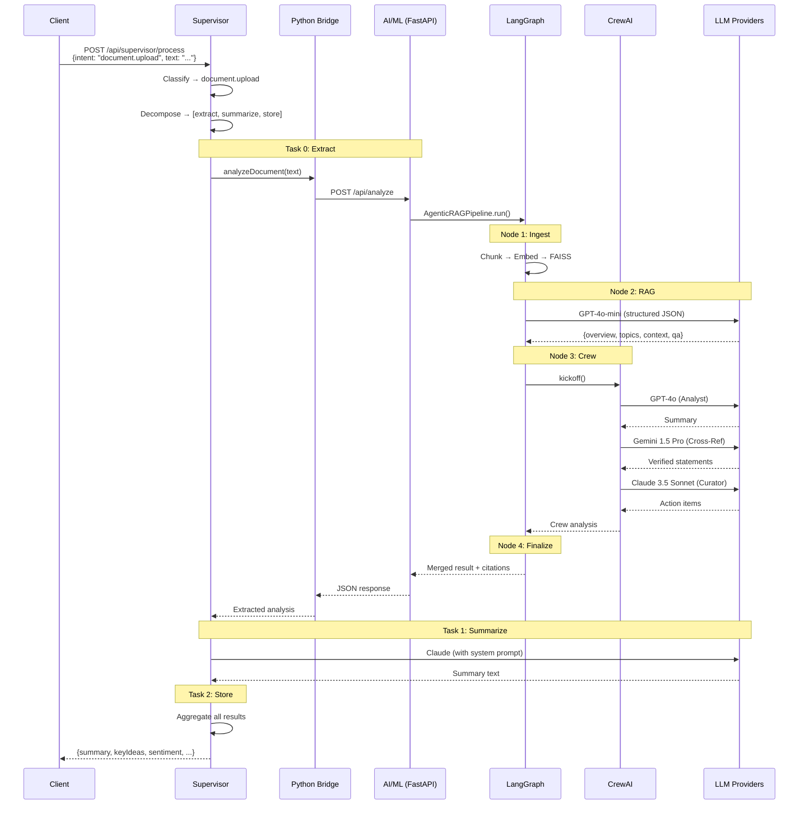

### Document Chat with Agent Loop

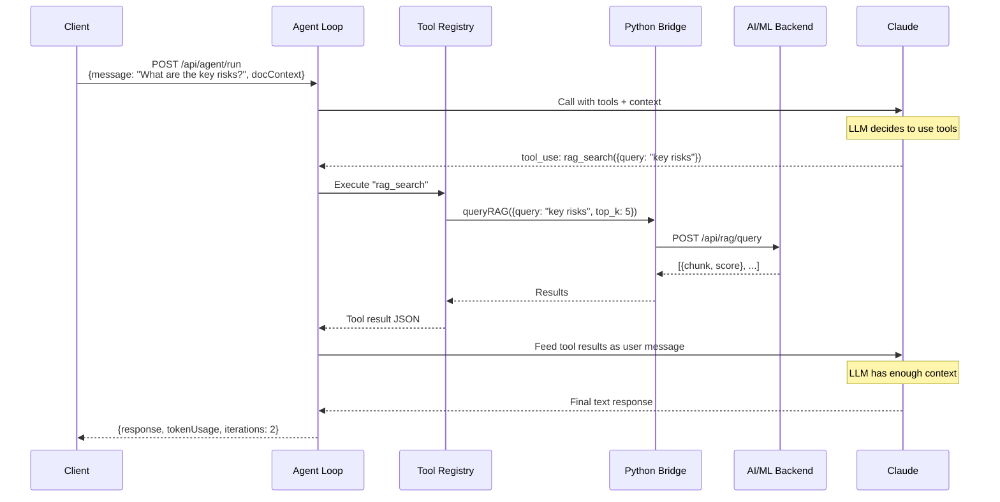

### Batch Processing

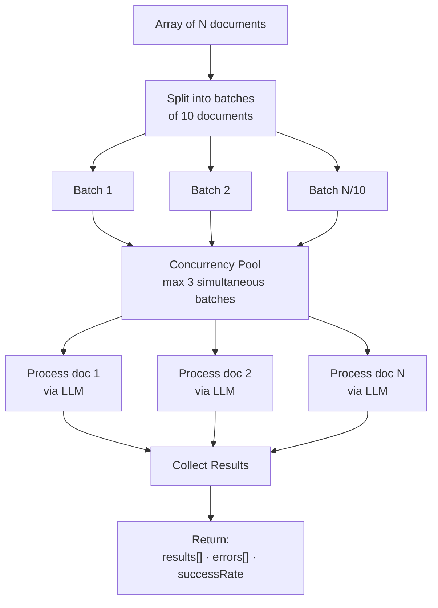

---

## Model Configuration Reference

### AI/ML Pipeline Models

| Role | Model | Provider | Temperature | Max Tokens | Purpose |
|------|-------|----------|-------------|------------|---------|
| RAG QA | `gpt-4o-mini` | OpenAI | 0.05 | 900 | Structured JSON extraction |
| Document Analyst | `gpt-4o` | OpenAI | 0.15 | 900 | Holistic summarization |
| Cross-Referencer | `gemini-1.5-pro` | Google | 0.20 | 1024 | Fact verification |
| Insights Curator | `claude-3-5-sonnet-20241022` | Anthropic | 0.15 | 1024 | Executive recommendations |
| Sentiment | `claude-3-haiku-20240307` | Anthropic | 0.05 | 512 | Sentiment scoring |

### Orchestrator Models

| Role | Model | Provider | Purpose |
|------|-------|----------|---------|
| Primary LLM | Claude (configurable) | Anthropic | Document ops, chat, summarization |
| Fallback LLM | Gemini (configurable) | Google | Provider failover, voice/translation preferred |
| Intent Classifier | Claude Haiku | Anthropic | Low-cost intent classification |

### Embedding Models

| Provider | Model | Dimensions | Use Case |
|----------|-------|------------|----------|
| HuggingFace (default) | `all-MiniLM-L6-v2` | 384 | Local, fast, no API cost |
| OpenAI | `text-embedding-3-large` | 3072 | High-quality, API-based |
| Google | `text-embedding-004` | 768 | Alternative API-based |

---

## Environment Variables

### Orchestrator

| Variable | Default | Description |
|----------|---------|-------------|
| `PORT` | `4000` | Server port |
| `AI_ML_SERVICE_URL` | `http://localhost:8000` | Python AI/ML backend URL |
| `ANTHROPIC_API_KEY` | — | Claude API access |
| `GOOGLE_AI_API_KEY` | — | Gemini API access |
| `DAILY_BUDGET` | `10` | USD daily limit |
| `MONTHLY_BUDGET` | `200` | USD monthly limit |
| `CIRCUIT_BREAKER_THRESHOLD` | `3` | Failures before tripping |
| `CIRCUIT_BREAKER_COOLDOWN_MS` | `60000` | Cooldown before probe |
| `REDIS_URL` | — | For hybrid RAG keyword search |
| `BACKEND_URL` | `http://localhost:3000` | Backend proxy target |

### AI/ML Backend

| Variable | Default | Description |
|----------|---------|-------------|
| `OPENAI_API_KEY` | — | OpenAI access |
| `ANTHROPIC_API_KEY` | — | Anthropic access |
| `GOOGLE_API_KEY` | — | Google AI access |
| `DOCUTHINKER_OPENAI_MODEL` | `gpt-4o-mini` | Override OpenAI model |
| `DOCUTHINKER_CLAUDE_MODEL` | `claude-3-5-sonnet-20241022` | Override Claude model |
| `DOCUTHINKER_GEMINI_MODEL` | `gemini-1.5-pro` | Override Gemini model |
| `DOCUTHINKER_CHUNK_SIZE` | `900` | Document chunk size (chars) |
| `DOCUTHINKER_CHUNK_OVERLAP` | `120` | Chunk overlap (chars) |
| `DOCUTHINKER_EMBEDDING_PROVIDER` | `huggingface` | Embedding provider |
| `DOCUTHINKER_EMBEDDING_MODEL` | `all-MiniLM-L6-v2` | Embedding model |
| `DOCUTHINKER_SYNC_GRAPH` | `false` | Auto-sync to Neo4j |
| `DOCUTHINKER_SYNC_VECTOR` | `false` | Auto-sync to ChromaDB |
| `DOCUTHINKER_NEO4J_URI` | — | Neo4j connection URI |
| `DOCUTHINKER_CHROMA_DIR` | — | ChromaDB persistence dir |

---

## API Surface

### Orchestrator Endpoints (Port 4000)

| Method | Endpoint | Description |
|--------|----------|-------------|
| `GET` | `/health` | Full system health (circuits, costs, cache, DLQ) |
| `POST` | `/api/supervisor/process` | Main entry — classify, decompose, dispatch, aggregate |
| `POST` | `/api/agent/run` | Agent tool-use loop |
| `POST` | `/api/batch/process` | Multi-document batch processing |
| `POST` | `/api/token-check` | Context window verification |
| `POST` | `/api/tools/execute` | Direct tool execution |
| `GET` | `/api/tools` | List registered tools |
| `GET` | `/api/costs` | Cost report by provider/intent |
| `GET` | `/api/circuits` | Circuit breaker states |
| `GET` | `/api/context-metrics` | Context utilization metrics |
| `GET` | `/api/dlq` | Dead letter queue stats |
| `POST` | `/api/conversations/:userId/:docId/message` | Add conversation message |
| `GET` | `/api/conversations/:userId/:docId` | Get conversation history |
| `DELETE` | `/api/conversations/:userId/:docId` | Clear conversation |

### AI/ML Endpoints (Port 8000)

| Method | Endpoint | Description |
|--------|----------|-------------|
| `POST` | `/api/analyze` | Full document intelligence pipeline |
| `POST` | `/api/rag/query` | Semantic RAG search |
| `POST` | `/api/crew/analyze` | CrewAI multi-agent analysis |
| `POST` | `/api/nlp/ner` | Named entity recognition |
| `POST` | `/api/nlp/sentiment` | Sentiment analysis |
| `POST` | `/api/vector/search` | ChromaDB vector search |
| `POST` | `/api/graph/query` | Neo4j Cypher queries |
| `GET` | `/health` | Service health |

### MCP Tools (stdio)

**Orchestrator MCP Server (13 tools):** `document_summarize`, `document_key_ideas`, `document_sentiment`, `document_discussion_points`, `document_analytics`, `document_bullet_summary`, `document_rewrite`, `document_recommendations`, `document_chat`, `system_health`, `system_costs`, `rag_query`, `knowledge_graph_query`

**AI/ML MCP Server (7 tools):** `agentic_document_brief`, `semantic_document_search`, `quick_topics`, `vector_upsert`, `vector_search`, `graph_upsert`, `graph_query`
