# DocuThinker Architecture Documentation

## Table of Contents

- [Overview](#overview)
- [System Architecture](#system-architecture)
- [Production DevOps Platform](#production-devops-platform)
- [Frontend Architecture](#frontend-architecture)
- [Backend Architecture](#backend-architecture)
- [AI/ML Pipeline](#aiml-pipeline)
- [Database Architecture](#database-architecture)
- [Service Mesh Architecture](#service-mesh-architecture)
- [Observability & Monitoring](#observability--monitoring)
- [Security Architecture](#security-architecture)
- [Reliability Engineering](#reliability-engineering)
- [Progressive Delivery](#progressive-delivery)
- [Autoscaling Strategy](#autoscaling-strategy)
- [Deployment Architecture](#deployment-architecture)
- [Container Orchestration](#container-orchestration)
- [Scalability & Performance](#scalability--performance)
- [Technology Stack](#technology-stack)

---

## Overview

DocuThinker is an **enterprise-grade**, full-stack AI-powered document analysis and summarization application built using the **FERN Stack** (Firebase, Express, React, Node.js). The application has been enhanced with a comprehensive DevOps platform featuring 15+ production-ready components for security, reliability, and scalability.

### Core Features

- **Document Upload & Processing**: Multi-format document support (PDF, DOCX, TXT)
- **AI-Powered Summarization**: Advanced summarization using Google Cloud NLP and LangChain
- **Intelligent Chat**: Context-aware conversational AI for document Q&A
- **Multi-Language Support**: Document processing and summarization in multiple languages
- **Real-time Analytics**: User behavior tracking and document analytics
- **Sentiment Analysis**: Emotional tone detection in documents
- **Named Entity Recognition (NER)**: Extraction of key entities from documents
- **Content Rewriting**: Style-based content transformation
- **Semantic Search**: Vector-based document search using embeddings
- **User Management**: Firebase Authentication with social login options
- **Cloud-Native Architecture**: Kubernetes-based deployment with microservices
- **Observability**: Full-stack monitoring with OpenTelemetry, Prometheus, Grafana, and Jaeger
- **Security**: mTLS, OPA policy enforcement, runtime security with Falco
- **Reliability Engineering**: Chaos testing with Litmus, disaster recovery with Velero

### DevOps Platform Features

- **Blue/Green Deployments**: Zero-downtime releases with Istio
- **Canary Releases**: Gradual rollouts with Flagger
- **Service Mesh**: Istio for mTLS, traffic management, and circuit breaking
- **Policy Enforcement**: OPA Gatekeeper for security and compliance
- **Chaos Engineering**: Litmus for resilience testing
- **Progressive Delivery**: Flagger for automated canary deployments
- **Event-Driven Autoscaling**: KEDA for cost-optimized scaling
- **Runtime Security**: Falco for threat detection
- **Distributed Tracing**: OpenTelemetry with Jaeger integration
- **Disaster Recovery**: Velero for automated backups
- **SLO/SLI Monitoring**: Error budget tracking and alerting
- **TLS Automation**: cert-manager for certificate management

---

## System Architecture

The application follows a **cloud-native, microservices-oriented architecture** with enterprise-grade DevOps components across multiple layers.

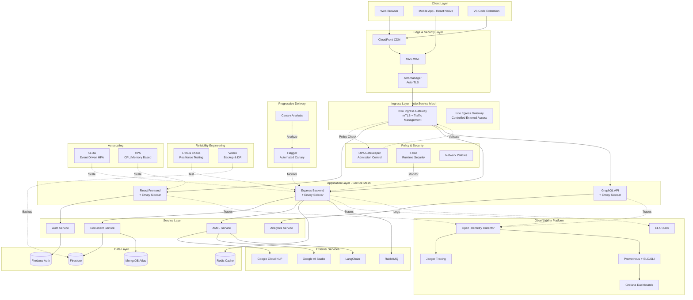
```mermaid
graph TB
    subgraph "Client Layer"
        A[Web Browser]
        B[Mobile App - React Native]
        C[VS Code Extension]
    end

    subgraph "Edge & Security Layer"
        D[CloudFront CDN]
        E[AWS WAF]
        F[cert-manager<br/>Auto TLS]
    end

    subgraph "Ingress Layer - Istio Service Mesh"
        G[Istio Ingress Gateway<br/>mTLS + Traffic Management]
        H[Istio Egress Gateway<br/>Controlled External Access]
    end

    subgraph "Policy & Security"
        I[OPA Gatekeeper<br/>Admission Control]
        J[Falco<br/>Runtime Security]
        K[Network Policies]
    end

    subgraph "Application Layer - Service Mesh"
        L[React Frontend<br/>+ Envoy Sidecar]
        M[Express Backend<br/>+ Envoy Sidecar]
        N[GraphQL API<br/>+ Envoy Sidecar]
    end

    subgraph "Progressive Delivery"
        O[Flagger<br/>Automated Canary]
        P[Canary Analysis]
    end

    subgraph "Service Layer"
        Q[Auth Service]
        R[Document Service]
        S[AI/ML Service]
        T[Analytics Service]
    end

    subgraph "Data Layer"
        U[(Firebase Auth)]
        V[(Firestore)]
        W[(MongoDB Atlas)]
        X[(Redis Cache)]
    end

    subgraph "Observability Platform"
        Y[OpenTelemetry Collector]
        Z[Prometheus + SLO/SLI]
        AA[Grafana Dashboards]
        AB[Jaeger Tracing]
        AC[ELK Stack]
    end

    subgraph "Reliability Engineering"
        AD[Litmus Chaos<br/>Resilience Testing]
        AE[Velero<br/>Backup & DR]
    end

    subgraph "Autoscaling"
        AF[KEDA<br/>Event-Driven HPA]
        AG[HPA<br/>CPU/Memory Based]
    end

    subgraph "External Services"
        AH[Google Cloud NLP]
        AI[Google AI Studio]
        AJ[LangChain]
        AK[RabbitMQ]
    end

    A --> D
    B --> E
    C --> D
    D --> E
    E --> F
    F --> G

    G -.->|Policy Check| I
    I -.->|Validate| G
    G --> L
    G --> M
    G --> N

    L --> Q
    M --> R
    M --> S
    N --> T

    O -.->|Monitor| M
    P -.->|Analyze| O

    Q --> U
    R --> V
    R --> W
    S --> AH
    S --> AI
    S --> AJ
    M --> X
    M --> AK

    L -.->|Traces| Y
    M -.->|Traces| Y
    N -.->|Traces| Y

    Y --> AB
    Y --> Z
    Z --> AA
    M -.->|Logs| AC

    J -.->|Monitor| M
    AD -.->|Test| M
    AE -.->|Backup| V

    AF -.->|Scale| M
    AG -.->|Scale| L
```

---

## Production DevOps Platform

Complete enterprise DevOps infrastructure with 15 integrated components.

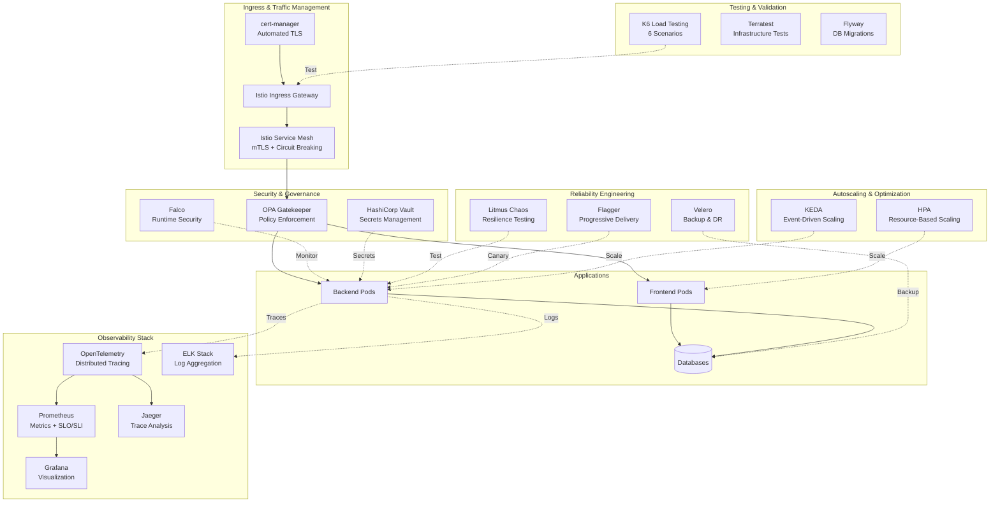
```mermaid
graph TB
    subgraph "Ingress & Traffic Management"
        SM[Istio Service Mesh<br/>mTLS + Circuit Breaking]
        IG[Istio Ingress Gateway]
        TLS[cert-manager<br/>Automated TLS]
    end

    subgraph "Security & Governance"
        OPA[OPA Gatekeeper<br/>Policy Enforcement]
        FALCO[Falco<br/>Runtime Security]
        VAULT[HashiCorp Vault<br/>Secrets Management]
    end

    subgraph "Applications"
        FE[Frontend Pods]
        BE[Backend Pods]
        DB[(Databases)]
    end

    subgraph "Observability Stack"
        OTEL[OpenTelemetry<br/>Distributed Tracing]
        PROM[Prometheus<br/>Metrics + SLO/SLI]
        GRAF[Grafana<br/>Visualization]
        JAEGER[Jaeger<br/>Trace Analysis]
        ELK[ELK Stack<br/>Log Aggregation]
    end

    subgraph "Reliability Engineering"
        LITMUS[Litmus Chaos<br/>Resilience Testing]
        FLAGGER[Flagger<br/>Progressive Delivery]
        VELERO[Velero<br/>Backup & DR]
    end

    subgraph "Autoscaling & Optimization"
        KEDA[KEDA<br/>Event-Driven Scaling]
        HPA[HPA<br/>Resource-Based Scaling]
    end

    subgraph "Testing & Validation"
        K6[K6 Load Testing<br/>6 Scenarios]
        TERRATEST[Terratest<br/>Infrastructure Tests]
        FLYWAY[Flyway<br/>DB Migrations]
    end

    TLS --> IG
    IG --> SM
    SM --> OPA
    OPA --> FE
    OPA --> BE

    FALCO -.->|Monitor| BE
    VAULT -.->|Secrets| BE

    FE --> DB
    BE --> DB

    BE -.->|Traces| OTEL
    OTEL --> JAEGER
    OTEL --> PROM
    PROM --> GRAF
    BE -.->|Logs| ELK

    LITMUS -.->|Test| BE
    FLAGGER -.->|Canary| BE
    VELERO -.->|Backup| DB

    KEDA -.->|Scale| BE
    HPA -.->|Scale| FE

    K6 -.->|Test| IG
```

---

## Frontend Architecture

The frontend is built with **React 18** and follows a component-based architecture with modern React patterns.

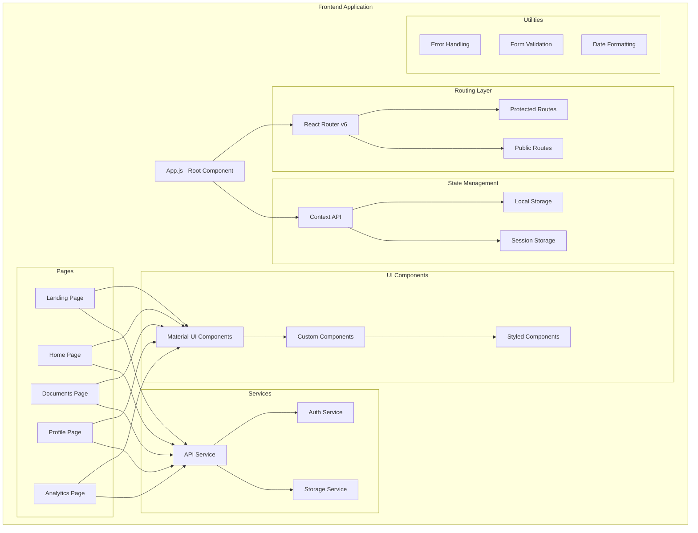
```mermaid
graph TB
    subgraph "Frontend Application"
        A[App.js - Root Component]

        subgraph "Routing Layer"
            B[React Router v6]
            C[Protected Routes]
            D[Public Routes]
        end

        subgraph "State Management"
            E[Context API]
            F[Local Storage]
            G[Session Storage]
        end

        subgraph "UI Components"
            H[Material-UI Components]
            I[Custom Components]
            J[Styled Components]
        end

        subgraph "Pages"
            K[Landing Page]
            L[Home Page]
            M[Documents Page]
            N[Profile Page]
            O[Analytics Page]
        end

        subgraph "Services"
            P[API Service]
            Q[Auth Service]
            R[Storage Service]
        end

        subgraph "Utilities"
            S[Error Handling]
            T[Form Validation]
            U[Date Formatting]
        end
    end

    A --> B
    B --> C
    B --> D
    A --> E
    E --> F
    E --> G
    K --> H
    L --> H
    M --> H
    N --> H
    O --> H
    H --> I
    I --> J
    P --> Q
    P --> R
    K --> P
    L --> P
    M --> P
    N --> P
    O --> P
```

---

## Backend Architecture

The backend follows the **MVC (Model-View-Controller)** pattern with additional service layers for business logic.

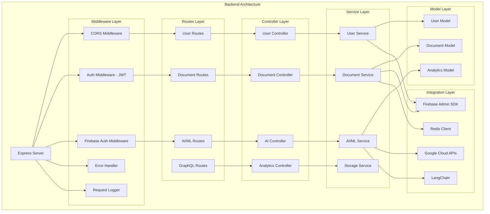
```mermaid
graph TB
    subgraph "Backend Architecture"
        A[Express Server]

        subgraph "Middleware Layer"
            B[CORS Middleware]
            C[Auth Middleware - JWT]
            D[Firebase Auth Middleware]
            E[Error Handler]
            F[Request Logger]
        end

        subgraph "Routes Layer"
            G[User Routes]
            H[Document Routes]
            I[AI/ML Routes]
            J[GraphQL Routes]
        end

        subgraph "Controller Layer"
            K[User Controller]
            L[Document Controller]
            M[AI Controller]
            N[Analytics Controller]
        end

        subgraph "Service Layer"
            O[User Service]
            P[Document Service]
            Q[AI/ML Service]
            R[Storage Service]
        end

        subgraph "Model Layer"
            S[User Model]
            T[Document Model]
            U[Analytics Model]
        end

        subgraph "Integration Layer"
            V[Firebase Admin SDK]
            W[Google Cloud APIs]
            X[LangChain]
            Y[Redis Client]
        end
    end

    A --> B
    A --> C
    A --> D
    A --> E
    A --> F

    B --> G
    C --> H
    D --> I

    G --> K
    H --> L
    I --> M
    J --> N

    K --> O
    L --> P
    M --> Q
    N --> R

    O --> S
    P --> T
    Q --> U

    O --> V
    P --> V
    Q --> W
    Q --> X
    P --> Y
```

### MVC Pattern Implementation

#### Controllers
Handle HTTP requests and responses, coordinate between services and views.

```javascript
// Example Controller Structure
exports.uploadDocument = async (req, res) => {
  try {
    // 1. Parse request
    const { userId, file } = req.body;

    // 2. Validate input
    if (!file) throw new Error('No file provided');

    // 3. Call service layer
    const result = await documentService.processDocument(userId, file);

    // 4. Format response
    sendSuccessResponse(res, 200, 'Document uploaded successfully', result);
  } catch (error) {
    // 5. Handle errors
    sendErrorResponse(res, 400, 'Document upload failed', error.message);
  }
};
```

#### Services
Contain business logic and interact with data models and external APIs.

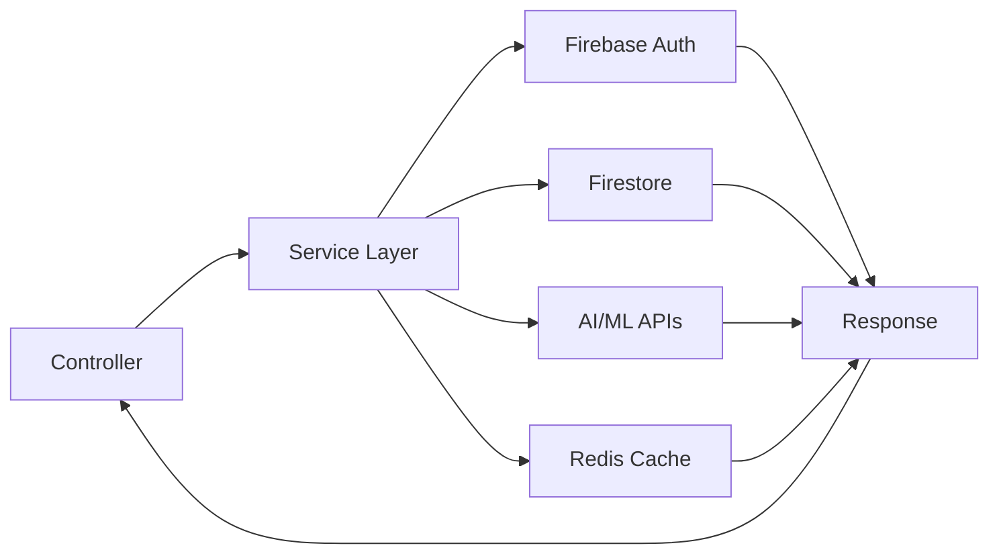
```mermaid
graph LR
    A[Controller] --> B[Service Layer]
    B --> C[Firebase Auth]
    B --> D[Firestore]
    B --> E[AI/ML APIs]
    B --> F[Redis Cache]
    C --> G[Response]
    D --> G
    E --> G
    F --> G
    G --> A
```

#### Models
Define data schemas and database interactions.

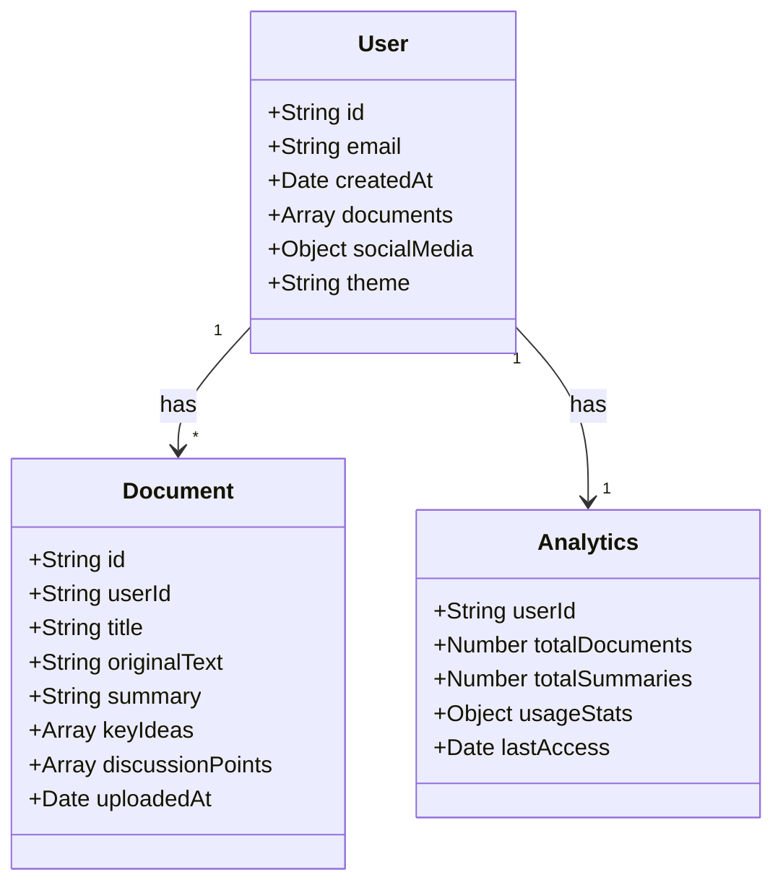
```mermaid
classDiagram
    class User {
        +String id
        +String email
        +Date createdAt
        +Array documents
        +Object socialMedia
        +String theme
    }

    class Document {
        +String id
        +String userId
        +String title
        +String originalText
        +String summary
        +Array keyIdeas
        +Array discussionPoints
        +Date uploadedAt
    }

    class Analytics {
        +String userId
        +Number totalDocuments
        +Number totalSummaries
        +Object usageStats
        +Date lastAccess
    }

    User "1" --> "*" Document : has
    User "1" --> "1" Analytics : has
```

---

## AI/ML Pipeline

DocuThinker's AI/ML pipeline is a **production-ready, multi-agent RAG (Retrieval-Augmented Generation) platform** that orchestrates multiple LLM providers, vector stores, and knowledge graphs for comprehensive document intelligence.

### AI/ML Architecture Overview

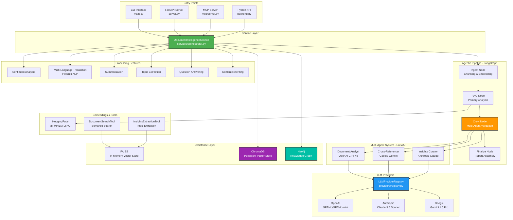
```mermaid
graph TB
    subgraph "Entry Points"
        CLI[CLI Interface<br/>main.py]
        API[FastAPI Server<br/>server.py]
        MCP[MCP Server<br/>mcp/server.py]
        PY[Python API<br/>backend.py]
    end

    subgraph "Service Layer"
        SERVICE[DocumentIntelligenceService<br/>services/orchestrator.py]
    end

    subgraph "Agentic Pipeline - LangGraph"
        INGEST[Ingest Node<br/>Chunking & Embedding]
        RAG_NODE[RAG Node<br/>Primary Analysis]
        CREW_NODE[Crew Node<br/>Multi-Agent Validation]
        FINAL[Finalize Node<br/>Report Assembly]
    end

    subgraph "Multi-Agent System - CrewAI"
        ANALYST[Document Analyst<br/>OpenAI GPT-4o]
        RESEARCHER[Cross-Referencer<br/>Google Gemini]
        REVIEWER[Insights Curator<br/>Anthropic Claude]
    end

    subgraph "LLM Providers"
        REGISTRY[LLMProviderRegistry<br/>providers/registry.py]
        OPENAI[OpenAI<br/>GPT-4o/GPT-4o-mini]
        ANTHROPIC[Anthropic<br/>Claude 3.5 Sonnet]
        GEMINI[Google<br/>Gemini 1.5 Pro]
    end

    subgraph "Embeddings & Tools"
        HF[HuggingFace<br/>all-MiniLM-L6-v2]
        SEARCH[DocumentSearchTool<br/>Semantic Search]
        INSIGHTS[InsightsExtractionTool<br/>Topic Extraction]
    end

    subgraph "Persistence Layer"
        FAISS[FAISS<br/>In-Memory Vector Store]
        CHROMA[ChromaDB<br/>Persistent Vector Store]
        NEO4J[Neo4j<br/>Knowledge Graph]
    end

    subgraph "Processing Features"
        SENTIMENT[Sentiment Analysis]
        TRANSLATION[Multi-Language Translation<br/>Helsinki-NLP]
        SUMMARIZE[Summarization]
        TOPIC[Topic Extraction]
        QA[Question Answering]
        REWRITE[Content Rewriting]
    end

    CLI --> SERVICE
    API --> SERVICE
    MCP --> SERVICE
    PY --> SERVICE

    SERVICE --> INGEST
    INGEST --> RAG_NODE
    RAG_NODE --> CREW_NODE
    CREW_NODE --> FINAL

    CREW_NODE --> ANALYST
    CREW_NODE --> RESEARCHER
    CREW_NODE --> REVIEWER

    ANALYST --> REGISTRY
    RESEARCHER --> REGISTRY
    REVIEWER --> REGISTRY

    REGISTRY --> OPENAI
    REGISTRY --> ANTHROPIC
    REGISTRY --> GEMINI

    RAG_NODE --> HF
    SEARCH --> FAISS
    INSIGHTS --> FAISS

    SERVICE --> CHROMA
    SERVICE --> NEO4J

    SERVICE --> SENTIMENT
    SERVICE --> TRANSLATION
    SERVICE --> SUMMARIZE
    SERVICE --> TOPIC
    SERVICE --> QA
    SERVICE --> REWRITE

    style SERVICE fill:#4CAF50,stroke:#333,stroke-width:3px,color:#fff
    style CREW_NODE fill:#FF9800,stroke:#333,stroke-width:2px,color:#fff
    style REGISTRY fill:#2196F3,stroke:#333,stroke-width:2px,color:#fff
    style NEO4J fill:#00BFA5,stroke:#333,stroke-width:2px,color:#fff
    style CHROMA fill:#9C27B0,stroke:#333,stroke-width:2px,color:#fff
```

### Core Components

#### 1. DocumentIntelligenceService

The main orchestration service that coordinates all AI/ML operations.

**Location**: `ai_ml/services/orchestrator.py`

**Key Responsibilities**:
- Orchestrates the complete agentic RAG pipeline
- Manages LLM provider selection and fallbacks
- Coordinates multi-agent collaboration
- Handles document enrichment (sentiment, translation, topics)
- Manages persistence to vector stores and knowledge graphs

**Key Methods**:
```python
analyze_document()      # Full pipeline execution
summarize()            # Narrative summarization
bullet_summary()       # Bullet-point summaries
extract_topics()       # Topic extraction
answer_question()      # Q&A system
sentiment()            # Sentiment analysis
translate()            # Multi-language translation
semantic_search()      # Vector-based search
```

#### 2. AgenticRAGPipeline (LangGraph)

Stateful multi-step RAG workflow using LangGraph.

**Location**: `ai_ml/pipelines/rag_graph.py`

**Pipeline Flow**:

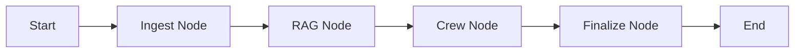
```mermaid
graph LR
    A[Start] --> B[Ingest Node]
    B --> C[RAG Node]
    C --> D[Crew Node]
    D --> E[Finalize Node]
    E --> F[End]
```

**Node Details**:

1. **Ingest Node**
   - Chunks document into manageable pieces (default: 900 chars, 120 overlap)
   - Generates embeddings using HuggingFace models
   - Creates in-memory FAISS vector store
   - Prepares retrieval tools for agents

2. **RAG Node**
   - Performs primary document analysis
   - Uses DocumentSearchTool for semantic retrieval
   - Generates structured JSON output:
     - Overview summary
     - Key topics
     - Q&A answer (if question provided)
     - Supporting context/citations

3. **Crew Node**
   - Invokes CrewAI multi-agent system
   - Three agents collaborate sequentially
   - Validates RAG findings with multiple LLM perspectives
   - Produces executive-level insights

4. **Finalize Node**
   - Merges RAG and Crew outputs
   - Assembles final comprehensive report
   - Returns structured payload

#### 3. Multi-Agent System (CrewAI)

Three specialized agents collaborate for thorough document analysis.

**Location**: `ai_ml/agents/crew_agents.py`

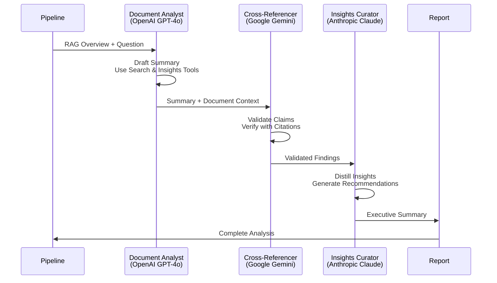
```mermaid
sequenceDiagram
    participant Pipeline
    participant Analyst as Document Analyst<br/>(OpenAI GPT-4o)
    participant Researcher as Cross-Referencer<br/>(Google Gemini)
    participant Reviewer as Insights Curator<br/>(Anthropic Claude)
    participant Report

    Pipeline->>Analyst: RAG Overview + Question
    Analyst->>Analyst: Draft Summary<br/>Use Search & Insights Tools
    Analyst->>Researcher: Summary + Document Context
    Researcher->>Researcher: Validate Claims<br/>Verify with Citations
    Researcher->>Reviewer: Validated Findings
    Reviewer->>Reviewer: Distill Insights<br/>Generate Recommendations
    Reviewer->>Report: Executive Summary
    Report->>Pipeline: Complete Analysis
```

**Agent Specifications**:

| Agent | LLM | Role | Tools | Output |
|-------|-----|------|-------|--------|
| **Document Analyst** | OpenAI GPT-4o-mini | Lead summarizer | DocumentSearchTool, InsightsExtractionTool | Structured summary with citations |
| **Cross-Referencer** | Google Gemini 1.5 Pro | Fact verifier | DocumentSearchTool | Validated statements with flagged uncertainties |
| **Insights Curator** | Anthropic Claude 3.5 Sonnet | Executive reviewer | DocumentSearchTool, InsightsExtractionTool | Strategic recommendations and action items |

#### 4. LLM Provider Registry

Unified interface for multiple LLM providers with lazy loading.

**Location**: `ai_ml/providers/registry.py`

**Supported Providers**:
- **OpenAI**: GPT-4o, GPT-4o-mini, GPT-4 Turbo
- **Anthropic**: Claude 3.5 Sonnet, Claude 3 Haiku, Claude 3 Opus
- **Google**: Gemini 1.5 Pro, Gemini 1.5 Flash

**Features**:
- Lazy initialization (only loads when needed)
- Automatic fallback to OpenAI if providers unavailable
- Configurable per-model temperature and max tokens
- Caching to prevent duplicate instantiation
- Support for custom model parameters

**Configuration Example**:
```python
LLMConfig(
    provider="openai",           # openai | anthropic | google
    model="gpt-4o-mini",
    temperature=0.15,
    max_tokens=900,
    extra={}                     # Provider-specific parameters
)
```

#### 5. Vector Stores

**FAISS (In-Memory)**:
- Used for per-document semantic search
- Fast, ephemeral retrieval during analysis
- Automatically created in RAG pipeline

**ChromaDB (Persistent)**:
- Optional persistent vector store
- Cross-session semantic search
- Document upsert and query capabilities
- Configurable via `DOCUTHINKER_SYNC_VECTOR=true`

**Location**: `ai_ml/vectorstores/chroma_store.py`

#### 6. Knowledge Graph (Neo4j)

Stores document relationships and topic networks.

**Location**: `ai_ml/graph/neo4j_client.py`

**Schema**:
```cypher
(Document {
  id: String,
  title: String,
  summary: Text,
  updated_at: DateTime,
  metadata: Map
})

(Topic {
  name: String
})

(Document)-[:COVERS]->(Topic)
```

**Use Cases**:
- Find documents by topic
- Discover related documents via shared topics
- Analyze topic trends across documents
- Custom Cypher queries for advanced analytics

### AI/ML Data Flow

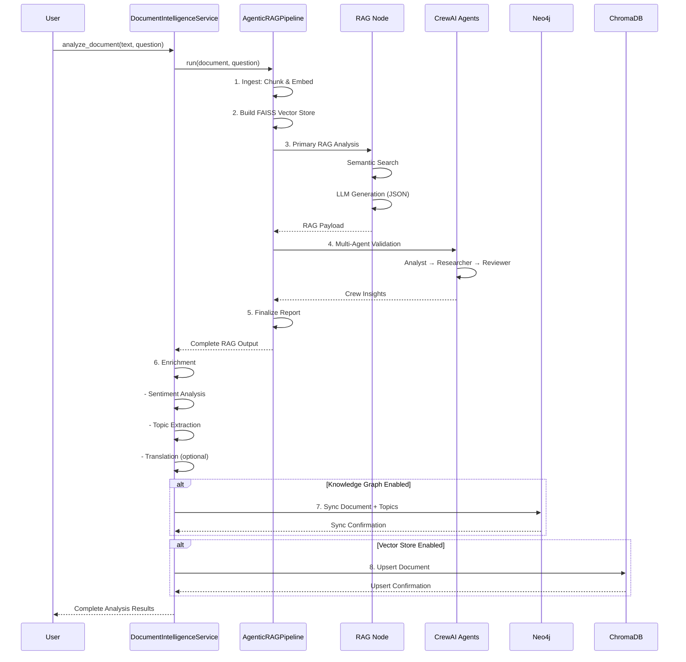
```mermaid
sequenceDiagram
    participant User
    participant Service as DocumentIntelligenceService
    participant Pipeline as AgenticRAGPipeline
    participant RAG as RAG Node
    participant Crew as CrewAI Agents
    participant Neo4j
    participant ChromaDB

    User->>Service: analyze_document(text, question)
    Service->>Pipeline: run(document, question)

    Pipeline->>Pipeline: 1. Ingest: Chunk & Embed
    Pipeline->>Pipeline: 2. Build FAISS Vector Store

    Pipeline->>RAG: 3. Primary RAG Analysis
    RAG->>RAG: Semantic Search
    RAG->>RAG: LLM Generation (JSON)
    RAG-->>Pipeline: RAG Payload

    Pipeline->>Crew: 4. Multi-Agent Validation
    Crew->>Crew: Analyst → Researcher → Reviewer
    Crew-->>Pipeline: Crew Insights

    Pipeline->>Pipeline: 5. Finalize Report
    Pipeline-->>Service: Complete RAG Output

    Service->>Service: 6. Enrichment
    Service->>Service: - Sentiment Analysis
    Service->>Service: - Topic Extraction
    Service->>Service: - Translation (optional)

    alt Knowledge Graph Enabled
        Service->>Neo4j: 7. Sync Document + Topics
        Neo4j-->>Service: Sync Confirmation
    end

    alt Vector Store Enabled
        Service->>ChromaDB: 8. Upsert Document
        ChromaDB-->>Service: Upsert Confirmation
    end

    Service-->>User: Complete Analysis Results
```

### Processing Features

#### Document Summarization

**Types**:
1. **Narrative Summary**: Coherent prose summary
2. **Bullet Summary**: Concise bullet points
3. **Refined Summary**: Iterative improvement of draft summaries

**Models Used**: OpenAI GPT-4o-mini (configurable)

**Location**: `ai_ml/processing/summarizer.py`, `ai_ml/extended_features/`

#### Sentiment Analysis

Returns structured sentiment with confidence scores.

**Output Format**:
```json
{
  "label": "positive | neutral | negative",
  "confidence": 0.85,
  "rationale": "Explanation of sentiment determination"
}
```

**Model**: Anthropic Claude 3 Haiku (fast & cost-effective)

**Location**: `ai_ml/processing/sentiment.py`

#### Topic Extraction

Extracts main themes and topics from documents.

**Methods**:
1. **LLM-based**: Uses primary analyst model
2. **Heuristic-based**: TF-IDF and frequency analysis

**Location**: `ai_ml/processing/topic_extractor.py`

#### Multi-Language Translation

Supports 7+ languages using Helsinki-NLP models.

**Supported Languages**:
- French (fr)
- German (de)
- Spanish (es)
- Italian (it)
- Portuguese (pt)
- Chinese (zh)
- Japanese (ja)

**Models**: `Helsinki-NLP/opus-mt-en-{lang}`

**Location**: `ai_ml/processing/translator.py`, `ai_ml/models/hf_model.py`

#### Question Answering

Context-aware Q&A using RAG pipeline.

**Process**:
1. Document chunks embedded and indexed
2. Question used to retrieve relevant context
3. LLM generates answer with citations
4. Supporting context returned for verification

**Model**: OpenAI GPT-4o-mini or configured QA model

#### Content Rewriting

Style-based document transformation.

**Supported Tones**:
- Professional
- Casual
- Executive
- Technical
- Marketing

**Location**: `ai_ml/extended_features/rewriter.py`

#### Semantic Search

Vector-based document search within or across documents.

**Features**:
- FAISS-backed in-memory search
- ChromaDB-backed persistent search
- Configurable top-K results
- Similarity scores and snippets

**Location**: `ai_ml/tools/document_tools.py`

### Technology Stack

**Core ML Frameworks**:
- **LangChain 0.2.6+**: LLM orchestration and prompt engineering
- **LangGraph 0.0.40+**: Stateful agentic workflows
- **CrewAI 0.28.8+**: Multi-agent collaboration
- **PyTorch 1.10+**: Deep learning framework
- **Transformers 4.38+**: HuggingFace model loading

**LLM Providers**:
- **langchain-openai**: OpenAI integration
- **langchain-anthropic**: Anthropic integration
- **langchain-google-genai**: Google AI integration

**Embeddings & Vector Stores**:
- **sentence-transformers**: Text embeddings
- **FAISS**: Fast similarity search
- **ChromaDB**: Persistent vector database

**Knowledge Graph**:
- **Neo4j 5.11+**: Graph database for document relationships

**Model Optimization**:
- **ONNX**: Model format conversion
- **ONNX Runtime**: Optimized inference
- **Optimum**: HuggingFace ONNX support

**API & Deployment**:
- **FastAPI 0.109+**: REST API framework
- **Uvicorn 0.23+**: ASGI server
- **MCP 0.1.2+**: Model Context Protocol server

**Utilities**:
- **pandas**: Data manipulation
- **matplotlib**: Visualization
- **python-dotenv**: Environment configuration

### Deployment Interfaces

#### 1. CLI Interface

```bash
python -m ai_ml.main documents/sample.txt \
  --question "What are the key findings?" \
  --translate_lang es \
  --doc_id doc-001 \
  --title "Sample Document"
```

#### 2. Python API

```python
from ai_ml.services import get_document_service

service = get_document_service()
results = service.analyze_document(
    document="Document text...",
    question="What are the insights?",
    translate_lang="fr",
    metadata={"id": "doc-001"}
)
```

#### 3. FastAPI Server

```bash
uvicorn ai_ml.server:app --host 0.0.0.0 --port 8000

# POST /analyze endpoint
curl -X POST http://localhost:8000/analyze \
  -H "Content-Type: application/json" \
  -d '{"document": "...", "question": "..."}'
```

#### 4. MCP Server

```bash
python -m ai_ml.mcp.server

# Exposes tools for external consumption:
# - agentic_document_brief
# - semantic_document_search
# - quick_topics
# - vector_upsert/search
# - graph_upsert/query
```

### Configuration

All AI/ML components are configurable via environment variables:

**Core Settings** (`ai_ml/core/settings.py`):
```bash
# LLM Models
DOCUTHINKER_OPENAI_MODEL=gpt-4o-mini
DOCUTHINKER_CLAUDE_MODEL=claude-3-5-sonnet-20241022
DOCUTHINKER_GEMINI_MODEL=gemini-1.5-pro

# Embeddings
DOCUTHINKER_EMBEDDING_PROVIDER=huggingface
DOCUTHINKER_EMBEDDING_MODEL=sentence-transformers/all-MiniLM-L6-v2

# Chunking
DOCUTHINKER_CHUNK_SIZE=900
DOCUTHINKER_CHUNK_OVERLAP=120

# Neo4j
DOCUTHINKER_SYNC_GRAPH=true
DOCUTHINKER_NEO4J_URI=bolt://localhost:7687
DOCUTHINKER_NEO4J_USER=neo4j
DOCUTHINKER_NEO4J_PASSWORD=password

# ChromaDB
DOCUTHINKER_SYNC_VECTOR=true
DOCUTHINKER_CHROMA_DIR=.chroma
DOCUTHINKER_CHROMA_COLLECTION=docuthinker
```

### Performance Characteristics

**Typical Performance** (5K token document, M1 MacBook Pro):

| Operation | Time | Notes |
|-----------|------|-------|
| Full Agentic Analysis | 15-25s | With CrewAI collaboration |
| Summary Only | 3-5s | Single LLM call |
| Topic Extraction | 2-4s | Single LLM call |
| Semantic Search (FAISS) | 100-200ms | In-memory, 10K docs |
| Vector Upsert (ChromaDB) | 50-100ms | Single document |
| Translation | 5-10s | Helsinki-NLP model |
| Sentiment Analysis | 2-3s | Claude Haiku |

**Optimization Features**:
- Lazy model loading (only load when needed)
- Singleton service pattern with caching
- Parallel agent execution (where applicable)
- ONNX model optimization support
- Configurable chunk sizes for memory efficiency

### Integration with Backend

The AI/ML pipeline integrates with the Express backend through:

1. **Direct Python API Calls**: Backend calls Python functions via child processes
2. **REST API**: Backend communicates with FastAPI server
3. **Shared Database**: Results stored in PostgreSQL/Firestore
4. **Message Queue**: Async processing via RabbitMQ
5. **Caching Layer**: Redis caches AI/ML results

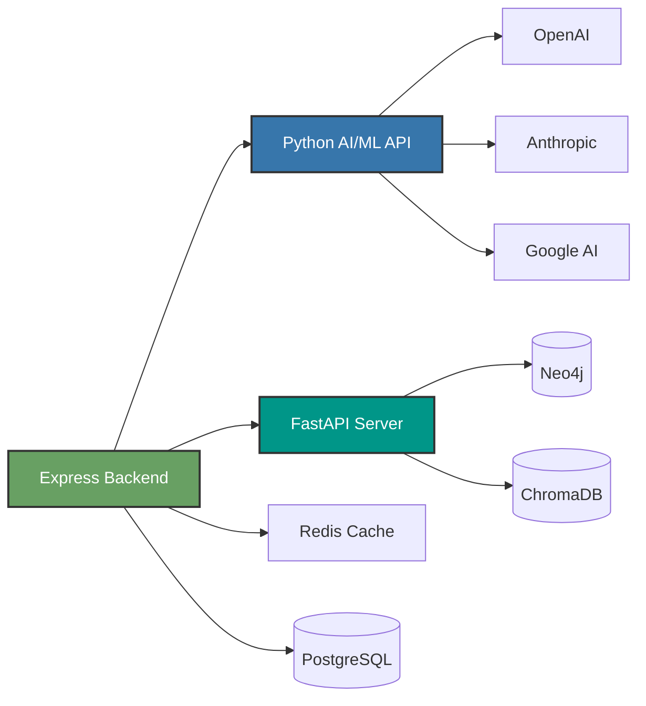
```mermaid
graph LR
    EXPRESS[Express Backend] --> PYTHON[Python AI/ML API]
    EXPRESS --> FASTAPI[FastAPI Server]
    EXPRESS --> REDIS[Redis Cache]
    EXPRESS --> POSTGRES[(PostgreSQL)]

    PYTHON --> OPENAI[OpenAI]
    PYTHON --> ANTHROPIC[Anthropic]
    PYTHON --> GEMINI[Google AI]

    FASTAPI --> NEO4J[(Neo4j)]
    FASTAPI --> CHROMA[(ChromaDB)]

    style EXPRESS fill:#68A063,stroke:#333,stroke-width:2px,color:#fff
    style PYTHON fill:#3776AB,stroke:#333,stroke-width:2px,color:#fff
    style FASTAPI fill:#009688,stroke:#333,stroke-width:2px,color:#fff
```

### Monitoring & Observability

AI/ML pipeline metrics tracked by Prometheus:

- **Request Rate**: Requests per second to AI/ML services
- **Latency**: P50, P95, P99 response times
- **Token Usage**: LLM token consumption by provider
- **Model Performance**: Success/failure rates per model
- **Cache Hit Rate**: Redis cache effectiveness
- **Vector Store Performance**: Query latency and throughput
- **Error Rates**: Failed API calls by provider

**Logging**: Structured JSON logs with trace IDs for distributed tracing

**Alerts**:
- High token usage (cost monitoring)
- Model API failures
- Slow response times (>30s)
- Memory pressure from model loading

---

## Database Architecture

DocuThinker uses a **hybrid database approach** with Flyway migrations for version control.

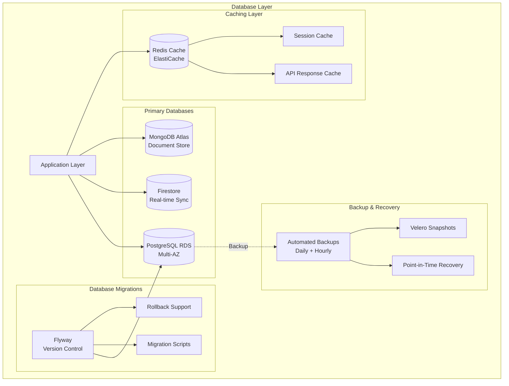
```mermaid
graph TB
    subgraph "Database Layer"
        A[Application Layer]

        subgraph "Primary Databases"
            B[(PostgreSQL RDS<br/>Multi-AZ)]
            C[(Firestore<br/>Real-time Sync)]
            D[(MongoDB Atlas<br/>Document Store)]
        end

        subgraph "Caching Layer"
            E[(Redis Cache<br/>ElastiCache)]
            F[API Response Cache]
            G[Session Cache]
        end

        subgraph "Database Migrations"
            H[Flyway<br/>Version Control]
            I[Migration Scripts]
            J[Rollback Support]
        end

        subgraph "Backup & Recovery"
            K[Automated Backups<br/>Daily + Hourly]
            L[Point-in-Time Recovery]
            M[Velero Snapshots]
        end
    end

    A --> B
    A --> C
    A --> D
    A --> E

    E --> F
    E --> G

    H --> B
    H --> I
    H --> J

    B -.->|Backup| K
    K --> L
    K --> M
```

### PostgreSQL Schema with Flyway Migrations

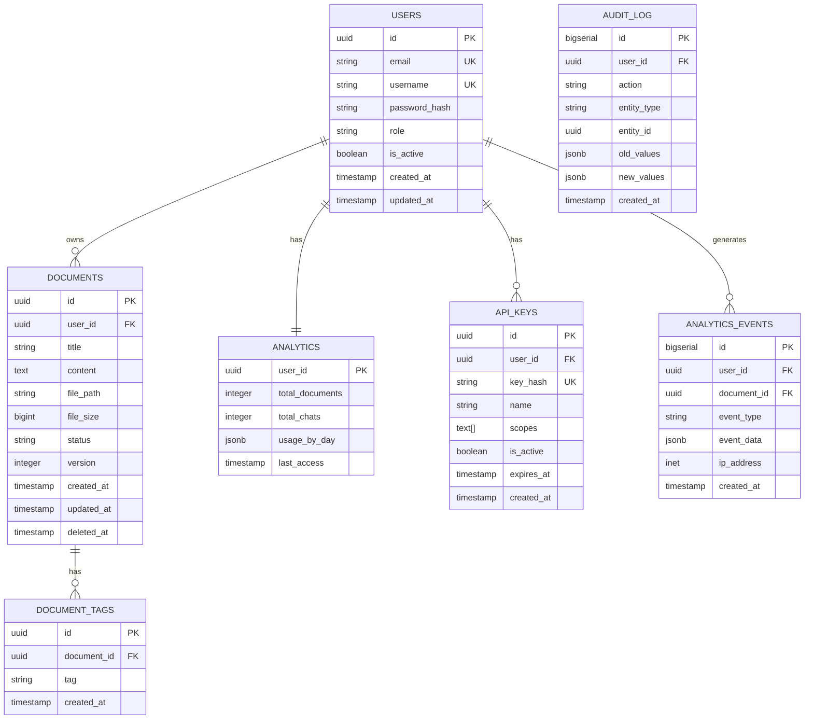
```mermaid
erDiagram
    USERS ||--o{ DOCUMENTS : owns
    USERS ||--|| ANALYTICS : has
    USERS ||--o{ API_KEYS : has
    DOCUMENTS ||--o{ DOCUMENT_TAGS : has
    USERS ||--o{ ANALYTICS_EVENTS : generates

    USERS {
        uuid id PK
        string email UK
        string username UK
        string password_hash
        string role
        boolean is_active
        timestamp created_at
        timestamp updated_at
    }

    DOCUMENTS {
        uuid id PK
        uuid user_id FK
        string title
        text content
        string file_path
        bigint file_size
        string status
        integer version
        timestamp created_at
        timestamp updated_at
        timestamp deleted_at
    }

    DOCUMENT_TAGS {
        uuid id PK
        uuid document_id FK
        string tag
        timestamp created_at
    }

    ANALYTICS {
        uuid user_id PK
        integer total_documents
        integer total_chats
        jsonb usage_by_day
        timestamp last_access
    }

    ANALYTICS_EVENTS {
        bigserial id PK
        uuid user_id FK
        uuid document_id FK
        string event_type
        jsonb event_data
        inet ip_address
        timestamp created_at
    }

    API_KEYS {
        uuid id PK
        uuid user_id FK
        string key_hash UK
        string name
        text[] scopes
        boolean is_active
        timestamp expires_at
        timestamp created_at
    }

    AUDIT_LOG {
        bigserial id PK
        uuid user_id FK
        string action
        string entity_type
        uuid entity_id
        jsonb old_values
        jsonb new_values
        timestamp created_at
    }
```

---

## Service Mesh Architecture

Istio provides zero-trust security and advanced traffic management.

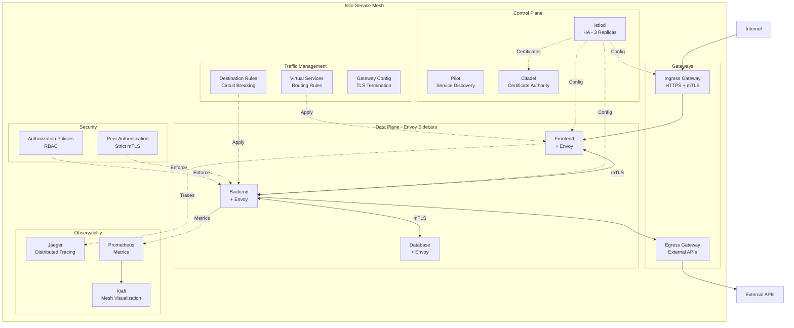
```mermaid
graph TB
    subgraph "Istio Service Mesh"
        subgraph "Control Plane"
            ISTIOD[Istiod<br/>HA - 3 Replicas]
            PILOT[Pilot<br/>Service Discovery]
            CITADEL[Citadel<br/>Certificate Authority]
        end

        subgraph "Data Plane - Envoy Sidecars"
            FE_PROXY[Frontend<br/>+ Envoy]
            BE_PROXY[Backend<br/>+ Envoy]
            DB_PROXY[Database<br/>+ Envoy]
        end

        subgraph "Gateways"
            INGRESS[Ingress Gateway<br/>HTTPS + mTLS]
            EGRESS[Egress Gateway<br/>External APIs]
        end

        subgraph "Traffic Management"
            VS[Virtual Services<br/>Routing Rules]
            DR[Destination Rules<br/>Circuit Breaking]
            GW[Gateway Config<br/>TLS Termination]
        end

        subgraph "Security"
            PA[Peer Authentication<br/>Strict mTLS]
            AP[Authorization Policies<br/>RBAC]
        end

        subgraph "Observability"
            KIALI[Kiali<br/>Mesh Visualization]
            JAEGER[Jaeger<br/>Distributed Tracing]
            PROM[Prometheus<br/>Metrics]
        end
    end

    INTERNET[Internet] --> INGRESS
    INGRESS --> FE_PROXY
    FE_PROXY <-->|mTLS| BE_PROXY
    BE_PROXY <-->|mTLS| DB_PROXY
    BE_PROXY --> EGRESS
    EGRESS --> EXTERNAL[External APIs]

    ISTIOD -.->|Config| INGRESS
    ISTIOD -.->|Config| FE_PROXY
    ISTIOD -.->|Config| BE_PROXY
    ISTIOD -.->|Certificates| CITADEL

    VS -.->|Apply| FE_PROXY
    DR -.->|Apply| BE_PROXY
    PA -.->|Enforce| BE_PROXY
    AP -.->|Enforce| BE_PROXY

    FE_PROXY -.->|Traces| JAEGER
    BE_PROXY -.->|Metrics| PROM
    PROM --> KIALI
```

### Traffic Management Flow

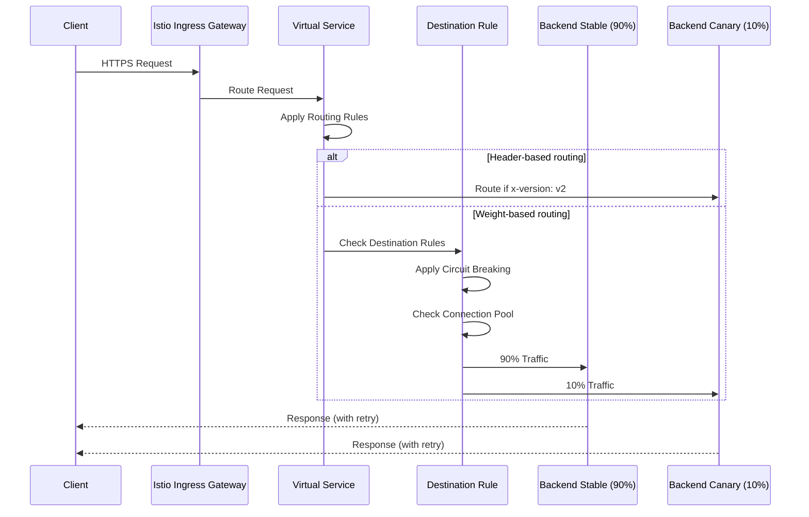
```mermaid
sequenceDiagram
    participant Client
    participant Ingress as Istio Ingress Gateway
    participant VS as Virtual Service
    participant DR as Destination Rule
    participant Stable as Backend Stable (90%)
    participant Canary as Backend Canary (10%)

    Client->>Ingress: HTTPS Request
    Ingress->>VS: Route Request
    VS->>VS: Apply Routing Rules

    alt Header-based routing
        VS->>Canary: Route if x-version: v2
    else Weight-based routing
        VS->>DR: Check Destination Rules
        DR->>DR: Apply Circuit Breaking
        DR->>DR: Check Connection Pool
        DR->>Stable: 90% Traffic
        DR->>Canary: 10% Traffic
    end

    Stable-->>Client: Response (with retry)
    Canary-->>Client: Response (with retry)
```

---

## Observability & Monitoring

Comprehensive observability with OpenTelemetry, Prometheus, and ELK Stack.

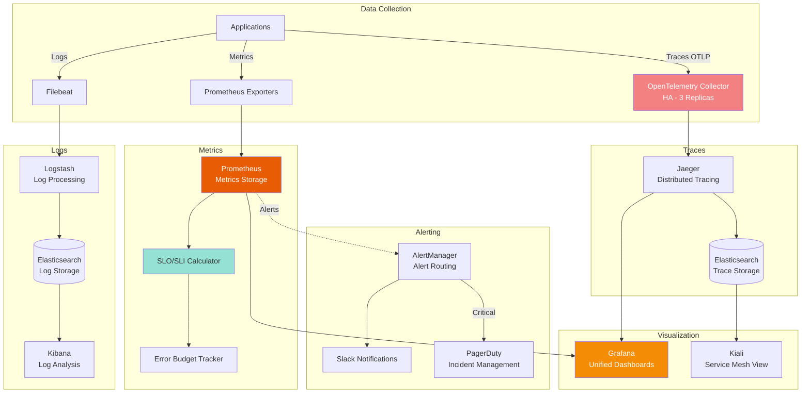
```mermaid
graph TB
    subgraph "Data Collection"
        APP[Applications]
        OTEL[OpenTelemetry Collector<br/>HA - 3 Replicas]
        PROM_EXP[Prometheus Exporters]
        FILEBEAT[Filebeat]
    end

    subgraph "Traces"
        JAEGER[Jaeger<br/>Distributed Tracing]
        TRACE_STORE[(Elasticsearch<br/>Trace Storage)]
    end

    subgraph "Metrics"
        PROM[Prometheus<br/>Metrics Storage]
        SLO[SLO/SLI Calculator]
        ERROR_BUDGET[Error Budget Tracker]
    end

    subgraph "Logs"
        LOGSTASH[Logstash<br/>Log Processing]
        ELASTIC[(Elasticsearch<br/>Log Storage)]
        KIBANA[Kibana<br/>Log Analysis]
    end

    subgraph "Visualization"
        GRAF[Grafana<br/>Unified Dashboards]
        KIALI[Kiali<br/>Service Mesh View]
    end

    subgraph "Alerting"
        ALERT_MGR[AlertManager<br/>Alert Routing]
        SLACK[Slack Notifications]
        PAGERDUTY[PagerDuty<br/>Incident Management]
    end

    APP -->|Traces OTLP| OTEL
    APP -->|Metrics| PROM_EXP
    APP -->|Logs| FILEBEAT

    OTEL --> JAEGER
    JAEGER --> TRACE_STORE

    PROM_EXP --> PROM
    PROM --> SLO
    SLO --> ERROR_BUDGET

    FILEBEAT --> LOGSTASH
    LOGSTASH --> ELASTIC
    ELASTIC --> KIBANA

    PROM --> GRAF
    JAEGER --> GRAF
    TRACE_STORE --> KIALI

    PROM -.->|Alerts| ALERT_MGR
    ALERT_MGR --> SLACK
    ALERT_MGR -->|Critical| PAGERDUTY

    style OTEL fill:#F38181,color:#fff
    style PROM fill:#E85D04,color:#fff
    style GRAF fill:#F48C06,color:#fff
    style SLO fill:#95E1D3
```

### SLO/SLI Monitoring

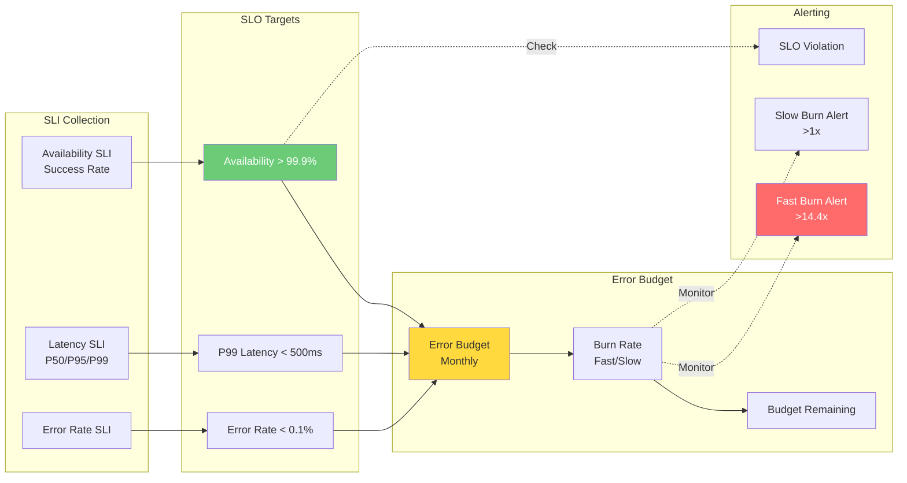
```mermaid
graph LR
    subgraph "SLI Collection"
        AVAIL[Availability SLI<br/>Success Rate]
        LAT[Latency SLI<br/>P50/P95/P99]
        ERR[Error Rate SLI]
    end

    subgraph "SLO Targets"
        SLO_AVAIL[Availability > 99.9%]
        SLO_LAT[P99 Latency < 500ms]
        SLO_ERR[Error Rate < 0.1%]
    end

    subgraph "Error Budget"
        BUDGET[Error Budget<br/>Monthly]
        BURN[Burn Rate<br/>Fast/Slow]
        REMAINING[Budget Remaining]
    end

    subgraph "Alerting"
        FAST_BURN[Fast Burn Alert<br/>>14.4x]
        SLOW_BURN[Slow Burn Alert<br/>>1x]
        SLO_BREACH[SLO Violation]
    end

    AVAIL --> SLO_AVAIL
    LAT --> SLO_LAT
    ERR --> SLO_ERR

    SLO_AVAIL --> BUDGET
    SLO_LAT --> BUDGET
    SLO_ERR --> BUDGET

    BUDGET --> BURN
    BURN --> REMAINING

    BURN -.->|Monitor| FAST_BURN
    BURN -.->|Monitor| SLOW_BURN
    SLO_AVAIL -.->|Check| SLO_BREACH

    style SLO_AVAIL fill:#6BCB77,color:#fff
    style BUDGET fill:#FFD93D
    style FAST_BURN fill:#FF6B6B,color:#fff
```

---

## Security Architecture

Multi-layered security with OPA, Falco, and mTLS.

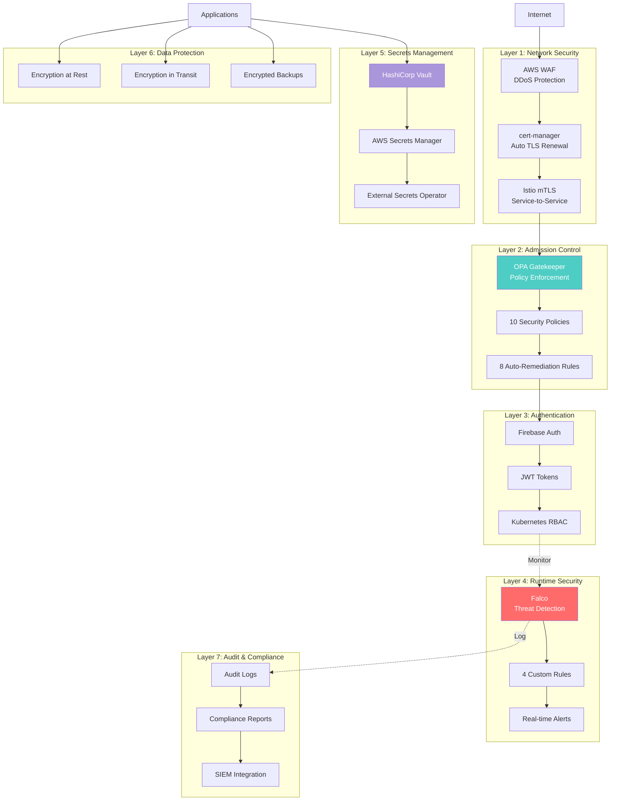
```mermaid
graph TB
    subgraph "Layer 1: Network Security"
        WAF[AWS WAF<br/>DDoS Protection]
        TLS[cert-manager<br/>Auto TLS Renewal]
        MTLS[Istio mTLS<br/>Service-to-Service]
    end

    subgraph "Layer 2: Admission Control"
        OPA[OPA Gatekeeper<br/>Policy Enforcement]
        POLICIES[10 Security Policies]
        MUTATIONS[8 Auto-Remediation Rules]
    end

    subgraph "Layer 3: Authentication"
        FIREBASE[Firebase Auth]
        JWT[JWT Tokens]
        RBAC[Kubernetes RBAC]
    end

    subgraph "Layer 4: Runtime Security"
        FALCO[Falco<br/>Threat Detection]
        RULES[4 Custom Rules]
        ALERTS[Real-time Alerts]
    end

    subgraph "Layer 5: Secrets Management"
        VAULT[HashiCorp Vault]
        AWS_SM[AWS Secrets Manager]
        ESO[External Secrets Operator]
    end

    subgraph "Layer 6: Data Protection"
        ENCRYPT_REST[Encryption at Rest]
        ENCRYPT_TRANSIT[Encryption in Transit]
        BACKUP[Encrypted Backups]
    end

    subgraph "Layer 7: Audit & Compliance"
        AUDIT[Audit Logs]
        COMPLIANCE[Compliance Reports]
        SIEM[SIEM Integration]
    end

    INTERNET[Internet] --> WAF
    WAF --> TLS
    TLS --> MTLS

    MTLS --> OPA
    OPA --> POLICIES
    POLICIES --> MUTATIONS

    MUTATIONS --> FIREBASE
    FIREBASE --> JWT
    JWT --> RBAC

    RBAC -.->|Monitor| FALCO
    FALCO --> RULES
    RULES --> ALERTS

    APP[Applications] --> VAULT
    VAULT --> AWS_SM
    AWS_SM --> ESO

    APP --> ENCRYPT_REST
    APP --> ENCRYPT_TRANSIT
    APP --> BACKUP

    FALCO -.->|Log| AUDIT
    AUDIT --> COMPLIANCE
    COMPLIANCE --> SIEM

    style OPA fill:#4ECDC4,color:#fff
    style FALCO fill:#FF6B6B,color:#fff
    style VAULT fill:#AA96DA,color:#fff
```

### OPA Policy Enforcement Flow

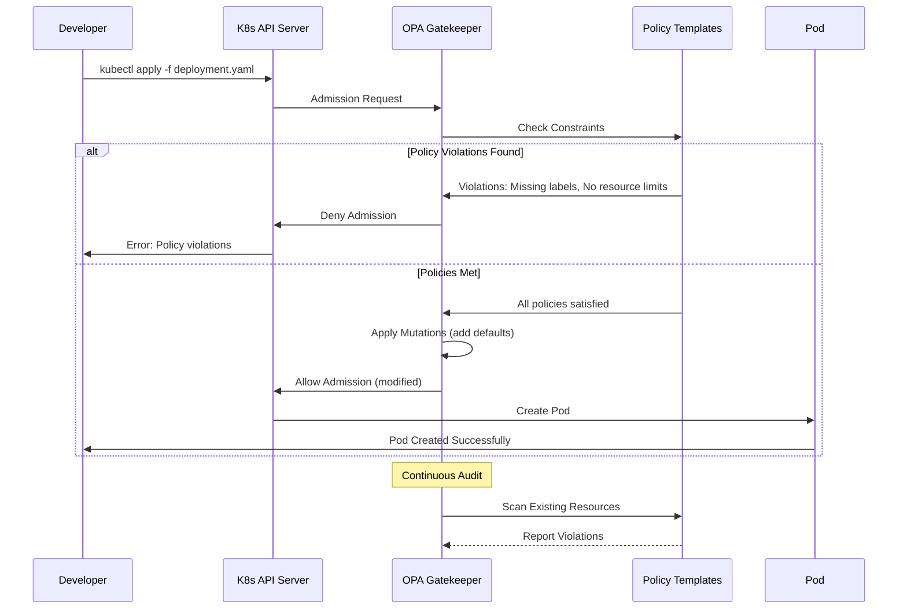
```mermaid
sequenceDiagram
    participant Dev as Developer
    participant API as K8s API Server
    participant OPA as OPA Gatekeeper
    participant POLICIES as Policy Templates
    participant POD as Pod

    Dev->>API: kubectl apply -f deployment.yaml
    API->>OPA: Admission Request

    OPA->>POLICIES: Check Constraints

    alt Policy Violations Found
        POLICIES->>OPA: Violations: Missing labels, No resource limits
        OPA->>API: Deny Admission
        API->>Dev: Error: Policy violations
    else Policies Met
        POLICIES->>OPA: All policies satisfied
        OPA->>OPA: Apply Mutations (add defaults)
        OPA->>API: Allow Admission (modified)
        API->>POD: Create Pod
        POD->>Dev: Pod Created Successfully
    end

    Note over OPA: Continuous Audit
    OPA->>POLICIES: Scan Existing Resources
    POLICIES-->>OPA: Report Violations
```

---

## Reliability Engineering

Chaos testing and disaster recovery for production resilience.

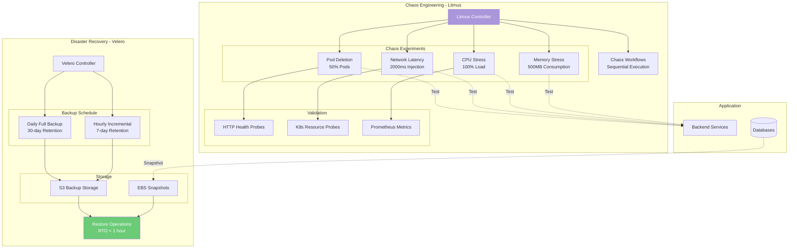
```mermaid
graph TB
    subgraph "Chaos Engineering - Litmus"
        CHAOS_CTRL[Litmus Controller]

        subgraph "Chaos Experiments"
            POD_DELETE[Pod Deletion<br/>50% Pods]
            NET_LATENCY[Network Latency<br/>2000ms Injection]
            CPU_STRESS[CPU Stress<br/>100% Load]
            MEM_STRESS[Memory Stress<br/>500MB Consumption]
        end

        subgraph "Validation"
            HTTP_PROBE[HTTP Health Probes]
            K8S_PROBE[K8s Resource Probes]
            PROM_PROBE[Prometheus Metrics]
        end

        WORKFLOW[Chaos Workflows<br/>Sequential Execution]
    end

    subgraph "Disaster Recovery - Velero"
        BACKUP_CTRL[Velero Controller]

        subgraph "Backup Schedule"
            DAILY[Daily Full Backup<br/>30-day Retention]
            HOURLY[Hourly Incremental<br/>7-day Retention]
        end

        subgraph "Storage"
            S3[S3 Backup Storage]
            EBS_SNAP[EBS Snapshots]
        end

        RESTORE[Restore Operations<br/>RTO < 1 hour]
    end

    subgraph "Application"
        APP[Backend Services]
        DB[(Databases)]
    end

    CHAOS_CTRL --> POD_DELETE
    CHAOS_CTRL --> NET_LATENCY
    CHAOS_CTRL --> CPU_STRESS
    CHAOS_CTRL --> MEM_STRESS

    POD_DELETE -.->|Test| APP
    NET_LATENCY -.->|Test| APP
    CPU_STRESS -.->|Test| APP
    MEM_STRESS -.->|Test| APP

    POD_DELETE --> HTTP_PROBE
    NET_LATENCY --> K8S_PROBE
    CPU_STRESS --> PROM_PROBE

    CHAOS_CTRL --> WORKFLOW

    BACKUP_CTRL --> DAILY
    BACKUP_CTRL --> HOURLY

    DAILY --> S3
    HOURLY --> S3
    DB -.->|Snapshot| EBS_SNAP

    S3 --> RESTORE
    EBS_SNAP --> RESTORE

    style CHAOS_CTRL fill:#AA96DA,color:#fff
    style RESTORE fill:#6BCB77,color:#fff
```

---

## Progressive Delivery

Automated canary deployments with Flagger.

```mermaid
graph TB
    subgraph "Flagger Progressive Delivery"
        FLAGGER[Flagger Controller]

        subgraph "Deployment Stages"
            INIT[Initialize Canary<br/>0% Traffic]
            RAMP[Progressive Ramp<br/>10% → 50%]
            ANALYSIS[Canary Analysis<br/>1-min Intervals]
            PROMOTE[Promote to 100%]
            ROLLBACK[Automatic Rollback]
        end

        subgraph "Metrics Analysis"
            SUCCESS[Success Rate > 99%]
            LATENCY[Latency < 500ms]
            CUSTOM[Custom Metrics]
        end

        subgraph "Integration"
            ISTIO_INT[Istio<br/>Traffic Splitting]
            PROM_INT[Prometheus<br/>Metrics Source]
            SLACK_INT[Slack<br/>Notifications]
        end
    end

    subgraph "Deployments"
        STABLE[Stable Version<br/>Current Production]
        CANARY[Canary Version<br/>New Release]
    end

    FLAGGER --> INIT
    INIT --> RAMP
    RAMP --> ANALYSIS

    ANALYSIS --> SUCCESS
    ANALYSIS --> LATENCY
    ANALYSIS --> CUSTOM

    SUCCESS & LATENCY & CUSTOM -.->|All Pass| PROMOTE
    SUCCESS & LATENCY & CUSTOM -.->|Any Fail| ROLLBACK

    PROMOTE --> STABLE
    ROLLBACK --> STABLE

    FLAGGER -.->|Control| ISTIO_INT
    FLAGGER -.->|Query| PROM_INT
    FLAGGER -.->|Notify| SLACK_INT

    ISTIO_INT -.->|Split| STABLE
    ISTIO_INT -.->|Split| CANARY
    
    style PROMOTE fill:#6BCB77,color:#fff
    style ROLLBACK fill:#FF6B6B,color:#fff
```

---

## Autoscaling Strategy

Multi-dimensional autoscaling with KEDA and HPA.

```mermaid
graph TB
    subgraph "KEDA - Event-Driven Autoscaling"
        KEDA[KEDA Operator<br/>HA - 2 Replicas]

        subgraph "Scalers"
            SQS[AWS SQS Scaler<br/>Queue Depth]
            HTTP[HTTP Scaler<br/>Request Rate]
            CRON[Cron Scaler<br/>Scheduled]
            PROM_SCALER[Prometheus Scaler<br/>Custom Metrics]
        end

        SCALE_ZERO[Scale to Zero<br/>Cost Optimization]
    end

    subgraph "HPA - Resource-Based"
        HPA[Horizontal Pod Autoscaler]

        subgraph "Triggers"
            CPU[CPU > 70%]
            MEM[Memory > 80%]
        end
    end

    subgraph "Applications"
        WORKER[Worker Pods<br/>1-50 Replicas]
        BACKEND[Backend Pods<br/>2-20 Replicas]
        FRONTEND[Frontend Pods<br/>2-10 Replicas]
    end

    KEDA --> SQS
    KEDA --> HTTP
    KEDA --> CRON
    KEDA --> PROM_SCALER

    SQS -.->|Scale| WORKER
    HTTP -.->|Scale| BACKEND
    CRON -.->|Scale| BACKEND
    PROM_SCALER -.->|Scale| BACKEND

    KEDA -.->|Enable| SCALE_ZERO
    SCALE_ZERO -.->|Apply| WORKER

    HPA --> CPU
    HPA --> MEM

    CPU -.->|Scale| FRONTEND
    MEM -.->|Scale| FRONTEND

    style KEDA fill:#FCBAD3,color:#000
    style SCALE_ZERO fill:#6BCB77,color:#fff
    style HPA fill:#4D96FF,color:#fff
```

---

## Container Orchestration

Enhanced Kubernetes with Istio, OPA, and advanced deployments.

```mermaid
graph TB
    subgraph "Kubernetes Cluster - EKS"
        subgraph "Control Plane Components"
            ISTIOD[Istiod Control Plane]
            OPA_CTRL[OPA Gatekeeper]
            FLAGGER_CTRL[Flagger]
            KEDA_CTRL[KEDA Operator]
        end

        subgraph "Ingress"
            ISTIO_IG[Istio Ingress Gateway<br/>3 Replicas]
        end

        subgraph "Frontend Namespace"
            FE_SVC[Frontend Service]
            FE1[Frontend Pod 1 + Envoy]
            FE2[Frontend Pod 2 + Envoy]
            FE3[Frontend Pod 3 + Envoy]
        end

        subgraph "Backend Namespace"
            BE_SVC[Backend Service]
            BE_STABLE[Stable Deployment<br/>90% Traffic]
            BE_CANARY[Canary Deployment<br/>10% Traffic]
        end

        subgraph "Data Services"
            PG_SVC[(PostgreSQL<br/>StatefulSet)]
            REDIS_SVC[(Redis<br/>StatefulSet)]
        end

        subgraph "Monitoring Namespace"
            PROM[Prometheus]
            GRAF[Grafana]
            JAEGER[Jaeger]
        end

        subgraph "Config & Secrets"
            CM[ConfigMaps]
            SECRET[Kubernetes Secrets]
            ESO[External Secrets]
        end
    end

    INTERNET[Internet] --> ISTIO_IG

    ISTIOD -.->|Config| ISTIO_IG
    OPA_CTRL -.->|Validate| FE1
    OPA_CTRL -.->|Validate| BE_STABLE

    ISTIO_IG --> FE_SVC
    FE_SVC --> FE1 & FE2 & FE3

    FE1 --> BE_SVC
    BE_SVC --> BE_STABLE
    BE_SVC --> BE_CANARY

    FLAGGER_CTRL -.->|Manage| BE_CANARY
    KEDA_CTRL -.->|Scale| BE_STABLE

    BE_STABLE --> PG_SVC
    BE_STABLE --> REDIS_SVC

    BE_STABLE -.->|Metrics| PROM
    FE1 -.->|Traces| JAEGER

    ESO -.->|Sync| SECRET
    SECRET --> BE_STABLE
    CM --> BE_STABLE
```

---

## Technology Stack

Comprehensive overview of all technologies used.

```mermaid
mindmap
  root((DocuThinker<br/>Tech Stack))
    Frontend
      React 18
      Material-UI
      TailwindCSS
      React Router
      Axios
      Context API
    Backend
      Node.js
      Express
      Firebase Admin SDK
      GraphQL
      JWT
    Database
      PostgreSQL
      Firestore
      MongoDB Atlas
      Redis Cache
      Flyway Migrations
    AI/ML
      Google Cloud NLP
      LangChain
      CrewAI
      LangGraph
      Neo4j
      ChromaDB
    Service Mesh
      Istio 1.20
      Envoy Proxy
      mTLS
      Circuit Breaking
    Security
      OPA Gatekeeper
      Falco
      HashiCorp Vault
      cert-manager
      AWS WAF
    Observability
      OpenTelemetry
      Prometheus
      Grafana
      Jaeger
      ELK Stack
      SLO/SLI
    Reliability
      Litmus Chaos
      Flagger
      Velero
      KEDA
      HPA
    DevOps
      Docker
      Kubernetes
      Helm
      ArgoCD
      GitLab CI
      Terraform
      Terratest
    Cloud Services
      AWS EKS
      AWS RDS
      AWS S3
      ElastiCache
      CloudFront
    Testing
      K6 Load Testing
      Jest
      Pytest
      Cypress
      Terratest
```

---

## Scalability & Performance

Enhanced with event-driven autoscaling and SLO monitoring.

```mermaid
graph TB
    subgraph "Scalability Architecture"
        A[Application Growth]

        subgraph "Horizontal Scaling"
            B[Istio Load Balancing]
            C[Multi-AZ Deployment]
            D[Database Replication]
            E[KEDA Auto-scaling]
        end

        subgraph "Performance Optimization"
            F[Redis Caching<br/>85% Hit Rate]
            G[CDN Distribution]
            H[Code Splitting]
            I[Lazy Loading]
            J[Connection Pooling]
        end

        subgraph "SLO Targets"
            K[Availability > 99.9%]
            L[P99 Latency < 500ms]
            M[Error Rate < 0.1%]
            N[Error Budget Tracking]
        end

        subgraph "Resilience"
            O[Circuit Breaking]
            P[Retry Logic]
            Q[Timeout Controls]
            R[Chaos Testing]
        end

        subgraph "Monitoring"
            S[OpenTelemetry]
            T[Prometheus Metrics]
            U[Real-time Alerting]
        end
    end

    A --> B & C & E

    B --> F
    C --> G
    E --> H & I & J

    F --> K
    G --> L
    H --> M
    I --> N

    O --> K
    P --> L
    Q --> M
    R --> N

    S --> T
    T --> U
    U -.->|Alert| DevOps[DevOps Team]
```

---

## Deployment Architecture

Multi-environment with GitOps and progressive delivery.

```mermaid
graph TB
    subgraph "CI/CD Pipeline"
        GIT[Git Repository]

        subgraph "Build"
            BUILD[Build Stage]
            TEST[Test Stage<br/>Unit + Integration]
            SECURITY[Security Scan<br/>Trivy + SonarQube]
            PACKAGE[Docker Build]
        end

        subgraph "GitOps - ArgoCD"
            ARGO[ArgoCD Controller]
            SYNC[Auto-Sync]
            HEALTH[Health Check]
        end

        subgraph "Progressive Delivery"
            CANARY[Flagger Canary]
            ANALYSIS[Metric Analysis]
            DECISION[Promote/Rollback]
        end
    end

    subgraph "Environments"
        DEV[Development<br/>Auto-Deploy]
        STAGING[Staging<br/>Manual Approval]
        PROD[Production<br/>Canary + Manual]
    end

    subgraph "Infrastructure"
        HELM[Helm Charts]
        K8S[Kubernetes]
        ISTIO[Istio Mesh]
    end

    GIT --> BUILD
    BUILD --> TEST
    TEST --> SECURITY
    SECURITY --> PACKAGE

    PACKAGE --> ARGO
    ARGO --> SYNC
    SYNC --> HEALTH

    HEALTH --> DEV
    DEV -.->|Smoke Tests Pass| STAGING
    STAGING -.->|Approval| CANARY

    CANARY --> ANALYSIS
    ANALYSIS --> DECISION
    DECISION -->|Success| PROD
    DECISION -->|Failure| STAGING

    HELM --> K8S
    K8S --> ISTIO
    ARGO -.->|Deploy| HELM

    style ARGO fill:#FF6B35,color:#fff
    style PROD fill:#6BCB77,color:#fff
```

---

## Conclusion

DocuThinker's enhanced architecture delivers:

- **Enterprise Security**: mTLS, OPA policies, Falco monitoring, zero-trust architecture
- **High Availability**: 99.9% SLO, multi-AZ deployment, automated failover
- **Observability**: Distributed tracing, SLO/SLI tracking, comprehensive dashboards
- **Resilience**: Chaos testing, circuit breaking, automated backups (RTO < 1 hour)
- **Progressive Delivery**: Automated canary deployments with metric-driven rollback
- **Cost Optimization**: Event-driven scaling, scale-to-zero capability
- **Production Ready**: Tested, validated, and battle-hardened infrastructure

For more details, refer to:
- [DEVOPS_ENHANCEMENTS.md](DEVOPS_ENHANCEMENTS.md) - Complete DevOps platform overview
- [DEVOPS_QUICK_START.md](DEVOPS_QUICK_START.md) - Quick installation guide
- [DEVOPS.md](DEVOPS.md) - Detailed DevOps documentation
- [README.md](README.md) - General documentation

---

**Last Updated**: January 2025
**Version**: 2.0.0 - Enterprise DevOps Edition
**Author**: [Son Nguyen](https://github.com/hoangsonww)
