# DocuThinker Architecture Documentation

## Table of Contents

- [Overview](#overview)
- [System Architecture](#system-architecture)
- [Frontend Architecture](#frontend-architecture)
- [Backend Architecture](#backend-architecture)
- [Database Architecture](#database-architecture)
- [AI/ML Pipeline](#aiml-pipeline)
- [Authentication & Security](#authentication--security)
- [Caching Strategy](#caching-strategy)
- [Message Queue Architecture](#message-queue-architecture)
- [Deployment Architecture](#deployment-architecture)
- [Container Orchestration](#container-orchestration)
- [API Design](#api-design)
- [Data Flow](#data-flow)
- [Scalability & Performance](#scalability--performance)
- [Technology Stack](#technology-stack)

---

## Overview

DocuThinker is a full-stack AI-powered document analysis and summarization application built using the **FERN Stack** (Firebase, Express, React, Node.js). The application leverages advanced AI/ML services to provide intelligent document processing, natural language understanding, and conversational AI capabilities.

### Core Features

- **Document Upload & Processing**: Multi-format document support (PDF, DOCX, TXT)
- **AI-Powered Summarization**: Advanced summarization using Google Cloud NLP and LangChain
- **Intelligent Chat**: Context-aware conversational AI for document Q&A
- **Multi-Language Support**: Document processing and summarization in multiple languages
- **Real-time Analytics**: User behavior tracking and document analytics
- **Sentiment Analysis**: Emotional tone detection in documents
- **Named Entity Recognition (NER)**: Extraction of key entities from documents
- **Content Rewriting**: Style-based content transformation

---

## System Architecture

The application follows a **microservices-oriented architecture** with clear separation of concerns across multiple layers.

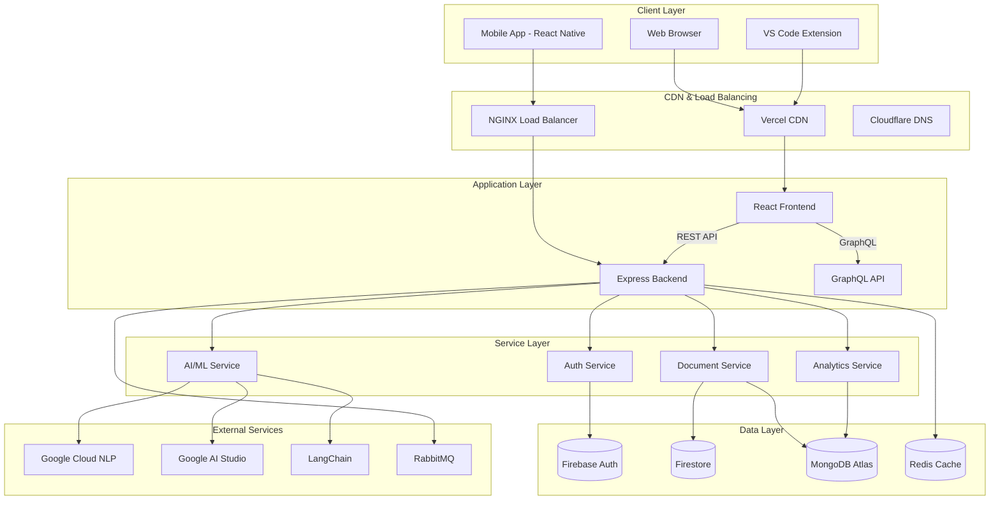

### Architecture Principles

1. **Separation of Concerns**: Each layer has a distinct responsibility
2. **Scalability**: Horizontal scaling through containerization and load balancing
3. **Resilience**: Fault tolerance through caching, message queues, and redundancy
4. **Security**: Multi-layer security with Firebase Auth, JWT, and HTTPS
5. **Performance**: Optimized with Redis caching and CDN distribution

---

## Frontend Architecture

The frontend is built with **React 18** and follows a component-based architecture with modern React patterns.

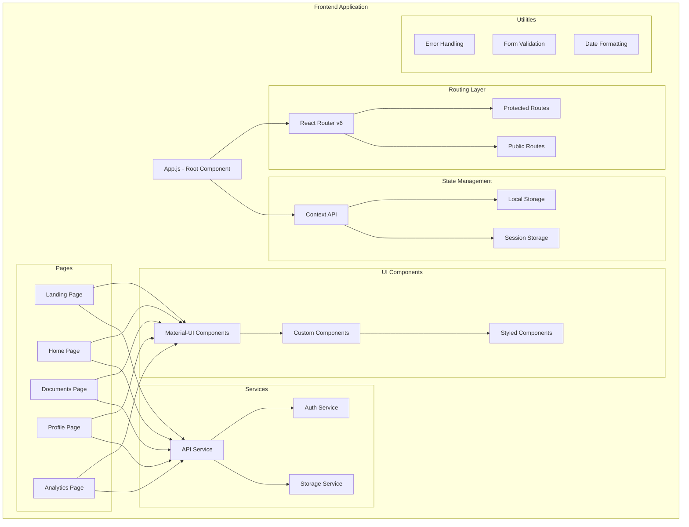

### Frontend Technology Stack

- **React 18**: Core UI framework
- **Material-UI (MUI)**: Component library
- **React Router v6**: Client-side routing
- **Axios**: HTTP client for API requests
- **Context API**: State management
- **TailwindCSS**: Utility-first CSS framework
- **Webpack**: Module bundler
- **Craco**: Create React App configuration override

### Component Hierarchy

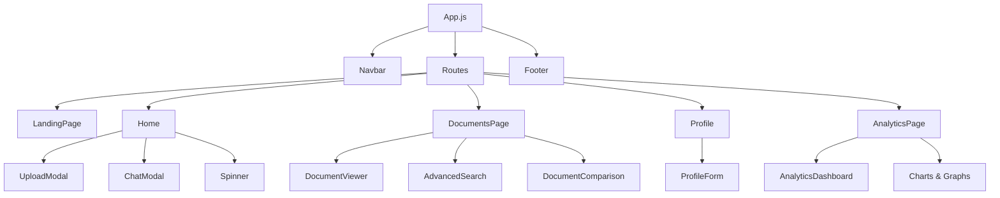

### State Management Flow

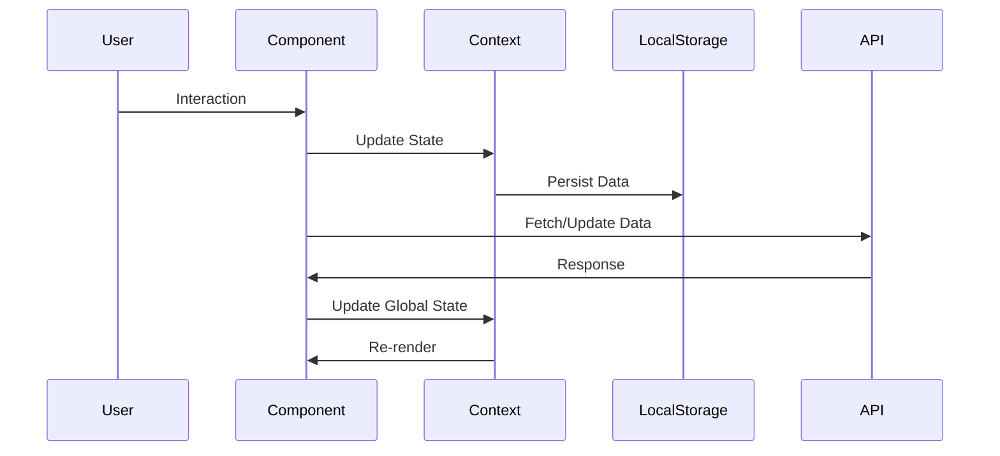

---

## Backend Architecture

The backend follows the **MVC (Model-View-Controller)** pattern with additional service layers for business logic.

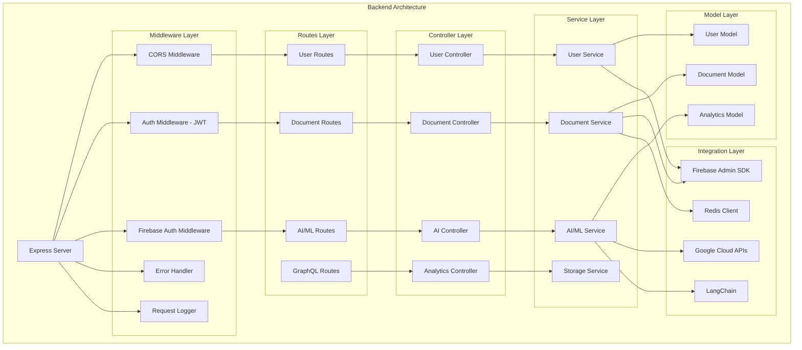

### MVC Pattern Implementation

#### Controllers
Handle HTTP requests and responses, coordinate between services and views.

```javascript
// Example Controller Structure
exports.uploadDocument = async (req, res) => {
  try {
    // 1. Parse request
    const { userId, file } = req.body;

    // 2. Validate input
    if (!file) throw new Error('No file provided');

    // 3. Call service layer
    const result = await documentService.processDocument(userId, file);

    // 4. Format response
    sendSuccessResponse(res, 200, 'Document uploaded successfully', result);
  } catch (error) {
    // 5. Handle errors
    sendErrorResponse(res, 400, 'Document upload failed', error.message);
  }
};
```

#### Services
Contain business logic and interact with data models and external APIs.

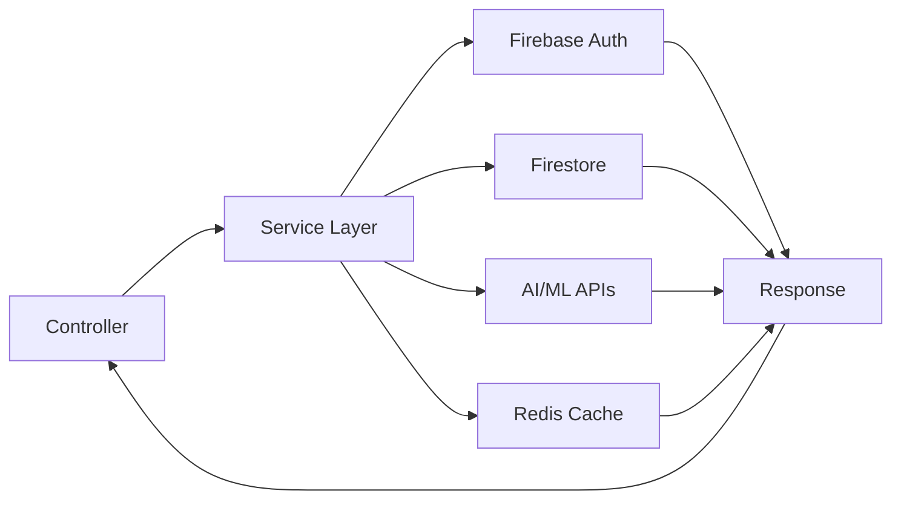

#### Models
Define data schemas and database interactions.

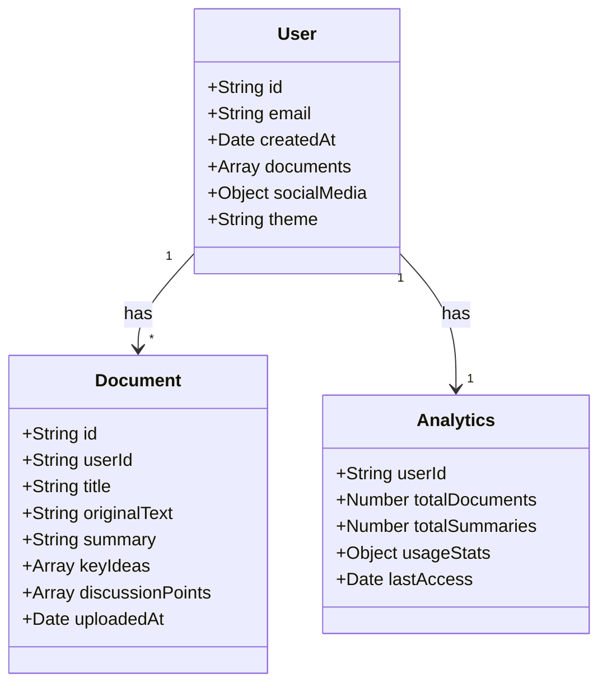

---

## Database Architecture

DocuThinker uses a **hybrid database approach** with multiple database technologies for different purposes.

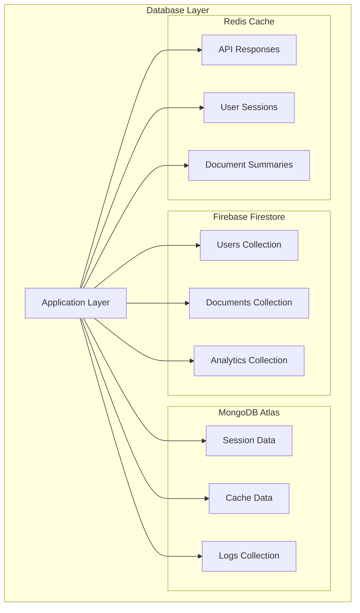

### Firestore Schema

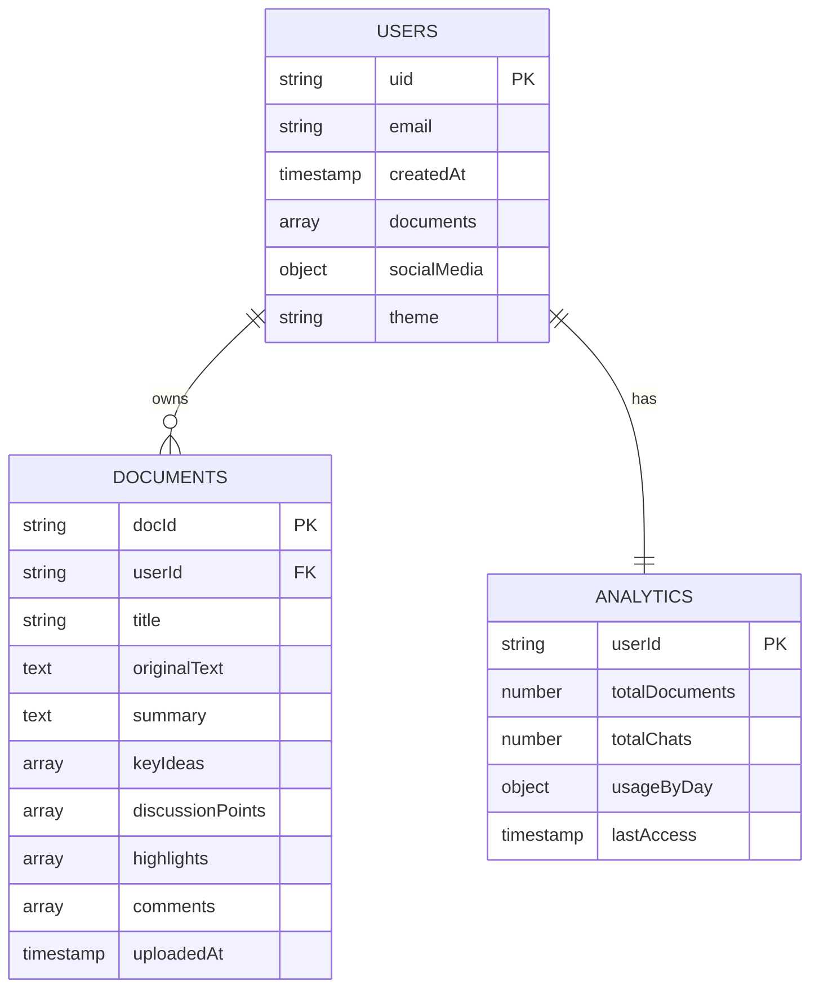

### Data Access Patterns

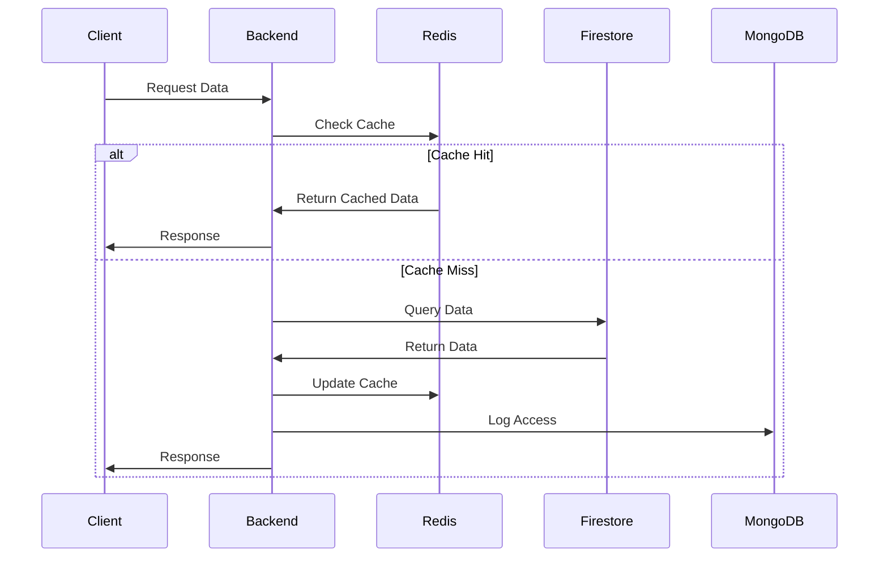

---

## AI/ML Pipeline

The AI/ML pipeline processes documents through multiple stages to extract insights and generate summaries.

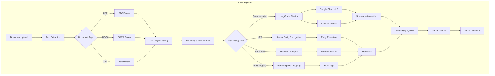

### LangChain Integration

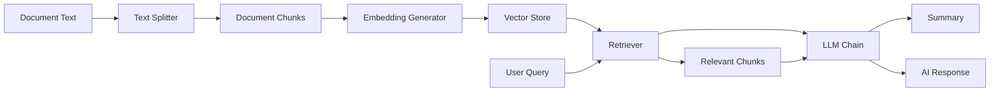

### AI Service Architecture

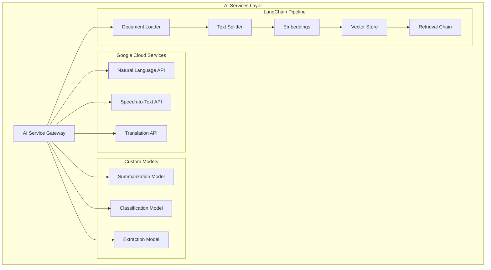

### Agentic RAG Orchestration (2024 Refresh)

DocuThinker's revamped AI/ML core consolidates LangGraph, CrewAI, multi-provider LLMs, and optional Neo4j/Chroma persistence into a single `DocumentIntelligenceService` facade. Key characteristics:

- **LangGraph state machine** – `AgenticRAGPipeline` orchestrates ingest → semantic retrieval → CrewAI validation → final report assembly with configurable chunk sizes and embedding backends.
- **CrewAI swarm** – OpenAI (analyst), Gemini (researcher), and Claude (reviewer) agents collaborate via shared search/insights tools to ground responses.
- **Multi-provider registry** – Pluggable chat/embedding creation through `LLMProviderRegistry` allows runtime swapping of OpenAI, Anthropic, Gemini, or Hugging Face models.
- **Persistent memory (optional)** – When enabled, analyses are synced into Neo4j (knowledge graph) and ChromaDB (semantic vector store) for cross-session recall and graph querying.
- **Unified access** – FastAPI, CLI, legacy helpers, and the MCP server consume the same facade, exposing sentiment, translation, recommendations, graph sync, and vector search with consistent metadata.

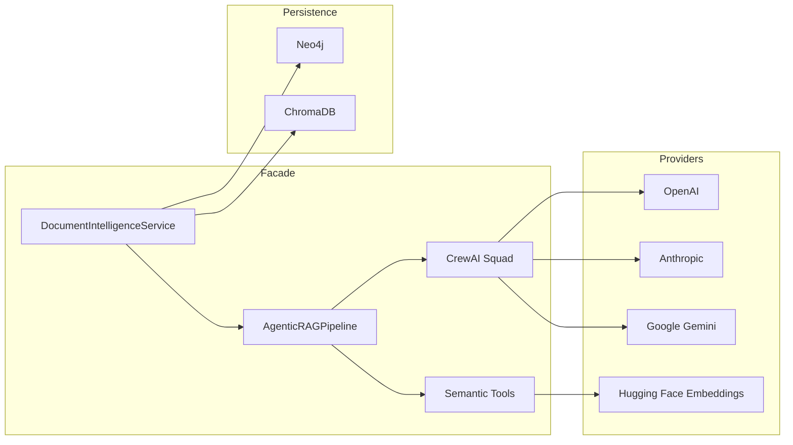

---

## Authentication & Security

DocuThinker implements a multi-layered security architecture.

```mermaid
graph TB
    subgraph "Security Architecture"
        A[Client Request]

        subgraph "Transport Layer"
            B[HTTPS/TLS 1.3]
            C[Certificate Validation]
        end

        subgraph "Authentication Layer"
            D[Firebase Authentication]
            E[JWT Tokens]
            F[Session Management]
        end

        subgraph "Authorization Layer"
            G[Role-Based Access Control]
            H[Resource Permissions]
            I[API Rate Limiting]
        end

        subgraph "Data Protection"
            J[Data Encryption at Rest]
            K[Data Encryption in Transit]
            L[Secure Key Storage]
        end

        subgraph "Monitoring & Logging"
            M[Access Logs]
            N[Audit Trail]
            O[Anomaly Detection]
        end
    end

    A --> B
    B --> C
    C --> D
    D --> E
    E --> F
    F --> G
    G --> H
    H --> I
    I --> J
    J --> K
    K --> L
    L --> M
    M --> N
    N --> O
```

### Authentication Flow

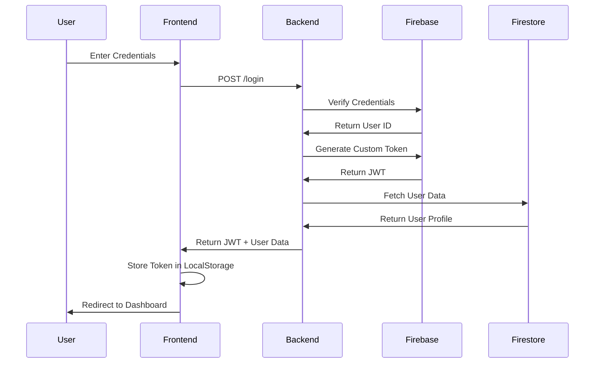

### Authorization Middleware

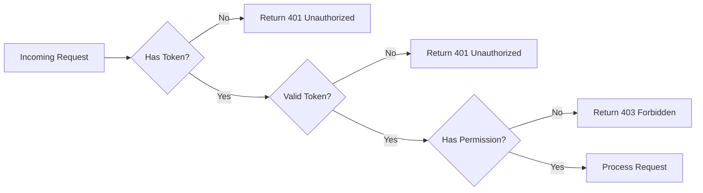

---

## Caching Strategy

Redis is used for multi-level caching to optimize performance.

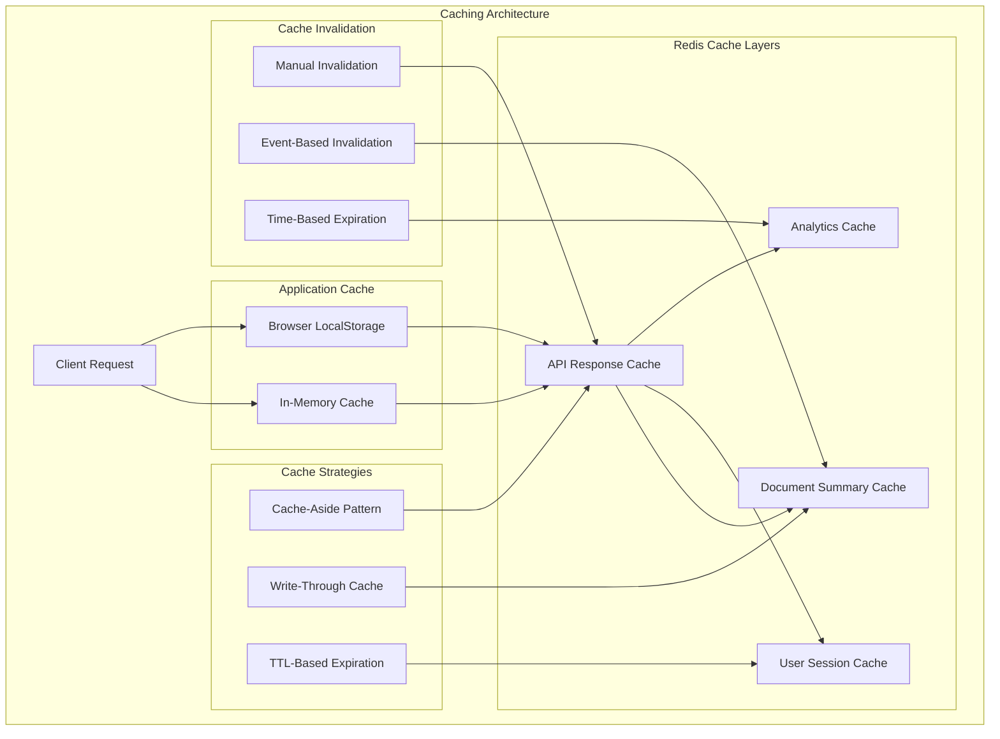

### Cache Flow

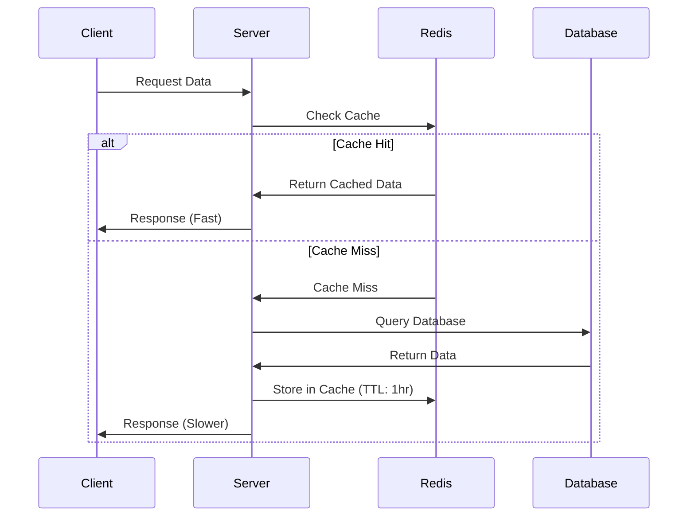

---

## Message Queue Architecture

RabbitMQ handles asynchronous tasks and background jobs.

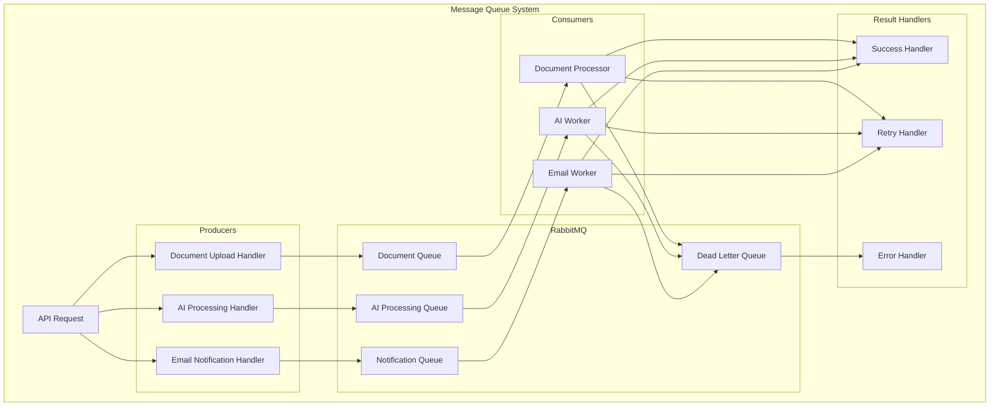

### Async Processing Flow

```mermaid
sequenceDiagram
    participant Client
    participant API
    participant Queue
    participant Worker
    participant Database
    participant Notification

    Client->>API: Upload Document
    API->>Queue: Enqueue Processing Job
    API->>Client: Return Job ID (202 Accepted)

    Queue->>Worker: Dequeue Job
    Worker->>Worker: Process Document
    Worker->>Database: Store Results
    Worker->>Notification: Send Completion Event
    Notification->>Client: Notify User
```

---

## Deployment Architecture

Multi-platform deployment with CI/CD automation.

```mermaid
graph TB
    subgraph "Deployment Pipeline"
        A[Git Repository]

        subgraph "CI/CD"
            B[GitHub Actions]
            C[Jenkins Pipeline]
        end

        subgraph "Build Stage"
            D[Install Dependencies]
            E[Run Tests]
            F[Build Assets]
            G[Docker Image Build]
        end

        subgraph "Deployment Targets"
            H[Vercel - Frontend]
            I[Render - Backend]
            J[Netlify - Backup]
            K[Docker Hub]
        end

        subgraph "Production Services"
            L[Firebase Auth]
            M[MongoDB Atlas]
            N[Redis Cloud]
            O[Google Cloud APIs]
        end
    end

    A --> B
    A --> C

    B --> D
    C --> D

    D --> E
    E --> F
    F --> G

    F --> H
    G --> I
    F --> J
    G --> K

    I --> L
    I --> M
    I --> N
    I --> O
```

### CI/CD Workflow

```mermaid
sequenceDiagram
    participant Dev as Developer
    participant Git as GitHub
    participant CI as CI/CD Pipeline
    participant Test as Test Suite
    participant Build as Build System
    participant Deploy as Deployment
    participant Prod as Production

    Dev->>Git: Push Code
    Git->>CI: Trigger Pipeline
    CI->>Test: Run Tests

    alt Tests Pass
        Test->>CI: Success
        CI->>Build: Build Assets
        Build->>CI: Build Complete
        CI->>Deploy: Deploy to Staging
        Deploy->>CI: Staging Success
        CI->>Deploy: Deploy to Production
        Deploy->>Prod: Update Live
        Prod->>CI: Deployment Success
        CI->>Dev: Notify Success
    else Tests Fail
        Test->>CI: Failure
        CI->>Dev: Notify Failure
    end
```

---

## Container Orchestration

Kubernetes manages containerized deployments.

```mermaid
graph TB
    subgraph "Kubernetes Cluster"
        A[Ingress Controller]

        subgraph "Frontend Deployment"
            B[Frontend Service]
            C[Pod 1 - React]
            D[Pod 2 - React]
            E[Pod 3 - React]
        end

        subgraph "Backend Deployment"
            F[Backend Service]
            G[Pod 1 - Express]
            H[Pod 2 - Express]
            I[Pod 3 - Express]
        end

        subgraph "Supporting Services"
            J[Redis Service]
            K[MongoDB Service]
            L[RabbitMQ Service]
        end

        subgraph "Configuration"
            M[ConfigMap]
            N[Secrets]
            O[Persistent Volumes]
        end

        subgraph "Monitoring"
            P[Prometheus]
            Q[Grafana]
            R[Logs Aggregator]
        end
    end

    A --> B
    A --> F

    B --> C
    B --> D
    B --> E

    F --> G
    F --> H
    F --> I

    G --> J
    H --> K
    I --> L

    M --> G
    N --> G
    O --> K

    P --> Q
    R --> Q
```

### Auto-Scaling Configuration

```mermaid
graph LR
    A[Metrics Server] --> B{CPU > 70%}
    B -->|Yes| C[Horizontal Pod Autoscaler]
    C --> D[Scale Up Pods]
    D --> E[Load Balancer]

    A --> F{CPU < 30%}
    F -->|Yes| G[HPA]
    G --> H[Scale Down Pods]
    H --> E

    E --> I[Distribute Traffic]
```

---

## API Design

RESTful and GraphQL APIs with comprehensive documentation.

```mermaid
graph TB
    subgraph "API Gateway"
        A[Client Request]

        subgraph "REST API"
            B[api/users]
            C[api/documents]
            D[api/ai]
            E[api/analytics]
        end

        subgraph "GraphQL API"
            F[graphql]
            G[Queries]
            H[Mutations]
            I[Subscriptions]
        end

        subgraph "Documentation"
            J[Swagger/OpenAPI]
            K[GraphiQL Interface]
            L[Postman Collection]
        end
    end

    A --> B
    A --> C
    A --> D
    A --> E
    A --> F

    F --> G
    F --> H
    F --> I

    B --> J
    C --> J
    D --> J
    E --> J
    F --> K
```

### API Request Flow

```mermaid
sequenceDiagram
    participant Client
    participant Gateway
    participant Auth
    participant Controller
    participant Service
    participant Database
    participant Cache

    Client->>Gateway: API Request + JWT
    Gateway->>Auth: Validate Token
    Auth->>Gateway: Token Valid
    Gateway->>Controller: Route to Controller
    Controller->>Cache: Check Cache

    alt Cache Hit
        Cache->>Controller: Return Cached Data
    else Cache Miss
        Cache->>Service: Cache Miss
        Service->>Database: Query Data
        Database->>Service: Return Data
        Service->>Cache: Update Cache
        Service->>Controller: Return Data
    end

    Controller->>Gateway: Format Response
    Gateway->>Client: JSON Response
```

---

## Data Flow

End-to-end data flow through the application.

```mermaid
graph TB
    A[User] --> B[Frontend UI]
    B --> C[API Layer]

    C --> D{Request Type}

    D -->|Upload| E[Document Processing]
    D -->|Query| F[Data Retrieval]
    D -->|Auth| G[Authentication]

    E --> H[File Parser]
    H --> I[AI Processing]
    I --> J[Results Storage]

    F --> K[Cache Check]
    K -->|Hit| L[Return Cached]
    K -->|Miss| M[Database Query]
    M --> N[Update Cache]
    N --> L

    G --> O[Firebase Auth]
    O --> P[Token Generation]

    J --> Q[Response Formatter]
    L --> Q
    P --> Q

    Q --> R[JSON Response]
    R --> B
    B --> A
```

### Document Processing Flow

```mermaid
sequenceDiagram
    participant User
    participant Frontend
    participant Backend
    participant Queue
    participant AI Service
    participant Database
    participant Cache

    User->>Frontend: Upload Document
    Frontend->>Backend: POST /upload
    Backend->>Queue: Enqueue Processing Job
    Backend->>Frontend: Job ID + Status Link
    Frontend->>User: Show Processing Status

    Queue->>AI Service: Process Document
    AI Service->>AI Service: Extract Text
    AI Service->>AI Service: Generate Summary
    AI Service->>AI Service: Extract Entities
    AI Service->>Database: Store Results
    AI Service->>Cache: Cache Summary
    AI Service->>Backend: Processing Complete
    Backend->>Frontend: WebSocket Notification
    Frontend->>User: Display Results
```

---

## Scalability & Performance

Strategies for handling growth and maintaining performance.

```mermaid
graph TB
    subgraph "Scalability Architecture"
        A[Application Growth]

        subgraph "Horizontal Scaling"
            B[Load Balancer]
            C[Multiple Server Instances]
            D[Database Replication]
        end

        subgraph "Vertical Scaling"
            E[Increased Resources]
            F[Better Hardware]
        end

        subgraph "Performance Optimization"
            G[Redis Caching]
            H[CDN Distribution]
            I[Code Splitting]
            J[Lazy Loading]
        end

        subgraph "Database Optimization"
            K[Indexing]
            L[Query Optimization]
            M[Connection Pooling]
        end

        subgraph "Monitoring"
            N[APM Tools]
            O[Performance Metrics]
            P[Error Tracking]
        end
    end

    A --> B
    A --> E

    B --> C
    C --> D

    E --> F

    G --> H
    H --> I
    I --> J

    K --> L
    L --> M

    N --> O
    O --> P
```

### Performance Metrics

```mermaid
graph LR
    A[Performance Monitoring] --> B[Response Time]
    A --> C[Throughput]
    A --> D[Error Rate]
    A --> E[Resource Usage]

    B --> F[< 200ms Target]
    C --> G[1000 req/sec]
    D --> H[< 0.1%]
    E --> I[CPU < 70%]

    F --> J[Alerts]
    G --> J
    H --> J
    I --> J
```

---

## Technology Stack

Comprehensive overview of all technologies used.

```mermaid
mindmap
  root((DocuThinker Tech Stack))
    Frontend
      React 18
      Material-UI
      TailwindCSS
      React Router
      Axios
      Context API
    Backend
      Node.js
      Express
      Firebase Admin SDK
      GraphQL
      JWT
    Database
      Firestore
      MongoDB Atlas
      Redis Cache
    AI/ML
      Google Cloud NLP
      LangChain
      Custom NLP Models
      Speech-to-Text
    DevOps
      Docker
      Kubernetes
      Jenkins
      GitHub Actions
      NGINX
    Cloud Services
      Vercel
      Render
      Firebase
      Google Cloud
    Monitoring
      Analytics
      Error Tracking
      Performance Monitoring
```

### Technology Decisions

| Category | Technology | Reason |
|----------|-----------|--------|
| Frontend Framework | React 18 | Component reusability, large ecosystem, performance |
| Backend Framework | Express.js | Lightweight, flexible, extensive middleware support |
| Authentication | Firebase Auth | Secure, scalable, built-in user management |
| Database | Firestore + MongoDB | Real-time updates (Firestore), flexible schema (MongoDB) |
| Caching | Redis | In-memory speed, advanced data structures |
| AI/ML | Google Cloud NLP + LangChain | Accuracy, scalability, ease of integration |
| Containerization | Docker | Environment consistency, easy deployment |
| Orchestration | Kubernetes | Auto-scaling, self-healing, load balancing |
| CI/CD | GitHub Actions + Jenkins | Automation, integration with GitHub |
| Monitoring | Google Analytics + Custom | User behavior tracking, performance metrics |

---

## Conclusion

DocuThinker's architecture is designed for scalability, performance, and maintainability. The multi-layered approach ensures:

- **High Availability**: Through load balancing and redundancy
- **Performance**: Via caching and CDN distribution
- **Security**: With multi-layer authentication and encryption
- **Scalability**: Through containerization and cloud services
- **Maintainability**: With clean architecture and separation of concerns

For more details, refer to:
- [README.md](README.md) - General documentation
- [Backend README](backend/README.md) - Backend-specific details
- [Frontend README](frontend/README.md) - Frontend-specific details
- [API Documentation](openapi.yaml) - Complete API reference

---

**Last Updated**: January 2025
**Version**: 1.0.0
**Author**: [Son Nguyen](https://github.com/hoangsonww)
