# DocuThinker Architecture Documentation

## Table of Contents

- [Overview](#overview)
- [System Architecture](#system-architecture)
- [Production DevOps Platform](#production-devops-platform)
- [Frontend Architecture](#frontend-architecture)
- [Landing Page 3D Experience](#landing-page-3d-experience)
- [Multi-Format Ingestion & Rendering](#multi-format-ingestion--rendering)
- [Backend Architecture](#backend-architecture)
- [Document Storage & Data Model](#document-storage--data-model)
- [Agentic Orchestration Layer](#agentic-orchestration-layer)
- [Beads Task Coordination](#beads-task-coordination)
- [AI/ML Pipeline](#aiml-pipeline)
- [Database Architecture](#database-architecture)
- [Service Mesh Architecture](#service-mesh-architecture)
- [Observability & Monitoring](#observability--monitoring)
- [Security Architecture](#security-architecture)
- [Reliability Engineering](#reliability-engineering)
- [Progressive Delivery](#progressive-delivery)
- [Autoscaling Strategy](#autoscaling-strategy)
- [Deployment Architecture](#deployment-architecture)
- [Container Orchestration](#container-orchestration)
- [Scalability & Performance](#scalability--performance)
- [Technology Stack](#technology-stack)

---

## Overview

DocuThinker is an **enterprise-grade**, full-stack AI-powered document analysis and summarization application built using the **FERN Stack** (Firebase, Express, React, Node.js). The application has been enhanced with a comprehensive DevOps platform featuring 15+ production-ready components for security, reliability, and scalability.

### Core Features

- **Document Upload & Processing**: Broad multi-format support — **PDF** (pdf.js, with paragraph reconstruction), **Word/DOCX** (mammoth), **Markdown**, **HTML**, **CSV/TSV**, **JSON**, and a wide range of **plain-text / code / config** files. The browser extracts a clean plaintext (for the AI) **and** a display variant (HTML / Markdown / monospace) entirely **client-side**, then uploads the original file **directly to Supabase Storage** via a backend-minted signed URL (see [Multi-Format Ingestion & Rendering](#multi-format-ingestion--rendering))
- **Format-Aware Viewer**: The result screen renders each document the way it should look — native **PDF in an `<iframe>`** of a signed Supabase URL, **DOCX/HTML/CSV** as sanitized HTML, **Markdown** via `react-markdown`, **JSON/code** as monospace `<pre>`, and everything else as `pre-wrap` text
- **Interactive Result View**: A **drag-resizable** Original | Summary split, a **text-selection action menu** (Copy / Summarize / Rewrite / Ask Chat / Search the web) that operates only on the highlighted text, and a **multi-step animated upload progress** (Reading → Storing → Analyzing → Ready) with a smooth reveal into results
- **Scalable Per-Document Storage**: Each uploaded document is its own Firestore record in a `users/{uid}/documents/{docId}` **subcollection**, with heavy text/HTML/file payloads offloaded to **Supabase Storage**. This is the permanent fix for the previous inline-array design that hit Firestore's 1 MB-per-document ceiling (see [Document Storage & Data Model](#document-storage--data-model))
- **AI-Powered Summarization**: Resilient summarization using **Google Gemini** (`@google/generative-ai`) with dynamic model discovery, model + API-key rotation, and multi-model / multi-key fallback (the production summary path). The document **title** and **today's date** are injected into every system prompt, and the summary prompt asks for easy-to-read, model-decided formatting (light Markdown). A separate Python **LangGraph + CrewAI** pipeline powers deep multi-agent analysis
- **Intelligent Chat**: Context-aware conversational AI for document Q&A
- **Multi-Language Support**: Document processing and summarization in multiple languages
- **Real-time Analytics**: User behavior tracking and document analytics
- **Sentiment Analysis**: Emotional tone detection in documents
- **Named Entity Recognition (NER)**: Extraction of key entities from documents
- **Content Rewriting**: Style-based content transformation
- **Semantic Search**: Vector-based document search using embeddings
- **User Management**: Firebase Authentication with social login options
- **Passkeys (WebAuthn)**: Passwordless, phishing-resistant sign-in; multiple credentials per user, managed from a dedicated Passkeys page. A successful assertion mints a Firebase custom token, so passkeys plug into the existing session model unchanged
- **Cloud-Native Architecture**: Kubernetes-based deployment with microservices
- **Observability**: Full-stack monitoring with OpenTelemetry, Prometheus, Grafana, Jaeger, and Coralogix
- **Security**: mTLS, OPA policy enforcement, runtime security with Falco, SonarQube code quality gates, Snyk vulnerability management
- **Reliability Engineering**: Chaos testing with Litmus, disaster recovery with Velero

### DevOps Platform Features

- **Blue/Green Deployments**: Zero-downtime releases with Istio
- **Canary Releases**: Gradual rollouts with Flagger
- **Service Mesh**: Istio for mTLS, traffic management, and circuit breaking
- **Policy Enforcement**: OPA Gatekeeper for security and compliance
- **Chaos Engineering**: Litmus for resilience testing
- **Progressive Delivery**: Flagger for automated canary deployments
- **Event-Driven Autoscaling**: KEDA for cost-optimized scaling
- **Runtime Security**: Falco for threat detection
- **Code Quality**: SonarQube for static analysis, quality gates, and coverage
- **Vulnerability Management**: Snyk for OSS, container, IaC, and SAST scanning
- **Distributed Tracing**: OpenTelemetry with Jaeger and Coralogix integration
- **Disaster Recovery**: Velero for automated backups
- **SLO/SLI Monitoring**: Error budget tracking and alerting
- **TLS Automation**: cert-manager for certificate management

---

## System Architecture

The application follows a **cloud-native, microservices-oriented architecture** with enterprise-grade DevOps components across multiple layers.

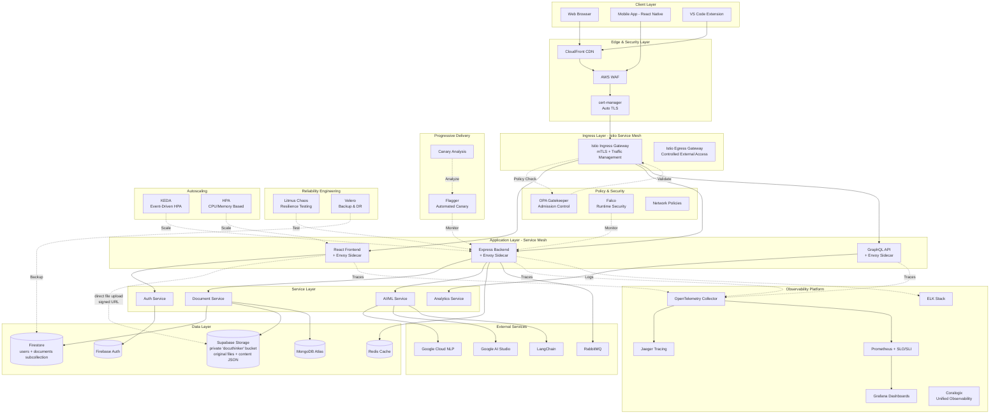
```mermaid
graph TB
    subgraph "Client Layer"
        A[Web Browser]
        B[Mobile App - React Native]
        C[VS Code Extension]
    end

    subgraph "Edge & Security Layer"
        D[CloudFront CDN]
        E[AWS WAF]
        F[cert-manager<br/>Auto TLS]
    end

    subgraph "Ingress Layer - Istio Service Mesh"
        G[Istio Ingress Gateway<br/>mTLS + Traffic Management]
        H[Istio Egress Gateway<br/>Controlled External Access]
    end

    subgraph "Policy & Security"
        I[OPA Gatekeeper<br/>Admission Control]
        J[Falco<br/>Runtime Security]
        K[Network Policies]
    end

    subgraph "Application Layer - Service Mesh"
        L[React Frontend<br/>+ Envoy Sidecar]
        M[Express Backend<br/>+ Envoy Sidecar]
        N[GraphQL API<br/>+ Envoy Sidecar]
    end

    subgraph "Progressive Delivery"
        O[Flagger<br/>Automated Canary]
        P[Canary Analysis]
    end

    subgraph "Service Layer"
        Q[Auth Service]
        R[Document Service]
        S[AI/ML Service]
        T[Analytics Service]
    end

    subgraph "Data Layer"
        U[(Firebase Auth)]
        V[(Firestore<br/>users + documents subcollection)]
        SB[(Supabase Storage<br/>private 'docuthinker' bucket<br/>original files + content JSON)]
        W[(MongoDB Atlas)]
        X[(Redis Cache)]
    end

    subgraph "Observability Platform"
        Y[OpenTelemetry Collector]
        Z[Prometheus + SLO/SLI]
        AA[Grafana Dashboards]
        AB[Jaeger Tracing]
        AC[ELK Stack]
        CX[Coralogix<br/>Unified Observability]
    end

    subgraph "Reliability Engineering"
        AD[Litmus Chaos<br/>Resilience Testing]
        AE[Velero<br/>Backup & DR]
    end

    subgraph "Autoscaling"
        AF[KEDA<br/>Event-Driven HPA]
        AG[HPA<br/>CPU/Memory Based]
    end

    subgraph "External Services"
        AH[Google Cloud NLP]
        AI[Google AI Studio]
        AJ[LangChain]
        AK[RabbitMQ]
    end

    A --> D
    B --> E
    C --> D
    D --> E
    E --> F
    F --> G

    G -.->|Policy Check| I
    I -.->|Validate| G
    G --> L
    G --> M
    G --> N

    L --> Q
    M --> R
    M --> S
    N --> T

    O -.->|Monitor| M
    P -.->|Analyze| O

    Q --> U
    R --> V
    R --> SB
    R --> W
    L -.->|direct file upload<br/>signed URL| SB
    S --> AH
    S --> AI
    S --> AJ
    M --> X
    M --> AK

    L -.->|Traces| Y
    M -.->|Traces| Y
    N -.->|Traces| Y

    Y --> AB
    Y --> Z
    Z --> AA
    M -.->|Logs| AC

    J -.->|Monitor| M
    AD -.->|Test| M
    AE -.->|Backup| V

    AF -.->|Scale| M
    AG -.->|Scale| L
```

---

## Production DevOps Platform

Complete enterprise DevOps infrastructure with 15 integrated components.

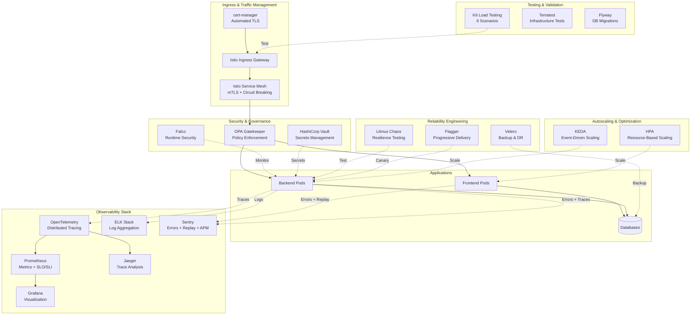
```mermaid
graph TB
    subgraph "Ingress & Traffic Management"
        SM[Istio Service Mesh<br/>mTLS + Circuit Breaking]
        IG[Istio Ingress Gateway]
        TLS[cert-manager<br/>Automated TLS]
    end

    subgraph "Security & Governance"
        OPA[OPA Gatekeeper<br/>Policy Enforcement]
        FALCO[Falco<br/>Runtime Security]
        VAULT[HashiCorp Vault<br/>Secrets Management]
    end

    subgraph "Applications"
        FE[Frontend Pods]
        BE[Backend Pods]
        DB[(Databases)]
    end

    subgraph "Observability Stack"
        OTEL[OpenTelemetry<br/>Distributed Tracing]
        PROM[Prometheus<br/>Metrics + SLO/SLI]
        GRAF[Grafana<br/>Visualization]
        JAEGER[Jaeger<br/>Trace Analysis]
        ELK[ELK Stack<br/>Log Aggregation]
        SENTRY[Sentry<br/>Errors + Replay + APM]
    end

    subgraph "Reliability Engineering"
        LITMUS[Litmus Chaos<br/>Resilience Testing]
        FLAGGER[Flagger<br/>Progressive Delivery]
        VELERO[Velero<br/>Backup & DR]
    end

    subgraph "Autoscaling & Optimization"
        KEDA[KEDA<br/>Event-Driven Scaling]
        HPA[HPA<br/>Resource-Based Scaling]
    end

    subgraph "Testing & Validation"
        K6[K6 Load Testing<br/>6 Scenarios]
        TERRATEST[Terratest<br/>Infrastructure Tests]
        FLYWAY[Flyway<br/>DB Migrations]
    end

    TLS --> IG
    IG --> SM
    SM --> OPA
    OPA --> FE
    OPA --> BE

    FALCO -.->|Monitor| BE
    VAULT -.->|Secrets| BE

    FE --> DB
    BE --> DB

    BE -.->|Traces| OTEL
    OTEL --> JAEGER
    OTEL --> PROM
    PROM --> GRAF
    BE -.->|Logs| ELK
    FE -.->|Errors + Replay| SENTRY
    BE -.->|Errors + Traces| SENTRY

    LITMUS -.->|Test| BE
    FLAGGER -.->|Canary| BE
    VELERO -.->|Backup| DB

    KEDA -.->|Scale| BE
    HPA -.->|Scale| FE

    K6 -.->|Test| IG
```

---

## Frontend Architecture

The frontend is built with **React 18** + **Material-UI** (CRACO build, Poppins font) and follows a component-based architecture with modern React patterns. Two characteristics are worth calling out up front because they drive the data flow:

- **Client-side multi-format extraction + direct-to-Supabase uploads.** The upload modal (`components/UploadModal.js`) extracts a clean plaintext **and** a display variant in the browser for **PDF, DOCX, Markdown, HTML, CSV/TSV, JSON, and text/code** files (`extractDocument`), then uploads the **original file bytes straight to Supabase Storage** using `@supabase/supabase-js` (anon key) against a backend-minted signed-upload token. This bypasses Vercel's ~4.5 MB serverless body limit; only the small extracted text + paths are POSTed to the backend. A four-step animated progress (**Reading → Storing → Analyzing → Ready**) tracks the real upload stages. See [Multi-Format Ingestion & Rendering](#multi-format-ingestion--rendering).
- **Rich, interactive result view.** The summary screen (`pages/Home.js`) renders **drag-resizable** Original | Summary columns (with a full-screen drag overlay so the PDF iframe can't swallow the drag), a custom **text-selection action menu** (Copy / Summarize / Rewrite / Ask Chat / Search web on just the highlighted text), a **localStorage-cached** per-document sentiment meter, and the full AI toolset (key ideas, discussion points, bullet/translated summaries, rewrite, recommendations, chat). The format-aware viewer shows native PDFs in an `<iframe>` of the signed URL, DOCX/HTML/CSV/JSON/code as sanitized HTML, Markdown via `react-markdown`, and everything else as pre-wrap text. See [Result View & In-Document Interactions](#result-view--in-document-interactions).

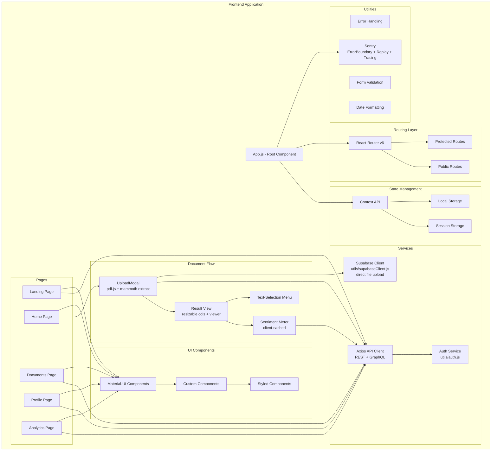
```mermaid
graph TB
    subgraph "Frontend Application"
        A[App.js - Root Component]

        subgraph "Routing Layer"
            B[React Router v6]
            C[Protected Routes]
            D[Public Routes]
        end

        subgraph "State Management"
            E[Context API]
            F[Local Storage]
            G[Session Storage]
        end

        subgraph "UI Components"
            H[Material-UI Components]
            I[Custom Components]
            J[Styled Components]
        end

        subgraph "Pages"
            K[Landing Page]
            L[Home Page]
            M[Documents Page]
            N[Profile Page]
            O[Analytics Page]
        end

        subgraph "Services"
            P[Axios API Client<br/>REST + GraphQL]
            Q[Auth Service<br/>utils/auth.js]
            R[Supabase Client<br/>utils/supabaseClient.js<br/>direct file upload]
        end

        subgraph "Document Flow"
            UM[UploadModal<br/>pdf.js + mammoth extract]
            RV[Result View<br/>resizable cols + viewer]
            SEL[Text-Selection Menu]
            SM[Sentiment Meter<br/>client-cached]
        end

        subgraph "Utilities"
            S[Error Handling]
            T[Form Validation]
            U[Date Formatting]
            SENT[Sentry<br/>ErrorBoundary + Replay + Tracing]
        end
    end

    A --> SENT
    A --> B
    B --> C
    B --> D
    A --> E
    E --> F
    E --> G
    K --> H
    L --> H
    M --> H
    N --> H
    O --> H
    H --> I
    I --> J
    P --> Q
    L --> UM
    UM --> R
    UM --> P
    UM --> RV
    RV --> SEL
    RV --> SM
    SM --> P
    K --> P
    M --> P
    N --> P
    O --> P
```

**Error & session monitoring.** Sentry (`@sentry/react`) is initialized in `src/sentry.js`, which is imported **first** in `index.js` so `Sentry.init()` runs before React renders. The app tree is wrapped in `Sentry.ErrorBoundary`, so uncaught render errors are reported with a graceful fallback UI. The SDK also captures **browser performance traces** (`browserTracingIntegration`) and **session replays** (`replayIntegration`, 100% of errored sessions), and `tracePropagationTargets` propagates trace headers to the backend API so a browser transaction stitches to its backend spans. DSN and sample rates are configurable via `REACT_APP_SENTRY_*` env vars.

---

## Landing Page 3D Experience

The marketing landing page (`frontend/src/pages/LandingPage.js`) is a cinematic, **scroll-reactive 3D experience** rendered with **Three.js** through **React Three Fiber (R3F)** and **Drei**. The scene lives in `frontend/src/components/three/HeroExperience.js` and is lazy-loaded (via `React.lazy`) so the first paint of the hero copy never blocks on the Three.js bundle (~240 kB gzipped, split into its own chunk).

### Design goals

- **One continuous background, not two boxes.** A single WebGL canvas sits behind the *entire* page and the camera travels through it as the user scrolls — replacing the earlier approach of two isolated canvases (hero + CTA).
- **Readable content over a moving scene.** Content surfaces are **solid dark panels**; the 3D shows through the open areas (hero, CTA, inter-section gaps), keeping copy crisp.
- **Zero binary assets.** Every shape is primitive geometry, lighting is rendered into an in-memory cube with `<Lightformer>` panels (no `.hdr`), and particles use `<Sparkles>`. Nothing extra ships in the bundle.
- **Graceful degradation** for reduced-motion, no-WebGL, and low-power devices.

### Compositing: sticky canvas + negative-margin overlay

The page can't use `position: fixed` for the background because the app's route wrapper (`.page-transition`) applies `will-change: transform`, which creates a containing block that would trap a fixed child. Instead the canvas is pinned with `position: sticky`:

```
LandingPage root  (position: relative; overflow-x: clip)   ← clip, NOT hidden,
│                                                             so it isn't a scroll
│                                                             container (sticky-safe)
├── 3D background  (position: sticky; top: 0; height: 100svh; z-index: 0)
│     └── <HeroExperience />  ← single full-viewport WebGL canvas
│     └── vignette + film-grain scrims (legibility)
│
└── Foreground content  (position: relative; z-index: 1; margin-top: -100svh)
      └── hero · stats · features · … · CTA   (solid panels, transparent sections)
```

The foreground is pulled up over the sticky background with `margin-top: -100svh`, so the background stays pinned to the viewport for the whole scroll while content scrolls on top of it.

### Scroll-driven camera

Page scroll is normalized to a `0 → 1` progress value, **stored in a ref** and updated by a `passive` scroll listener — it is **never** put in React state, so scrolling triggers **no re-renders**. A `ScrollCamera` component reads that ref every frame (`useFrame`) and lerps the camera down a vertical column of objects:

- **Descend** — `camera.y` travels from `0` (hero core) to `-9` (CTA core), passing frosted-glass "document" panels distributed along the way.
- **Breathe** — `camera.z` eases back at the scroll midpoint (`sin(p·π)`) for a cinematic dolly.
- **Sway** — a small lateral `camera.x` drift, plus pointer-parallax on the whole group (`Rig`).

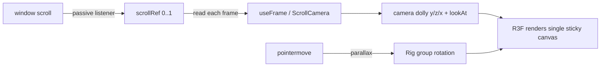
```mermaid
flowchart LR
    SCROLL[window scroll] -->|passive listener| REF[scrollRef 0..1]
    REF -->|read each frame| UF[useFrame / ScrollCamera]
    UF --> CAM[camera dolly y/z/x + lookAt]
    CAM --> R[R3F renders single sticky canvas]
    PTR[pointermove] -->|parallax| RIG[Rig group rotation] --> R
```

### Scene composition (`HeroExperience.js`)

- **Two glowing cores** (`<MeshDistortMaterial>` icosahedra + additive halo) anchor the hero (top) and CTA (bottom).
- **Frosted-glass panels** (`<RoundedBox>` with `meshPhysicalMaterial` transmission) drift along the column via `<Float>`.
- **Metallic accents** (octahedron / dodecahedron / torus-knot) and a `<Sparkles>` field add depth.
- **Procedural lighting** via `<Environment>` + `<Lightformer>` rectangles/ring rendered to an in-memory cube — no image-based lighting files.

### Capability detection & fallbacks

| Condition | Behavior |
| --- | --- |
| `prefers-reduced-motion` | All animation frozen; render loop switches to `frameloop="demand"`; camera holds its initial framing. |
| No WebGL context | Canvas is never mounted; a pure-CSS warm-glow backdrop (`Fallback`) is shown so the layout/copy stay intact. |
| Low-power device (≤4 cores / ≤4 GB) | Lighter scene — fewer panels/accents, no shadows or antialias, lower DPR, smaller environment resolution. |
| GPU context loss | `webglcontextlost` is `preventDefault`ed so the browser can restore instead of blanking; a `CanvasErrorBoundary` swaps in the CSS fallback on hard failure. |

### Testing

Because jsdom has no WebGL, the snapshot suite (`frontend/src/__tests__/07_snapshots.test.js`) mocks `HeroExperience` with a deterministic stub and polyfills the browser APIs the page relies on (`matchMedia`, `IntersectionObserver`, `ResizeObserver`, scroll helpers) in `setupTests.js`. This lets the full `LandingPage` render and snapshot deterministically without a GPU.

---

## Multi-Format Ingestion & Rendering

DocuThinker extracts and renders **many** document formats entirely in the browser. All of the parsing happens client-side in `frontend/src/components/UploadModal.js` (`extractDocument`), and the viewer in `frontend/src/pages/Home.js` picks a render path from the resulting `fileType`. The guiding principle is a clean separation between **what the AI sees** and **what the user sees**:

- The **AI always receives clean plaintext** (`text`) — no markup, no table tags, no JSON noise — so summaries and chat stay coherent regardless of source format.
- The **viewer receives a format-appropriate display variant** (`html`, raw Markdown, or monospace) so the original document still *looks* like itself.
- The **original file** is uploaded straight to Supabase, and a small **content object** `{ originalText, originalHtml }` is stored alongside it; Firestore keeps only `filePath` / `contentPath` references (see [Document Storage & Data Model](#document-storage--data-model)).

### `extractDocument` — one extractor, many formats

`extractDocument(file)` returns `{ text, html, fileType }` (or `null` for unsupported files). Each branch produces a clean plaintext for the AI plus the right display payload:

| Source format | `text` (for the AI) | `html` / display | Render path in the viewer | `fileType` |
|---------------|---------------------|------------------|---------------------------|------------|
| **PDF** | Reconstructed plaintext — line/paragraph breaks inferred from each glyph's vertical position + `hasEOL` (no longer one space-joined blob) | Paragraph-ized HTML (`textToHtml`) as a fallback | Native `<iframe>` of a signed Supabase URL | `application/pdf` |
| **DOCX** | `mammoth.extractRawText` (raw text) | `mammoth.convertToHtml` (headings, bold, lists, tables) | Sanitized HTML | `…wordprocessingml.document` |
| **HTML** | `stripHtml` (tags removed) | Original HTML as-is | Sanitized HTML | `text/html` |
| **CSV / TSV** | Raw delimited text | `delimitedToHtmlTable` (first row → `<thead>`, quoted-field aware) | Sanitized HTML table | `text/csv` · `text/tab-separated-values` |
| **JSON** | Raw text | Pretty-printed (`JSON.stringify(…, null, 2)`) inside `<pre>` | Sanitized HTML (`<pre>`) | `application/json` |
| **Code / config** (`.js`, `.py`, `.go`, `.yaml`, `.sql`, …) | Raw text | Escaped source inside `<pre>` | Sanitized HTML (`<pre>`) | `text/plain` |
| **Markdown** | Raw Markdown | *(empty — rendered live)* | `react-markdown` (GFM + math) | `text/markdown` |
| **Plain text** | Raw text | *(empty)* | `pre-wrap` text | `text/plain` |

> **Note on the viewer branch order** (`Home.js`). The choice is **not** a flat `switch` on `fileType` — it is an ordered fallthrough that always degrades gracefully:
> 1. `fileType` contains `"pdf"` **and** a signed `fileUrl` exists → render the original PDF in a native `<iframe src={fileUrl}>`.
> 2. Else if `originalHtml` is non-empty → render `DOMPurify.sanitize(originalHtml)` (this is the DOCX/HTML/CSV/JSON/code path).
> 3. Else if `fileType` contains `"markdown"` → render `originalText` through `react-markdown`.
> 4. Else → render `originalText` with `white-space: pre-wrap`.
>
> Because branch 2 keys off **HTML presence** rather than the MIME type, a record always renders richly when HTML is available — which is exactly what makes the storage fallbacks (missing `filePath`, or a small inline payload) degrade to a clean view instead of failing.

### Ingestion data flow

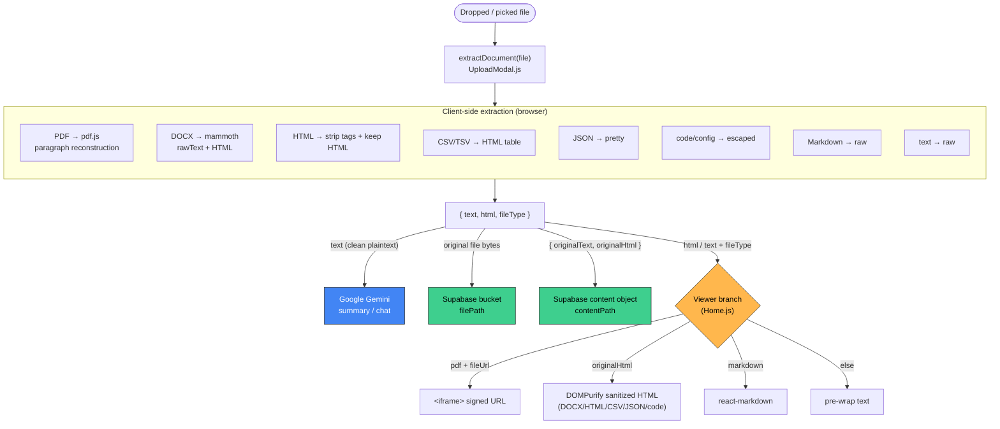
```mermaid
flowchart TB
    FILE([Dropped / picked file])

    FILE --> EXTRACT["extractDocument(file)<br/>UploadModal.js"]

    subgraph Extract["Client-side extraction (browser)"]
        direction TB
        PDF["PDF → pdf.js<br/>paragraph reconstruction"]
        DOCX["DOCX → mammoth<br/>rawText + HTML"]
        HTMLB["HTML → strip tags + keep HTML"]
        CSV["CSV/TSV → HTML table"]
        JSONB["JSON → pretty <pre>"]
        CODE["code/config → escaped <pre>"]
        MD["Markdown → raw"]
        TXT["text → raw"]
    end

    EXTRACT --> Extract
    Extract --> RET["{ text, html, fileType }"]

    RET -->|"text (clean plaintext)"| AI["Google Gemini<br/>summary / chat"]
    RET -->|original file bytes| SB["Supabase bucket<br/>filePath"]
    RET -->|"{ originalText, originalHtml }"| CJSON["Supabase content object<br/>contentPath"]

    RET -->|"html / text + fileType"| VIEW{"Viewer branch<br/>(Home.js)"}
    VIEW -->|"pdf + fileUrl"| V1["&lt;iframe&gt; signed URL"]
    VIEW -->|originalHtml| V2["DOMPurify sanitized HTML<br/>(DOCX/HTML/CSV/JSON/code)"]
    VIEW -->|markdown| V3["react-markdown"]
    VIEW -->|else| V4["pre-wrap text"]

    style AI fill:#4285F4,stroke:#333,color:#fff
    style SB fill:#3ECF8E,stroke:#333,color:#000
    style CJSON fill:#3ECF8E,stroke:#333,color:#000
    style VIEW fill:#FFB74D,stroke:#333,color:#000
```

The `dropzone` `accept` map and the `CODE_EXTS` set in `UploadModal.js` are the single source of truth for which extensions are accepted; the supported-format chips shown in the modal (`PDF`, `Word`, `Markdown`, `HTML`, `CSV`, `JSON`, `Code`) summarize them for the user.

---

## Backend Architecture

The backend follows the **MVC (Model-View-Controller)** pattern with additional service layers for business logic. It runs as **Express on Node 18** (deployed as **Vercel serverless functions**; `app.listen` is gated to non-production for local dev). Cross-cutting concerns wired in `index.js`, in order:

- **Permissive top-level CORS** — a hand-rolled middleware registered **before** body parsing or routing, so the CORS headers land on **every** response, including preflight `OPTIONS` (answered with `204`) and **error/crash paths**. It reflects the requested `Access-Control-Request-Headers` so no custom header is ever rejected. (A `cors()` middleware is also applied for completeness.)
- **Raised JSON/urlencoded body limit** — `express.json({ limit: "25mb" })` (and the matching `urlencoded` limit), up from body-parser's ~100 KB default. The `/upload` body now carries the extracted **text + display HTML** for large documents; the **original file itself bypasses the backend entirely** (it goes straight to Supabase), so this limit only needs to cover the extracted payload.
- **Structured request/response logging** — a paired `[REQ] METHOD url` on entry and `[RES] METHOD url -> status (Nms)` on `finish`, so every call is traceable in Vercel logs (5xx logged at `error` level).
- **Layered error handling** — a global error handler, an `UnauthorizedError` handler, and a catch-all `[UNHANDLED]` handler that logs a full stack (skipping if headers are already sent) instead of a silent 500.
- **Sentry monitoring** — `./instrument` is required at the **very top** of `index.js` (before any other module) so `@sentry/node` can auto-instrument Express/HTTP at require-time. `Sentry.setupExpressErrorHandler(app)` is registered **after all routes and before** the custom error handlers, so unhandled route errors are captured and forwarded to Sentry. Performance tracing, CPU profiling (`@sentry/profiling-node`), and structured logs are enabled; DSN and sample rates are configurable via `SENTRY_*` env vars.
- **Process-level crash loggers** — `unhandledRejection` and `uncaughtException` listeners so crashes are never silent.
- **Surfaces** — REST routes, **GraphQL at `/graphql`** (GraphiQL enabled), **Swagger UI at `/api-docs`** (served from CDN, JSON at `/swagger.json`), and the **Passkey/WebAuthn** routes.

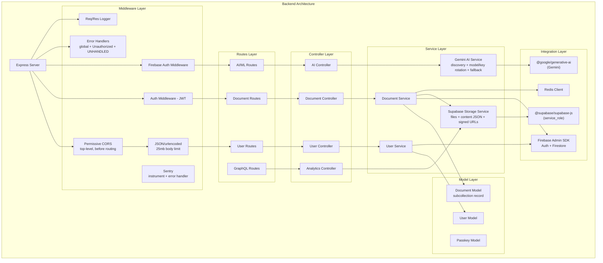
```mermaid
graph TB
    subgraph "Backend Architecture"
        A[Express Server]

        subgraph "Middleware Layer"
            B[Permissive CORS<br/>top-level, before routing]
            BJ[JSON/urlencoded<br/>25mb body limit]
            C[Auth Middleware - JWT]
            D[Firebase Auth Middleware]
            E[Error Handlers<br/>global + Unauthorized + UNHANDLED]
            F[Req/Res Logger]
            SEN[Sentry<br/>instrument + error handler]
        end

        subgraph "Routes Layer"
            G[User Routes]
            H[Document Routes]
            I[AI/ML Routes]
            J[GraphQL Routes]
        end

        subgraph "Controller Layer"
            K[User Controller]
            L[Document Controller]
            M[AI Controller]
            N[Analytics Controller]
        end

        subgraph "Service Layer"
            O[User Service]
            P[Document Service]
            Q[Gemini AI Service<br/>discovery + model/key rotation + fallback]
            R[Supabase Storage Service<br/>files + content JSON + signed URLs]
        end

        subgraph "Model Layer"
            S[User Model]
            T[Document Model<br/>subcollection record]
            U[Passkey Model]
        end

        subgraph "Integration Layer"
            V[Firebase Admin SDK<br/>Auth + Firestore]
            W["@google/generative-ai<br/>(Gemini)"]
            SBX["@supabase/supabase-js<br/>(service_role)"]
            Y[Redis Client]
        end
    end

    A --> B
    B --> BJ
    A --> C
    A --> D
    A --> E
    A --> F

    BJ --> G
    C --> H
    D --> I

    G --> K
    H --> L
    I --> M
    J --> N

    K --> O
    L --> P
    M --> Q
    N --> R

    O --> S
    P --> T

    O --> V
    P --> V
    P --> R
    R --> SBX
    Q --> W
    P --> Y
```

> **Note on the production AI path.** The Express backend summarizes with **Google Gemini** via `@google/generative-ai` (see `services/services.js`). On each call it:
> 1. **Discovers** available models from `GET https://generativelanguage.googleapis.com/v1/models`, keeping only models whose name contains `gemini`, **excludes** `embedding` and `pro` variants, and that advertise the `generateContent` method.
> 2. **Caches** the discovered list for **5 minutes** (`GEMINI_MODEL_CACHE_TTL_MS`); if discovery fails it reuses the last good list or falls back to `gemini-2.5-flash` (`DEFAULT_GEMINI_MODEL_FALLBACK`).
> 3. **Rotates** the starting model (round-robin via `geminiModelRotationIndex`) and **falls back across every model in order** — a `503`/blank/non-quota error on one model transparently retries the next.
> 4. **Rotates API keys** — every env var matching `GOOGLE_AI_API_KEY<n>` (`GOOGLE_AI_API_KEY`, `GOOGLE_AI_API_KEY1`, `GOOGLE_AI_API_KEY2`, …) is auto-discovered (`getGoogleAiApiKeys`), de-duplicated, and rotated round-robin (`geminiKeyRotationIndex`). Keys are the **outer** fallback loop, models the **inner** loop: when a key returns a quota/`429` error (`isGeminiQuotaError`) it is abandoned and the **next key** is tried immediately (rather than grinding every model on an exhausted key), so a single free-tier quota no longer fails the request. A descriptive error is surfaced only after **all keys × models** are exhausted (raw Gemini errors are often blank, which previously produced opaque 500s). Adding a key is an env-var change only — no code edit.
>
> **Prompt context injection.** Today's real date (`currentDateContext()`, formatted as a full `weekday, Month D, YYYY`) is prepended to **every** system instruction across all Gemini tasks (summary, chat, key ideas, discussion points, sentiment, bullet/translated summary, rewrite, recommendations, refine) for recency-aware reasoning. The document **title** is additionally fed to `generateSummary` as extra context (`Title: "…"` prefixed to the text), while the *stored* `originalText` is kept clean (no title prefix) so the viewer and chat stay intact. The summary prompt itself now asks for an **easy-to-read, model-decided layout** — short paragraphs with the occasional heading or short list only where it genuinely improves clarity, emitted as light Markdown — rather than a fixed structure.
>
> The heavier multi-agent **LangChain / LangGraph / CrewAI** stack lives in the separate Python [AI/ML Pipeline](#aiml-pipeline) service, not in this Express layer.

### MVC Pattern Implementation

#### Controllers
Handle HTTP requests and responses, coordinate between services and views.

```javascript
// Example Controller Structure
exports.uploadDocument = async (req, res) => {
  try {
    // 1. Parse request
    const { userId, file } = req.body;

    // 2. Validate input
    if (!file) throw new Error('No file provided');

    // 3. Call service layer
    const result = await documentService.processDocument(userId, file);

    // 4. Format response
    sendSuccessResponse(res, 200, 'Document uploaded successfully', result);
  } catch (error) {
    // 5. Handle errors
    sendErrorResponse(res, 400, 'Document upload failed', error.message);
  }
};
```

#### Services
Contain business logic and interact with data models and external APIs.

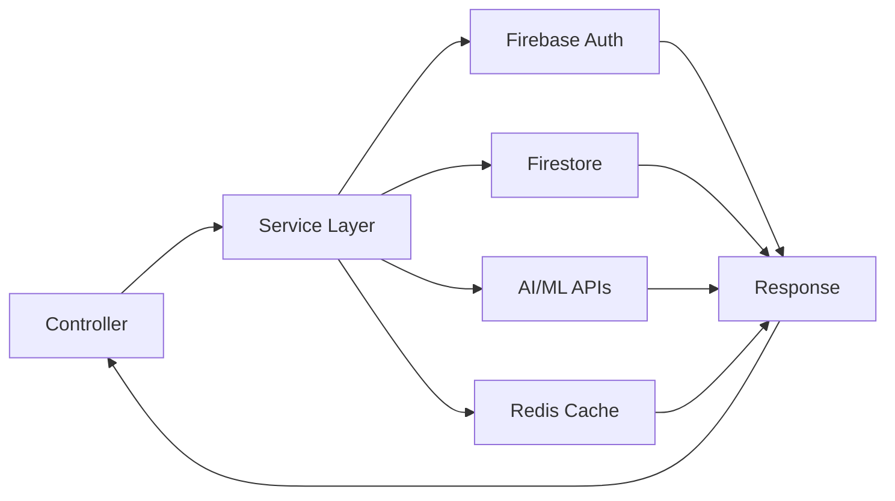
```mermaid
graph LR
    A[Controller] --> B[Service Layer]
    B --> C[Firebase Auth]
    B --> D[Firestore]
    B --> E[AI/ML APIs]
    B --> F[Redis Cache]
    C --> G[Response]
    D --> G
    E --> G
    F --> G
    G --> A
```

#### Models
Define data schemas and database interactions.

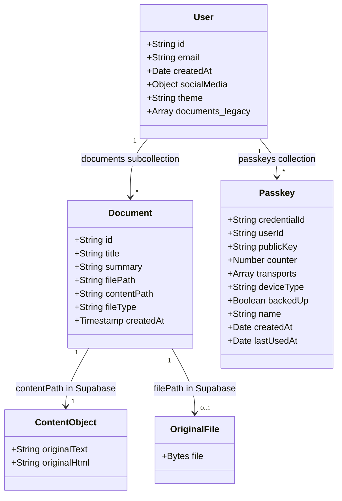
```mermaid
classDiagram
    class User {
        +String id
        +String email
        +Date createdAt
        +Object socialMedia
        +String theme
        +Array documents_legacy
    }

    class Document {
        +String id
        +String title
        +String summary
        +String filePath
        +String contentPath
        +String fileType
        +Timestamp createdAt
    }

    class ContentObject {
        +String originalText
        +String originalHtml
    }

    class OriginalFile {
        +Bytes file
    }

    class Passkey {
        +String credentialId
        +String userId
        +String publicKey
        +Number counter
        +Array transports
        +String deviceType
        +Boolean backedUp
        +String name
        +Date createdAt
        +Date lastUsedAt
    }

    User "1" --> "*" Document : documents subcollection
    Document "1" --> "1" ContentObject : contentPath in Supabase
    Document "1" --> "0..1" OriginalFile : filePath in Supabase
    User "1" --> "*" Passkey : passkeys collection
```

Field locations and notes:

- **`User`** lives at `users/{uid}` in Firestore. `documents_legacy` is the old inline `documents` array — empty after migration, still read for safe transitions.
- **`Document`** lives at `users/{uid}/documents/{docId}` (the subcollection). It is intentionally **tiny** — title, summary, `fileType`, and two storage *paths* (`filePath`, `contentPath`) plus a `createdAt` server timestamp.
- **`ContentObject`** (`{ originalText, originalHtml }`) lives in Supabase at `contentPath`; **`OriginalFile`** (the PDF/DOCX bytes) lives in Supabase at `filePath`. These never touch Firestore.
- **`Passkey`** lives at `passkeys/{credentialId}` (one per credential, linked by `userId`).

`originalText` / `originalHtml` only appear *inline* on `Document` for legacy records or as a small (<400 KB) fallback when the content offload fails. See [Document Storage & Data Model](#document-storage--data-model) for the full rationale and flow.

#### Passkey (WebAuthn) Authentication

Passwordless sign-in is implemented with `@simplewebauthn/server` (`controllers/passkeyController.js`,
`models/passkeyModel.js`) and stored in two Firestore collections:

- `passkeys/{credentialId}` — one document per credential, linked to the account via `userId` (a user may own many).
- `webauthnChallenges/{flowId}` — short-lived (5-minute TTL) registration/authentication challenges, consumed once.

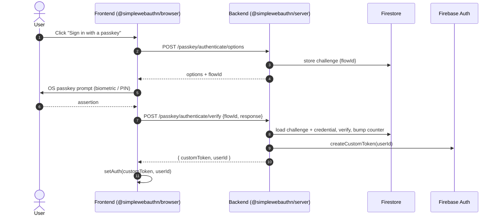
```mermaid
sequenceDiagram
    autonumber
    actor User
    participant FE as Frontend (@simplewebauthn/browser)
    participant BE as Backend (@simplewebauthn/server)
    participant FS as Firestore
    participant FB as Firebase Auth

    User->>FE: Click "Sign in with a passkey"
    FE->>BE: POST /passkey/authenticate/options
    BE->>FS: store challenge {flowId}
    BE-->>FE: options + flowId
    FE->>User: OS passkey prompt (biometric / PIN)
    User-->>FE: assertion
    FE->>BE: POST /passkey/authenticate/verify {flowId, response}
    BE->>FS: load challenge + credential, verify, bump counter
    BE->>FB: createCustomToken(userId)
    BE-->>FE: { customToken, userId }
    FE->>FE: setAuth(customToken, userId)
```

The Relying Party ID / expected origin default to the request `Origin` and can be pinned via
`WEBAUTHN_RP_ID` / `WEBAUTHN_ORIGINS` / `WEBAUTHN_RP_NAME`. Because verification returns the same
`{ customToken, userId }` as `/login`, passkeys reuse the existing client session model verbatim.

---

## Document Storage & Data Model

This is the most important change to the data layer, so it gets its own section. DocuThinker now uses a **Firestore subcollection + Supabase Storage offload** model for documents. Firestore holds only tiny references; the heavy payloads (original files and extracted text/HTML) live in a private Supabase bucket.

### Why it changed

The original design stored **all** of a user's documents inline as a single `documents` **array on the user document** (`users/{uid}.documents`). Every uploaded document — including its full `originalText` and `originalHtml` — was appended to that one array. Firestore enforces a hard **1 MB-per-document limit**, so as a user accumulated documents (or uploaded a single large one), the user document overflowed and **every subsequent upload failed**, even tiny ones.

The fix has two parts:

1. **Per-document subcollection.** Each uploaded document becomes its own Firestore document at `users/{uid}/documents/{docId}`. Because every document is now its own record, the per-user storage is **effectively unlimited** — there is no shared array to overflow.
2. **Storage offload.** The large fields never touch Firestore. The extracted text + display HTML are written to a Supabase **content object**, and the original PDF/DOCX is written to the bucket. Firestore keeps only the small `filePath` and `contentPath` references.

### What lives where

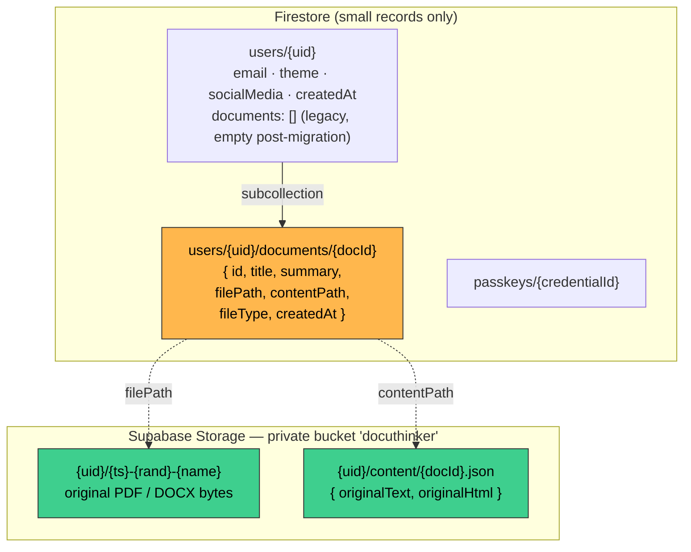
```mermaid
graph TB
    subgraph Firestore["Firestore (small records only)"]
        UDOC["users/{uid}<br/>email · theme · socialMedia · createdAt<br/>documents: [] (legacy, empty post-migration)"]
        SUB["users/{uid}/documents/{docId}<br/>{ id, title, summary,<br/>filePath, contentPath,<br/>fileType, createdAt }"]
        PK["passkeys/{credentialId}"]
        UDOC -->|subcollection| SUB
    end

    subgraph Supabase["Supabase Storage — private bucket 'docuthinker'"]
        FILE["{uid}/{ts}-{rand}-{name}<br/>original PDF / DOCX bytes"]
        CONTENT["{uid}/content/{docId}.json<br/>{ originalText, originalHtml }"]
    end

    SUB -. "filePath" .-> FILE
    SUB -. "contentPath" .-> CONTENT

    style SUB fill:#FFB74D,stroke:#333,color:#000
    style FILE fill:#3ECF8E,stroke:#333,color:#000
    style CONTENT fill:#3ECF8E,stroke:#333,color:#000
```

| Field | Stored in | Notes |
|-------|-----------|-------|
| `id` | Firestore subcollection doc | Same value as the Firestore doc id |
| `title` | Firestore subcollection doc | Small string |
| `summary` | Firestore subcollection doc | Gemini-generated summary |
| `filePath` | Firestore subcollection doc | Supabase path to the original file (or `""`) |
| `contentPath` | Firestore subcollection doc | Supabase path to the content JSON (or `""`) |
| `fileType` | Firestore subcollection doc | MIME type, drives the viewer |
| `createdAt` | Firestore subcollection doc | `serverTimestamp()`, preserves chronological order |
| `originalText` / `originalHtml` | **Supabase content object** | The heavy payloads; only inline on legacy records or as a small (<400 KB) fallback when offload fails |
| original PDF/DOCX bytes | **Supabase bucket** | Private; served only via short-lived signed URLs |

The Supabase bucket (`SUPABASE_BUCKET`, default `docuthinker`) is **private**. The backend uses the **`service_role`** key (never exposed to the browser) to mint signed URLs; the frontend only ever holds the **anon** key, which cannot read the bucket on its own.

### Supabase service helpers

All storage access is funneled through a small set of helpers in `backend/services/services.js`:

| Helper | Purpose |
|--------|---------|
| `createDocumentUploadUrl(userId, fileName)` | Mint a one-time **signed upload** token (`createSignedUploadUrl`) so the browser can upload file bytes directly to the bucket, bypassing the serverless body limit |
| `storeDocumentFile(userId, file)` | **Fallback** path — stream a (small) file through the backend (formidable) into the bucket; returns `{ filePath, fileType }` |
| `storeDocumentContent(userId, docId, content)` | Write the `{ originalText, originalHtml }` JSON content object; returns its `contentPath` |
| `getDocumentContent(contentPath)` | Download + parse the content JSON (returns `null` on miss so the viewer degrades gracefully) |
| `getDocumentFileUrl(filePath, expiresIn=3600)` | Mint a short-lived (1 h) **signed download URL** for the viewer (`""` on failure) |
| `deleteStorageObjects(paths)` | Best-effort cleanup of file + content objects on document delete |

### Upload data flow

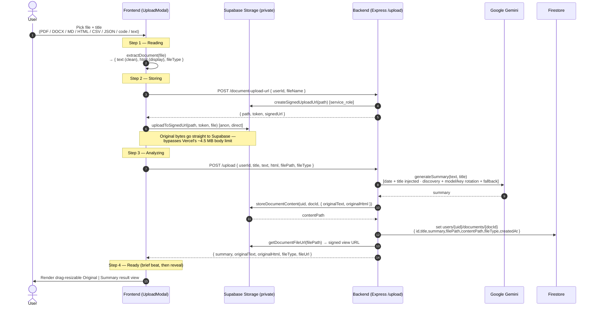
```mermaid
sequenceDiagram
    autonumber
    actor User
    participant FE as Frontend (UploadModal)
    participant SB as Supabase Storage (private)
    participant BE as Backend (Express /upload)
    participant AI as Google Gemini
    participant FS as Firestore

    User->>FE: Pick file + title<br/>(PDF / DOCX / MD / HTML / CSV / JSON / code / text)
    Note over FE: Step 1 — Reading
    FE->>FE: extractDocument(file)<br/>→ { text (clean), html (display), fileType }
    Note over FE: Step 2 — Storing
    FE->>BE: POST /document-upload-url { userId, fileName }
    BE->>SB: createSignedUploadUrl(path)  [service_role]
    BE-->>FE: { path, token, signedUrl }
    FE->>SB: uploadToSignedUrl(path, token, file)  [anon, direct]
    Note over FE,SB: Original bytes go straight to Supabase —<br/>bypasses Vercel's ~4.5 MB body limit
    Note over FE: Step 3 — Analyzing
    FE->>BE: POST /upload { userId, title, text, html, filePath, fileType }
    BE->>AI: generateSummary(text, title)<br/>[date + title injected · discovery + model/key rotation + fallback]
    AI-->>BE: summary
    BE->>SB: storeDocumentContent(uid, docId, { originalText, originalHtml })
    SB-->>BE: contentPath
    BE->>FS: set users/{uid}/documents/{docId}<br/>{ id,title,summary,filePath,contentPath,fileType,createdAt }
    BE->>SB: getDocumentFileUrl(filePath)  → signed view URL
    BE-->>FE: { summary, originalText, originalHtml, fileType, fileUrl }
    Note over FE: Step 4 — Ready (brief beat, then reveal)
    FE->>User: Render drag-resizable Original | Summary result view
```

The four `Note over FE` markers map one-to-one to the **Reading → Storing → Analyzing → Ready** progress steps shown in the upload modal (see [Result View & In-Document Interactions](#result-view--in-document-interactions)).

**Fallback path.** If the browser-side Supabase client is unavailable (e.g. the frontend Supabase envs are unset), `uploadOriginalFile` POSTs the file to `POST /document-file`, which streams it through the backend (formidable) into the bucket via `storeDocumentFile`. If even that fails, the upload still succeeds — the document is saved without a `filePath` and the viewer falls back to the stored HTML/text.

**Content-offload fallback.** If `storeDocumentContent` fails, the backend keeps the text/HTML **inline on the Firestore record only when it is small** (`< 400 KB`), guaranteeing the record can never approach the 1 MB ceiling. Above that threshold it saves a lean record and the viewer relies on the stored original file.

### View data flow

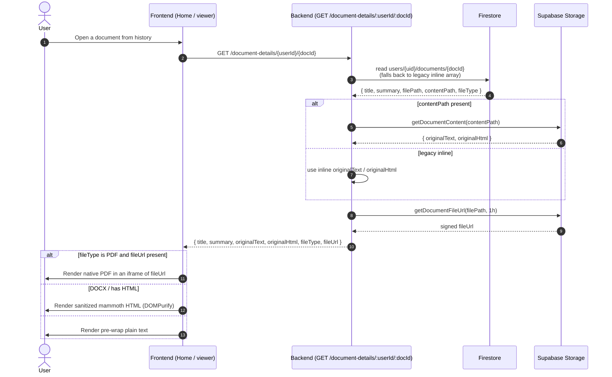
```mermaid
sequenceDiagram
    autonumber
    actor User
    participant FE as Frontend (Home / viewer)
    participant BE as Backend (GET /document-details/:userId/:docId)
    participant FS as Firestore
    participant SB as Supabase Storage

    User->>FE: Open a document from history
    FE->>BE: GET /document-details/{userId}/{docId}
    BE->>FS: read users/{uid}/documents/{docId}<br/>(falls back to legacy inline array)
    FS-->>BE: { title, summary, filePath, contentPath, fileType }
    alt contentPath present
        BE->>SB: getDocumentContent(contentPath)
        SB-->>BE: { originalText, originalHtml }
    else legacy inline
        BE->>BE: use inline originalText / originalHtml
    end
    BE->>SB: getDocumentFileUrl(filePath, 1h)
    SB-->>BE: signed fileUrl
    BE-->>FE: { title, summary, originalText, originalHtml, fileType, fileUrl }
    alt fileType is PDF and fileUrl present
        FE->>User: Render native PDF in an iframe of fileUrl
    else DOCX / has HTML
        FE->>User: Render sanitized mammoth HTML (DOMPurify)
    else
        FE->>User: Render pre-wrap plain text
    end
```

> **Exact viewer branch logic** (`frontend/src/pages/Home.js`). The viewer is an **ordered fallthrough**, not a flat `switch` on `fileType`:
> 1. If `fileType` contains `"pdf"` **and** a signed `fileUrl` is present → render the original PDF inside a native `<iframe src={fileUrl}>`.
> 2. Otherwise, if `originalHtml` is non-empty → render `DOMPurify.sanitize(originalHtml)` (the DOCX/HTML/CSV/JSON/code path — the extractor already produced HTML — and also any PDF whose signed URL is unavailable but whose text was preserved).
> 3. Otherwise, if `fileType` contains `"markdown"` → render `originalText` through `react-markdown` (GFM + math).
> 4. Otherwise → render `originalText` with `white-space: pre-wrap`.
>
> The second branch keys off **HTML presence**, not strictly the MIME type, so a record with HTML always renders richly even when its original file is missing. This is what makes the storage fallbacks (no `filePath`, or an inline `< 400 KB` payload) degrade gracefully instead of failing. See [Multi-Format Ingestion & Rendering](#multi-format-ingestion--rendering) for how each `fileType` is produced.

### Delete & storage lifecycle

Deletes are **storage-aware**: before a Firestore record is removed, its Supabase objects are cleaned up so the bucket never accumulates orphans. `deleteDocument` (`DELETE /documents/:userId/:docId`) and `deleteAllDocuments` (`DELETE /documents/:userId`) both:

1. Resolve the record(s) via `findUserDocument` / `readUserDocuments` (covering subcollection **and** legacy array).
2. Call `deleteStorageObjects([filePath, contentPath, …])` — best-effort, so a storage hiccup never blocks the delete.
3. Remove the subcollection doc(s) (`deleteAllDocuments` batches at 450/commit, under Firestore's 500-write batch cap), then clear any matching legacy-array entries.

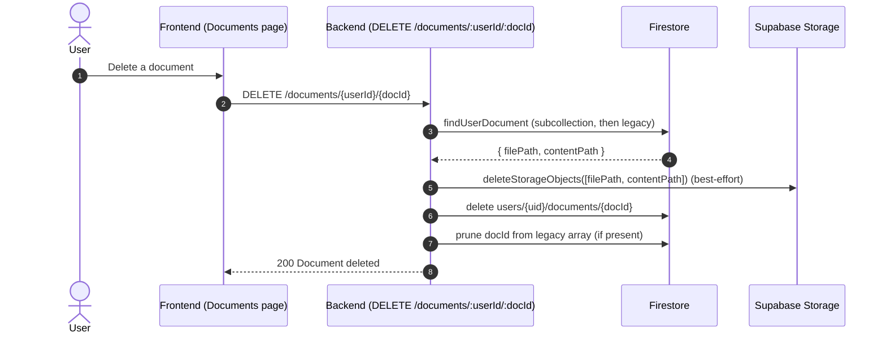
```mermaid
sequenceDiagram
    autonumber
    actor User
    participant FE as Frontend (Documents page)
    participant BE as Backend (DELETE /documents/:userId/:docId)
    participant FS as Firestore
    participant SB as Supabase Storage

    User->>FE: Delete a document
    FE->>BE: DELETE /documents/{userId}/{docId}
    BE->>FS: findUserDocument (subcollection, then legacy)
    FS-->>BE: { filePath, contentPath }
    BE->>SB: deleteStorageObjects([filePath, contentPath])  (best-effort)
    BE->>FS: delete users/{uid}/documents/{docId}
    BE->>FS: prune docId from legacy array (if present)
    BE-->>FE: 200 Document deleted
```

### Environment configuration

The storage + AI layer is driven entirely by environment variables. The **service-role** Supabase key and the Google AI key live **only** on the backend; the browser receives just the anon-key triad.

| Variable | Side | Purpose |
|----------|------|---------|
| `SUPABASE_URL` | Backend | Supabase project URL for the storage client |
| `SUPABASE_SERVICE_ROLE_KEY` | Backend | Privileged key used to mint signed upload/download URLs and read/write the private bucket. **Never** shipped to the browser |
| `SUPABASE_BUCKET` | Backend | Bucket name (default `docuthinker`) |
| `REACT_APP_SUPABASE_URL` | Frontend | Same project URL for the browser client |
| `REACT_APP_SUPABASE_ANON_KEY` | Frontend | Anon key — cannot read the private bucket on its own; only authorizes uploads against a backend-minted signed-upload token |
| `REACT_APP_SUPABASE_BUCKET` | Frontend | Bucket name (default `docuthinker`) |
| `GOOGLE_AI_API_KEY` | Backend | Google Generative Language API key used by Gemini discovery + summarization |
| `AI_INSTRUCTIONS` | Backend | Base system-prompt text prepended to every AI task |
| `FIREBASE_*` | Backend | Firebase Admin service-account credentials (Auth + Firestore) |

If the frontend Supabase envs are **absent**, `supabase` is `null` and `uploadOriginalFile` automatically falls back to the through-backend `POST /document-file` path — no code change required.

### Safe reads & migrations

Every document read merges the subcollection with any **legacy inline `documents` array** (deduplicating by `id`, subcollection wins), so nothing is ever lost mid-migration:

- `readUserDocuments(userRef, userData)` — lists docs oldest-first across both sources.
- `findUserDocument(userRef, userData, docId)` — looks in the subcollection first, then the legacy array.

Three **idempotent, re-runnable** migration scripts live in `backend/scripts/`:

| Script | What it does | Safety |
|--------|--------------|--------|
| `migrate-content-to-storage.js` | Offloads inline `originalText`/`originalHtml` from existing array entries into Supabase content objects, replacing them with a `contentPath` | Content is written to storage **before** the inline blobs are dropped |
| `migrate-array-to-subcollection.js` | Copies each user's inline `documents` array into the `users/{uid}/documents` subcollection, then clears the array | Documents are **copied first**; the array is cleared only if every copy succeeded |
| `backfill-original-html.js` | Backfills `originalHtml` (paragraph-ized from stored text) and ensures `filePath`/`fileType` exist on pre-existing text-only docs | Non-destructive; original files for legacy docs were never stored, so they render as clean text/HTML |

### GraphQL parity

The GraphQL API (`/graphql`, built with `express-graphql` + `@graphql-tools`, GraphiQL enabled) is backed by the **same subcollection**. The `Document` type exposes `fileUrl`, `originalText`, and `originalHtml` as **on-demand field resolvers** (`backend/graphql/resolvers.js`) — they are resolved lazily from Supabase (signed URL + content object) only when a query requests them, so `listDocuments` / `getDocument` queries stay cheap. The `summarizeDocument` mutation mirrors `POST /upload`, writing to the subcollection and offloading content identically.

### Document REST surface (quick reference)

The REST endpoints that touch the document store, and how each interacts with the subcollection + Supabase model:

| Method | Endpoint | Role in the storage model |
|--------|----------|---------------------------|
| `POST` | `/document-upload-url` | Mint a one-time **signed upload** token (`createDocumentUploadUrl`) for direct-to-Supabase upload |
| `POST` | `/document-file` | **Fallback** — stream a file through the backend (formidable) into the bucket (`storeDocumentFile`) |
| `POST` | `/upload` | Summarize (Gemini), offload content to Supabase, write the small record to the subcollection; returns a signed `fileUrl` |
| `GET` | `/documents/:userId` | List a user's documents (subcollection + legacy, oldest-first) |
| `GET` | `/documents/:userId/:docId` | Fetch one document record (subcollection first, then legacy) |
| `GET` | `/document-details/:userId/:docId` | Full view payload — record + content object + short-lived signed `fileUrl` |
| `GET` | `/search-documents/:userId` | Server-side title/content search across the merged set |
| `GET` | `/document-count/:userId` | Count across the merged set |
| `POST` | `/update-document-title` | Rename (subcollection first, then legacy array) |
| `DELETE` | `/documents/:userId/:docId` | Delete one — cleans up Supabase objects, then removes the record |
| `DELETE` | `/documents/:userId` | Delete all — batched subcollection deletes + storage cleanup |

---

## Agentic Orchestration Layer

The orchestrator (`orchestrator/`) is a standalone Node.js service (port 4000) that sits between the Express backend and the Python AI/ML services. It implements a **supervisor-driven agentic architecture** with circuit breakers, cost controls, context management, and MCP integration.

### Orchestrator Architecture

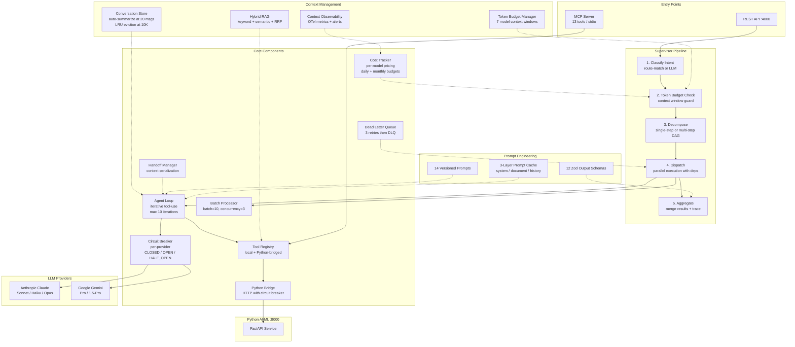
```mermaid
graph TB
    subgraph "Entry Points"
        REST[REST API :4000]
        MCP_S[MCP Server<br/>13 tools / stdio]
    end

    subgraph "Supervisor Pipeline"
        CLASSIFY[1. Classify Intent<br/>route-match or LLM]
        BUDGET[2. Token Budget Check<br/>context window guard]
        DECOMPOSE[3. Decompose<br/>single-step or multi-step DAG]
        DISPATCH[4. Dispatch<br/>parallel execution with deps]
        AGGREGATE[5. Aggregate<br/>merge results + trace]
    end

    subgraph "Core Components"
        AL[Agent Loop<br/>iterative tool-use<br/>max 10 iterations]
        CB[Circuit Breaker<br/>per-provider<br/>CLOSED / OPEN / HALF_OPEN]
        CT[Cost Tracker<br/>per-model pricing<br/>daily + monthly budgets]
        BP[Batch Processor<br/>batch=10, concurrency=3]
        DLQ[Dead Letter Queue<br/>3 retries then DLQ]
        HO[Handoff Manager<br/>context serialization]
        TR[Tool Registry<br/>local + Python-bridged]
        PB[Python Bridge<br/>HTTP with circuit breaker]
    end

    subgraph "Context Management"
        TBM[Token Budget Manager<br/>7 model context windows]
        CS[Conversation Store<br/>auto-summarize at 20 msgs<br/>LRU eviction at 10K]
        OBS[Context Observability<br/>OTel metrics + alerts]
        HRAG[Hybrid RAG<br/>keyword + semantic + RRF]
    end

    subgraph "Prompt Engineering"
        SP[14 Versioned Prompts]
        ZOD[12 Zod Output Schemas]
        PC[3-Layer Prompt Cache<br/>system / document / history]
    end

    subgraph "LLM Providers"
        CLAUDE[Anthropic Claude<br/>Sonnet / Haiku / Opus]
        GEMINI[Google Gemini<br/>Pro / 1.5-Pro]
    end

    subgraph "Python AI/ML :8000"
        PY[FastAPI Service]
    end

    REST --> CLASSIFY
    CLASSIFY --> BUDGET
    BUDGET --> DECOMPOSE
    DECOMPOSE --> DISPATCH
    DISPATCH --> AGGREGATE

    DISPATCH --> AL
    DISPATCH --> BP
    AL --> TR
    TR --> PB
    PB --> PY

    AL --> CB
    CB --> CLAUDE
    CB --> GEMINI

    CT -.-> BUDGET
    TBM -.-> BUDGET
    CS -.-> AL
    OBS -.-> CT
    HO -.-> AL
    HRAG -.-> TR
    SP -.-> AL
    ZOD -.-> AGGREGATE
    PC -.-> AL

    DLQ -.-> DISPATCH
    MCP_S --> TR
```

### Supervisor Workflow

The `DocuThinkerSupervisor` processes every request through a five-stage pipeline:

1. **Classify** -- Determines the intent from 18+ registered intents. Uses exact route matching first (`/upload` -> `document.upload`, `/chat` -> `chat.document`, etc.), then falls back to LLM classification using Claude Haiku, and finally defaults to `chat.general`.
2. **Budget Check** -- Validates the request against the model's context window using `TokenBudgetManager`. Rejects requests that would overflow the available token budget.
3. **Decompose** -- Breaks the intent into a task DAG. Simple intents produce a single task. `document.upload` decomposes into three sequential tasks (extract -> summarize -> store). Batch intents produce parallel tasks.
4. **Dispatch** -- Executes tasks respecting dependency order. Independent tasks run in parallel via `Promise.allSettled`. On failure, automatically retries with an alternate provider from the intent's provider preference list.
5. **Aggregate** -- Merges results from all tasks, attaches a trace ID (`dt-{timestamp}-{random}`), and records cost/token usage.

### Circuit Breaker State Diagram

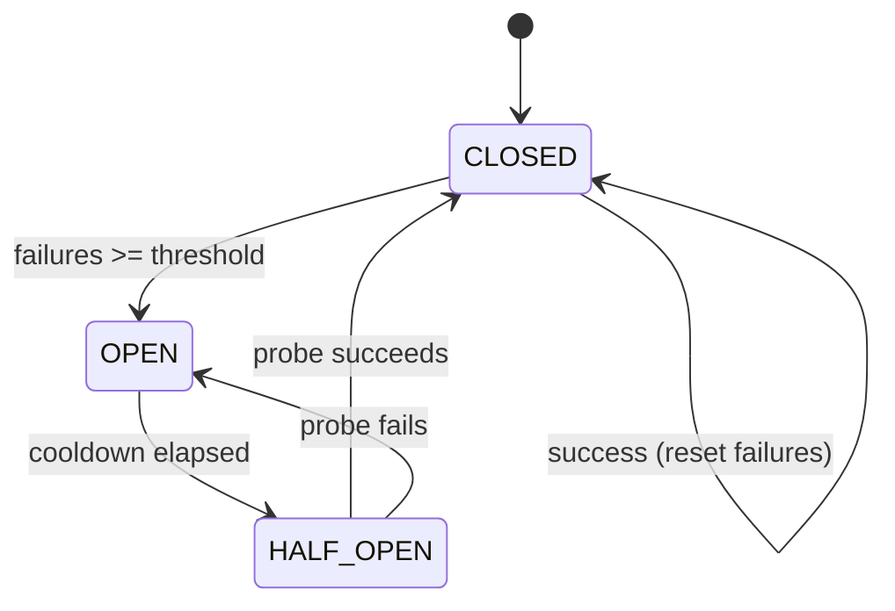
```mermaid
stateDiagram-v2
    [*] --> CLOSED
    CLOSED --> OPEN : failures >= threshold
    OPEN --> HALF_OPEN : cooldown elapsed
    HALF_OPEN --> CLOSED : probe succeeds
    HALF_OPEN --> OPEN : probe fails
    CLOSED --> CLOSED : success (reset failures)
```

Each LLM provider (`claude`, `gemini`, `python-ai-ml`) has an independent circuit breaker. Configuration:
- **Failure threshold**: `CIRCUIT_BREAKER_THRESHOLD` (default: 3)
- **Cooldown**: `CIRCUIT_BREAKER_COOLDOWN_MS` (default: 60,000 ms)
- **HALF_OPEN**: Only one probe request allowed at a time

### Orchestrator API Endpoints

| Method | Endpoint | Description |
|--------|----------|-------------|
| `GET` | `/health` | Full system health: circuit breakers, costs, cache stats, DLQ, providers, tools |
| `GET` | `/api/costs` | Cost breakdown by provider and intent |
| `GET` | `/api/circuits` | Circuit breaker state per provider (state, failures, uptime %) |
| `GET` | `/api/context-metrics` | Context utilization stats, cache hit rate, per-provider breakdown |
| `GET` | `/api/dlq` | DLQ stats and last 20 dead-lettered messages |
| `GET` | `/api/tools` | Registered tool definitions and count |
| `POST` | `/api/tools/execute` | Execute a tool by name: `{ "tool": "...", "input": {...} }` |
| `POST` | `/api/token-check` | Token budget check: `{ "model": "...", "systemPrompt": "...", "messages": [...] }` |
| `POST` | `/api/supervisor/process` | Full supervisor pipeline: `{ "route": "/...", ...body }` |
| `POST` | `/api/agent/run` | Agent loop: `{ "message": "...", "context": {...}, "provider": "claude" }` |
| `POST` | `/api/batch/process` | Batch processing: `{ "documents": [...], "operation": "summarize" }` |
| `POST` | `/api/conversations/:userId/:documentId/message` | Add message: `{ "role": "user", "content": "..." }` |
| `GET` | `/api/conversations/:userId/:documentId` | Get conversation history and summary state |
| `DELETE` | `/api/conversations/:userId/:documentId` | Clear a conversation |

### Context Management Details

**Token Budget Manager** tracks context windows for 7+ models (Claude 200K, Gemini 2M, GPT-4 128K) and provides a `check()` method that estimates token usage and returns whether the request is allowed, the utilization percentage, and a recommendation to compact if above 80%.

**Conversation Store** maintains per-user per-document conversations in memory with automatic summarization. When a conversation exceeds 20 messages, the oldest messages are summarized using Claude Haiku and replaced with a summary injection. LRU eviction kicks in at 10,000 active conversations.

**Prompt Cache Strategy** implements Anthropic's 3-layer caching:
- **Layer 1**: System prompt with `cache_control: ephemeral`
- **Layer 2**: Document context with `cache_control: ephemeral`
- **Layer 3**: Conversation history prefixed with cached document context

---

## Beads Task Coordination

DocuThinker employs a **Beads** sub-architecture for coordinating work across multiple AI agents (or developers) operating on the same codebase concurrently. A *bead* is an atomic, dependency-aware task unit that any agent can claim, execute, and complete — enabling safe parallel development without merge conflicts or duplicated effort.

### Beads Architecture Overview

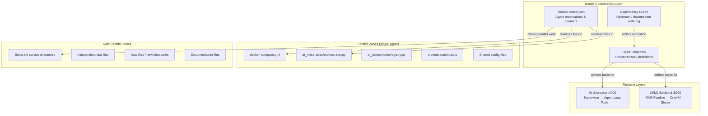
```mermaid
graph TB
    subgraph "Beads Coordination Layer"
        STATUS[".beads/.status.json<br/>Agent reservations & counters"]
        TEMPLATE["Bead Templates<br/>Structured task definitions"]
        DEPS["Dependency Graph<br/>Upstream / downstream ordering"]
    end

    subgraph "Conflict Zones (single agent)"
        CZ1["docker-compose.yml"]
        CZ2["ai_ml/services/orchestrator.py"]
        CZ3["ai_ml/providers/registry.py"]
        CZ4["orchestrator/index.js"]
        CZ5["Shared config files"]
    end

    subgraph "Safe Parallel Zones"
        PZ1["Separate service directories"]
        PZ2["Independent test files"]
        PZ3["New files / new directories"]
        PZ4["Documentation files"]
    end

    subgraph "Runtime Layers"
        ORCH["Orchestrator :4000<br/>Supervisor → Agent Loop → Tools"]
        AIML["AI/ML Backend :8000<br/>RAG Pipeline → CrewAI → Stores"]
    end

    STATUS -->|reserves files in| CZ1
    STATUS -->|reserves files in| CZ2
    STATUS -->|allows parallel work| PZ1
    TEMPLATE -->|defines tasks for| ORCH
    TEMPLATE -->|defines tasks for| AIML
    DEPS -->|orders execution| TEMPLATE
```

### Bead Lifecycle

Each bead moves through a well-defined lifecycle:

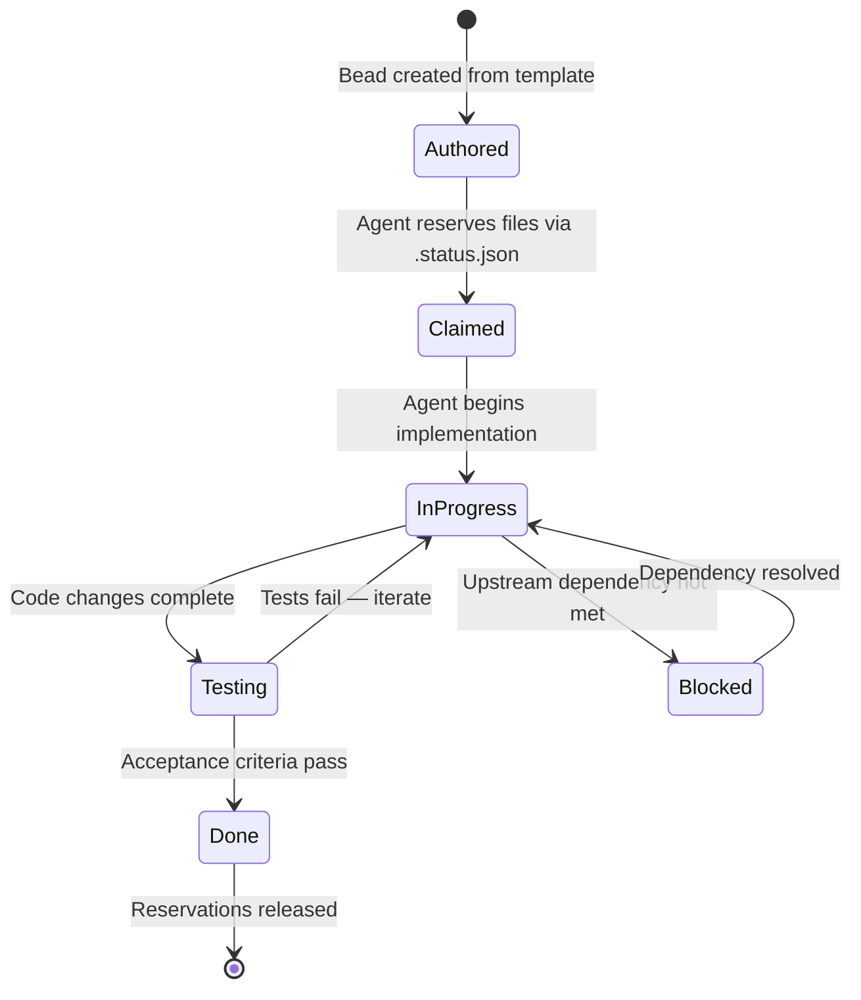
```mermaid
stateDiagram-v2
    [*] --> Authored: Bead created from template
    Authored --> Claimed: Agent reserves files via .status.json
    Claimed --> InProgress: Agent begins implementation
    InProgress --> Testing: Code changes complete
    Testing --> Done: Acceptance criteria pass
    Testing --> InProgress: Tests fail — iterate
    Done --> [*]: Reservations released
    InProgress --> Blocked: Upstream dependency not met
    Blocked --> InProgress: Dependency resolved
```

### Bead Structure

Every bead follows the canonical template at `.beads/templates/feature-bead.md`:

| Section | Purpose |
|---------|---------|
| **Background** | Business or technical context for why the work exists |
| **Current State** | Files the agent must read before making any changes |
| **Desired Outcome** | A specific, testable description of the end state |
| **Files to Touch** | Explicit list — `READ FIRST, then ENHANCE` or `CREATE NEW` |
| **Dependencies** | Upstream beads (`Depends on`) and downstream beads (`Blocks`) |
| **Acceptance Criteria** | Checklist that must pass, always including "all existing tests still pass" |

### Status Tracking

The `.beads/.status.json` file is the single source of truth for coordination:

```json
{
  "version": "1.0.0",
  "agents": {
    "agent-1": { "name": "orchestrator-dev", "startedAt": "...", "currentBead": "ORCH-04" }
  },
  "reservations": {
    "orchestrator/index.js": "agent-1"
  },
  "lastUpdated": "2025-01-15T10:30:00Z",
  "beadsCompleted": 12,
  "beadsActive": 2
}
```

| Field | Type | Purpose |
|-------|------|---------|
| `agents` | `Record<string, AgentMeta>` | Active agent IDs mapped to metadata (name, start time, current bead) |
| `reservations` | `Record<string, string>` | File paths mapped to the agent ID holding the reservation |
| `lastUpdated` | `ISO 8601 / null` | Timestamp of the most recent status update |
| `beadsCompleted` | `number` | Running count of successfully completed beads |
| `beadsActive` | `number` | Number of beads currently being worked on |

### Conflict Zones & Safe Zones

**Conflict zones** are files that only one agent may reserve at a time because they are shared entry points or cross-cutting configuration:

| File | Reason |
|------|--------|
| `docker-compose.yml` | Global service topology |
| `ai_ml/services/orchestrator.py` | Central AI/ML façade — all pipelines flow through it |
| `ai_ml/providers/registry.py` | LLM provider registry shared by all AI/ML components |
| `orchestrator/index.js` | Orchestrator entry point and route wiring |
| Shared config files | Cross-service environment and build settings |

**Safe parallel zones** allow multiple agents to work simultaneously because they are logically isolated:

- Separate service directories (e.g., `ai_ml/providers/` vs. `orchestrator/context/`)
- Independent test files (each suite is self-contained)
- New files in new directories (no reservation conflicts)
- Documentation files (non-overlapping prose sections)

### Agent Communication Protocol

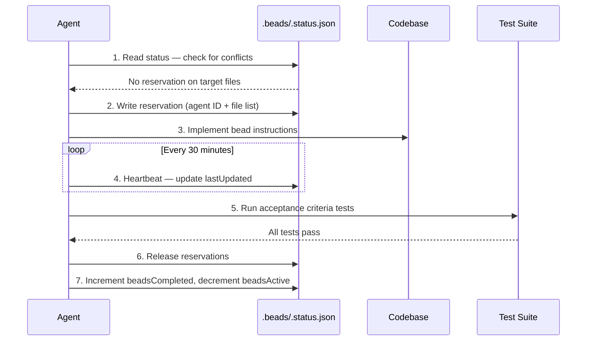
```mermaid
sequenceDiagram
    participant A as Agent
    participant S as .beads/.status.json
    participant C as Codebase
    participant T as Test Suite

    A->>S: 1. Read status — check for conflicts
    S-->>A: No reservation on target files
    A->>S: 2. Write reservation (agent ID + file list)
    A->>C: 3. Implement bead instructions
    loop Every 30 minutes
        A->>S: 4. Heartbeat — update lastUpdated
    end
    A->>T: 5. Run acceptance criteria tests
    T-->>A: All tests pass
    A->>S: 6. Release reservations
    A->>S: 7. Increment beadsCompleted, decrement beadsActive
```

**Rules:**
1. **Check first** — always read `.status.json` before claiming files.
2. **Reserve explicitly** — post agent ID and every file path you will modify.
3. **Heartbeat** — update status every 30 minutes while actively working.
4. **Release on exit** — release all reservations on completion or failure. A post-session hook (`.claude/hooks/post-session.sh`) auto-cleans stale reservations.
5. **Branch convention** — `agent/<agent-name>/<bead-id>` (e.g., `agent/claude/ORCH-04`).

### Relationship to Runtime Layers

Beads operate at **development time** — they coordinate *who changes what*. The runtime architecture has analogous patterns at request time:

| Beads Concept | Runtime Analogue | Layer |
|---------------|-----------------|-------|
| Bead (atomic task) | Intent (e.g., `document.upload`) | Orchestrator Supervisor |
| Dependency graph | Task DAG decomposition | Supervisor `decompose()` |
| File reservation | Circuit breaker per provider | Circuit Breaker |
| Agent heartbeat | Health checks & cost tracking | Cost Tracker / `/health` |
| Conflict zones | Mutex on shared state | Conversation Store LRU |
| Acceptance criteria | Zod output schema validation | Schema validation layer |

> For the full agent protocol including branch naming and escalation, see [AGENTS.md](AGENTS.md).

---

## AI/ML Pipeline

DocuThinker's AI/ML pipeline is a **production-ready, multi-agent RAG (Retrieval-Augmented Generation) platform** that orchestrates multiple LLM providers, vector stores, and knowledge graphs for comprehensive document intelligence.

### AI/ML Architecture Overview

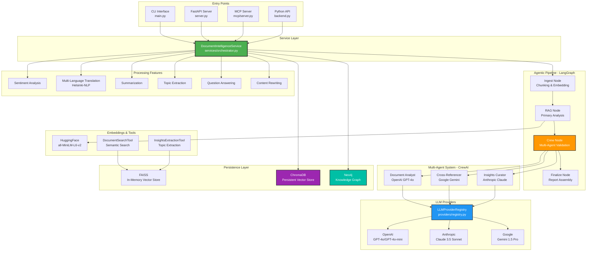
```mermaid
graph TB
    subgraph "Entry Points"
        CLI[CLI Interface<br/>main.py]
        API[FastAPI Server<br/>server.py]
        MCP[MCP Server<br/>mcp/server.py]
        PY[Python API<br/>backend.py]
    end

    subgraph "Service Layer"
        SERVICE[DocumentIntelligenceService<br/>services/orchestrator.py]
    end

    subgraph "Agentic Pipeline - LangGraph"
        INGEST[Ingest Node<br/>Chunking & Embedding]
        RAG_NODE[RAG Node<br/>Primary Analysis]
        CREW_NODE[Crew Node<br/>Multi-Agent Validation]
        FINAL[Finalize Node<br/>Report Assembly]
    end

    subgraph "Multi-Agent System - CrewAI"
        ANALYST[Document Analyst<br/>OpenAI GPT-4o]
        RESEARCHER[Cross-Referencer<br/>Google Gemini]
        REVIEWER[Insights Curator<br/>Anthropic Claude]
    end

    subgraph "LLM Providers"
        REGISTRY[LLMProviderRegistry<br/>providers/registry.py]
        OPENAI[OpenAI<br/>GPT-4o/GPT-4o-mini]
        ANTHROPIC[Anthropic<br/>Claude 3.5 Sonnet]
        GEMINI[Google<br/>Gemini 1.5 Pro]
    end

    subgraph "Embeddings & Tools"
        HF[HuggingFace<br/>all-MiniLM-L6-v2]
        SEARCH[DocumentSearchTool<br/>Semantic Search]
        INSIGHTS[InsightsExtractionTool<br/>Topic Extraction]
    end

    subgraph "Persistence Layer"
        FAISS[FAISS<br/>In-Memory Vector Store]
        CHROMA[ChromaDB<br/>Persistent Vector Store]
        NEO4J[Neo4j<br/>Knowledge Graph]
    end

    subgraph "Processing Features"
        SENTIMENT[Sentiment Analysis]
        TRANSLATION[Multi-Language Translation<br/>Helsinki-NLP]
        SUMMARIZE[Summarization]
        TOPIC[Topic Extraction]
        QA[Question Answering]
        REWRITE[Content Rewriting]
    end

    CLI --> SERVICE
    API --> SERVICE
    MCP --> SERVICE
    PY --> SERVICE

    SERVICE --> INGEST
    INGEST --> RAG_NODE
    RAG_NODE --> CREW_NODE
    CREW_NODE --> FINAL

    CREW_NODE --> ANALYST
    CREW_NODE --> RESEARCHER
    CREW_NODE --> REVIEWER

    ANALYST --> REGISTRY
    RESEARCHER --> REGISTRY
    REVIEWER --> REGISTRY

    REGISTRY --> OPENAI
    REGISTRY --> ANTHROPIC
    REGISTRY --> GEMINI

    RAG_NODE --> HF
    SEARCH --> FAISS
    INSIGHTS --> FAISS

    SERVICE --> CHROMA
    SERVICE --> NEO4J

    SERVICE --> SENTIMENT
    SERVICE --> TRANSLATION
    SERVICE --> SUMMARIZE
    SERVICE --> TOPIC
    SERVICE --> QA
    SERVICE --> REWRITE

    style SERVICE fill:#4CAF50,stroke:#333,stroke-width:3px,color:#fff
    style CREW_NODE fill:#FF9800,stroke:#333,stroke-width:2px,color:#fff
    style REGISTRY fill:#2196F3,stroke:#333,stroke-width:2px,color:#fff
    style NEO4J fill:#00BFA5,stroke:#333,stroke-width:2px,color:#fff
    style CHROMA fill:#9C27B0,stroke:#333,stroke-width:2px,color:#fff
```

### Core Components

#### 1. DocumentIntelligenceService

The main orchestration service that coordinates all AI/ML operations.

**Location**: `ai_ml/services/orchestrator.py`

**Key Responsibilities**:
- Orchestrates the complete agentic RAG pipeline
- Manages LLM provider selection and fallbacks
- Coordinates multi-agent collaboration
- Handles document enrichment (sentiment, translation, topics)
- Manages persistence to vector stores and knowledge graphs

**Key Methods**:
```python
analyze_document()      # Full pipeline execution
summarize()            # Narrative summarization
bullet_summary()       # Bullet-point summaries
extract_topics()       # Topic extraction
answer_question()      # Q&A system
sentiment()            # Sentiment analysis
translate()            # Multi-language translation
semantic_search()      # Vector-based search
```

#### 2. AgenticRAGPipeline (LangGraph)

Stateful multi-step RAG workflow using LangGraph.

**Location**: `ai_ml/pipelines/rag_graph.py`

**Pipeline Flow**:

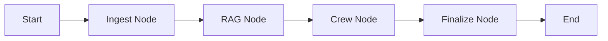
```mermaid
graph LR
    A[Start] --> B[Ingest Node]
    B --> C[RAG Node]
    C --> D[Crew Node]
    D --> E[Finalize Node]
    E --> F[End]
```

**Node Details**:

1. **Ingest Node**
   - Chunks document into manageable pieces (default: 900 chars, 120 overlap)
   - Generates embeddings using HuggingFace models
   - Creates in-memory FAISS vector store
   - Prepares retrieval tools for agents

2. **RAG Node**
   - Performs primary document analysis
   - Uses DocumentSearchTool for semantic retrieval
   - Generates structured JSON output:
     - Overview summary
     - Key topics
     - Q&A answer (if question provided)
     - Supporting context/citations

3. **Crew Node**
   - Invokes CrewAI multi-agent system
   - Three agents collaborate sequentially
   - Validates RAG findings with multiple LLM perspectives
   - Produces executive-level insights

4. **Finalize Node**
   - Merges RAG and Crew outputs
   - Assembles final comprehensive report
   - Returns structured payload

#### 3. Multi-Agent System (CrewAI)

Three specialized agents collaborate for thorough document analysis.

**Location**: `ai_ml/agents/crew_agents.py`

```mermaid
sequenceDiagram
    participant Pipeline
    participant Analyst as Document Analyst<br/>(OpenAI GPT-4o)
    participant Researcher as Cross-Referencer<br/>(Google Gemini)
    participant Reviewer as Insights Curator<br/>(Anthropic Claude)
    participant Report

    Pipeline->>Analyst: RAG Overview + Question
    Analyst->>Analyst: Draft Summary<br/>Use Search & Insights Tools
    Analyst->>Researcher: Summary + Document Context
    Researcher->>Researcher: Validate Claims<br/>Verify with Citations
    Researcher->>Reviewer: Validated Findings
    Reviewer->>Reviewer: Distill Insights<br/>Generate Recommendations
    Reviewer->>Report: Executive Summary
    Report->>Pipeline: Complete Analysis
```

**Agent Specifications**:

| Agent | LLM | Role | Tools | Output |
|-------|-----|------|-------|--------|
| **Document Analyst** | OpenAI GPT-4o-mini | Lead summarizer | DocumentSearchTool, InsightsExtractionTool | Structured summary with citations |
| **Cross-Referencer** | Google Gemini 1.5 Pro | Fact verifier | DocumentSearchTool | Validated statements with flagged uncertainties |
| **Insights Curator** | Anthropic Claude 3.5 Sonnet | Executive reviewer | DocumentSearchTool, InsightsExtractionTool | Strategic recommendations and action items |

#### 4. LLM Provider Registry

Unified interface for multiple LLM providers with lazy loading.

**Location**: `ai_ml/providers/registry.py`

**Supported Providers**:
- **OpenAI**: GPT-4o, GPT-4o-mini, GPT-4 Turbo
- **Anthropic**: Claude 3.5 Sonnet, Claude 3 Haiku, Claude 3 Opus
- **Google**: Gemini 1.5 Pro, Gemini 1.5 Flash

**Features**:
- Lazy initialization (only loads when needed)
- Automatic fallback to OpenAI if providers unavailable
- Configurable per-model temperature and max tokens
- Caching to prevent duplicate instantiation
- Support for custom model parameters

**Configuration Example**:
```python
LLMConfig(
    provider="openai",           # openai | anthropic | google
    model="gpt-4o-mini",
    temperature=0.15,
    max_tokens=900,
    extra={}                     # Provider-specific parameters
)
```

#### 5. Vector Stores

**FAISS (In-Memory)**:
- Used for per-document semantic search
- Fast, ephemeral retrieval during analysis
- Automatically created in RAG pipeline

**ChromaDB (Persistent)**:
- Optional persistent vector store
- Cross-session semantic search
- Document upsert and query capabilities
- Configurable via `DOCUTHINKER_SYNC_VECTOR=true`

**Location**: `ai_ml/vectorstores/chroma_store.py`

#### 6. Knowledge Graph (Neo4j)

Stores document relationships and topic networks.

**Location**: `ai_ml/graph/neo4j_client.py`

**Schema**:
```cypher
(Document {
  id: String,
  title: String,
  summary: Text,
  updated_at: DateTime,
  metadata: Map
})

(Topic {
  name: String
})

(Document)-[:COVERS]->(Topic)
```

**Use Cases**:
- Find documents by topic
- Discover related documents via shared topics
- Analyze topic trends across documents
- Custom Cypher queries for advanced analytics

### AI/ML Data Flow

```mermaid
sequenceDiagram
    participant User
    participant Service as DocumentIntelligenceService
    participant Pipeline as AgenticRAGPipeline
    participant RAG as RAG Node
    participant Crew as CrewAI Agents
    participant Neo4j
    participant ChromaDB

    User->>Service: analyze_document(text, question)
    Service->>Pipeline: run(document, question)

    Pipeline->>Pipeline: 1. Ingest: Chunk & Embed
    Pipeline->>Pipeline: 2. Build FAISS Vector Store

    Pipeline->>RAG: 3. Primary RAG Analysis
    RAG->>RAG: Semantic Search
    RAG->>RAG: LLM Generation (JSON)
    RAG-->>Pipeline: RAG Payload

    Pipeline->>Crew: 4. Multi-Agent Validation
    Crew->>Crew: Analyst → Researcher → Reviewer
    Crew-->>Pipeline: Crew Insights

    Pipeline->>Pipeline: 5. Finalize Report
    Pipeline-->>Service: Complete RAG Output

    Service->>Service: 6. Enrichment
    Service->>Service: - Sentiment Analysis
    Service->>Service: - Topic Extraction
    Service->>Service: - Translation (optional)

    alt Knowledge Graph Enabled
        Service->>Neo4j: 7. Sync Document + Topics
        Neo4j-->>Service: Sync Confirmation
    end

    alt Vector Store Enabled
        Service->>ChromaDB: 8. Upsert Document
        ChromaDB-->>Service: Upsert Confirmation
    end

    Service-->>User: Complete Analysis Results
```

### Processing Features

#### Document Summarization

**Types**:
1. **Narrative Summary**: Coherent prose summary
2. **Bullet Summary**: Concise bullet points
3. **Refined Summary**: Iterative improvement of draft summaries

**Models Used**: OpenAI GPT-4o-mini (configurable)

**Location**: `ai_ml/processing/summarizer.py`, `ai_ml/extended_features/`

#### Sentiment Analysis

Returns structured sentiment with confidence scores.

**Output Format**:
```json
{
  "label": "positive | neutral | negative",
  "confidence": 0.85,
  "rationale": "Explanation of sentiment determination"
}
```

**Model**: Anthropic Claude 3 Haiku (fast & cost-effective)

**Location**: `ai_ml/processing/sentiment.py`

#### Topic Extraction

Extracts main themes and topics from documents.

**Methods**:
1. **LLM-based**: Uses primary analyst model
2. **Heuristic-based**: TF-IDF and frequency analysis

**Location**: `ai_ml/processing/topic_extractor.py`

#### Multi-Language Translation

Supports 7+ languages using Helsinki-NLP models.

**Supported Languages**:
- French (fr)
- German (de)
- Spanish (es)
- Italian (it)
- Portuguese (pt)
- Chinese (zh)
- Japanese (ja)

**Models**: `Helsinki-NLP/opus-mt-en-{lang}`

**Location**: `ai_ml/processing/translator.py`, `ai_ml/models/hf_model.py`

#### Question Answering

Context-aware Q&A using RAG pipeline.

**Process**:
1. Document chunks embedded and indexed
2. Question used to retrieve relevant context
3. LLM generates answer with citations
4. Supporting context returned for verification

**Model**: OpenAI GPT-4o-mini or configured QA model

#### Content Rewriting

Style-based document transformation.

**Supported Tones**:
- Professional
- Casual
- Executive
- Technical
- Marketing

**Location**: `ai_ml/extended_features/rewriter.py`

#### Semantic Search

Vector-based document search within or across documents.

**Features**:
- FAISS-backed in-memory search
- ChromaDB-backed persistent search
- Configurable top-K results
- Similarity scores and snippets

**Location**: `ai_ml/tools/document_tools.py`

### Technology Stack

**Core ML Frameworks**:
- **LangChain 0.2.6+**: LLM orchestration and prompt engineering
- **LangGraph 0.0.40+**: Stateful agentic workflows
- **CrewAI 0.28.8+**: Multi-agent collaboration
- **PyTorch 1.10+**: Deep learning framework
- **Transformers 4.38+**: HuggingFace model loading

**LLM Providers**:
- **langchain-openai**: OpenAI integration
- **langchain-anthropic**: Anthropic integration
- **langchain-google-genai**: Google AI integration

**Embeddings & Vector Stores**:
- **sentence-transformers**: Text embeddings
- **FAISS**: Fast similarity search
- **ChromaDB**: Persistent vector database

**Knowledge Graph**:
- **Neo4j 5.11+**: Graph database for document relationships

**Model Optimization**:
- **ONNX**: Model format conversion
- **ONNX Runtime**: Optimized inference
- **Optimum**: HuggingFace ONNX support

**API & Deployment**:
- **FastAPI 0.109+**: REST API framework
- **Uvicorn 0.23+**: ASGI server
- **MCP 0.1.2+**: Model Context Protocol server

**Utilities**:
- **pandas**: Data manipulation
- **matplotlib**: Visualization
- **python-dotenv**: Environment configuration

### Deployment Interfaces

#### 1. CLI Interface

```bash
python -m ai_ml.main documents/sample.txt \
  --question "What are the key findings?" \
  --translate_lang es \
  --doc_id doc-001 \
  --title "Sample Document"
```

#### 2. Python API

```python
from ai_ml.services import get_document_service

service = get_document_service()
results = service.analyze_document(
    document="Document text...",
    question="What are the insights?",
    translate_lang="fr",
    metadata={"id": "doc-001"}
)
```

#### 3. FastAPI Server

```bash
uvicorn ai_ml.server:app --host 0.0.0.0 --port 8000

# POST /analyze endpoint
curl -X POST http://localhost:8000/analyze \
  -H "Content-Type: application/json" \
  -d '{"document": "...", "question": "..."}'
```

#### 4. MCP Server

```bash
python -m ai_ml.mcp.server

# Exposes tools for external consumption:
# - agentic_document_brief
# - semantic_document_search
# - quick_topics
# - vector_upsert/search
# - graph_upsert/query
```

### Configuration

All AI/ML components are configurable via environment variables:

**Core Settings** (`ai_ml/core/settings.py`):
```bash
# LLM Models
DOCUTHINKER_OPENAI_MODEL=gpt-4o-mini
DOCUTHINKER_CLAUDE_MODEL=claude-3-5-sonnet-20241022
DOCUTHINKER_GEMINI_MODEL=gemini-1.5-pro

# Embeddings
DOCUTHINKER_EMBEDDING_PROVIDER=huggingface
DOCUTHINKER_EMBEDDING_MODEL=sentence-transformers/all-MiniLM-L6-v2

# Chunking
DOCUTHINKER_CHUNK_SIZE=900
DOCUTHINKER_CHUNK_OVERLAP=120

# Neo4j
DOCUTHINKER_SYNC_GRAPH=true
DOCUTHINKER_NEO4J_URI=bolt://localhost:7687
DOCUTHINKER_NEO4J_USER=neo4j
DOCUTHINKER_NEO4J_PASSWORD=password

# ChromaDB
DOCUTHINKER_SYNC_VECTOR=true
DOCUTHINKER_CHROMA_DIR=.chroma
DOCUTHINKER_CHROMA_COLLECTION=docuthinker
```

### Performance Characteristics

**Typical Performance** (5K token document, M1 MacBook Pro):

| Operation | Time | Notes |
|-----------|------|-------|
| Full Agentic Analysis | 15-25s | With CrewAI collaboration |
| Summary Only | 3-5s | Single LLM call |
| Topic Extraction | 2-4s | Single LLM call |
| Semantic Search (FAISS) | 100-200ms | In-memory, 10K docs |
| Vector Upsert (ChromaDB) | 50-100ms | Single document |
| Translation | 5-10s | Helsinki-NLP model |
| Sentiment Analysis | 2-3s | Claude Haiku |

**Optimization Features**:
- Lazy model loading (only load when needed)
- Singleton service pattern with caching
- Parallel agent execution (where applicable)
- ONNX model optimization support
- Configurable chunk sizes for memory efficiency

### Integration with Backend

It's worth being precise about the **two AI surfaces**:

- **Express backend (production summary path):** uses **Google Gemini** directly via `@google/generative-ai` for the live `/upload`, `/chat`, sentiment, bullet/translated summaries, rewrite, key ideas, discussion points, and recommendations. It does **not** depend on the Python service to serve a request. This is the path the web/mobile clients hit today.
- **Python AI/ML service (deep analysis):** the LangGraph + CrewAI multi-agent RAG platform described above, consumed via its own REST/CLI/MCP interfaces and the orchestrator, for richer multi-provider analysis, semantic search, and knowledge-graph features.

The (optional) integration paths between the Express backend, the orchestrator, and the Python AI/ML service:

1. **Orchestrator bridge**: the Node orchestrator (port 4000) calls the Python FastAPI service over HTTP with a circuit breaker
2. **REST API**: Backend / orchestrator communicate with the FastAPI server (`/analyze`)
3. **Shared Database**: deep-analysis results can be persisted to Neo4j / ChromaDB (and app records to Firestore + Supabase)
4. **Message Queue**: optional async processing via RabbitMQ
5. **Caching Layer**: Redis caches AI/ML results

```mermaid
graph LR
    EXPRESS[Express Backend<br/>Vercel serverless] -->|primary AI| GEMINI_BE[Google Gemini<br/>@google/generative-ai]
    EXPRESS --> FIRESTORE[(Firestore<br/>documents subcollection)]
    EXPRESS --> SUPA[(Supabase Storage)]
    EXPRESS --> REDIS[Redis Cache]
    EXPRESS -.->|deep analysis| ORCH[Orchestrator :4000]

    ORCH -->|HTTP + circuit breaker| FASTAPI[Python FastAPI :8000]
    FASTAPI --> OPENAI[OpenAI]
    FASTAPI --> ANTHROPIC[Anthropic]
    FASTAPI --> GEMINI[Google AI]
    FASTAPI --> NEO4J[(Neo4j)]
    FASTAPI --> CHROMA[(ChromaDB)]

    style EXPRESS fill:#68A063,stroke:#333,stroke-width:2px,color:#fff
    style ORCH fill:#F4B400,stroke:#333,stroke-width:2px,color:#000
    style FASTAPI fill:#009688,stroke:#333,stroke-width:2px,color:#fff
    style GEMINI_BE fill:#4285F4,stroke:#333,stroke-width:2px,color:#fff
```

### Monitoring & Observability

AI/ML pipeline metrics tracked by Prometheus:

- **Request Rate**: Requests per second to AI/ML services
- **Latency**: P50, P95, P99 response times
- **Token Usage**: LLM token consumption by provider
- **Model Performance**: Success/failure rates per model
- **Cache Hit Rate**: Redis cache effectiveness
- **Vector Store Performance**: Query latency and throughput
- **Error Rates**: Failed API calls by provider

**Logging**: Structured JSON logs with trace IDs for distributed tracing

**Alerts**:
- High token usage (cost monitoring)
- Model API failures
- Slow response times (>30s)
- Memory pressure from model loading

---

## Database Architecture

DocuThinker uses a **hybrid database approach**. The **live document store** for the app is **Firestore (per-user `documents` subcollection) + Supabase Storage (object payloads)** — described in detail in [Document Storage & Data Model](#document-storage--data-model). The relational/PostgreSQL + MongoDB + Flyway components below are part of the broader enterprise platform (analytics, audit, relational reporting) and version-controlled with Flyway.

```mermaid
graph TB
    subgraph "Database Layer"
        A[Application Layer]

        subgraph "Live Document Store"
            C[(Firestore<br/>users + documents subcollection<br/>small records only)]
            SB[(Supabase Storage<br/>private 'docuthinker' bucket<br/>files + content JSON)]
        end

        subgraph "Primary Databases"
            B[(PostgreSQL RDS<br/>Multi-AZ)]
            D[(MongoDB Atlas<br/>Document Store)]
        end

        subgraph "Caching Layer"
            E[(Redis Cache<br/>ElastiCache)]
            F[API Response Cache]
            G[Session Cache]
        end

        subgraph "Database Migrations"
            H[Flyway<br/>Version Control]
            I[Migration Scripts]
            J[Rollback Support]
        end

        subgraph "Backup & Recovery"
            K[Automated Backups<br/>Daily + Hourly]
            L[Point-in-Time Recovery]
            M[Velero Snapshots]
        end
    end

    A --> C
    A --> SB
    A --> B
    A --> D
    A --> E

    C -.->|filePath / contentPath| SB

    E --> F
    E --> G

    H --> B
    H --> I
    H --> J

    B -.->|Backup| K
    SB -.->|Backup| K
    K --> L
    K --> M

    style C fill:#FFB74D,stroke:#333,color:#000
    style SB fill:#3ECF8E,stroke:#333,color:#000
```

### PostgreSQL Schema with Flyway Migrations

```mermaid
erDiagram
    USERS ||--o{ DOCUMENTS : owns
    USERS ||--|| ANALYTICS : has
    USERS ||--o{ API_KEYS : has
    DOCUMENTS ||--o{ DOCUMENT_TAGS : has
    USERS ||--o{ ANALYTICS_EVENTS : generates

    USERS {
        uuid id PK
        string email UK
        string username UK
        string password_hash
        string role
        boolean is_active
        timestamp created_at
        timestamp updated_at
    }

    DOCUMENTS {
        uuid id PK
        uuid user_id FK
        string title
        text content
        string file_path
        bigint file_size
        string status
        integer version
        timestamp created_at
        timestamp updated_at
        timestamp deleted_at
    }

    DOCUMENT_TAGS {
        uuid id PK
        uuid document_id FK
        string tag
        timestamp created_at
    }

    ANALYTICS {
        uuid user_id PK
        integer total_documents
        integer total_chats
        jsonb usage_by_day
        timestamp last_access
    }

    ANALYTICS_EVENTS {
        bigserial id PK
        uuid user_id FK
        uuid document_id FK
        string event_type
        jsonb event_data
        inet ip_address
        timestamp created_at
    }

    API_KEYS {
        uuid id PK
        uuid user_id FK
        string key_hash UK
        string name
        text[] scopes
        boolean is_active
        timestamp expires_at
        timestamp created_at
    }

    AUDIT_LOG {
        bigserial id PK
        uuid user_id FK
        string action
        string entity_type
        uuid entity_id
        jsonb old_values
        jsonb new_values
        timestamp created_at
    }
```

---

## Service Mesh Architecture

Istio provides zero-trust security and advanced traffic management.

```mermaid
graph TB
    subgraph "Istio Service Mesh"
        subgraph "Control Plane"
            ISTIOD[Istiod<br/>HA - 3 Replicas]
            PILOT[Pilot<br/>Service Discovery]
            CITADEL[Citadel<br/>Certificate Authority]
        end

        subgraph "Data Plane - Envoy Sidecars"
            FE_PROXY[Frontend<br/>+ Envoy]
            BE_PROXY[Backend<br/>+ Envoy]
            DB_PROXY[Database<br/>+ Envoy]
        end

        subgraph "Gateways"
            INGRESS[Ingress Gateway<br/>HTTPS + mTLS]
            EGRESS[Egress Gateway<br/>External APIs]
        end

        subgraph "Traffic Management"
            VS[Virtual Services<br/>Routing Rules]
            DR[Destination Rules<br/>Circuit Breaking]
            GW[Gateway Config<br/>TLS Termination]
        end

        subgraph "Security"
            PA[Peer Authentication<br/>Strict mTLS]
            AP[Authorization Policies<br/>RBAC]
        end

        subgraph "Observability"
            KIALI[Kiali<br/>Mesh Visualization]
            JAEGER[Jaeger<br/>Distributed Tracing]
            PROM[Prometheus<br/>Metrics]
        end
    end

    INTERNET[Internet] --> INGRESS
    INGRESS --> FE_PROXY
    FE_PROXY <-->|mTLS| BE_PROXY
    BE_PROXY <-->|mTLS| DB_PROXY
    BE_PROXY --> EGRESS
    EGRESS --> EXTERNAL[External APIs]

    ISTIOD -.->|Config| INGRESS
    ISTIOD -.->|Config| FE_PROXY
    ISTIOD -.->|Config| BE_PROXY
    ISTIOD -.->|Certificates| CITADEL

    VS -.->|Apply| FE_PROXY
    DR -.->|Apply| BE_PROXY
    PA -.->|Enforce| BE_PROXY
    AP -.->|Enforce| BE_PROXY

    FE_PROXY -.->|Traces| JAEGER
    BE_PROXY -.->|Metrics| PROM
    PROM --> KIALI
```

### Traffic Management Flow

```mermaid
sequenceDiagram
    participant Client
    participant Ingress as Istio Ingress Gateway
    participant VS as Virtual Service
    participant DR as Destination Rule
    participant Stable as Backend Stable (90%)
    participant Canary as Backend Canary (10%)

    Client->>Ingress: HTTPS Request
    Ingress->>VS: Route Request
    VS->>VS: Apply Routing Rules

    alt Header-based routing
        VS->>Canary: Route if x-version: v2
    else Weight-based routing
        VS->>DR: Check Destination Rules
        DR->>DR: Apply Circuit Breaking
        DR->>DR: Check Connection Pool
        DR->>Stable: 90% Traffic
        DR->>Canary: 10% Traffic
    end

    Stable-->>Client: Response (with retry)
    Canary-->>Client: Response (with retry)
```

---

## Observability & Monitoring

Comprehensive observability with OpenTelemetry, Prometheus, ELK Stack, and Coralogix.

```mermaid
graph TB
    subgraph "Data Collection"
        APP[Applications]
        OTEL[OpenTelemetry Collector<br/>HA - 3 Replicas]
        PROM_EXP[Prometheus Exporters]
        FILEBEAT[Filebeat]
        FLUENTBIT[Fluent Bit DaemonSet<br/>Node-level Logs]
    end

    subgraph "Traces"
        JAEGER[Jaeger<br/>Distributed Tracing]
        TRACE_STORE[(Elasticsearch<br/>Trace Storage)]
    end

    subgraph "Metrics"
        PROM[Prometheus<br/>Metrics Storage]
        SLO[SLO/SLI Calculator]
        ERROR_BUDGET[Error Budget Tracker]
    end

    subgraph "Logs"
        LOGSTASH[Logstash<br/>Log Processing]
        ELASTIC[(Elasticsearch<br/>Log Storage)]
        KIBANA[Kibana<br/>Log Analysis]
    end

    subgraph "Coralogix SaaS"
        CX_INGEST[Coralogix Ingestion<br/>OTLP/gRPC + Fluent Bit]
        CX_TCO[TCO Optimizer<br/>Cost Tiering]
        CX_LOGS[Logs Engine]
        CX_METRICS[Metrics Engine]
        CX_TRACES[Traces Engine]
        CX_ALERTS[Coralogix Alerts<br/>12 Production Rules]
        CX_DASH[Coralogix Dashboards]
    end

    subgraph "Visualization"
        GRAF[Grafana<br/>Unified Dashboards]
        KIALI[Kiali<br/>Service Mesh View]
    end

    subgraph "Alerting"
        ALERT_MGR[AlertManager<br/>Alert Routing]
        SLACK[Slack Notifications]
        PAGERDUTY[PagerDuty<br/>Incident Management]
    end

    APP -->|Traces OTLP| OTEL
    APP -->|Metrics| PROM_EXP
    APP -->|Logs| FILEBEAT
    APP -->|Logs| FLUENTBIT

    OTEL --> JAEGER
    OTEL -->|OTLP/gRPC| CX_INGEST
    JAEGER --> TRACE_STORE

    PROM_EXP --> PROM
    PROM --> SLO
    PROM -->|Remote Write| CX_INGEST
    SLO --> ERROR_BUDGET

    FILEBEAT --> LOGSTASH
    LOGSTASH --> ELASTIC
    ELASTIC --> KIBANA
    FLUENTBIT -->|HTTPS| CX_INGEST

    CX_INGEST --> CX_TCO
    CX_TCO --> CX_LOGS
    CX_TCO --> CX_METRICS
    CX_TCO --> CX_TRACES
    CX_LOGS --> CX_ALERTS
    CX_METRICS --> CX_DASH
    CX_TRACES --> CX_DASH
    CX_METRICS --> GRAF

    PROM --> GRAF
    JAEGER --> GRAF
    TRACE_STORE --> KIALI

    PROM -.->|Alerts| ALERT_MGR
    CX_ALERTS -.-> SLACK
    CX_ALERTS -.->|Critical| PAGERDUTY
    ALERT_MGR --> SLACK
    ALERT_MGR -->|Critical| PAGERDUTY

    style OTEL fill:#F38181,color:#fff
    style PROM fill:#E85D04,color:#fff
    style GRAF fill:#F48C06,color:#fff
    style SLO fill:#95E1D3
    style CX_INGEST fill:#6C63FF,color:#fff
    style CX_TCO fill:#6C63FF,color:#fff
    style CX_LOGS fill:#6C63FF,color:#fff
    style CX_METRICS fill:#6C63FF,color:#fff
    style CX_TRACES fill:#6C63FF,color:#fff
    style CX_ALERTS fill:#6C63FF,color:#fff
    style CX_DASH fill:#6C63FF,color:#fff
    style FLUENTBIT fill:#6C63FF,color:#fff
```

### Coralogix Integration

Coralogix serves as the unified SaaS observability backend, complementing the existing on-cluster Prometheus/Grafana/ELK stack.

**Data Flow**:

| Signal | Source | Transport | Destination |
|--------|--------|-----------|-------------|
| Traces | OTel Collector | OTLP/gRPC (TLS) | Coralogix Traces |
| Metrics | OTel Collector + Prometheus Remote Write | OTLP/gRPC + Remote Write | Coralogix Metrics |
| Logs (app) | OTel Collector | OTLP/gRPC (TLS) | Coralogix Logs |
| Logs (K8s) | Fluent Bit DaemonSet | HTTPS | Coralogix Logs |
| K8s Events | Cluster Collector | OTLP/gRPC (TLS) | Coralogix Logs |
| K8s Metrics | Cluster Collector | OTLP/gRPC (TLS) | Coralogix Metrics |

**TCO Cost Optimization**:

```
┌──────────────────┬─────────────────────┬─────────────────┐
│ Frequent Search  │ Monitoring          │ Compliance      │
│ (High Priority)  │ (Medium Priority)   │ (Low Priority)  │
├──────────────────┼─────────────────────┼─────────────────┤
│ Errors, critical │ Warnings, info      │ Debug, verbose  │
│ Error spans      │ Normal spans        │ K8s infra logs  │
│ Full indexing    │ Monitoring index    │ Archive only    │
└──────────────────┴─────────────────────┴─────────────────┘
  Health check logs → BLOCKED (zero cost)
```

**IaC Management** (Terraform `coralogix/coralogix` provider):
- TCO policies for logs and spans
- Recording rule groups (availability, latency, SLO metrics)
- 6 alert definitions (error rate, latency, SLO burn, crashes, endpoint down, SLO violation)
- Webhook integrations (Slack, PagerDuty)
- S3 archive for long-term log retention
- GeoIP and custom enrichments

### SLO/SLI Monitoring

```mermaid
graph LR
    subgraph "SLI Collection"
        AVAIL[Availability SLI<br/>Success Rate]
        LAT[Latency SLI<br/>P50/P95/P99]
        ERR[Error Rate SLI]
    end

    subgraph "SLO Targets"
        SLO_AVAIL[Availability > 99.9%]
        SLO_LAT[P99 Latency < 500ms]
        SLO_ERR[Error Rate < 0.1%]
    end

    subgraph "Error Budget"
        BUDGET[Error Budget<br/>Monthly]
        BURN[Burn Rate<br/>Fast/Slow]
        REMAINING[Budget Remaining]
    end

    subgraph "Alerting"
        FAST_BURN[Fast Burn Alert<br/>>14.4x]
        SLOW_BURN[Slow Burn Alert<br/>>1x]
        SLO_BREACH[SLO Violation]
    end

    AVAIL --> SLO_AVAIL
    LAT --> SLO_LAT
    ERR --> SLO_ERR

    SLO_AVAIL --> BUDGET
    SLO_LAT --> BUDGET
    SLO_ERR --> BUDGET

    BUDGET --> BURN
    BURN --> REMAINING

    BURN -.->|Monitor| FAST_BURN
    BURN -.->|Monitor| SLOW_BURN
    SLO_AVAIL -.->|Check| SLO_BREACH
```

---

## Security Architecture

Multi-layered security with OPA, Falco, mTLS, SonarQube, and Snyk.

```mermaid
graph TB
    subgraph "Layer 1: Network Security"
        WAF[AWS WAF<br/>DDoS Protection]
        TLS[cert-manager<br/>Auto TLS Renewal]
        MTLS[Istio mTLS<br/>Service-to-Service]
    end

    subgraph "Layer 2: Admission Control"
        OPA[OPA Gatekeeper<br/>Policy Enforcement]
        POLICIES[10 Security Policies]
        MUTATIONS[8 Auto-Remediation Rules]
    end

    subgraph "Layer 3: Authentication"
        FIREBASE[Firebase Auth]
        JWT[JWT Tokens]
        WEBAUTHN[Passkeys / WebAuthn<br/>Phishing-resistant]
        RBAC[Kubernetes RBAC]
    end

    subgraph "Layer 4: Runtime Security"
        FALCO[Falco<br/>Threat Detection]
        RULES[4 Custom Rules]
        ALERTS[Real-time Alerts]
    end

    subgraph "Layer 5: Secrets Management"
        VAULT[HashiCorp Vault]
        AWS_SM[AWS Secrets Manager]
        ESO[External Secrets Operator]
    end

    subgraph "Layer 6: Code & Supply Chain Security"
        SONAR[SonarQube 10.4<br/>Static Analysis + Quality Gates]
        SNYK_OSS[Snyk Open Source<br/>Dependency Vulnerabilities]
        SNYK_CONTAINER[Snyk Container<br/>Image Scanning + Licenses]
        SNYK_IAC[Snyk IaC<br/>Terraform/K8s Misconfig]
        SNYK_SAST[Snyk Code<br/>SAST Analysis]
        TRIVY[Trivy<br/>Filesystem + Image Scan]
    end

    subgraph "Layer 7: Data Protection"
        ENCRYPT_REST[Encryption at Rest]
        ENCRYPT_TRANSIT[Encryption in Transit]
        BACKUP[Encrypted Backups]
    end

    subgraph "Layer 8: Audit & Compliance"
        AUDIT[Audit Logs]
        COMPLIANCE[Compliance Reports]
        SIEM[SIEM Integration]
    end

    INTERNET[Internet] --> WAF
    WAF --> TLS
    TLS --> MTLS

    MTLS --> OPA
    OPA --> POLICIES
    POLICIES --> MUTATIONS

    MUTATIONS --> FIREBASE
    FIREBASE --> JWT
    JWT --> RBAC

    RBAC -.->|Monitor| FALCO
    FALCO --> RULES
    RULES --> ALERTS

    APP[Applications] --> VAULT
    VAULT --> AWS_SM
    AWS_SM --> ESO

    CODE[Source Code] --> SONAR
    CODE --> SNYK_SAST
    CODE --> SNYK_OSS
    IMAGES[Container Images] --> SNYK_CONTAINER
    IMAGES --> TRIVY
    INFRA[IaC Configs] --> SNYK_IAC

    APP --> ENCRYPT_REST
    APP --> ENCRYPT_TRANSIT
    APP --> BACKUP

    FALCO -.->|Log| AUDIT
    SONAR -.->|Reports| COMPLIANCE
    SNYK_OSS -.->|Findings| COMPLIANCE
    AUDIT --> COMPLIANCE
    COMPLIANCE --> SIEM

    style OPA fill:#4ECDC4,color:#fff
    style FALCO fill:#FF6B6B,color:#fff
    style VAULT fill:#AA96DA,color:#fff
    style SONAR fill:#4E9BCD,color:#fff
    style SNYK_OSS fill:#4C4A73,color:#fff
    style SNYK_CONTAINER fill:#4C4A73,color:#fff
    style SNYK_IAC fill:#4C4A73,color:#fff
    style SNYK_SAST fill:#4C4A73,color:#fff
```

### OPA Policy Enforcement Flow

```mermaid
sequenceDiagram
    participant Dev as Developer
    participant API as K8s API Server
    participant OPA as OPA Gatekeeper
    participant POLICIES as Policy Templates
    participant POD as Pod

    Dev->>API: kubectl apply -f deployment.yaml
    API->>OPA: Admission Request

    OPA->>POLICIES: Check Constraints

    alt Policy Violations Found
        POLICIES->>OPA: Violations: Missing labels, No resource limits
        OPA->>API: Deny Admission
        API->>Dev: Error: Policy violations
    else Policies Met
        POLICIES->>OPA: All policies satisfied
        OPA->>OPA: Apply Mutations (add defaults)
        OPA->>API: Allow Admission (modified)
        API->>POD: Create Pod
        POD->>Dev: Pod Created Successfully
    end

    Note over OPA: Continuous Audit
    OPA->>POLICIES: Scan Existing Resources
    POLICIES-->>OPA: Report Violations
```

---

## Reliability Engineering

Chaos testing and disaster recovery for production resilience.

```mermaid
graph TB
    subgraph "Chaos Engineering - Litmus"
        CHAOS_CTRL[Litmus Controller]

        subgraph "Chaos Experiments"
            POD_DELETE[Pod Deletion<br/>50% Pods]
            NET_LATENCY[Network Latency<br/>2000ms Injection]
            CPU_STRESS[CPU Stress<br/>100% Load]
            MEM_STRESS[Memory Stress<br/>500MB Consumption]
        end

        subgraph "Validation"
            HTTP_PROBE[HTTP Health Probes]
            K8S_PROBE[K8s Resource Probes]
            PROM_PROBE[Prometheus Metrics]
        end

        WORKFLOW[Chaos Workflows<br/>Sequential Execution]
    end

    subgraph "Disaster Recovery - Velero"
        BACKUP_CTRL[Velero Controller]

        subgraph "Backup Schedule"
            DAILY[Daily Full Backup<br/>30-day Retention]
            HOURLY[Hourly Incremental<br/>7-day Retention]
        end

        subgraph "Storage"
            S3[S3 Backup Storage]
            EBS_SNAP[EBS Snapshots]
        end

        RESTORE[Restore Operations<br/>RTO < 1 hour]
    end

    subgraph "Application"
        APP[Backend Services]
        DB[(Databases)]
    end

    CHAOS_CTRL --> POD_DELETE
    CHAOS_CTRL --> NET_LATENCY
    CHAOS_CTRL --> CPU_STRESS
    CHAOS_CTRL --> MEM_STRESS

    POD_DELETE -.->|Test| APP
    NET_LATENCY -.->|Test| APP
    CPU_STRESS -.->|Test| APP
    MEM_STRESS -.->|Test| APP

    POD_DELETE --> HTTP_PROBE
    NET_LATENCY --> K8S_PROBE
    CPU_STRESS --> PROM_PROBE

    CHAOS_CTRL --> WORKFLOW

    BACKUP_CTRL --> DAILY
    BACKUP_CTRL --> HOURLY

    DAILY --> S3
    HOURLY --> S3
    DB -.->|Snapshot| EBS_SNAP

    S3 --> RESTORE
    EBS_SNAP --> RESTORE

    style CHAOS_CTRL fill:#AA96DA,color:#fff
    style RESTORE fill:#6BCB77,color:#fff
```

---

## Progressive Delivery

Automated canary deployments with Flagger.

```mermaid
graph TB
    subgraph "Flagger Progressive Delivery"
        FLAGGER[Flagger Controller]

        subgraph "Deployment Stages"
            INIT[Initialize Canary<br/>0% Traffic]
            RAMP[Progressive Ramp<br/>10% → 50%]
            ANALYSIS[Canary Analysis<br/>1-min Intervals]
            PROMOTE[Promote to 100%]
            ROLLBACK[Automatic Rollback]
        end

        subgraph "Metrics Analysis"
            SUCCESS[Success Rate > 99%]
            LATENCY[Latency < 500ms]
            CUSTOM[Custom Metrics]
        end

        subgraph "Integration"
            ISTIO_INT[Istio<br/>Traffic Splitting]
            PROM_INT[Prometheus<br/>Metrics Source]
            SLACK_INT[Slack<br/>Notifications]
        end
    end

    subgraph "Deployments"
        STABLE[Stable Version<br/>Current Production]
        CANARY[Canary Version<br/>New Release]
    end

    FLAGGER --> INIT
    INIT --> RAMP
    RAMP --> ANALYSIS

    ANALYSIS --> SUCCESS
    ANALYSIS --> LATENCY
    ANALYSIS --> CUSTOM

    SUCCESS & LATENCY & CUSTOM -.->|All Pass| PROMOTE
    SUCCESS & LATENCY & CUSTOM -.->|Any Fail| ROLLBACK

    PROMOTE --> STABLE
    ROLLBACK --> STABLE

    FLAGGER -.->|Control| ISTIO_INT
    FLAGGER -.->|Query| PROM_INT
    FLAGGER -.->|Notify| SLACK_INT

    ISTIO_INT -.->|Split| STABLE
    ISTIO_INT -.->|Split| CANARY
    
    style PROMOTE fill:#6BCB77,color:#fff
    style ROLLBACK fill:#FF6B6B,color:#fff
```

---

## Autoscaling Strategy

Multi-dimensional autoscaling with KEDA and HPA.

```mermaid
graph TB
    subgraph "KEDA - Event-Driven Autoscaling"
        KEDA[KEDA Operator<br/>HA - 2 Replicas]

        subgraph "Scalers"
            SQS[AWS SQS Scaler<br/>Queue Depth]
            HTTP[HTTP Scaler<br/>Request Rate]
            CRON[Cron Scaler<br/>Scheduled]
            PROM_SCALER[Prometheus Scaler<br/>Custom Metrics]
        end

        SCALE_ZERO[Scale to Zero<br/>Cost Optimization]
    end

    subgraph "HPA - Resource-Based"
        HPA[Horizontal Pod Autoscaler]

        subgraph "Triggers"
            CPU[CPU > 70%]
            MEM[Memory > 80%]
        end
    end

    subgraph "Applications"
        WORKER[Worker Pods<br/>1-50 Replicas]
        BACKEND[Backend Pods<br/>2-20 Replicas]
        FRONTEND[Frontend Pods<br/>2-10 Replicas]
    end

    KEDA --> SQS
    KEDA --> HTTP
    KEDA --> CRON
    KEDA --> PROM_SCALER

    SQS -.->|Scale| WORKER
    HTTP -.->|Scale| BACKEND
    CRON -.->|Scale| BACKEND
    PROM_SCALER -.->|Scale| BACKEND

    KEDA -.->|Enable| SCALE_ZERO
    SCALE_ZERO -.->|Apply| WORKER

    HPA --> CPU
    HPA --> MEM

    CPU -.->|Scale| FRONTEND
    MEM -.->|Scale| FRONTEND

    style KEDA fill:#FCBAD3,color:#000
    style SCALE_ZERO fill:#6BCB77,color:#fff
    style HPA fill:#4D96FF,color:#fff
```

---

## Container Orchestration

Enhanced Kubernetes with Istio, OPA, and advanced deployments.

```mermaid
graph TB
    subgraph "Kubernetes Cluster - EKS"
        subgraph "Control Plane Components"
            ISTIOD[Istiod Control Plane]
            OPA_CTRL[OPA Gatekeeper]
            FLAGGER_CTRL[Flagger]
            KEDA_CTRL[KEDA Operator]
        end

        subgraph "Ingress"
            ISTIO_IG[Istio Ingress Gateway<br/>3 Replicas]
        end

        subgraph "Frontend Namespace"
            FE_SVC[Frontend Service]
            FE1[Frontend Pod 1 + Envoy]
            FE2[Frontend Pod 2 + Envoy]
            FE3[Frontend Pod 3 + Envoy]
        end

        subgraph "Backend Namespace"
            BE_SVC[Backend Service]
            BE_STABLE[Stable Deployment<br/>90% Traffic]
            BE_CANARY[Canary Deployment<br/>10% Traffic]
        end

        subgraph "Data Services"
            PG_SVC[(PostgreSQL<br/>StatefulSet)]
            REDIS_SVC[(Redis<br/>StatefulSet)]
        end

        subgraph "Monitoring Namespace"
            PROM[Prometheus]
            GRAF[Grafana]
            JAEGER[Jaeger]
        end

        subgraph "Config & Secrets"
            CM[ConfigMaps]
            SECRET[Kubernetes Secrets]
            ESO[External Secrets]
        end
    end

    INTERNET[Internet] --> ISTIO_IG

    ISTIOD -.->|Config| ISTIO_IG
    OPA_CTRL -.->|Validate| FE1
    OPA_CTRL -.->|Validate| BE_STABLE

    ISTIO_IG --> FE_SVC
    FE_SVC --> FE1 & FE2 & FE3

    FE1 --> BE_SVC
    BE_SVC --> BE_STABLE
    BE_SVC --> BE_CANARY

    FLAGGER_CTRL -.->|Manage| BE_CANARY
    KEDA_CTRL -.->|Scale| BE_STABLE

    BE_STABLE --> PG_SVC
    BE_STABLE --> REDIS_SVC

    BE_STABLE -.->|Metrics| PROM
    FE1 -.->|Traces| JAEGER

    ESO -.->|Sync| SECRET
    SECRET --> BE_STABLE
    CM --> BE_STABLE
```

---

## Technology Stack

Comprehensive overview of all technologies used.

```mermaid
mindmap
  root((DocuThinker<br/>Tech Stack))
    Frontend
      React 18
      Material-UI
      TailwindCSS
      CRACO / Poppins
      React Router
      Axios
      Context API
      React Markdown / KaTeX
      pdfjs-dist client extract
      mammoth DOCX to HTML
      DOMPurify HTML sanitize
      Supabase JS anon direct upload
      SimpleWebAuthn browser passkeys
      React Dropzone
      Dropbox SDK
      Google API / OAuth
      Vercel Analytics
      Babel / Craco / Webpack
    Backend
      Node.js 18 on Vercel serverless
      Express
      Firebase Admin SDK Auth and Firestore
      Supabase JS service_role storage
      GraphQL express-graphql graphql-tools
      Google Generative AI Gemini
      SimpleWebAuthn server passkeys
      JWT / jsonwebtoken
      Redis
      RabbitMQ
      formidable / multer
      mammoth / pdf-parse
      Google APIs / googleapis
      Swagger / OpenAPI
    Orchestrator
      Anthropic AI SDK
      Google Generative AI SDK
      MCP SDK
      Zod Schema Validation
      Supervisor Pattern
      Agent Loop / ReAct
      Circuit Breaker
      Cost Tracker
      Dead Letter Queue
      Token Budget Manager
      Conversation Store
      Hybrid RAG
      Prompt Cache Strategy
      14 System Prompts
    AI/ML Pipeline
      FastAPI / Uvicorn
      LangChain
      LangGraph
      CrewAI
      OpenAI GPT-4o
      Anthropic Claude 3.5 Sonnet
      Google Gemini 1.5 Pro
      FAISS
      ChromaDB
      Neo4j
      sentence-transformers
      PyTorch
      HuggingFace Transformers
      ONNX / ONNX Runtime
      Optuna
      ROUGE Score
      Pandas / Matplotlib
      MCP Server
      Google Cloud NLP
      Google Speech-to-Text
    Database
      Firestore (documents subcollection)
      Supabase Storage (private bucket)
      PostgreSQL / RDS
      MongoDB Atlas
      Redis / ElastiCache
      Neo4j Graph DB
      ChromaDB Vectors
    Mobile App
      React Native 0.74
      Expo 51
      Expo Router
      React Navigation
      React Native Reanimated
    VS Code Extension
      TypeScript
      VS Code Extension API
      VSCE
    Service Mesh
      Istio 1.20
      Envoy Proxy
      mTLS
      Circuit Breaking
      Kiali Dashboard
    Security
      OPA Gatekeeper
      Falco 0.36
      HashiCorp Vault 1.15
      External Secrets Operator
      cert-manager
      AWS WAF
      Trivy
      SonarQube 10.4
      Snyk (OSS/Container/IaC/SAST)
    Observability
      OpenTelemetry Collector
      Prometheus / AlertManager
      Grafana
      Jaeger
      Loki
      ELK Stack
      SLO / SLI
    Reliability
      Flagger 1.34
      KEDA 2.12
      Velero
      HPA
      Blue-Green Deployments
      Canary Deployments
      AWS Backup
    DevOps
      Docker
      Docker Compose
      Kubernetes 1.28+
      Helm 3.13+
      ArgoCD
      Terraform 1.5+
      GitHub Actions
      GitLab CI
      CircleCI
      Jenkins
    Cloud Services
      Vercel (serverless backend + frontend)
      Supabase Storage (private bucket)
      Firebase (Auth + Firestore)
      AWS EKS
      AWS RDS
      AWS S3
      ElastiCache
      CloudFront
      ECS Fargate
      Secrets Manager
      IAM / IRSA
      VPC Multi-AZ
    Testing and Quality
      Jest
      React Testing Library
      pytest
      k6 Load Testing
      Supertest
      SonarQube
      ESLint
      Prettier
      Postman
    API and Documentation
      Swagger / OpenAPI 3.0
      GraphiQL
      REST APIs
      GraphQL
      MCP Protocol
```

---

## Scalability & Performance

Enhanced with event-driven autoscaling and SLO monitoring.

```mermaid
graph TB
    subgraph "Scalability Architecture"
        A[Application Growth]

        subgraph "Horizontal Scaling"
            B[Istio Load Balancing]
            C[Multi-AZ Deployment]
            D[Database Replication]
            E[KEDA Auto-scaling]
        end

        subgraph "Performance Optimization"
            F[Redis Caching<br/>85% Hit Rate]
            G[CDN Distribution]
            H[Code Splitting]
            I[Lazy Loading]
            J[Connection Pooling]
        end

        subgraph "SLO Targets"
            K[Availability > 99.9%]
            L[P99 Latency < 500ms]
            M[Error Rate < 0.1%]
            N[Error Budget Tracking]
        end

        subgraph "Resilience"
            O[Circuit Breaking]
            P[Retry Logic]
            Q[Timeout Controls]
            R[Chaos Testing]
        end

        subgraph "Monitoring"
            S[OpenTelemetry]
            T[Prometheus Metrics]
            U[Real-time Alerting]
        end
    end

    A --> B & C & E

    B --> F
    C --> G
    E --> H & I & J

    F --> K
    G --> L
    H --> M
    I --> N

    O --> K
    P --> L
    Q --> M
    R --> N

    S --> T
    T --> U
    U -.->|Alert| DevOps[DevOps Team]
```

---

## Deployment Architecture

DocuThinker ships in **two deployment shapes**:

1. **Production app (live today): Vercel serverless.** The Express backend runs as Vercel serverless functions (`backend/vercel.json`) and the React frontend is served as a static Vercel build. State is fully managed: **Firestore** (records), **Supabase Storage** (file/content objects), and **Redis** (cache). The ~4.5 MB serverless request-body limit is exactly why uploads go **directly to Supabase** via signed URLs rather than through the function — see [Document Storage & Data Model](#document-storage--data-model). `docker-compose up --build` brings up the full multi-service stack (frontend, backend, orchestrator, Python AI/ML) for local development.
2. **Enterprise platform (Kubernetes/EKS): GitOps + progressive delivery.** The diagram below describes the cloud-native path (Helm + ArgoCD + Flagger on EKS) used for the full DevOps platform.

```mermaid
graph TB
    subgraph "CI/CD Pipeline"
        GIT[Git Repository]

        subgraph "Build"
            BUILD[Build Stage]
            TEST[Test Stage<br/>Unit + Integration]
            SECURITY[Security Scan<br/>Trivy + SonarQube + Snyk]
            PACKAGE[Docker Build]
        end

        subgraph "GitOps - ArgoCD"
            ARGO[ArgoCD Controller]
            SYNC[Auto-Sync]
            HEALTH[Health Check]
        end

        subgraph "Progressive Delivery"
            CANARY[Flagger Canary]
            ANALYSIS[Metric Analysis]
            DECISION[Promote/Rollback]
        end
    end

    subgraph "Environments"
        DEV[Development<br/>Auto-Deploy]
        STAGING[Staging<br/>Manual Approval]
        PROD[Production<br/>Canary + Manual]
    end

    subgraph "Infrastructure"
        HELM[Helm Charts]
        K8S[Kubernetes]
        ISTIO[Istio Mesh]
    end

    GIT --> BUILD
    BUILD --> TEST
    TEST --> SECURITY
    SECURITY --> PACKAGE

    PACKAGE --> ARGO
    ARGO --> SYNC
    SYNC --> HEALTH

    HEALTH --> DEV
    DEV -.->|Smoke Tests Pass| STAGING
    STAGING -.->|Approval| CANARY

    CANARY --> ANALYSIS
    ANALYSIS --> DECISION
    DECISION -->|Success| PROD
    DECISION -->|Failure| STAGING

    HELM --> K8S
    K8S --> ISTIO
    ARGO -.->|Deploy| HELM

    style ARGO fill:#FF6B35,color:#fff
    style PROD fill:#6BCB77,color:#fff
```

---

## Conclusion

DocuThinker's enhanced architecture delivers:

- **Enterprise Security**: mTLS, OPA policies, Falco monitoring, SonarQube quality gates, Snyk vulnerability management, zero-trust architecture
- **High Availability**: 99.9% SLO, multi-AZ deployment, automated failover
- **Observability**: Distributed tracing, SLO/SLI tracking, comprehensive dashboards
- **Resilience**: Chaos testing, circuit breaking, automated backups (RTO < 1 hour)
- **Progressive Delivery**: Automated canary deployments with metric-driven rollback
- **Cost Optimization**: Event-driven scaling, scale-to-zero capability
- **Production Ready**: Tested, validated, and battle-hardened infrastructure

For more details, refer to:
- [DEVOPS_ENHANCEMENTS.md](DEVOPS_ENHANCEMENTS.md) - Complete DevOps platform overview
- [DEVOPS_QUICK_START.md](DEVOPS_QUICK_START.md) - Quick installation guide
- [DEVOPS.md](DEVOPS.md) - Detailed DevOps documentation
- [README.md](README.md) - General documentation

---

## Client-Side Auth Symmetry

The web frontend (`frontend/src/utils/auth.js`) and the mobile client (`mobile-app/lib/auth.ts`) share a deliberately symmetric model. Both store `customToken` + `userId` under the same keys, both broadcast change events, and both let downstream UI re-render reactively instead of polling.

```mermaid
graph TB
    subgraph Web["Web — utils/auth.js"]
        WLS["localStorage<br/>token + userId"]
        WEvt["window event<br/>auth-change"]
        WStorage["native 'storage' event<br/>(cross-tab)"]
    end

    subgraph Mobile["Mobile — lib/auth.ts"]
        MAS["AsyncStorage<br/>token + userId"]
        MEmit["module-level emitter<br/>Set&lt;Listener&gt;"]
    end

    subgraph Backend["Backend"]
        Login["POST /login"]
        FB[(Firebase Auth)]
    end

    Login --> FB
    FB -->|customToken + userId| Login
    Login -.->|response body| WLS
    Login -.->|response body| MAS

    WLS --> WEvt
    WLS -.-> WStorage
    MAS --> MEmit

    WEvt -->|Navbar, Profile, …| WReact[Web screens re-render]
    WStorage -->|other tabs| WReact
    MEmit -->|_layout, Home, Profile, …| MReact[Mobile screens re-render]
```

| Concern | Web (`utils/auth.js`) | Mobile (`lib/auth.ts`) |
|---|---|---|
| Storage | `localStorage` (sync) | `AsyncStorage` (async, hydrated once at boot) |
| Cache | n/a | module-level `cachedToken` / `cachedUserId` so getters stay sync |
| Same-runtime broadcast | `window.dispatchEvent(new Event("auth-change"))` | `listeners.forEach(fn => fn())` |
| Cross-context broadcast | native `storage` event (cross-tab) | n/a (each app is its own process) |
| Public surface | `isAuthenticated`, `setAuth`, `clearAuth`, `onAuthChange` | identical names + `hydrateAuth`, `getToken`, `getUserId` |
| Auto-logout | clamped `setTimeout` keyed on JWT `exp` | (deferred — same primitives available) |

This symmetry is intentional: any improvement to one side maps trivially to the other.

### Mobile screen graph

```mermaid
flowchart LR
    Boot(["App boot"]) --> Hydrate["hydrateAuth"]
    Hydrate --> Gate{"authenticated?"}
    Gate -- "no" --> Login["login"]
    Gate -- "yes" --> Tabs["tabs group"]
    Login --> Register["register"]
    Register --> Login
    Login -- "setAuth" --> Tabs
    Tabs --> Home["Home"]
    Tabs --> Lib["Library"]
    Tabs --> Prof["Profile"]
    Home --> Upload["upload"]
    Home --> Summary["summary"]
    Lib --> Summary
    Upload -- "upload OK" --> Summary
    Summary --> Chat["chat"]
    Prof -- "clearAuth" --> Login
```

### Mobile upload boundary

```mermaid
flowchart TB
    subgraph Mobile["Mobile client"]
        Pick["expo-document-picker"]
        Read["expo-file-system<br/>readAsStringAsync UTF-8"]
        Post["POST /upload<br/>JSON userId + title + text"]
        Pick --> Read --> Post
    end

    subgraph Skipped["PDF / DOCX path (mobile)"]
        Note["⚠️ Not supported on mobile<br/>RN parsers need expo prebuild<br/>drops Expo Go<br/>Vercel multipart limit ~4.5 MB"]
    end

    subgraph Web["Web client"]
        WPick["FileReader / dropzone"]
        WPdf["pdfjs-dist (text + HTML)"]
        WDocx["mammoth (text + HTML)"]
        WSign["POST /document-upload-url<br/>→ direct upload to Supabase"]
        WPost["POST /upload<br/>JSON userId + title + text + html<br/>+ filePath + fileType"]
        WPick --> WPdf --> WSign --> WPost
        WPick --> WDocx --> WSign --> WPost
    end

    Post --> Backend["Express /upload"]
    WPost --> Backend
    Backend --> Summary["generateSummary (Gemini)<br/>+ storeDocumentContent (Supabase)<br/>+ subcollection write (Firestore)"]
```

Net effect: both clients converge on the same `POST /upload` endpoint and the same `/documents/:userId` read surface. The differences: the **web client** also extracts display HTML, uploads the **original file directly to Supabase** (via a signed URL) and sends `html` + `filePath` + `fileType`, so its viewer can render native PDFs/DOCX; the **mobile client** sends plain text only (`{userId, title, text}`) because RN PDF/DOCX parsers would require an Expo prebuild and would still hit Vercel's multipart limit.

---

**Last Updated**: May 2026
**Version**: 2.1.1 - Subcollection + Supabase Storage Edition (verified against backend/ & frontend/src/)
**Author**: [Son Nguyen](https://github.com/hoangsonww)
