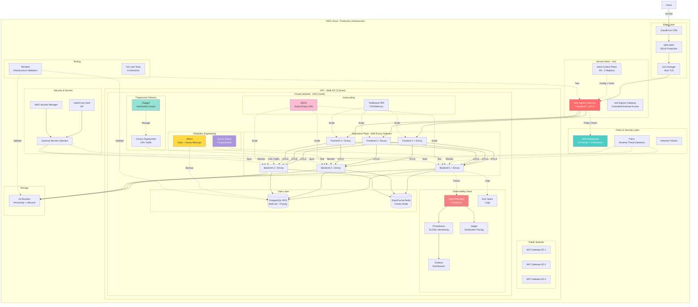
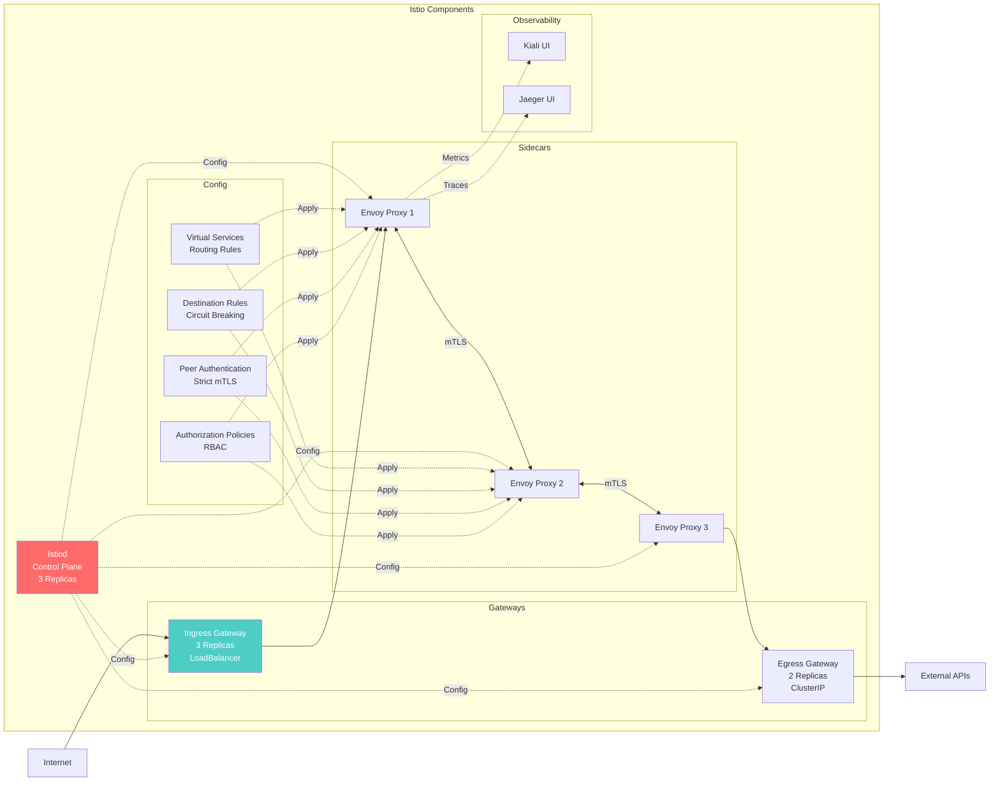
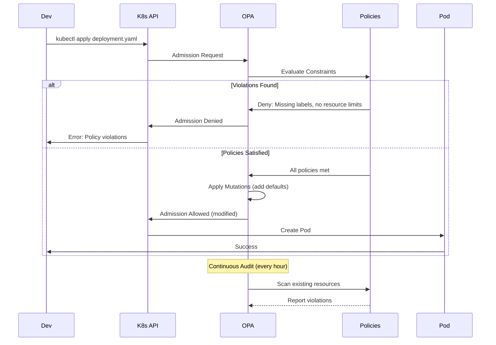
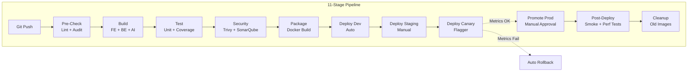
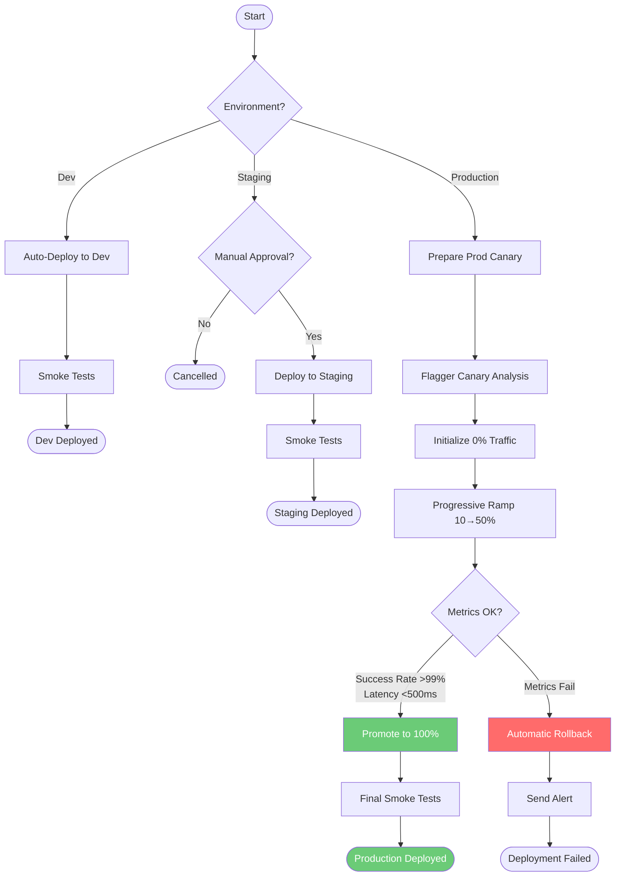
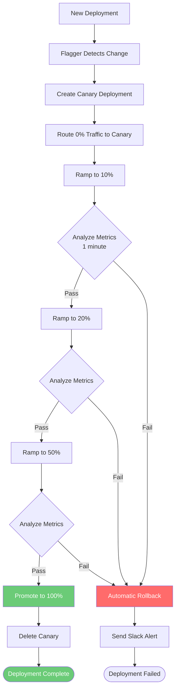
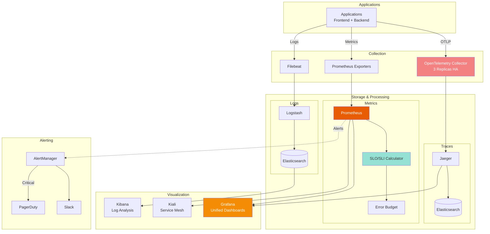
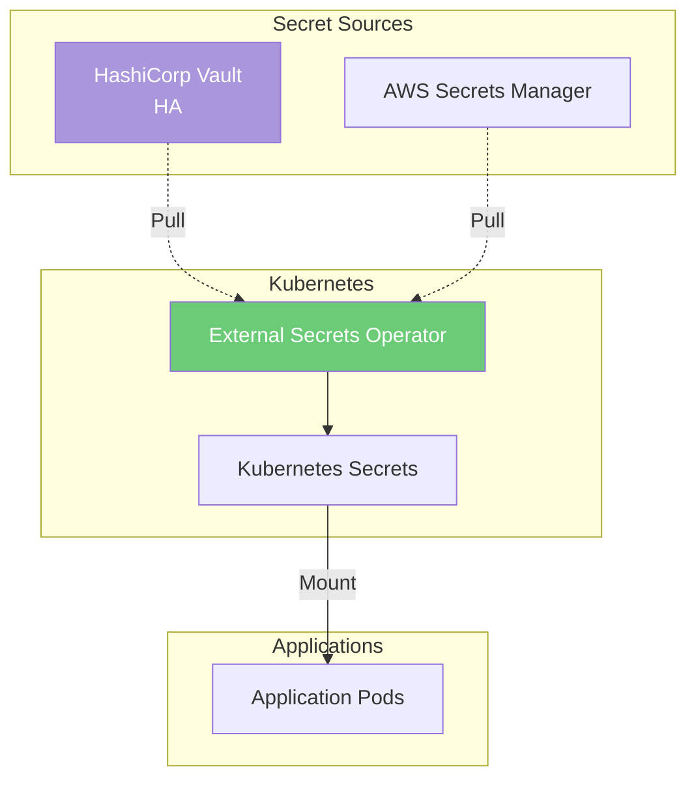
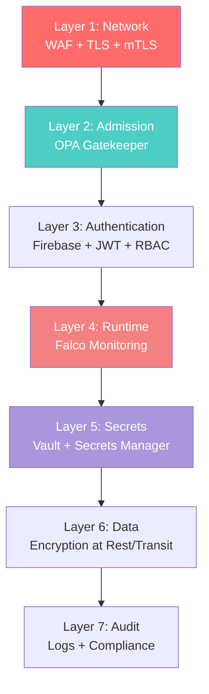

# DocuThinker DevOps Documentation

Comprehensive guide for deploying, monitoring, and maintaining DocuThinker's enterprise-grade infrastructure.

## Table of Contents

1. [Infrastructure Overview](#infrastructure-overview)
2. [Getting Started](#getting-started)
3. [Service Mesh - Istio](#service-mesh---istio)
4. [Policy Enforcement - OPA](#policy-enforcement---opa)
5. [CI/CD Pipelines](#cicd-pipelines)
6. [Kubernetes Deployments](#kubernetes-deployments)
7. [Progressive Delivery - Flagger](#progressive-delivery---flagger)
8. [Monitoring & Observability](#monitoring--observability)
9. [Chaos Engineering - Litmus](#chaos-engineering---litmus)
10. [Disaster Recovery - Velero](#disaster-recovery---velero)
11. [Autoscaling - KEDA](#autoscaling---keda)
12. [Runtime Security - Falco](#runtime-security---falco)
13. [Secret Management](#secret-management)
14. [Performance Testing](#performance-testing)
15. [Database Migrations](#database-migrations)
16. [Infrastructure Testing](#infrastructure-testing)
17. [Security](#security)
18. [Troubleshooting](#troubleshooting)

## Infrastructure Overview

DocuThinker uses a modern, enterprise-grade cloud-native architecture with **15 production-ready DevOps components**.

### Technology Stack

- **Cloud Provider**: AWS
- **Container Orchestration**: Amazon EKS (Kubernetes 1.28+)
- **Service Mesh**: Istio 1.20 (mTLS, Circuit Breaking, Traffic Management)
- **Policy Enforcement**: OPA Gatekeeper 3.14 (Security & Compliance)
- **Infrastructure as Code**: Terraform + Helm
- **CI/CD**: GitLab CI / GitHub Actions / Jenkins
- **GitOps**: ArgoCD
- **Observability**: OpenTelemetry + Prometheus + Grafana + Jaeger + ELK
- **Chaos Engineering**: Litmus 3.0
- **Progressive Delivery**: Flagger 1.34
- **Backup & DR**: Velero 1.12 (RTO < 1 hour)
- **Event-Driven Autoscaling**: KEDA 2.12
- **Runtime Security**: Falco 0.36
- **Secret Management**: HashiCorp Vault + AWS Secrets Manager
- **Performance Testing**: K6 (6 advanced scenarios)
- **TLS Management**: cert-manager 1.13
- **Database Migrations**: Flyway
- **Infrastructure Testing**: Terratest

### Architecture Diagram



---

## Getting Started

### Prerequisites

Install required tools:

```bash
# AWS CLI
curl "https://awscli.amazonaws.com/AWSCLIV2.pkg" -o "AWSCLIV2.pkg"
sudo installer -pkg AWSCLIV2.pkg -target /

# kubectl
curl -LO "https://dl.k8s.io/release/$(curl -L -s https://dl.k8s.io/release/stable.txt)/bin/darwin/amd64/kubectl"
chmod +x kubectl
sudo mv kubectl /usr/local/bin/

# Helm
curl https://raw.githubusercontent.com/helm/helm/main/scripts/get-helm-3 | bash

# Terraform
brew install terraform

# istioctl
curl -L https://istio.io/downloadIstio | sh -

# k6
brew install k6

# velero
brew install velero
```

### Initial Setup

1. **Configure AWS credentials**:
   ```bash
   aws configure
   ```

2. **Deploy infrastructure with Terraform**:
   ```bash
   cd terraform
   terraform init
   terraform plan
   terraform apply
   ```

3. **Configure kubectl**:
   ```bash
   aws eks update-kubeconfig --name docuthinker-eks-prod --region us-east-1
   ```

4. **Install core platform components**:
   ```bash
   # cert-manager (TLS automation)
   cd tls/cert-manager
   ./install-cert-manager.sh v1.13.0 admin@docuthinker.example.com

   # OPA Gatekeeper (Policy enforcement)
   cd ../../policy-as-code/opa
   ./install-opa.sh 3.14.0

   # Istio Service Mesh (Traffic management + mTLS)
   cd ../../service-mesh/istio
   ./install-istio.sh docuthinker-prod production
   ```

5. **Install observability stack**:
   ```bash
   # OpenTelemetry
   helm install otel-collector open-telemetry/opentelemetry-collector \
     -n monitoring -f observability/opentelemetry/values.yaml

   # Prometheus + SLO/SLI
   kubectl apply -f monitoring/slo-sli/prometheus-rules.yaml
   ```

6. **Install reliability components**:
   ```bash
   # Litmus Chaos Engineering
   cd chaos-engineering/litmus
   ./install-litmus.sh 3.0.0

   # Velero Backup & DR
   cd ../../backup-dr/velero
   ./install-velero.sh v1.12.0 us-east-1 docuthinker-velero-backups

   # Flagger Progressive Delivery
   helm install flagger flagger/flagger \
     -n istio-system -f progressive-delivery/flagger/values.yaml
   ```

7. **Install autoscaling & security**:
   ```bash
   # KEDA Event-Driven Autoscaling
   helm install keda kedacore/keda \
     -n keda --create-namespace -f autoscaling/keda/values.yaml

   # Falco Runtime Security
   helm install falco falcosecurity/falco \
     -n falco --create-namespace -f security/falco/values.yaml
   ```

---

## Service Mesh - Istio

### Overview

Istio provides:
- **Automatic mTLS**: 100% of service-to-service traffic encrypted
- **Traffic Management**: Canary deployments, A/B testing, traffic mirroring
- **Circuit Breaking**: Automatic failure isolation
- **Retry Logic**: Configurable retry attempts with timeouts
- **Distributed Tracing**: 100% sampling rate with Jaeger
- **Service Mesh Visualization**: Kiali dashboard

### Architecture



### Installation

```bash
cd service-mesh/istio
./install-istio.sh docuthinker-prod production
```

### Key Features

**1. Canary Deployment (10% traffic split)**:
```yaml
# Configured in traffic-management/virtual-services.yaml
route:
- destination:
    host: backend
    subset: stable
  weight: 90
- destination:
    host: backend
    subset: canary
  weight: 10
```

**2. Circuit Breaking**:
```yaml
# Configured in traffic-management/destination-rules.yaml
outlierDetection:
  consecutive5xxErrors: 3
  interval: 10s
  baseEjectionTime: 60s
  maxEjectionPercent: 30
```

**3. Retry Logic**:
```yaml
retries:
  attempts: 3
  perTryTimeout: 2s
  retryOn: 5xx,reset,connect-failure
```

### Access Dashboards

```bash
# Kiali (Service Mesh Visualization)
kubectl port-forward svc/kiali -n istio-system 20001:20001
# Open: http://localhost:20001

# Jaeger (Distributed Tracing)
kubectl port-forward svc/jaeger-query -n istio-system 16686:16686
# Open: http://localhost:16686
```

---

## Policy Enforcement - OPA

### Overview

OPA Gatekeeper enforces:
- **10 Security Policies**: Block privileged containers, enforce resource limits, etc.
- **8 Auto-Mutations**: Automatically add defaults (labels, resource limits, security contexts)
- **Continuous Audit**: Scan existing resources for violations
- **Admission Control**: Validate resources before creation

### Policy Enforcement Flow



### Installation

```bash
cd policy-as-code/opa
./install-opa.sh 3.14.0
```

### Active Policies

1. ✅ Block privileged containers
2. ✅ Enforce non-root users
3. ✅ Require resource limits (CPU/Memory)
4. ✅ Block `:latest` image tags
5. ✅ Enforce trusted registries
6. ✅ Block host namespaces
7. ✅ Require standard labels (app, version, environment, team)
8. ✅ Require read-only root filesystem
9. ✅ Enforce minimum replica counts (2 for prod)
10. ✅ Validate image pull policies

### View Violations

```bash
# List all constraints
kubectl get constraints

# View violations
kubectl get k8srequiredlabels pod-must-have-labels -o yaml

# Test deployment
kubectl apply --dry-run=server -f deployment.yaml
```

---

## CI/CD Pipelines

### Enhanced Pipeline Architecture



### GitLab CI Configuration

```yaml
# .gitlab-ci.yml (11 stages)
stages:
  - pre-check
  - build
  - test
  - security
  - package
  - deploy-dev
  - deploy-staging
  - deploy-canary
  - deploy-production
  - post-deploy
  - cleanup
```

---

## Kubernetes Deployments

### Deployment Flow with Progressive Delivery



### Deploy Commands

```bash
# Deploy via script
./scripts/deploy/deploy.sh [dev|staging|production]

# Deploy via Helm
helm upgrade --install docuthinker ./helm/docuthinker \
  -f ./helm/docuthinker/values-prod.yaml \
  -n docuthinker-prod

# Rollback
./scripts/deploy/rollback.sh production 3
```

---

## Progressive Delivery - Flagger

### Overview

Flagger automates canary deployments with metric-based promotion/rollback.

**Features**:
- Progressive traffic shifting (10% → 50%)
- Prometheus metrics analysis
- Success rate threshold (>99%)
- Latency threshold (<500ms)
- Automatic rollback on failure
- Slack notifications

### Canary Deployment Process



### Installation

```bash
helm install flagger flagger/flagger \
  -n istio-system \
  -f progressive-delivery/flagger/values.yaml
```

### Example Canary Configuration

```yaml
apiVersion: flagger.app/v1beta1
kind: Canary
metadata:
  name: backend
spec:
  targetRef:
    apiVersion: apps/v1
    kind: Deployment
    name: backend
  service:
    port: 8080
  analysis:
    interval: 1m
    threshold: 5
    maxWeight: 50
    stepWeight: 10
    metrics:
    - name: request-success-rate
      thresholdRange:
        min: 99
    - name: request-duration
      thresholdRange:
        max: 500
```

---

## Monitoring & Observability

### Complete Observability Stack



### SLO/SLI Monitoring

**Service Level Objectives**:
- Availability > 99.9%
- P99 Latency < 500ms
- Error Rate < 0.1%

**Prometheus Recording Rules**:
```promql
# Availability SLI
sli:availability:ratio_rate30d >= 0.999

# Latency SLI
sli:latency:p99_5m <= 0.5

# Error Budget
slo:error_budget:remaining
```

**Alerts**:
- Fast burn: >14.4x rate (error budget exhausted in 6 hours)
- Slow burn: >1x rate (gradual degradation)
- SLO violation: Availability < 99.9%

### Access Dashboards

```bash
# Grafana (Metrics + SLO/SLI)
kubectl port-forward svc/grafana -n monitoring 3000:80
# Open: http://localhost:3000

# Prometheus (Raw Metrics)
kubectl port-forward svc/prometheus -n monitoring 9090:9090
# Open: http://localhost:9090

# Kibana (Logs)
kubectl port-forward svc/kibana -n monitoring 5601:5601
# Open: http://localhost:5601

# Kiali (Service Mesh)
kubectl port-forward svc/kiali -n istio-system 20001:20001
# Open: http://localhost:20001
```

---

## Chaos Engineering - Litmus

### Overview

Litmus validates system resilience through controlled chaos experiments.

**Available Experiments**:
1. Pod Deletion (50% of pods, 60s)
2. Network Latency (2000ms injection)
3. CPU Stress (100% load, 1 core)
4. Memory Stress (500MB consumption)
5. Node Drain
6. Container Kill

### Installation

```bash
cd chaos-engineering/litmus
./install-litmus.sh 3.0.0
```

### Run Chaos Experiments

```bash
# Pod deletion test
kubectl apply -f chaos-engineering/litmus/experiments/pod-delete-experiment.yaml

# Network latency test
kubectl apply -f chaos-engineering/litmus/experiments/network-latency-experiment.yaml

# Resource stress test
kubectl apply -f chaos-engineering/litmus/experiments/resource-stress-experiment.yaml

# Comprehensive workflow (all experiments sequentially)
kubectl apply -f chaos-engineering/litmus/workflows/comprehensive-chaos-workflow.yaml
```

### Monitor Results

```bash
# Watch chaos engine
kubectl get chaosengine -n docuthinker-prod -w

# View results
kubectl describe chaosresult backend-pod-delete -n docuthinker-prod

# Access ChaosCenter UI
kubectl port-forward svc/chaos-litmus-frontend-service -n litmus 9091:9091
# Open: http://localhost:9091
```

---

## Disaster Recovery - Velero

### Overview

Velero provides automated backup and disaster recovery:
- **Daily full backups** (30-day retention)
- **Hourly incremental backups** (7-day retention)
- **RTO < 1 hour**
- **S3 backend storage**
- **EBS volume snapshots**

### Installation

```bash
cd backup-dr/velero
./install-velero.sh v1.12.0 us-east-1 docuthinker-velero-backups
```

### Backup Operations

```bash
# Create manual backup
velero backup create prod-backup-$(date +%Y%m%d) \
  --include-namespaces docuthinker-prod

# List backups
velero backup get

# Describe backup
velero backup describe prod-backup-20250127

# View backup logs
velero backup logs prod-backup-20250127
```

### Restore Operations

```bash
# Restore from backup
velero restore create --from-backup prod-backup-20250127

# Restore specific namespace
velero restore create --from-backup prod-backup-20250127 \
  --include-namespaces docuthinker-prod

# Monitor restore
velero restore get
velero restore describe <restore-name>
```

### Scheduled Backups

Automatically configured:
- **Daily**: 2 AM, 30-day retention
- **Hourly**: Every hour, 7-day retention

---

## Autoscaling - KEDA

### Overview

KEDA provides event-driven autoscaling:
- **Scale to zero** capability
- **AWS SQS** queue-based scaling
- **HTTP** request-based scaling
- **Cron** scheduled scaling
- **Prometheus** custom metrics

### Installation

```bash
helm install keda kedacore/keda \
  -n keda --create-namespace \
  -f autoscaling/keda/values.yaml
```

### Scaler Examples

**1. SQS Queue Scaler** (1-50 replicas):
```yaml
triggers:
- type: aws-sqs-queue
  metadata:
    queueURL: https://sqs.us-east-1.amazonaws.com/.../docuthinker-jobs
    queueLength: "5"
    awsRegion: "us-east-1"
```

**2. HTTP Scaler** (2-20 replicas):
```yaml
triggers:
- type: prometheus
  metadata:
    query: sum(rate(http_requests_total{app="backend"}[1m]))
    threshold: "100"
```

**3. Cron Scaler** (business hours):
```yaml
triggers:
- type: cron
  metadata:
    timezone: America/New_York
    start: 0 8 * * 1-5  # 8 AM weekdays
    end: 0 18 * * 1-5    # 6 PM weekdays
    desiredReplicas: "10"
```

### Apply Scalers

```bash
kubectl apply -f autoscaling/keda/scalers/queue-scaler.yaml
```

---

## Runtime Security - Falco

### Overview

Falco provides runtime threat detection:
- **4 custom security rules**
- **Real-time alerts** (Slack, PagerDuty)
- **eBPF-based** syscall monitoring
- **Anomaly detection**

### Installation

```bash
helm install falco falcosecurity/falco \
  -n falco --create-namespace \
  -f security/falco/values.yaml
```

### Custom Rules

1. **Privilege Escalation** - Detects sudo/su attempts
2. **Sensitive File Access** - Monitors /etc/shadow, SSH keys
3. **Reverse Shell** - Identifies shell attacks
4. **Cryptocurrency Mining** - Detects mining processes

### View Alerts

```bash
# View Falco logs
kubectl logs -l app=falco -n falco -f

# Check for alerts
kubectl logs -l app=falco -n falco | grep -i "warning\|critical"
```

---

## Secret Management

### Architecture



### HashiCorp Vault

```bash
# Install Vault
helm install vault hashicorp/vault \
  -n vault -f secrets/vault/vault-values.yaml

# Initialize Vault
./secrets/vault/init-vault.sh

# Access UI
kubectl port-forward svc/vault -n vault 8200:8200
# Open: http://localhost:8200
```

### External Secrets Operator

```bash
# Apply secret store
kubectl apply -f secrets/external-secrets/secret-store.yaml

# Secrets are automatically synced from Vault/AWS to K8s
```

---

## Performance Testing

### K6 Load Testing

**6 Test Scenarios**:
1. **Baseline** (10 VUs, 5min) - Establish normal performance
2. **Load Test** (0→50 VUs, 14min) - Sustained load
3. **Stress Test** (0→300 VUs, 26min) - Find breaking point
4. **Spike Test** (0→500 VUs, 1.5min) - Sudden surge
5. **Soak Test** (50 VUs, 2h) - Extended duration
6. **Breakpoint** (1→500 req/s, 22min) - Gradual increase to failure

### Run Load Tests

```bash
# Basic load test
k6 run --vus 100 --duration 5m testing/load-tests/k6-advanced-scenarios.js

# With custom endpoint
BASE_URL=https://staging.docuthinker.com k6 run testing/load-tests/k6-advanced-scenarios.js

# All scenarios
k6 run testing/load-tests/k6-advanced-scenarios.js
```

### Test Thresholds

- P95 latency < 500ms
- P99 latency < 1000ms
- Error rate < 1%
- Success rate > 95%

---

## Database Migrations

### Flyway Overview

Flyway provides version-controlled database migrations:
- **Versioned SQL scripts**
- **Rollback support**
- **Validation on deploy**
- **Baseline on migrate**

### Migration Structure

```
database/migrations/
├── flyway.conf               # Configuration
└── sql/
    ├── V1__initial_schema.sql
    ├── V2__add_api_keys.sql
    └── V3__add_audit_log.sql
```

### Run Migrations

```bash
# Via Flyway CLI
flyway -configFiles=database/migrations/flyway.conf migrate

# Via Docker
docker run --rm \
  -v $(pwd)/database/migrations:/flyway/sql \
  flyway/flyway migrate

# Rollback (if supported)
flyway -configFiles=database/migrations/flyway.conf undo
```

---

## Infrastructure Testing

### Terratest

Validate Terraform infrastructure with automated tests.

**Tests Included**:
- VPC configuration validation
- EKS cluster verification
- RDS database connectivity
- S3 bucket existence and versioning
- Security group rules
- IAM roles and policies
- CloudWatch log groups
- Resource tagging compliance

### Run Tests

```bash
cd testing/infrastructure

# Run all tests
go test -v -timeout 30m

# Run specific test
go test -v -run TestTerraformDocuThinkerInfrastructure

# Parallel execution
go test -v -parallel 4
```

---

## Security

### Multi-Layered Security



### Security Scanning

```bash
# Trivy image scanning
./scripts/security/trivy-scan.sh

# SonarQube analysis
sonar-scanner -Dproject.settings=scripts/security/sonarqube.properties

# OPA policy violations
kubectl get constraints -o json | jq '.items[].status.violations'

# Falco alerts
kubectl logs -l app=falco -n falco | grep -i critical
```

---

## Troubleshooting

### Common Issues

**1. Pod not starting**:
```bash
kubectl describe pod <pod-name> -n docuthinker-prod
kubectl logs <pod-name> -n docuthinker-prod
kubectl logs <pod-name> -c istio-proxy -n docuthinker-prod
```

**2. OPA blocking deployment**:
```bash
# Check violations
kubectl get constraints

# Test deployment
kubectl apply --dry-run=server -f deployment.yaml

# View specific constraint
kubectl get k8srequiredlabels pod-must-have-labels -o yaml
```

**3. Istio traffic issues**:
```bash
# Check virtual services
kubectl get virtualservices -n docuthinker-prod

# Check destination rules
kubectl get destinationrules -n docuthinker-prod

# Analyze configuration
istioctl analyze -n docuthinker-prod

# View proxy logs
kubectl logs <pod-name> -c istio-proxy
```

**4. Canary not promoting**:
```bash
# Check Flagger status
kubectl describe canary backend -n docuthinker-prod

# View Flagger logs
kubectl logs -l app=flagger -n istio-system

# Check metrics
kubectl port-forward svc/prometheus -n monitoring 9090:9090
# Query: flagger_canary_status
```

**5. High error rate**:
```bash
# Check SLO/SLI metrics
kubectl port-forward svc/prometheus -n monitoring 9090:9090
# Query: sli:availability:ratio_rate5m

# View error budget
# Query: slo:error_budget:remaining

# Check application logs
kubectl logs -l app=backend -n docuthinker-prod | grep -i error
```

### Rollback Procedures

```bash
# View deployment history
helm history docuthinker -n docuthinker-prod

# Rollback to previous version
./scripts/deploy/rollback.sh production

# Rollback to specific revision
helm rollback docuthinker 3 -n docuthinker-prod

# Emergency rollback (bypass Flagger)
kubectl rollout undo deployment/backend -n docuthinker-prod
```

---

## Maintenance Schedule

**Daily**:
- Monitor SLO/SLI dashboards
- Review error budgets
- Check Falco security alerts
- Review OPA violations

**Weekly**:
- Run chaos experiments
- Review Velero backup status
- Update dependencies
- Review cost optimization (Kubecost)
- Security scans (Trivy + SonarQube)

**Monthly**:
- DR drill (test Velero restore)
- Performance review (K6 load tests)
- Infrastructure testing (Terratest)
- Update documentation
- Security audit
- Cost optimization review

---

## Quick Reference

### Common Commands

```bash
# === Deployment ===
./scripts/deploy/deploy.sh [dev|staging|production]
./scripts/deploy/rollback.sh [environment] [revision]

# === Monitoring ===
kubectl port-forward svc/grafana -n monitoring 3000:80
kubectl port-forward svc/prometheus -n monitoring 9090:9090
kubectl port-forward svc/kiali -n istio-system 20001:20001

# === Chaos Engineering ===
kubectl apply -f chaos-engineering/litmus/experiments/pod-delete-experiment.yaml
kubectl get chaosresult -n docuthinker-prod

# === Backup & Restore ===
velero backup create prod-backup-$(date +%Y%m%d) --include-namespaces docuthinker-prod
velero restore create --from-backup prod-backup-20250127

# === Security ===
./scripts/security/trivy-scan.sh
kubectl get constraints
kubectl logs -l app=falco -n falco

# === Load Testing ===
k6 run --vus 100 --duration 5m testing/load-tests/k6-advanced-scenarios.js

# === Logs ===
kubectl logs -l app=backend -n docuthinker-prod -f
kubectl logs -l app=backend -c istio-proxy -n docuthinker-prod
```

---

## Support

For issues:
1. Check this documentation
2. Review component-specific READMEs
3. Check logs and metrics
4. Review troubleshooting section
5. Contact DevOps team

## Documentation

- [DEVOPS_QUICK_START.md](DEVOPS_QUICK_START.md) - Installation guide
- [ARCHITECTURE.md](ARCHITECTURE.md) - System architecture

---
