# DocuThinker DevOps Documentation

Comprehensive guide for deploying, monitoring, and maintaining DocuThinker infrastructure.

## Table of Contents

1. [Infrastructure Overview](#infrastructure-overview)
2. [Getting Started](#getting-started)
3. [CI/CD Pipelines](#cicd-pipelines)
4. [Kubernetes Deployments](#kubernetes-deployments)
5. [Monitoring & Observability](#monitoring--observability)
6. [Secret Management](#secret-management)
7. [Performance Testing](#performance-testing)
8. [Security](#security)
9. [Troubleshooting](#troubleshooting)

## Infrastructure Overview

DocuThinker uses a modern cloud-native architecture:

- **Cloud Provider**: AWS
- **Container Orchestration**: Amazon EKS (Kubernetes)
- **Infrastructure as Code**: Terraform
- **CI/CD**: GitLab CI / CircleCI / Jenkins
- **Monitoring**: Prometheus + Grafana + ELK Stack
- **Secret Management**: HashiCorp Vault + AWS Secrets Manager
- **GitOps**: ArgoCD
- **Performance Testing**: k6

### Architecture Diagram

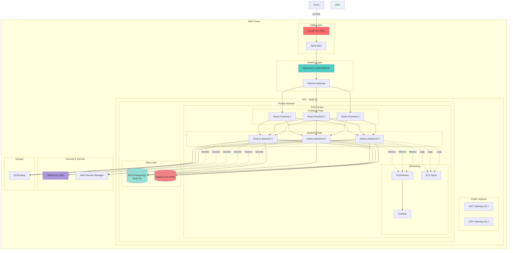

## Getting Started

### Prerequisites

Install required tools:

```bash
# AWS CLI
curl "https://awscli.amazonaws.com/AWSCLIV2.pkg" -o "AWSCLIV2.pkg"
sudo installer -pkg AWSCLIV2.pkg -target /

# kubectl
curl -LO "https://dl.k8s.io/release/$(curl -L -s https://dl.k8s.io/release/stable.txt)/bin/darwin/amd64/kubectl"
chmod +x kubectl
sudo mv kubectl /usr/local/bin/

# Helm
curl https://raw.githubusercontent.com/helm/helm/main/scripts/get-helm-3 | bash

# Terraform
brew install terraform

# k6
brew install k6
```

### Initial Setup

1. **Configure AWS credentials**:
   ```bash
   aws configure
   ```

2. **Deploy infrastructure**:
   ```bash
   cd terraform
   terraform init
   terraform plan
   terraform apply
   ```

3. **Configure kubectl**:
   ```bash
   aws eks update-kubeconfig --name docuthinker-eks-prod --region us-east-1
   ```

4. **Install monitoring stack**:
   ```bash
   ./scripts/setup/install-monitoring.sh
   ```

## CI/CD Pipelines

### Pipeline Architecture

```mermaid
graph LR
    subgraph "Source Control"
        GIT[Git Push]
    end

    subgraph "CI/CD Platform"
        TRIGGER[Webhook Trigger]

        subgraph "Pre-Check Stage"
            LINT[Code Linting]
            AUDIT[Dependency Audit]
        end

        subgraph "Build Stage"
            BFE[Build Frontend]
            BBE[Build Backend]
            BAI[Build AI/ML]
        end

        subgraph "Test Stage"
            TFE[Test Frontend]
            TBE[Test Backend]
            TAI[Test AI/ML]
            COV[Code Coverage]
        end

        subgraph "Security Stage"
            TRIVY[Trivy Scan]
            SONAR[SonarQube Analysis]
            SAST[SAST Checks]
        end

        subgraph "Package Stage"
            DOCKER[Build Docker Images]
            PUSH[Push to Registry]
        end

        subgraph "Deploy Stage"
            DEV[Deploy to Dev]
            STAGING[Deploy to Staging]
            CANARY[Deploy Canary]
            PROD[Promote to Production]
        end

        subgraph "Post-Deploy Stage"
            SMOKE[Smoke Tests]
            PERF[Performance Tests]
            NOTIFY[Notifications]
        end
    end

    GIT --> TRIGGER
    TRIGGER --> LINT & AUDIT
    LINT & AUDIT --> BFE & BBE & BAI
    BFE & BBE & BAI --> TFE & TBE & TAI
    TFE & TBE & TAI --> COV
    COV --> TRIVY & SONAR & SAST
    TRIVY & SONAR & SAST --> DOCKER
    DOCKER --> PUSH
    PUSH --> DEV
    DEV --> STAGING
    STAGING --> CANARY
    CANARY -->|Manual Approval| PROD
    PROD --> SMOKE & PERF
    SMOKE & PERF --> NOTIFY

    style TRIGGER fill:#FFD93D
    style DOCKER fill:#6BCB77
    style PROD fill:#FF6B6B
    style NOTIFY fill:#4D96FF
```

### GitLab CI

Pipeline stages:
1. Pre-check (linting, dependency audit)
2. Build (frontend, backend, AI/ML)
3. Test (unit tests, coverage)
4. Security (Trivy, SonarQube)
5. Package (Docker builds)
6. Deploy (dev → staging → production)
7. Post-deploy (smoke tests, performance tests)

Configuration: `.gitlab-ci.yml`

### CircleCI

Similar pipeline with parallel job execution.

Configuration: `.circleci/config.yml`

### Jenkins

Advanced canary and blue/green deployment strategy.

Configuration: `Jenkinsfile`

### Deployment Strategies

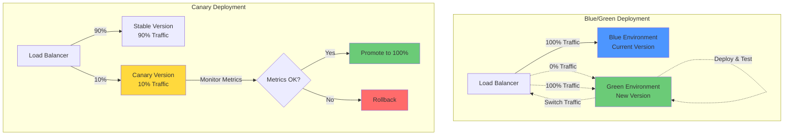

## Kubernetes Deployments

### Deployment Flow

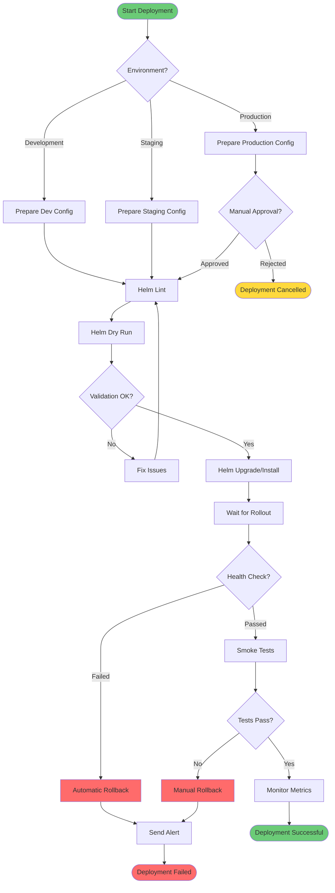

### Helm Charts

Deploy using Helm:

```bash
# Development
helm upgrade --install docuthinker ./helm/docuthinker \
  -f ./helm/docuthinker/values-dev.yaml \
  -n docuthinker-dev

# Staging
helm upgrade --install docuthinker ./helm/docuthinker \
  -f ./helm/docuthinker/values-staging.yaml \
  -n docuthinker-staging

# Production
helm upgrade --install docuthinker ./helm/docuthinker \
  -f ./helm/docuthinker/values-prod.yaml \
  -n docuthinker-prod
```

### ArgoCD (GitOps)

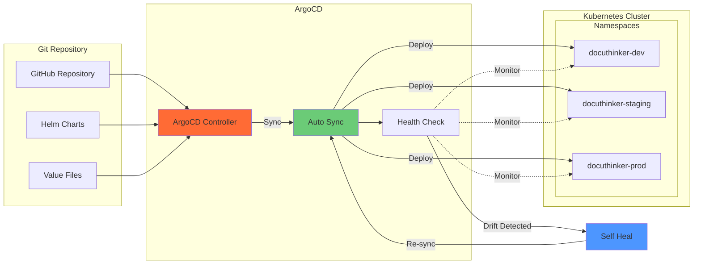

Automated deployment with ArgoCD:

```bash
# Install ArgoCD
kubectl create namespace argocd
kubectl apply -n argocd -f https://raw.githubusercontent.com/argoproj/argo-cd/stable/manifests/install.yaml

# Apply applications
kubectl apply -f argocd/application.yaml

# Access ArgoCD UI
kubectl port-forward svc/argocd-server -n argocd 8080:443
```

### Deployment Scripts

Quick deployment:
```bash
./scripts/deploy/deploy.sh production
```

Rollback:
```bash
./scripts/deploy/rollback.sh production 3
```

## Monitoring & Observability

### Monitoring Architecture

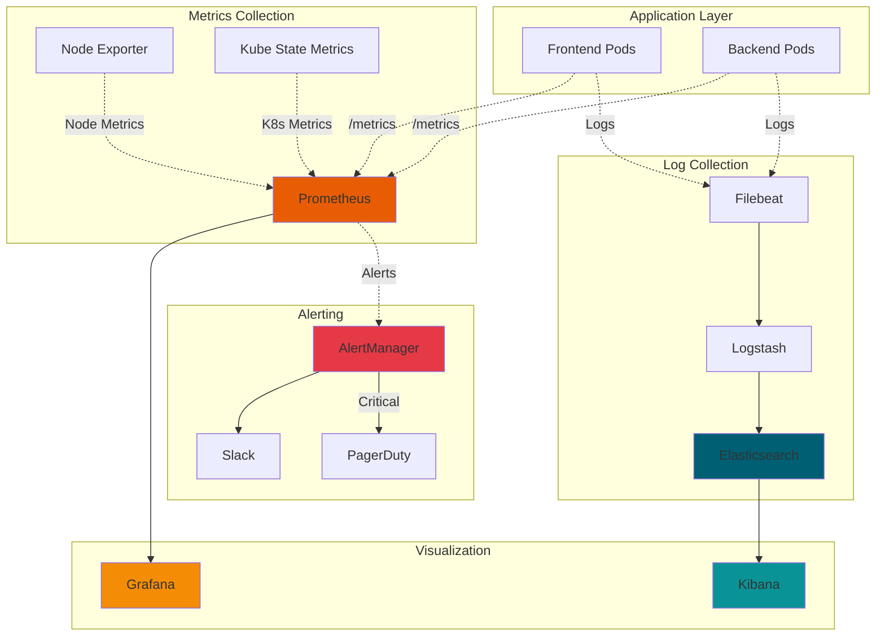

### Observability Data Flow

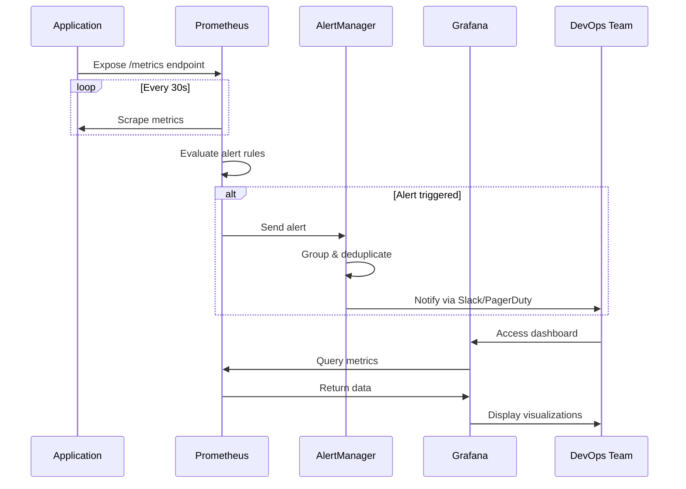

### Prometheus + Grafana

Access Grafana:
```bash
kubectl port-forward -n monitoring svc/kube-prometheus-stack-grafana 3000:80
```

Default credentials: `admin` / `prom-operator`

Dashboards:
- DocuThinker Overview
- Kubernetes Cluster Metrics
- Node Exporter

### ELK Stack

Access Kibana:
```bash
kubectl port-forward -n monitoring svc/kibana-kibana 5601:5601
```

Create index pattern: `docuthinker-*`

### Alerting

Alerts are configured in `monitoring/prometheus/alert-rules.yaml`

Notifications sent to:
- Slack: #docuthinker-alerts
- PagerDuty (critical only)

## Secret Management

### Secret Management Architecture

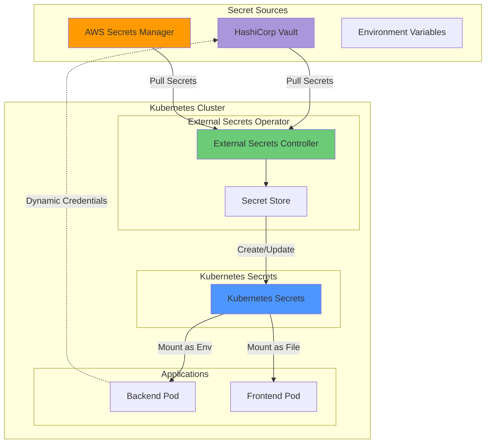

### Secret Sync Flow

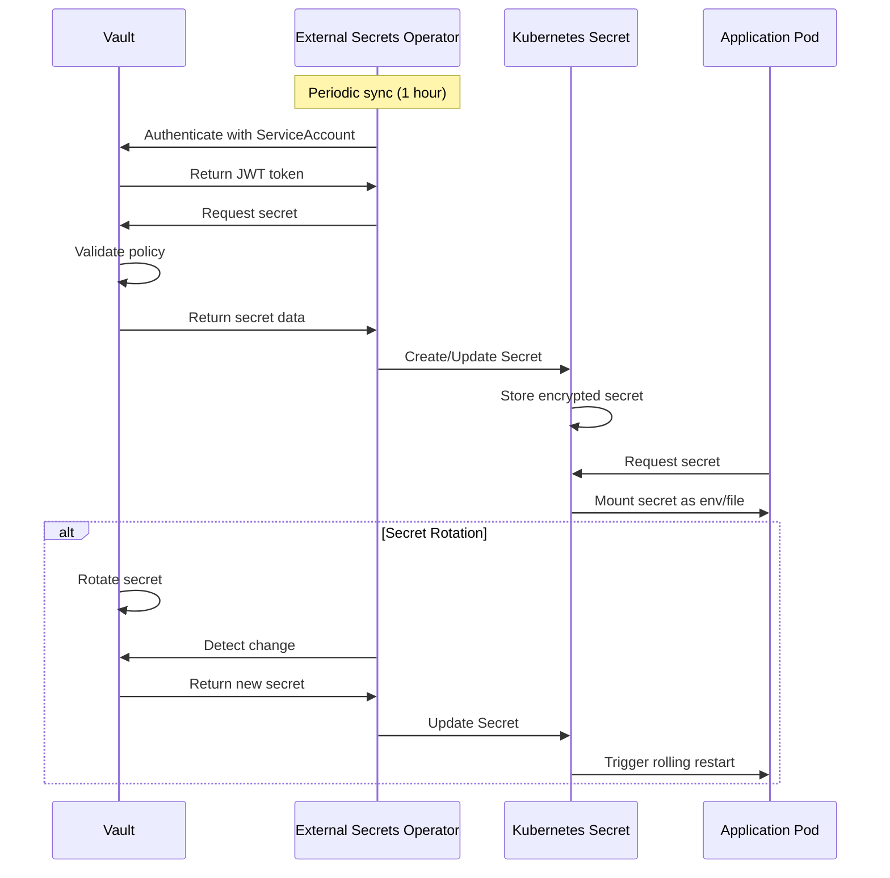

### HashiCorp Vault

Install and initialize:
```bash
helm install vault hashicorp/vault -n vault -f secrets/vault/vault-values.yaml
./secrets/vault/init-vault.sh
```

Access UI:
```bash
kubectl port-forward -n vault svc/vault 8200:8200
```

### External Secrets Operator

Automatically syncs secrets from Vault to Kubernetes:

```bash
kubectl apply -f secrets/external-secrets/secret-store.yaml
```

## Performance Testing

### Performance Testing Strategy

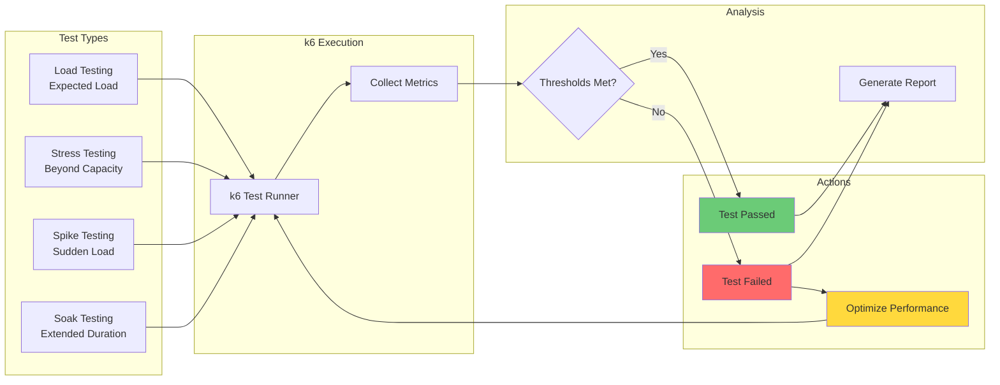

### Load Test Stages

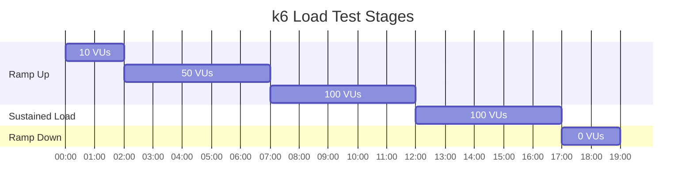

### k6 Load Testing

Run load test:
```bash
k6 run --vus 100 --duration 5m scripts/performance/load-test.js
```

Run stress test:
```bash
k6 run scripts/performance/stress-test.js
```

With custom endpoint:
```bash
BASE_URL=https://staging.docuthinker.com k6 run scripts/performance/load-test.js
```

## Security

### Security Layers

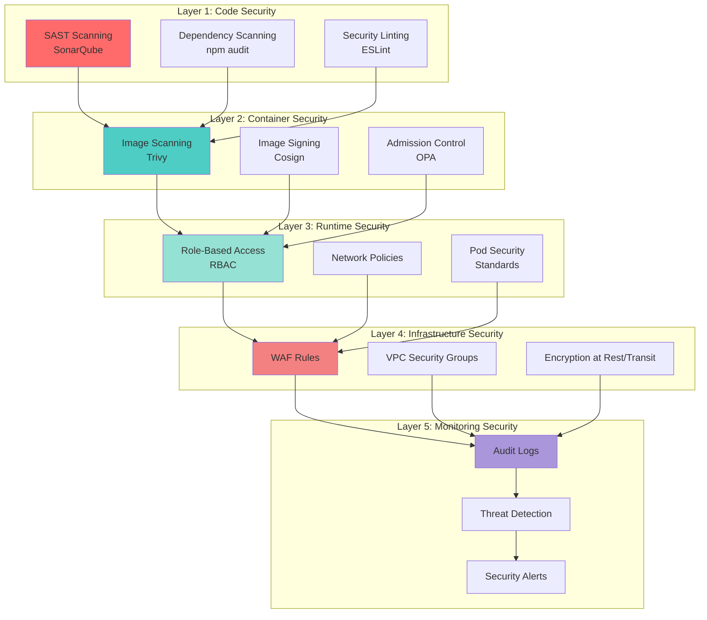

### Security Scanning Pipeline

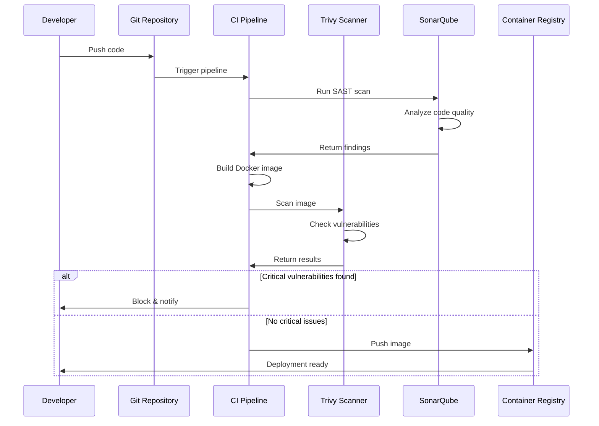

### Trivy Scanning

Run security scans:
```bash
chmod +x scripts/security/trivy-scan.sh
./scripts/security/trivy-scan.sh
```

### SonarQube Analysis

```bash
sonar-scanner -Dproject.settings=scripts/security/sonarqube.properties
```

### Security Best Practices

1. Regularly update dependencies
2. Scan container images before deployment
3. Use secrets management (never hardcode secrets)
4. Enable network policies
5. Implement RBAC
6. Regular security audits

## Troubleshooting

### Pod not starting

```bash
kubectl describe pod <pod-name> -n docuthinker-prod
kubectl logs <pod-name> -n docuthinker-prod
```

### Database connection issues

```bash
# Test database connectivity
kubectl run -it --rm debug --image=postgres:15 --restart=Never -- \
  psql -h postgres.docuthinker-prod.svc.cluster.local -U docuthinker
```

### High error rate

1. Check application logs
2. Review Prometheus alerts
3. Check resource utilization
4. Review recent deployments

### Rollback procedure

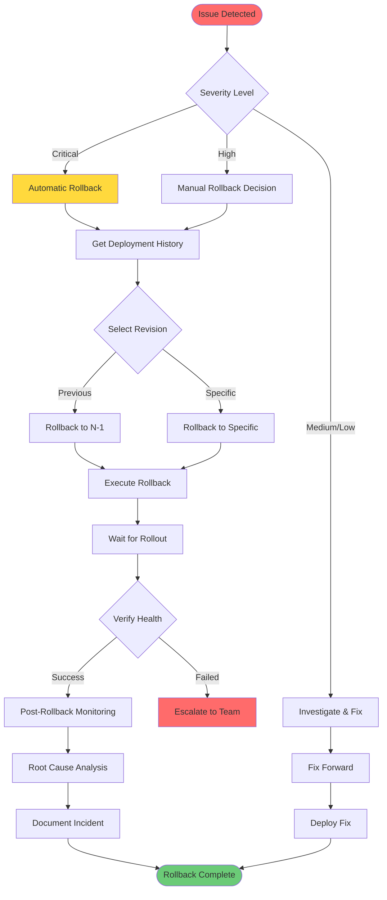

```bash
# View history
helm history docuthinker -n docuthinker-prod

# Rollback
./scripts/deploy/rollback.sh production <revision>
```

## Maintenance

### Regular Tasks

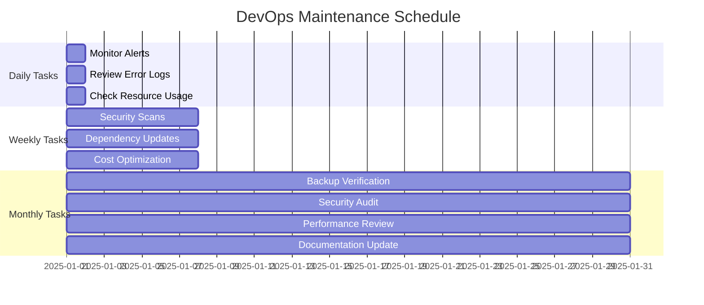

**Daily:**
- Monitor alerts
- Review error logs
- Check resource utilization

**Weekly:**
- Review security scans
- Update dependencies
- Review and optimize costs

**Monthly:**
- Backup verification
- Security audit
- Performance review
- Update documentation

### Backup Procedures

Database backups are automated via AWS Backup.

Manual backup:
```bash
kubectl exec -n docuthinker-prod <postgres-pod> -- \
  pg_dump -U docuthinker docuthinker > backup.sql
```

### Disaster Recovery

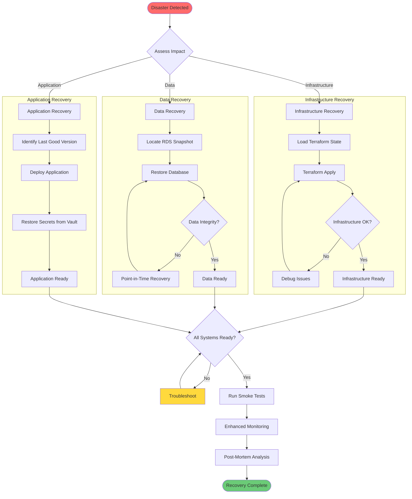

Disaster Recovery Steps:

1. Restore infrastructure from Terraform
2. Restore database from RDS snapshots
3. Deploy application from last known good version
4. Restore secrets from backup
5. Verify functionality

## Support

For issues:
1. Check this documentation
2. Review logs and metrics
3. Contact DevOps team
4. Create incident ticket

## Contributing

When making changes:
1. Update documentation
2. Test in dev/staging first
3. Follow deployment procedures
4. Monitor after deployment
5. Update runbooks if needed

## Infrastructure Cost Optimization

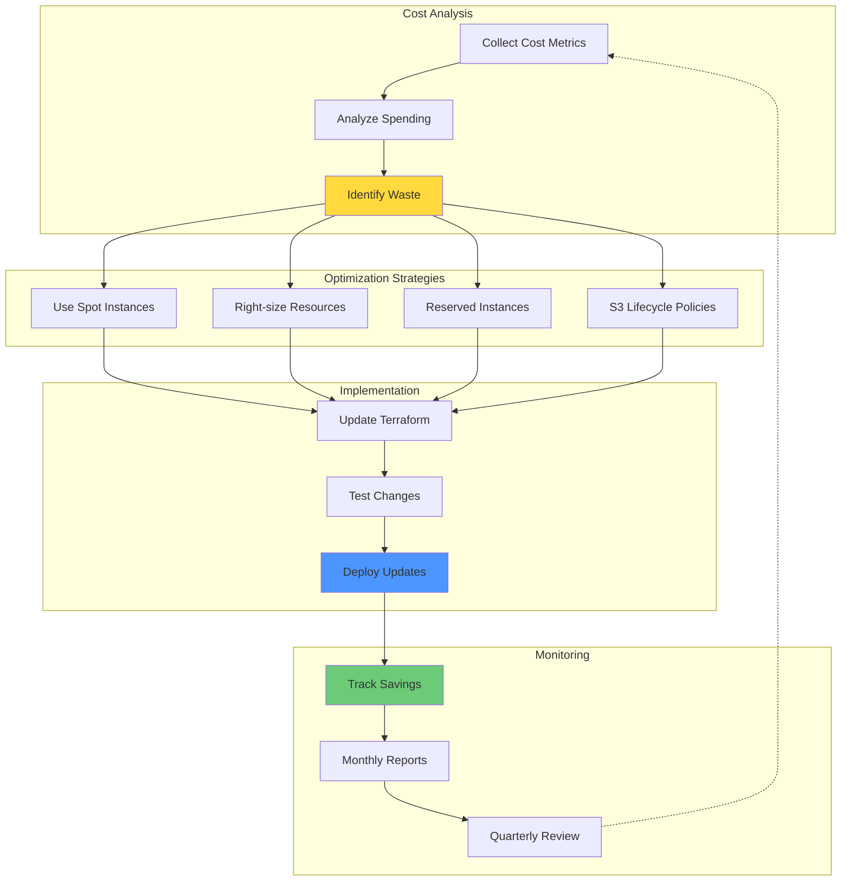

## System Health Dashboard

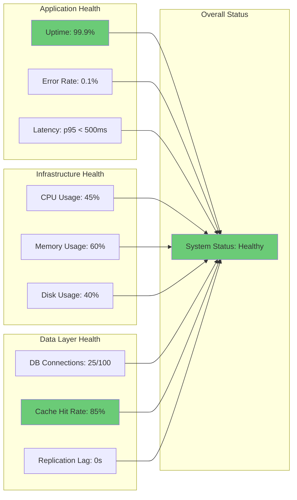

---

**Last Updated**: 2025-01-26
**Maintainer**: Son Nguyen
**Documentation Version**: 2.0.0

## Quick Reference

### Common Commands Cheatsheet

```bash
# Deployment
./scripts/deploy/deploy.sh [dev|staging|production]

# Rollback
./scripts/deploy/rollback.sh [environment] [revision]

# View logs
kubectl logs -f deployment/docuthinker-backend -n docuthinker-prod

# Scale deployment
kubectl scale deployment/docuthinker-backend --replicas=5 -n docuthinker-prod

# Port forward services
kubectl port-forward svc/grafana 3000:80 -n monitoring

# Run performance test
k6 run --vus 100 --duration 5m scripts/performance/load-test.js

# Security scan
./scripts/security/trivy-scan.sh

# Access ArgoCD
kubectl port-forward svc/argocd-server -n argocd 8080:443
```

### Emergency Contacts

| Role | Contact | Escalation Level |
|------|---------|------------------|
| DevOps Lead | devops-lead@docuthinker.com | Primary |
| Platform Team | platform@docuthinker.com | Secondary |
| On-Call Engineer | oncall@docuthinker.com | 24/7 |
| Security Team | security@docuthinker.com | Security Issues |
