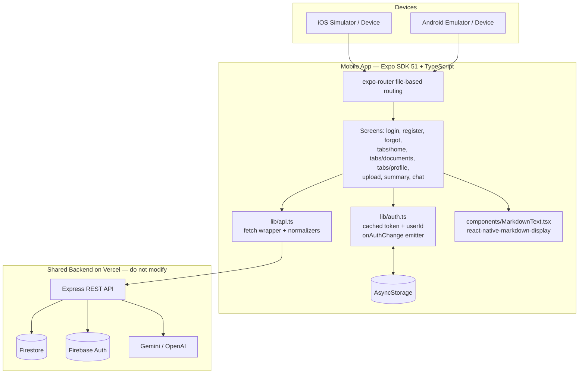
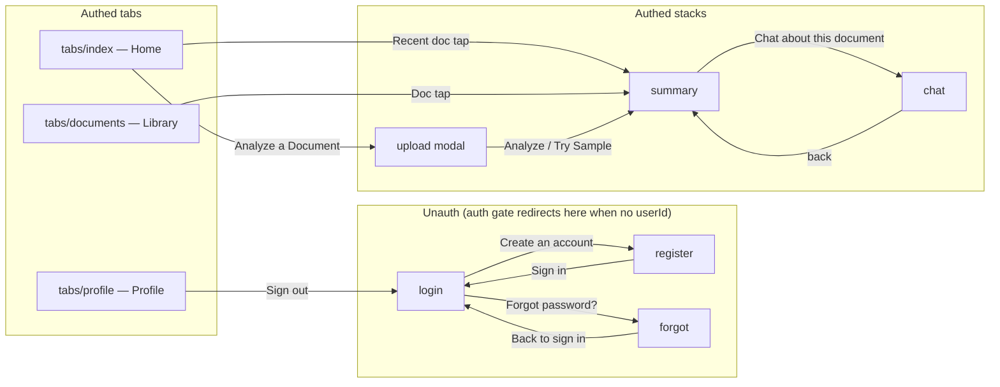
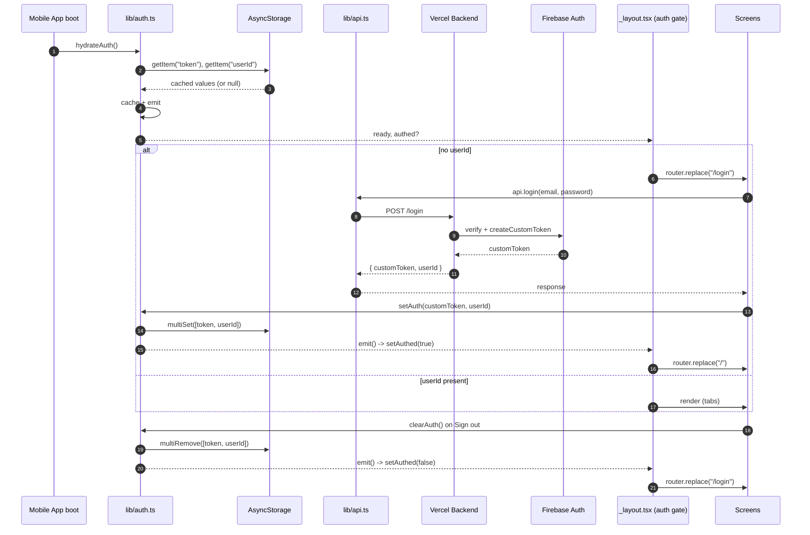
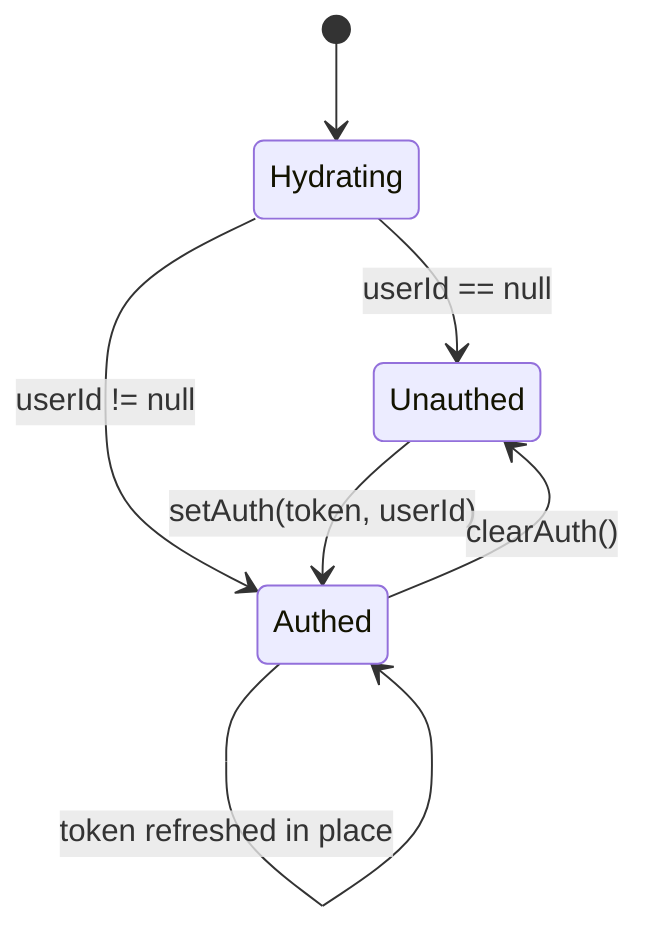
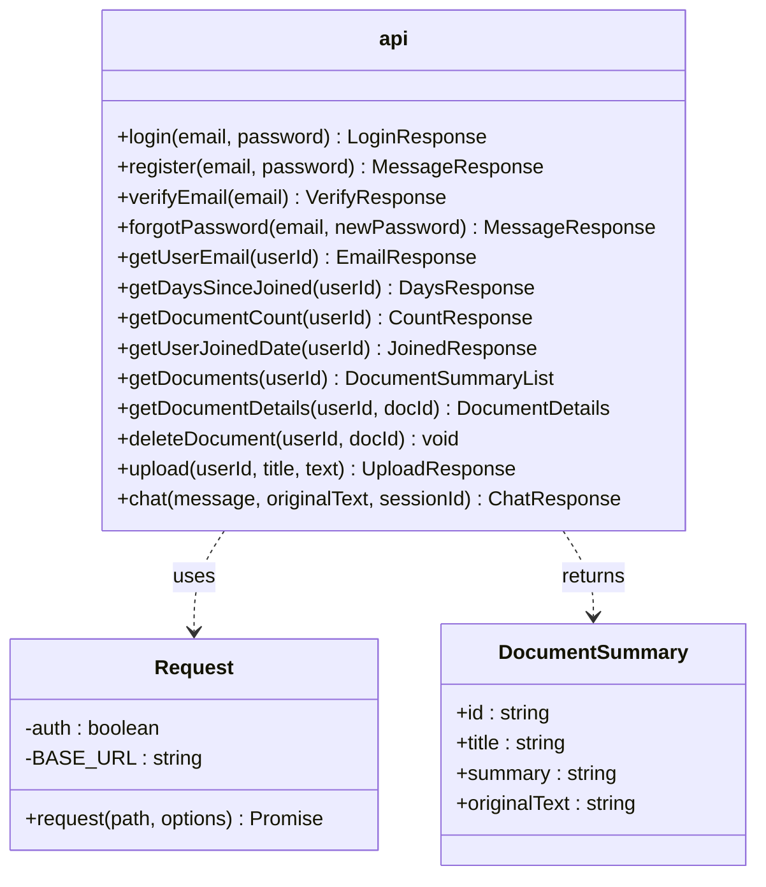
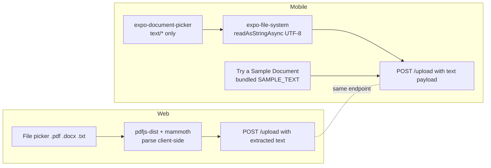

# DocuThinker — Mobile Apps (iOS & Android)

This document is the single source of truth for the DocuThinker mobile experience. It covers architecture, every screen (with iOS + Android screenshots), the auth and data layer, how mobile mirrors the web frontend, the upload boundary, dev workflows, and known limitations.

---

## Table of contents

1. [Overview](#overview)
2. [Architecture](#architecture)
3. [Screen map](#screen-map)
4. [Auth model](#auth-model)
5. [API surface](#api-surface)
6. [Markdown rendering](#markdown-rendering)
7. [Upload boundary](#upload-boundary)
8. [Screen tour](#screen-tour)
9. [Web ↔ mobile parity matrix](#web--mobile-parity-matrix)
10. [Build, run, and dev workflow](#build-run-and-dev-workflow)
11. [Known limitations](#known-limitations)

---

## Overview

The DocuThinker mobile app is an **Expo SDK 51** React Native app built with **TypeScript** and **expo-router** (file-based routing). It signs in against the **same Firebase Auth pool the web client uses** and talks to the same Vercel backend at `https://docuthinker-app-backend-api.vercel.app`. A user registered on the web can sign in on mobile (and vice-versa) and see the same documents, days-active counter, and summaries.

The mobile app is intentionally lean: it does not duplicate backend services, it does not own its own auth, and it does not parse PDFs on-device. It is a thin, fast, native-feeling client over the same APIs the web app uses, with one explicit boundary documented in [Upload boundary](#upload-boundary).



---

## Architecture

```
mobile-app/
├── app/                          # expo-router screens
│   ├── _layout.tsx               # Root stack + auth gate
│   ├── login.tsx                 # Email/password sign-in
│   ├── register.tsx              # Email/password sign-up
│   ├── forgot.tsx                # Two-step verify-email + reset
│   ├── upload.tsx                # Plain-text doc picker + sample seed
│   ├── summary.tsx               # AI summary + original tabs (markdown)
│   ├── chat.tsx                  # Document chat (markdown)
│   └── (tabs)/
│       ├── _layout.tsx           # Bottom tab nav
│       ├── index.tsx             # Home: stats + recent docs
│       ├── documents.tsx         # Library: searchable doc list
│       └── profile.tsx           # Profile: stats + settings + sign out
├── components/
│   ├── Screen.tsx                # Themed safe-area wrapper with refresh control hook
│   ├── ui.tsx                    # Buttons, Pills, TextField, Cards, IconCircle, Avatar, Logo
│   └── MarkdownText.tsx          # Renders LLM markdown the same way ChatModal.js does
├── lib/
│   ├── auth.ts                   # Token + userId cache, AsyncStorage, onAuthChange
│   └── api.ts                    # fetch wrapper + endpoint methods + response normalizers
└── constants/
    ├── theme.ts                  # Spacing, radius, font sizes, colors per scheme
    └── sampleData.ts             # Static UI copy only (home feature cards)
```

Important conventions:

- **No mock data in production paths.** Every screen that depends on user data calls `lib/api.ts`. The only static data file (`constants/sampleData.ts`) holds UI copy for the home "What you can do" cards.
- **Auth never polls.** `lib/auth.ts` caches token + userId and emits events; screens subscribe via `onAuthChange`. This mirrors the web client's switch from a per-second `localStorage` poll to an event-driven model (see `frontend/src/utils/auth.js`).
- **Response normalization lives in `lib/api.ts`.** The backend returns `/documents/:userId` as an object keyed by numeric strings plus a `message` field, and `title` is sometimes an array. The mobile API layer coerces these to a clean `DocumentSummary[]` so screens stay simple.
- **Markdown is rendered, not stringified.** Assistant messages and summaries pass through `MarkdownText.tsx` (`react-native-markdown-display`), matching `frontend/src/components/ChatModal.js` (`react-markdown`).

---

## Screen map



---

## Auth model

The mobile auth flow is a near-1:1 mirror of `frontend/src/utils/auth.js`:



State machine:



Auth gate (in `app/_layout.tsx`) treats `login`, `register`, and `forgot` as the only public segments. Anything else redirects to `/login` when unauthed; if already authed and on a public segment, it redirects to `/`.

---

## API surface

`lib/api.ts` exposes a single `api` object whose methods call the same Vercel backend as the web app. Every response is parsed through a small wrapper that surfaces `body.error || body.message` on non-2xx responses so screens can show meaningful error text.



### Why the normalizers exist

Two backend response shapes do not match what mobile screens want:

1. **`GET /documents/:userId`** returns `{"0":{...}, "1":{...}, ..., "message": "..."}`. The mobile API coerces this into `DocumentSummary[]`, filtering out the `message` key — the same trick `frontend/src/pages/DocumentsPage.js` uses with `Object.keys(data).filter(k => k !== "message").map(k => data[k])`.
2. **`title`** comes back as `string[]` for legacy docs (mostly PDFs uploaded through the web app). Mobile flattens this to a single string via `Array.isArray(title) ? title.join(" ") : title`, so list rows render as expected.

These normalizers are the reason `Library` is no longer empty on mobile when the same account has 30+ docs on web.

---

## Markdown rendering

LLM responses (summaries, chat replies) include markdown — `**bold**`, `_italic_`, bullet lists, occasional fenced code, and links. Web uses `react-markdown`; mobile uses `react-native-markdown-display` behind a small wrapper component (`components/MarkdownText.tsx`) that styles paragraphs, lists, code, and links to match the active theme.

Used by:

- `app/chat.tsx` for every assistant bubble.
- `app/summary.tsx` for the AI summary tab.

User-typed messages still render as plain `<Text>` to keep their styling consistent with the brand-colored bubbles.

---

## Upload boundary



### Why mobile is text-only

The Vercel deployment has a small request payload limit, and we don't want to ship a multipart binary upload path that's flaky in the wild. PDF/DOCX parsing on the web is done **client-side** with `pdfjs-dist` and `mammoth` before the extracted text is posted to `/upload`. Reproducing that on mobile would require either:

- bundling native PDF parsing (requires `expo prebuild` and breaks the Expo Go workflow), or
- streaming the raw binary to the backend (the Vercel payload limit makes this unreliable for non-trivial PDFs).

We chose to keep mobile text-only and document the boundary clearly. The Upload screen offers a **Try a Sample Document** button that posts a bundled `SAMPLE_TEXT` payload so users can validate the full pipeline without hunting for a `.txt` file.

---

## Screen tour

All screenshots below were taken on real signed-in state (account `newemail@example.com`, ~37 docs, 590 days active) so library/profile counts are real. iOS shots are from iPhone 16 Pro / iOS 18.5. Android shots are from Pixel 6 / API 34.

### 1. Login

| iOS | Android |
| --- | --- |
|  |  |

Email + password, forgot-password link (navigates to `/forgot`), and a `Create an account` link to `/register`. There is no "Continue with Google" — the web client doesn't have one either, and a dead button is a bug.

### 2. Register

| iOS | Android |
| --- | --- |
|  |  |

Email, password, confirm password. No "Full name" field — the backend's `/register` only accepts email + password, and capturing a name that's silently discarded is misleading. On success the screen navigates back to `/login`.

### 3. Forgot password

| iOS | Android |
| --- | --- |
|  |  |

Two-step flow mirroring `frontend/src/pages/ForgotPassword.js`:

1. POST `/verify-email` with the email; on success, reveal password fields.
2. POST `/forgot-password` with `{ email, newPassword }`; on success, redirect to `/login`.

### 4. Home

| iOS | Android |
| --- | --- |
|  |  |

Pull-to-refresh fires parallel calls to `/users/:id`, `/document-count/:id`, `/days-since-joined/:id`, and `/documents/:id`. The hero card jumps to `/upload`. Recent docs are tappable and route to `/summary?docId=…&title=…`.

### 5. Library

| iOS | Android |
| --- | --- |
|  |  |

Lists every document on the account (37 in this capture). The search field filters client-side by title. Tapping a row navigates to `/summary?docId=…&title=…` and the summary screen fetches details via `/document-details/:userId/:docId`.

### 6. Profile

| iOS | Android |
| --- | --- |
|  |  |

Shows the real email and Firestore-derived stats: document count, days active, and joined date in the footer. The centered "Pro member" pill matches the marketing card on web. Settings rows are honest stubs (`Coming soon` alerts) — they appear in the menu so the design is anchored, but they don't claim to work yet.

### 7. Upload

| iOS | Android |
| --- | --- |
|  |  |

A plain-text document picker (`expo-document-picker` with `text/*` filters), a divider, then a **Try a Sample Document** button that posts a bundled multi-paragraph quarterly update so the rest of the pipeline is one tap away. iOS presents this screen as a modal sheet (note the rounded corners and dark backdrop) — that's `presentation: "modal"` in `_layout.tsx`.

### 8. Summary

| iOS | Android |
| --- | --- |
|  |  |

Two tabs (`Summary`, `Original`). The Summary tab renders the AI-generated markdown via `MarkdownText`. The header shows reading time computed from the original text. The **Chat about this document** button passes `title` and `originalText` as params to `/chat`.

### 9. Chat

| iOS | Android |
| --- | --- |
|  |  |

Stable `sessionId` per chat session, AI responses rendered with full markdown (bold, lists, code), error bubbles inline on network failures. Input bar uses `KeyboardAvoidingView` on iOS so the field doesn't disappear under the software keyboard.

---

## Web ↔ mobile parity matrix

| Feature | Web | Mobile | Notes |
| --- | --- | --- | --- |
| Sign in (email + password) | ✅ | ✅ | Same Firebase Auth pool, same `/login` endpoint, same `{ customToken, userId }` response. |
| Sign up | ✅ | ✅ | Mobile no longer collects a name field that the backend ignores. |
| Forgot password (verify-then-reset) | ✅ | ✅ | Two-step `/verify-email` then `/forgot-password`. |
| Persistent session | localStorage | AsyncStorage | Both event-driven via a `setAuth` / `clearAuth` / `onAuthChange` trio. |
| Documents list | ✅ | ✅ | Mobile normalizes `{0:{},1:{},message:""}` → `DocumentSummary[]`. |
| Document summary view | ✅ | ✅ | Markdown rendered on both sides. |
| Document chat | ✅ | ✅ | Markdown rendered on both sides. |
| Upload `.txt` / `.md` | ✅ | ✅ | Same `/upload` endpoint, same JSON payload. |
| Upload `.pdf` / `.docx` | ✅ (client-side parse) | ❌ (text only) | See [Upload boundary](#upload-boundary). |
| Delete document | ✅ | API exists, no UI yet | `api.deleteDocument` is wired; the library doesn't expose a destructive action yet. |
| Update email/password from profile | ✅ | Stub (Coming soon alert) | Backend endpoints exist; mobile UI isn't ready. |
| Google sign-in | ❌ | ❌ | Neither client implements it; previously-dead mobile button has been removed. |

---

## Build, run, and dev workflow

### Prereqs

- Node 18+
- `npx expo` (Expo CLI) — installed automatically with `npm install`
- iOS: Xcode + iOS 18.5 simulator runtime
- Android: Android Studio + an AVD (we use `Pixel_6_API_34`)
- Expo Go for **SDK 51** installed on each emulator (one per device — they're auto-installed via `npx expo run --device` or via Expo's installer if missing)

### Install + start

```bash
cd mobile-app
npm install
npx expo start --port 8081
```

### Open on each device

```bash
# iOS Simulator (must be booted)
xcrun simctl openurl booted "exp://127.0.0.1:8081"

# Android Emulator
adb shell am start -a android.intent.action.VIEW -d "exp://10.0.2.2:8081"
```

The first launch in Expo Go shows a one-time tutorial overlay ("This is the developer menu…") — tap **Continue** to dismiss. macOS Accessibility blocks synthetic taps for unsigned clients, so this is a one-time human step per simulator session.

### Reload after code changes

```bash
curl -X POST http://localhost:8081/reload
```

### Deep links during development

`exp://127.0.0.1:8081/--/<route>` works for any screen. Useful for screenshotting and for skipping the auth gate when you already have a session in AsyncStorage:

```bash
xcrun simctl openurl booted "exp://127.0.0.1:8081/--/profile"
adb shell am start -a android.intent.action.VIEW -d "exp://10.0.2.2:8081/--/documents"
```

---

## Known limitations

1. **No PDF/DOCX upload on mobile.** Documented in [Upload boundary](#upload-boundary). The Vercel payload limit + the cost of leaving Expo Go (`expo prebuild`) make this a deferred decision rather than a missing feature.
2. **Profile settings are stubs.** Account details, Appearance, Notifications, Privacy & security, Help & support all show "coming soon" alerts. The backend endpoints for email/password updates exist; the mobile UI for them is the next clearly-scoped work item.
3. **No delete or rename in the library.** `api.deleteDocument` and `update-document-title` exist on the backend; the mobile library currently is read-only.
4. **iOS Simulator first-launch overlay.** Expo Go's intro modal needs a manual tap on macOS Simulator due to Accessibility permission requirements — this is an Expo Go / macOS quirk, not a DocuThinker behavior.
5. **Google sign-in.** Not implemented on either client. The previously-dead "Continue with Google" mobile button has been removed.

---

If you change anything in this directory, please re-capture the affected screens (the names follow the `mobile-<platform>-<screen>.png` convention) and update the corresponding section above so the docs and the binary stay honest.
