# **DocuThinker - AI-Powered Document Analysis and Summarization App**

Welcome to **DocuThinker**! This is a full-stack application that integrates an AI-powered document processing backend, blue/green & canary deployment on an AWS infrastructure, and a React-based frontend. The app allows users to upload documents for summarization, generate key insights, chat with an AI, and do even more with the document's content.

<p align="center">
  <a href="https://docuthinker.vercel.app" style="cursor: pointer">
    
  </a>
</p>

## **📚 Table of Contents**

- [**📖 Overview**](#-overview)
- [**🚀 Live Deployments**](#live-deployments)
- [**✨ Features**](#features)
- [**⚙️ Technologies**](#technologies)
- [**🖼️ User Interface**](#user-interface)
- [**📂 Complete File Structure**](#complete-file-structure)
- [**🛠️ Getting Started**](#getting-started)
  - [**Prerequisites**](#prerequisites)
  - [**Frontend Installation**](#frontend-installation)
  - [**Backend Installation**](#backend-installation)
  - [**Running the Mobile App**](#running-the-mobile-app)
- [**📋 API Endpoints**](#api-endpoints)
  - [**API Documentation**](#api-documentation)
  - [**API Architecture**](#api-architecture)
  - [**API Testing**](#api-testing)
  - [**Error Handling**](#error-handling)
- [**🤖 AI/ML Agentic Platform**](#ai-ml-agentic-platform)
- [**🧩 Beads Task Coordination**](#beads-task-coordination)
- [**🧰 GraphQL Integration**](#graphql-integration)
- [**📱 Mobile App**](#mobile-app)
- [**📦 Containerization**](#containerization)
- [**🚧 Deployment**](#deployment)
  - [**Frontend Deployment (Vercel)**](#frontend-deployment-vercel)
  - [**Backend & AI/ML Deployment**](#backend--aiml-deployment)
- [**⚖️ Load Balancing & Caching**](#load-balancing)
- [**🔗 Jenkins Integration**](#jenkins)
- [**🛠️ GitHub Actions Integration**](#github-actions)
- [**🧪 Testing**](#testing)
  - [**Backend Unit & Integration Testing**](#backend-unit--integration-testing)
  - [**Frontend Unit & E2E Testing**](#frontend-unit--e2e-testing)
- [**🚢 Kubernetes Integration**](#kubernetes)
- [**⚛️ VS Code Extension**](#vscode-extension)
- [**🔧 Contributing**](#contributing)
- [**📝 License**](#license)
- [**📚 Additional Documentation**](#alternative-docs)
- [**👨‍💻 Author**](#author)

<h2 id="-overview">📖 Overview</h2>

The **DocuThinker** app is designed to provide users with a simple, AI-powered document management tool. Users can upload PDFs or Word documents and receive summaries, key insights, and discussion points. Additionally, users can chat with an AI using the document's content for further clarification.

**DocuThinker** is created using the **FERN-Stack** architecture, which stands for **Firebase, Express, React, and Node.js**. The backend is built with Node.js and Express, integrating Firebase for user authentication and MongoDB for data storage. The frontend is built with React and Material-UI, providing a responsive and user-friendly interface.

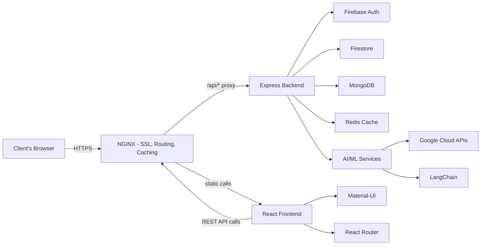
```mermaid
graph LR
    U[Client's Browser] -->|HTTPS| N[NGINX - SSL, Routing, Caching]
N -->|static calls| A[React Frontend]
N -->|/api/* proxy| B[Express Backend]
A -->|REST API calls| N

B --> C[Firebase Auth]
B --> D[Firestore]
B --> E[MongoDB]
B --> F[Redis Cache]
B --> G[AI/ML Services]

A --> H[Material-UI]
A --> I[React Router]

G --> J[Google Cloud APIs]
G --> K[LangChain]
```

Feel free to explore the app, upload documents, and interact with the AI! For architecture details, setup instructions, and more, please refer to the sections below, as well as the [ARCHITECTURE.md](ARCHITECTURE.md) file.

<h2 id="live-deployments">🚀 Live Deployments</h2>

> [!TIP]
> Access the live app at **[https://docuthinker.vercel.app/](https://docuthinker.vercel.app/) by clicking on the link or copying it into your browser! 🚀**

We have deployed the entire app on **Vercel** and **AWS**. You can access the live app **[here](https://docuthinker.vercel.app)**.

- **Frontend**: Deployed on **Vercel**. Access the live frontend **[here](https://docuthinker.vercel.app/)**. 
  - **Backup Frontend**: We have a backup of the frontend on **Netlify**. You can access the backup app **[here](https://docuthinker-ai-app.netlify.app/)**.
- **Backend**: Deployed on **Vercel**. You can access the live backend **[here](https://docuthinker-app-backend-api.vercel.app/)**. This will take you to the Swagger API documentation that allows you to test the API endpoints directly from the browser.
  - **Backup Backend API**: Deployed on **Render**. You can access the backup backend **[here](https://docuthinker-ai-app.onrender.com/)**.
  - **Optional AWS Deployment**: If you wish to deploy the backend on AWS, you can use the provided CloudFormation and CDK scripts in the `aws/` directory. It's a one-click deployment using AWS Fargate.
- **AI/ML Services**: Deployed on **AWS**, which are then used by the backend for document processing and analysis. To use the AI/ML services, simply visit the backend URL **[here](https://docuthinker-app-backend-api.vercel.app/)**.

> [!IMPORTANT]
> The backend server may take a few seconds to wake up if it has been inactive for a while. The first API call may take a bit longer to respond. Subsequent calls should be faster as the server warms up.

<h2 id="features">✨ Features</h2>

**DocuThinker** offers a wide range of features to help users manage and analyze their documents effectively. Here are some of the key features of the app:

- **Document Upload & Summarization**: Upload PDFs or Word documents for AI-generated summaries.
- **Key Insights & Discussion Points**: Generate important ideas and topics for discussion from your documents.
- **AI Chat Integration**: Chat with an AI using your document’s original context.
- **Voice Chat with AI**: Chat with an AI using voice commands for a more interactive experience.
- **Sentiment Analysis**: Analyze the sentiment of your document text for emotional insights.
- **Multiple Language Support**: Summarize documents in different languages for global users.
- **Content Rewriting**: Rewrite or rephrase document text based on a specific style or tone.
- **Actionable Recommendations**: Get actionable recommendations based on your document content.
- **Bullet Point Summaries**: Generate bullet point summaries for quick insights and understanding.
- **Document Categorization**: Categorize documents based on their content for easy organization.
- **Document Analytics**: View interactive and charts-powered analytics such as word count, reading time, sentiment distribution, and more!
- **Profile Management**: Update your profile information, social media links, and theme settings.
- **User Authentication**: Secure registration, login, and password reset functionality.
- **Document History**: View all uploaded documents and their details.
- **Mobile App Integration**: React Native mobile app for on-the-go document management.
- **Dark Mode Support**: Toggle between light and dark themes for better accessibility.
- **API Documentation**: Swagger (OpenAPI) documentation for all API endpoints.
- **Authentication Middleware**: Secure routes with JWT and Firebase authentication middleware.
- **Containerization**: Dockerized the app with Docker & K8s for easy deployment and scaling.
- **Continuous Integration**: Automated testing and deployment with GitHub Actions & Jenkins.
- **Load Balancing & Caching**: NGINX for load balancing and Redis for caching.
- **Zero Downtime Deployment**: Blue/Green & Canary deployment strategies on AWS.
- _and many more!_

<h2 id="technologies">⚙️ Technologies</h2>

DocuThinker is built with **120+ technologies** spanning frontend, backend, AI/ML, mobile, infrastructure, and DevOps. Below is the complete technology stack.

- **Frontend (Web)**:
  - **React 18.3**: JavaScript library for building user interfaces.
  - **Material-UI (MUI) 6**: React component library for UI development.
  - **Tailwind CSS**: Utility-first CSS framework for rapid styling.
  - **Emotion**: CSS-in-JS styling engine (used by MUI).
  - **Axios**: Promise-based HTTP client for API requests.
  - **React Router DOM 6**: Declarative client-side routing.
  - **Context API**: Built-in React state management.
  - **React Markdown / remark-gfm / rehype-katex / remark-math**: Markdown rendering with GitHub Flavored Markdown and LaTeX math.
  - **KaTeX**: Fast LaTeX math typesetting.
  - **Marked**: Markdown parser and compiler.
  - **pdfjs-dist**: PDF rendering and viewing in the browser.
  - **Mammoth**: DOCX-to-HTML document conversion.
  - **React Dropzone**: Drag-and-drop file upload component.
  - **React Helmet**: Document head management for SEO.
  - **Dropbox SDK**: Dropbox file import integration.
  - **Google API (gapi-script / react-oauth / react-google-picker)**: Google Drive and Picker integration.
  - **mic-recorder-to-mp3**: Audio recording for voice chat.
  - **Vercel Analytics & Speed Insights**: Frontend performance telemetry.
  - **Web Vitals**: Core Web Vitals performance metrics.
  - **Fontsource Poppins**: Self-hosted font loading.
  - **UUID**: Unique identifier generation.
  - **Craco**: Create React App Configuration Override for Webpack customization.
  - **Webpack**: Module bundler for JavaScript applications.
  - **Babel**: JavaScript transpilation (ES2015+ to browser-compatible code).
  - **Buffer / Crypto-browserify / Stream-browserify**: Node.js polyfills for the browser.
  - **Jest**: JavaScript testing framework.
  - **React Testing Library**: Component testing utilities.
  - **Prettier**: Code formatter.
  - **ESLint**: JavaScript/JSX linting with React plugin.
- **Backend (API Server)**:
  - **Node.js 18+**: JavaScript runtime for scalable network applications.
  - **Express 4**: Web application framework for Node.js.
  - **Firebase Admin SDK 12**: Server-side Firebase services.
  - **Firebase Authentication**: Secure user authentication.
  - **JWT (jsonwebtoken)**: Token-based authentication middleware.
  - **GraphQL / express-graphql / graphql-tools**: Flexible query API for data fetching.
  - **Redis 4**: In-memory data store for caching and session management.
  - **MongoDB**: NoSQL document database for user data.
  - **Multer / Busboy / Formidable**: Multi-part file upload handling.
  - **Mammoth**: DOCX-to-HTML conversion.
  - **pdf-parse**: PDF text extraction.
  - **Google APIs (googleapis)**: Google Drive, Docs, and Sheets integration.
  - **Google Generative AI SDK**: Gemini model integration.
  - **Sentiment (npm)**: Lightweight sentiment analysis.
  - **RabbitMQ (amqplib)**: Message broker for async task processing.
  - **Axios**: HTTP client for inter-service communication.
  - **CORS**: Cross-Origin Resource Sharing middleware.
  - **Dotenv**: Environment variable management.
  - **UUID**: Unique identifier generation.
  - **Serve Favicon**: Favicon middleware.
  - **Swagger JSDoc / Swagger UI Express**: Interactive API documentation.
  - **Nodemon**: Development auto-reload.
- **Orchestrator (Agentic Architecture)**:
  - **Anthropic AI SDK 0.39**: Claude model integration for the agent loop.
  - **Google Generative AI SDK**: Gemini model integration and failover.
  - **Model Context Protocol (MCP) SDK 1.12**: MCP server (13 tools) and client for agent interop.
  - **Zod 3.24**: Runtime schema validation for all AI outputs (12 schemas).
  - **Express 4**: HTTP server for orchestrator endpoints.
  - **Supervisor Pattern**: Intent classification, task DAG decomposition, parallel dispatch.
  - **Agent Loop (ReAct)**: Iterative tool-use cycle with up to 10 rounds.
  - **Circuit Breaker**: Per-provider fault tolerance (CLOSED / OPEN / HALF_OPEN).
  - **Cost Tracker**: Per-request token costing with daily/monthly budget enforcement.
  - **Dead Letter Queue**: Failed operation retry with manual inspection queue.
  - **Token Budget Manager**: Context window estimation for 7+ models with auto-compaction.
  - **Conversation Store**: In-memory history with auto-summarization and LRU eviction.
  - **Hybrid RAG**: Keyword (Redis) + semantic (Python) search with Reciprocal Rank Fusion.
  - **Prompt Cache Strategy**: 3-layer Anthropic prompt caching (system, document, history).
  - **14 Versioned System Prompts**: Covering all document operations, chat modes, and classification.
- **AI/ML Services (Python)**:
  - **FastAPI / Uvicorn**: High-performance async REST API server.
  - **Python 3.10+**: Core runtime.
  - **LangChain**: Document chunking, embeddings, and LLM orchestration.
  - **LangGraph**: Stateful agentic RAG pipeline (4-node state machine).
  - **CrewAI**: Multi-agent collaboration (Analyst → Cross-Referencer → Insights Curator).
  - **OpenAI GPT-4o / GPT-4o-mini**: Primary analysis and structured QA.
  - **Anthropic Claude 3.5 Sonnet / Haiku**: Insights curation and sentiment analysis.
  - **Google Gemini 1.5 Pro**: Cross-referencing and fact verification.
  - **FAISS (CPU)**: In-memory vector search for per-request RAG retrieval.
  - **ChromaDB**: Persistent on-disk vector store for cross-session semantic recall.
  - **Neo4j**: Knowledge graph database for document-topic relationship mapping.
  - **sentence-transformers (all-MiniLM-L6-v2)**: Local embedding generation.
  - **PyTorch**: Deep learning runtime for transformer models.
  - **Transformers (HuggingFace)**: Translation models and NLP pipelines.
  - **ONNX / ONNX Runtime / Optimum**: Model optimization and accelerated inference.
  - **Optuna**: Hyperparameter tuning for ML experiments.
  - **ROUGE Score**: Summarization quality metrics.
  - **Pandas**: Data processing and analysis.
  - **Matplotlib**: Data visualization.
  - **MCP Server (Python)**: 7-tool MCP server for external agent integration.
  - **Requests**: HTTP library for inter-service calls.
  - **Python-dotenv**: Environment variable management.
  - **NLP / NER / POS Tagging**: Named entity recognition and linguistic analysis.
  - **RAG**: Retrieval-Augmented Generation combining vector search with LLM inference.
  - **Google Cloud NLP API**: Machine learning models for text analysis.
  - **Google Speech-to-Text API**: Speech recognition for voice chat.
- **Database & Storage**:
  - **PostgreSQL**: Primary relational database (RDS Multi-AZ in production, Helm chart in-cluster).
  - **MongoDB**: NoSQL document store for user data.
  - **Firestore**: Cloud Firestore for real-time data sync.
  - **Redis**: In-memory cache and session store (ElastiCache in production).
  - **Neo4j**: Graph database for knowledge graphs.
  - **ChromaDB**: Vector database for embedding persistence.
  - **FAISS**: In-memory vector similarity search.
  - **Mongoose**: MongoDB object modeling for Node.js.
  - **Flyway**: Database schema migrations for PostgreSQL.
- **Mobile App**:
  - **React Native 0.74**: Cross-platform mobile framework.
  - **Expo 51**: Universal React application platform.
  - **Expo Router**: File-system based routing.
  - **React Navigation**: Stack and tab navigation.
  - **React Native Reanimated**: High-performance animations.
  - **React Native Gesture Handler**: Native gesture management.
  - **React Native Web**: React Native components for web browsers.
  - **React Native Safe Area Context**: Safe area insets.
  - **React Native Screens**: Native navigation primitives.
  - **Expo Vector Icons / Constants / Font / Linking / Splash Screen / Status Bar**: Expo SDK modules.
  - **Firebase SDK**: Authentication and real-time features.
  - **TypeScript**: Static type checking.
  - **Jest / Jest-Expo / React Test Renderer**: Mobile testing.
- **VS Code Extension**:
  - **TypeScript**: Extension development language.
  - **VS Code Extension API**: IDE integration for document analysis workflows.
  - **VSCE**: Extension packaging and publishing.
- **API Documentation**:
  - **Swagger / OpenAPI 3.0**: Interactive API docs for all endpoints.
  - **GraphiQL**: In-browser GraphQL query editor.
  - **Postman**: API development and testing collections.
- **Containerization & Orchestration**:
  - **Docker**: Multi-stage builds for all services (7 Dockerfiles: frontend, backend, orchestrator, AI/ML, NGINX, mobile, devcontainer).
  - **Docker Compose**: Local multi-service orchestration.
  - **Kubernetes 1.28+**: Container orchestration with Deployments, Services, Ingress, PDBs, NetworkPolicies.
  - **Helm 3.13+**: Kubernetes package management (PostgreSQL, Redis, custom charts).
  - **ArgoCD**: GitOps-based continuous deployment with Application and AppProject CRDs.
  - **Devcontainer**: VS Code remote container development environment.
- **Service Mesh & Networking**:
  - **Istio 1.20**: Service mesh with mTLS, sidecar injection, traffic management, authorization policies.
  - **Envoy**: High-performance proxy sidecar (embedded in Istio).
  - **NGINX Ingress Controller**: Reverse proxy, rate limiting, TLS termination, load balancing.
  - **Kiali**: Service mesh observability dashboard.
  - **cert-manager**: Automated Let's Encrypt TLS certificate provisioning.
- **Cloud Infrastructure (AWS)**:
  - **Terraform 1.5+**: Infrastructure as Code with S3/DynamoDB state backend.
  - **EKS (Elastic Kubernetes Service)**: Managed Kubernetes cluster.
  - **VPC**: Multi-AZ networking with public/private subnets.
  - **RDS**: Managed PostgreSQL (Multi-AZ production).
  - **ElastiCache**: Managed Redis cluster.
  - **S3**: Object storage (uploads, backups, Terraform state) with lifecycle policies.
  - **CloudFront**: CDN for frontend asset delivery.
  - **WAF (Web Application Firewall)**: Rate limiting and geo-blocking.
  - **Secrets Manager**: Credential and secret management.
  - **CloudWatch**: Monitoring, logging, and alerting.
  - **AWS Backup**: Automated RDS and S3 backup schedules.
  - **ECS Fargate**: Serverless container execution (CloudFormation-based).
  - **IAM / IRSA**: Fine-grained service account permissions.
- **Monitoring & Observability**:
  - **Prometheus**: Metrics collection with Prometheus Operator, Node Exporter, and kube-state-metrics.
  - **Grafana**: Dashboards and visualization with Loki integration.
  - **Jaeger**: Distributed tracing with Elasticsearch backend.
  - **Zipkin**: Distributed tracing (OpenTelemetry receiver).
  - **Loki**: Log aggregation.
  - **ELK Stack (Elasticsearch, Logstash, Kibana)**: Centralized logging, processing, and search.
  - **OpenTelemetry Collector**: Unified traces, metrics, and logs pipeline (OTLP, Jaeger, Zipkin, Prometheus receivers).
  - **Coralogix**: Unified SaaS observability platform with TCO optimization — receives logs, metrics, and traces via OTel OTLP/gRPC; Fluent Bit DaemonSet for node-level log shipping; Prometheus remote write for metric correlation; 12 production alerts; recording rules; TCO cost policies; Terraform-managed via `coralogix/coralogix` provider.
  - **AlertManager**: Alert routing with Slack and PagerDuty integrations.
  - **SLI/SLO Monitoring**: Prometheus recording rules for availability and latency tracking.
- **Security & Compliance**:
  - **HashiCorp Vault 1.15**: Secrets management with HA Raft storage, AWS KMS seal, CSI provider.
  - **External Secrets Operator**: Syncs secrets from Vault and AWS Secrets Manager into Kubernetes.
  - **Falco 0.36**: Runtime security monitoring with eBPF driver, custom rules, Falcosidekick alerting.
  - **OPA Gatekeeper 3.14**: Policy-as-code enforcement with constraint templates, mutation webhooks, and audit logging.
  - **Trivy**: Container image and filesystem vulnerability scanning.
  - **SonarQube 10.4 Enterprise**: Static code analysis with multi-module scanning (frontend, backend, orchestrator, AI/ML), quality gates (14 conditions), custom quality profiles for JS/TS/Python, coverage tracking ≥70%, and security hotspot review.
  - **Snyk**: Continuous vulnerability management — open source dependency scanning, container image scanning with license compliance (GPL/AGPL blocked), Infrastructure as Code analysis (Terraform/K8s/Helm), SAST code analysis, and in-cluster Kubernetes controller for runtime workload monitoring.
- **Progressive Delivery & Autoscaling**:
  - **Flagger 1.34**: Automated canary deployments with Istio and Prometheus analysis.
  - **KEDA 2.12**: Event-driven pod autoscaling (2–10 replicas).
  - **HPA (Horizontal Pod Autoscaler)**: CPU/memory-based pod scaling.
  - **Blue/Green Deployments**: Zero-downtime release strategy via Jenkins pipelines.
  - **Canary Deployments**: Gradual traffic shifting with automated rollback.
- **Chaos Engineering**:
  - **Litmus Chaos**: Resilience testing platform with pod-delete, cpu-hog, memory-hog, network-latency, network-loss, container-kill, disk-fill, node-drain, and AWS-specific chaos experiments (ec2-terminate, ebs-loss, az-outage).
- **Backup & Disaster Recovery**:
  - **Velero**: Kubernetes cluster backup and restore.
  - **AWS Backup**: Managed backup for RDS and S3.
  - **S3 Versioning + Glacier Lifecycle**: Long-term archival with automated transitions.
- **CI/CD & Deployment**:
  - **GitHub Actions**: Primary CI pipeline (lint, test, coverage, Docker build & push to GHCR, deploy).
  - **GitLab CI**: Multi-stage pipeline (pre-check, build, test, security, package, deploy, post-deploy, cleanup).
  - **CircleCI**: Orb-based pipeline (Node, Python, AWS-EKS, Docker, SonarCloud, k6).
  - **Jenkins**: Multi-stage pipeline with canary and blue/green deployment stages.
  - **SonarQube / SonarCloud**: Static code analysis and quality gates.
  - **GHCR (GitHub Container Registry)**: Docker image registry.
  - **Vercel**: Frontend hosting with analytics.
  - **Render**: Backend hosting (fallback).
  - **Netlify**: Frontend hosting (backup).
- **Testing & Quality**:
  - **Jest**: Unit and integration testing (frontend, backend, orchestrator, mobile).
  - **React Testing Library**: Component testing with user-event simulation.
  - **Supertest**: HTTP endpoint testing.
  - **pytest**: Python test framework for AI/ML services.
  - **k6**: Load and performance testing (baseline, stress, spike, soak, breakpoint scenarios).
  - **ESLint**: JavaScript/TypeScript linting.
  - **Prettier**: Code formatting.
  - **Postman**: API development and testing.

> For a comprehensive deep-dive into the AI/ML architecture with visual diagrams, see [**AI_ML.md**](AI_ML.md).

<p align="center">

  <!-- 🔤 Languages & Runtimes -->
  
  
  
  
  
  

  <!-- 🖥️ Frontend (Web) -->
  
  
  
  
  
  
  
  
  
  
  
  
  
  
  
  
  

  <!-- 📱 Mobile -->
  
  
  
  
  

  <!-- ⚙️ Backend & API -->
  
  
  
  
  
  
  
  

  <!-- 🤖 Orchestrator & AI Agents -->
  
  
  

  <!-- 🧠 AI/ML & LLMs -->
  
  
  
  
  
  
  
  
  
  
  
  
  
  
  
  
  
  

  <!-- 🗄️ Databases & Vector Stores -->
  
  
  
  
  
  
  
  
  

  <!-- 🏗️ Infrastructure & Containers -->
  
  
  
  
  
  
  

  <!-- ☁️ AWS Cloud -->
  
  
  
  
  
  
  
  
  
  
  

  <!-- 🔗 Service Mesh & Networking -->
  
  
  
  
  

  <!-- 📊 Monitoring & Observability -->
  
  
  
  
  
  
  
  
  
  
  

  <!-- 🔒 Security & Compliance -->
  
  
  
  
  
  
  

  <!-- 🔄 Progressive Delivery & Resilience -->
  
  
  
  

  <!-- 🚀 CI/CD & Hosting -->
  
  
  
  
  
  
  
  
  

  <!-- 📖 API Documentation -->
  
  
  
  

  <!-- 🧪 Testing & Quality -->
  
  
  
  
  
  
  

  <!-- 🔧 Developer Tools -->
  
  
</p>

<h2 id="user-interface">🖼️ User Interface</h2>

**DocuThinker** features a clean and intuitive user interface designed to provide a seamless experience for users. The app supports both light and dark themes, responsive design, and easy navigation. Here are some screenshots of the app:

### **Landing Page**

<p align="center">
  
</p>

### **Document Upload Page**

<p align="center">
  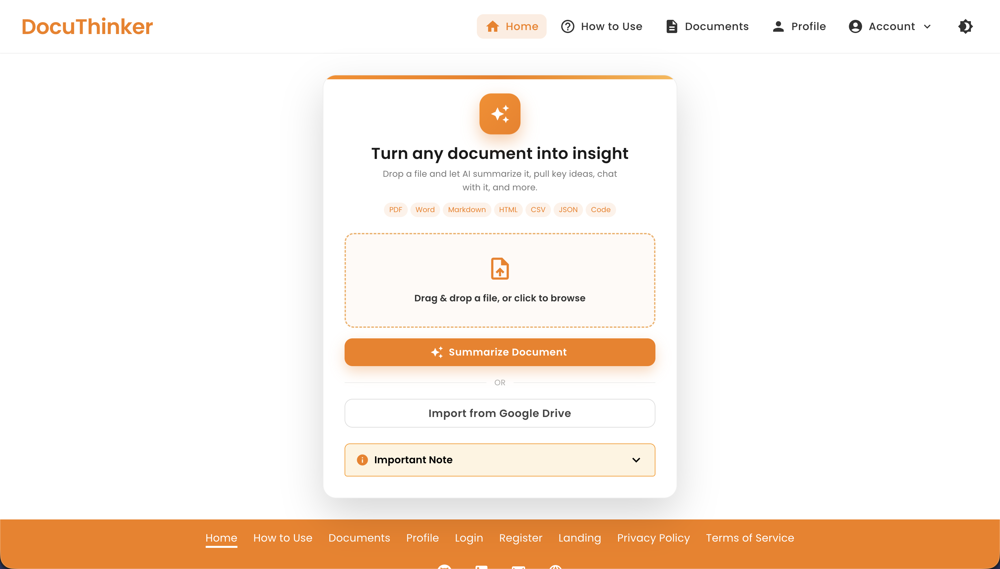
</p>

### **Document Upload Page - Dark Mode**

<p align="center">
  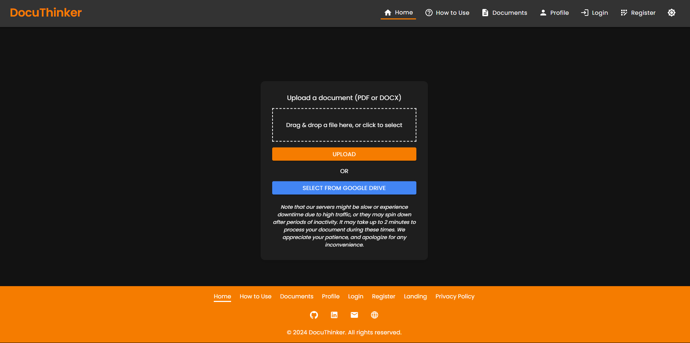
</p>

### **Document Upload Page - Document Uploaded**

<p align="center">
  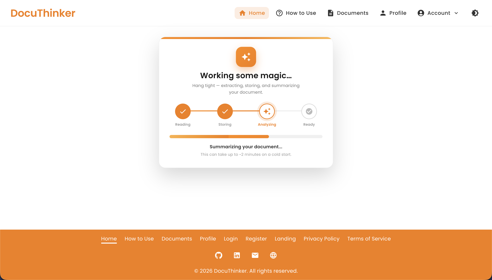
</p>

### **Google Drive Document Selection**

<p align="center">
  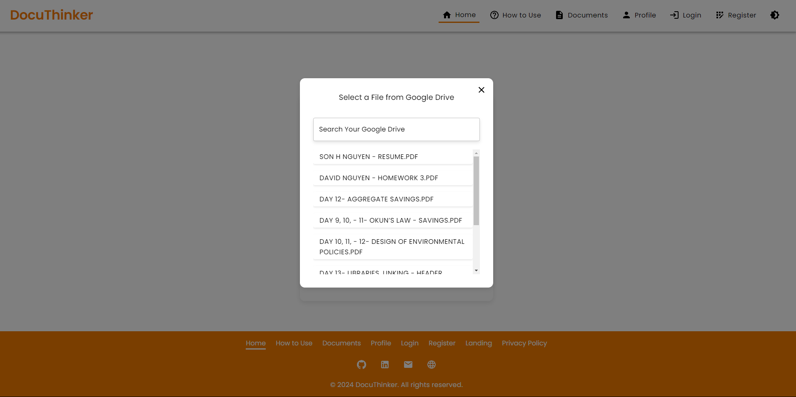
</p>

### **Home Page**

<p align="center">
  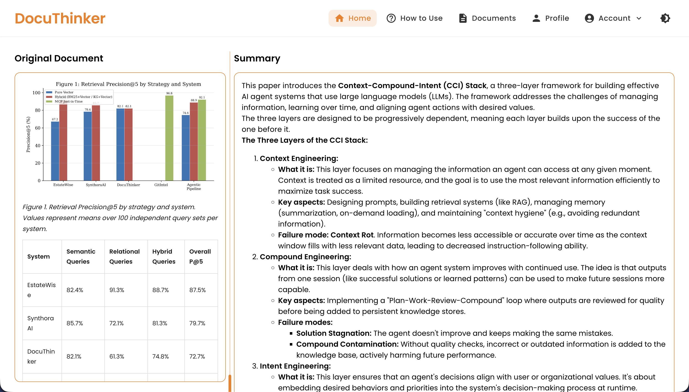
</p>

### **Home Page - Dark Mode**

<p align="center">
  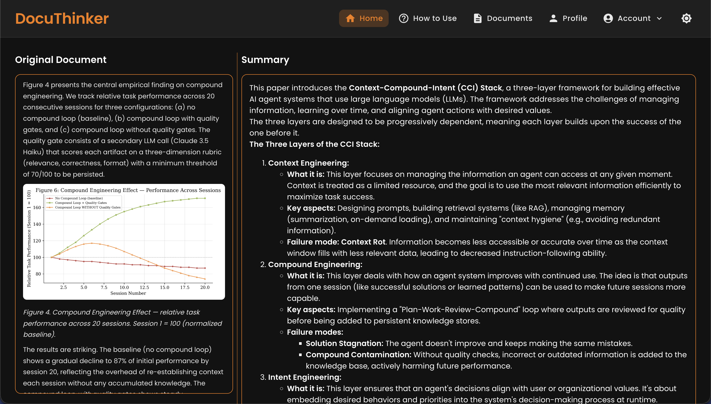
</p>

### **Chat Modal**

<p align="center">
  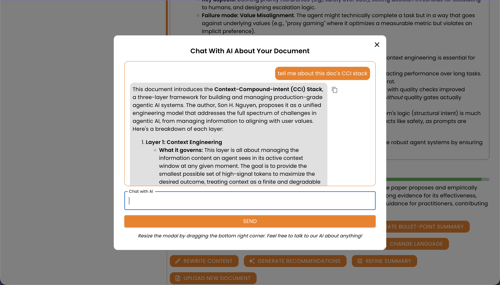
</p>

### **Chat Modal - Dark Mode**

<p align="center">
  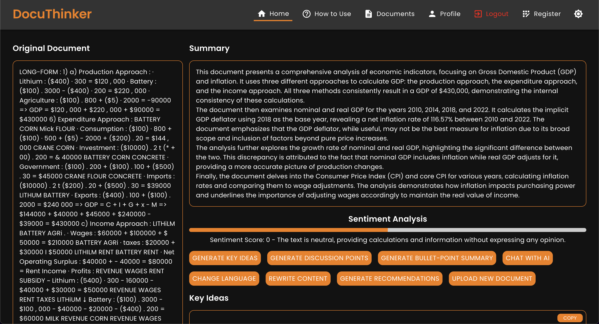
</p>

### **Document Analytics**

<p align="center">
  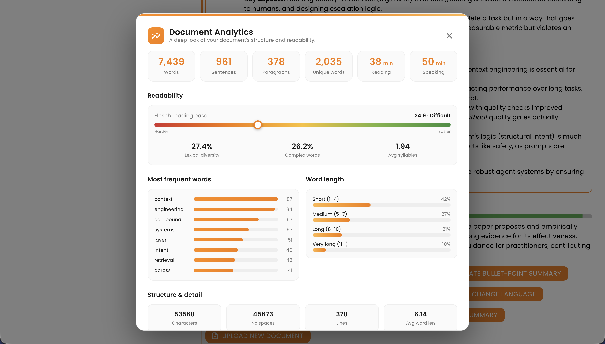
</p>

### **Documents Page**

<p align="center">
  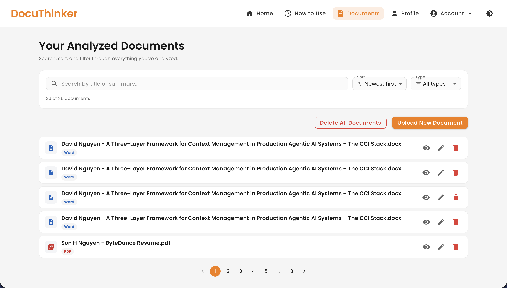
</p>

### **Documents Page - Dark Mode**

<p align="center">
  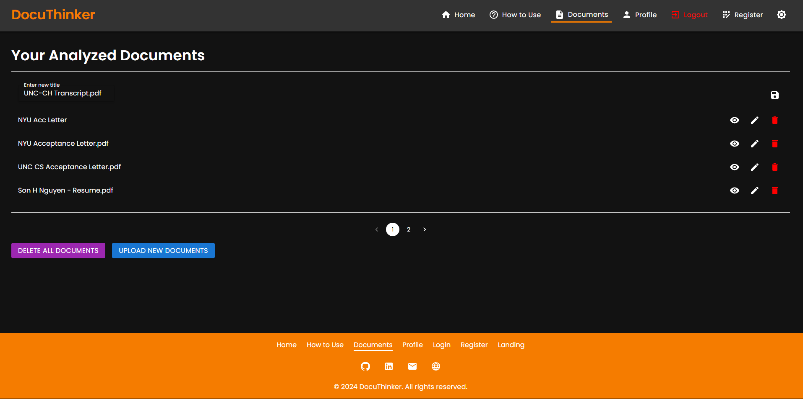
</p>

### **Document Page - Search Results**

<p align="center">
  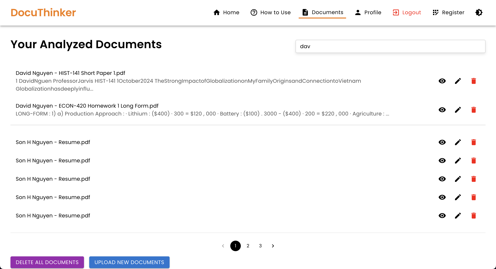
</p>

### **Profile Page**

<p align="center">
  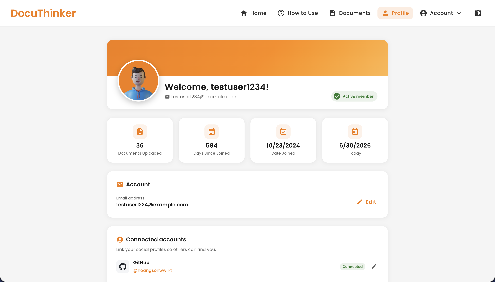
</p>

### **Profile Page - Dark Mode**

<p align="center">
  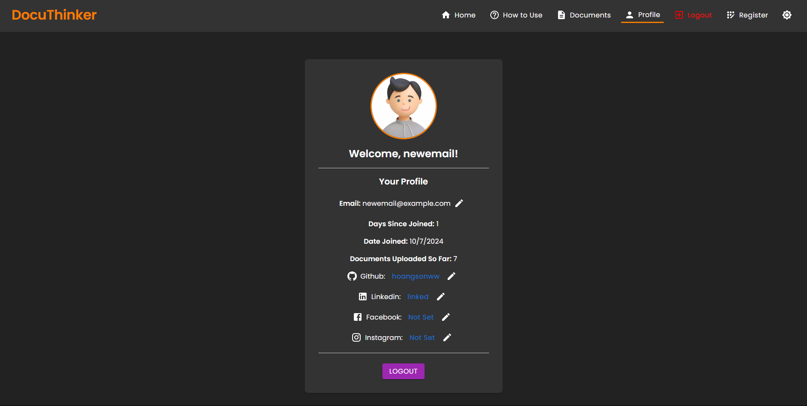
</p>

### **How To Use Page**

<p align="center">
  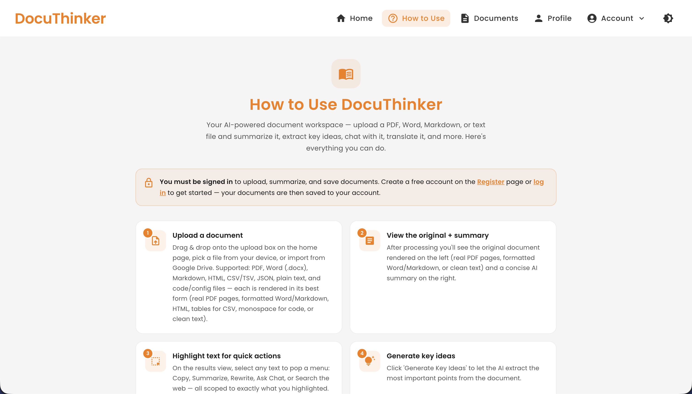
</p>

### **Login Page**

<p align="center">
  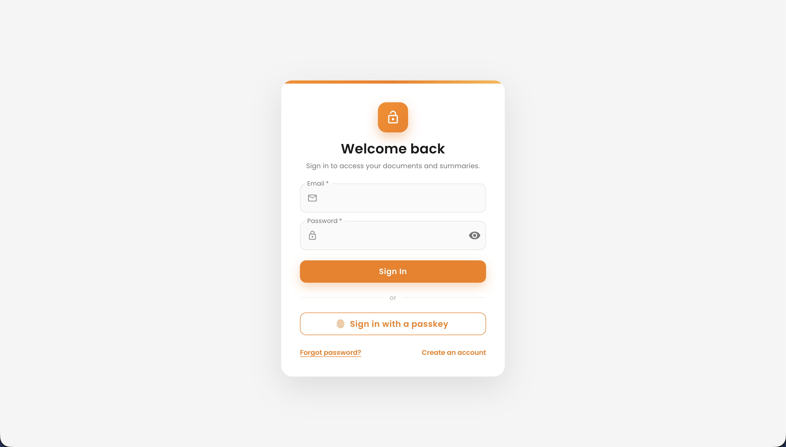
</p>

### **Registration Page**

<p align="center">
  
</p>

### **Forgot Password Page**

<p align="center">
  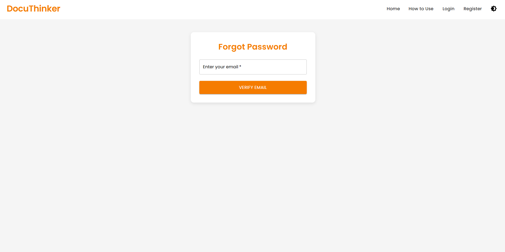
</p>

### **Mobile App's View**

<p align="center">
  
</p>

<p align="center">
  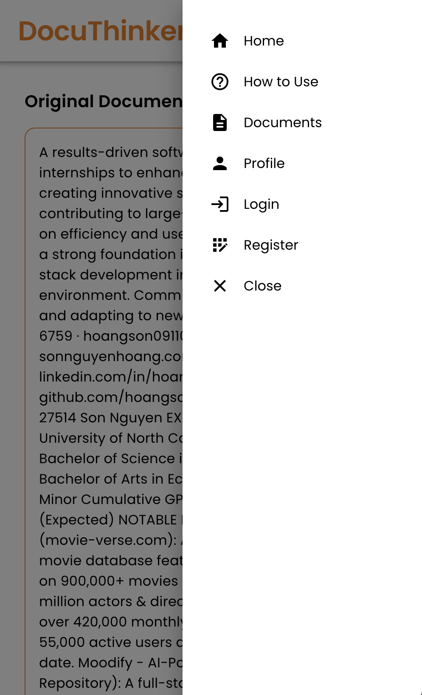
</p>

<h2 id="complete-file-structure">📂 Complete File Structure</h2>

The **DocuThinker** app is organized into separate subdirectories for the frontend, backend, and mobile app. Each directory contains the necessary files and folders for the respective components of the app. Here is the complete file structure of the app:

```
DocuThinker-AI-App/
├── .beads/                           # Beads task coordination system
│   ├── .status.json                  # Agent reservations & active bead tracking
│   ├── README.md                     # Beads workflow quick-reference
│   ├── active/                       # Beads available for agents to pick up
│   ├── completed/                    # Archive of finished beads
│   └── templates/
│       └── feature-bead.md           # Template for new feature beads
├── .agent-sessions/                  # Agent session history & coordination
│   ├── README.md                     # Session management guide
│   ├── SCHEMA.md                     # Session data structure specification
│   ├── config.json                   # Session configuration
│   ├── active/                       # Sessions currently in progress
│   ├── completed/                    # Archived finished sessions
│   └── templates/
│       ├── session-log.md            # Standard session log template
│       ├── handoff-report.md         # Agent-to-agent handoff template
│       └── escalation-report.md      # Conflict / blocker escalation template
├── .claude/                          # Claude Code workspace settings
├── .mcp.json                         # MCP server configuration
├── AGENTS.md                         # Agent behavior instructions
├── CLAUDE.md                         # Claude Code project instructions
├── ai_ml/                            # AI/ML pipelines & services directory (Python)
├── orchestrator/                     # Agentic orchestration layer (Node.js)
│   ├── core/
│   │   ├── supervisor.js             # Intent classification, decomposition, dispatch
│   │   ├── circuit-breaker.js        # Per-provider circuit breaker state machine
│   │   ├── agent-loop.js             # Iterative tool-use agent loop
│   │   ├── handoff.js                # Cross-agent context transfer
│   │   ├── batch-processor.js        # Concurrent batch document processing
│   │   ├── cost-tracker.js           # Token cost tracking with budget limits
│   │   ├── dlq.js                    # Dead letter queue with retry logic
│   │   ├── python-bridge.js          # HTTP bridge to Python AI/ML service
│   │   ├── providers.js              # Unified LLM client (Claude + Gemini)
│   │   └── tool-registry.js          # Tool registration and dispatch
│   ├── context/
│   │   ├── token-budget.js           # Context window management
│   │   ├── conversation-store.js     # Auto-summarizing conversation memory
│   │   ├── observability.js          # OTel-compatible context metrics
│   │   └── hybrid-rag.js             # Keyword + semantic search with RRF
│   ├── prompts/
│   │   ├── system-prompts.js         # 14 versioned system prompts
│   │   └── cache-strategy.js         # 3-layer Anthropic prompt caching
│   ├── schemas/
│   │   └── ai-outputs.js             # 12 Zod validation schemas
│   ├── mcp/
│   │   ├── server.js                 # MCP server exposing 13 tools
│   │   └── client.js                 # MCP client for external servers
│   ├── __tests__/
│   │   └── orchestrator.test.js      # Integration tests (Jest)
│   ├── Dockerfile                    # Production container (node:20-alpine)
│   ├── package.json                  # Dependencies and scripts
│   └── index.js                      # Express server entry point (port 4000)
│
├── backend/
│   ├── middleware/
│   │   └── jwt.js                    # Authentication middleware with JWT for the app's backend
│   ├── controllers/
│   │   └── controllers.js            # Controls the flow of data and logic
│   ├── graphql/
│   │   ├── resolvers.js              # Resolvers for querying data from the database
│   │   └── schema.js                 # GraphQL schema for querying data from the database
│   ├── models/
│   │   └── models.js                 # Data models for interacting with the database
│   ├── services/
│   │   └── services.js               # Models for interacting with database and AI/ML services
│   ├── views/
│   │   └── views.js                  # Output formatting for success and error responses
│   ├── redis/
│   │   └── redisClient.js            # Redis client for caching data in-memory
│   ├── swagger/
│   │   └── swagger.js                # Swagger documentation for API endpoints
│   ├── .env                          # Environment variables (git-ignored)
│   ├── firebase-admin-sdk.json       # Firebase Admin SDK credentials (git-ignored)
│   ├── index.js                      # Main entry point for the server
│   ├── Dockerfile                    # Docker configuration file
│   ├── manage_server.sh              # Shell script to manage and start the backend server
│   └── README.md                     # Backend README file
│
├── frontend/
│   ├── public/
│   │   ├── index.html                # Main HTML template
│   │   └── manifest.json             # Manifest for PWA settings
│   ├── src/
│   │   ├── assets/                   # Static assets like images and fonts
│   │   │   └── logo.png              # App logo or images
│   │   ├── components/
│   │   │   ├── ChatModal.js          # Chat modal component
│   │   │   ├── Spinner.js            # Loading spinner component
│   │   │   ├── UploadModal.js        # Document upload modal component
│   │   │   ├── Navbar.js             # Navigation bar component
│   │   │   ├── Footer.js             # Footer component
│   │   │   └── GoogleAnalytics.js    # Google Analytics integration component
│   │   ├── pages/
│   │   │   ├── Home.js               # Home page where documents are uploaded
│   │   │   ├── LandingPage.js        # Welcome and information page
│   │   │   ├── Login.js              # Login page
│   │   │   ├── Register.js           # Registration page
│   │   │   ├── ForgotPassword.js     # Forgot password page
│   │   │   └── HowToUse.js           # Page explaining how to use the app
│   │   ├── App.js                    # Main App component
│   │   ├── index.js                  # Entry point for the React app
│   │   ├── App.css                   # Global CSS 1
│   │   ├── index.css                 # Global CSS 2
│   │   ├── reportWebVitals.js        # Web Vitals reporting
│   │   ├── styles.css                # Custom styles for different components
│   │   └── config.js                 # Configuration file for environment variables
│   ├── .env                          # Environment variables file (e.g., REACT_APP_BACKEND_URL)
│   ├── package.json                  # Project dependencies and scripts
│   ├── craco.config.js               # Craco configuration file
│   ├── Dockerfile                    # Docker configuration file
│   ├── manage_frontend.sh            # Shell script for managing and starting the frontend
│   ├── README.md                     # Frontend README file
│   └── package.lock                  # Lock file for dependencies
│
├── mobile-app/                       # Mobile app directory
│   ├── app/                          # React Native app directory
│   ├── .env                          # Environment variables file for the mobile app
│   ├── app.json                      # Expo configuration file
│   ├── components/                   # Reusable components for the mobile app
│   ├── assets/                       # Static assets for the mobile app
│   ├── constants/                    # Constants for the mobile app
│   ├── hooks/                        # Custom hooks for the mobile app
│   ├── scripts/                      # Scripts for the mobile app
│   ├── babel.config.js               # Babel configuration file
│   ├── package.json                  # Project dependencies and scripts
│   └── tsconfig.json                 # TypeScript configuration file
│
├── aws/                              # AWS deployment assets (ECR/ECS/CloudFormation/CDK)
│   ├── README.md
│   ├── cloudformation/
│   │   └── fargate-service.yaml      # Reference Fargate stack for backend + ai_ml services
│   ├── infrastructure/
│   │   ├── cdk-app.ts                # CDK entrypoint
│   │   └── lib/docuthinker-stack.ts  # CDK stack definition
│   └── scripts/
│       └── local-env.sh              # Helper to mirror production env vars locally
│ 
├── kubernetes/                       # Kubernetes configuration files
│   ├── manifests/                    # Kubernetes manifests for deployment, service, and ingress
│   ├── backend-deployment.yaml       # Deployment configuration for the backend
│   ├── backend-service.yaml          # Service configuration for the backend
│   ├── frontend-deployment.yaml      # Deployment configuration for the frontend
│   ├── frontend-service.yaml         # Service configuration for the frontend
│   ├── firebase-deployment.yaml      # Deployment configuration for Firebase
│   ├── firebase-service.yaml         # Service configuration for Firebase
│   └── configmap.yaml                # ConfigMap configuration for environment variables
│
├── nginx/
│   ├── nginx.conf                    # NGINX configuration file for load balancing and caching
│   └── Dockerfile                    # Docker configuration file for NGINX
│
├── images/                           # Images for the README
├── .env                              # Environment variables file for the whole app
├── docker-compose.yml                # Docker Compose file for containerization
├── jsconfig.json                     # JavaScript configuration file
├── package.json                      # Project dependencies and scripts
├── package-lock.json                 # Lock file for dependencies
├── postcss.config.js                 # PostCSS configuration file
├── tailwind.config.js                # Tailwind CSS configuration file
├── render.yaml                       # Render configuration file
├── vercel.json                       # Vercel configuration file
├── openapi.yaml                      # OpenAPI specification for API documentation
├── manage_docuthinker.sh             # Shell script for managing and starting the app (both frontend & backend)
├── .gitignore                        # Git ignore file
├── LICENSE.md                        # License file for the project
├── README.md                         # Comprehensive README for the whole app
└── (and many more files...)          # Additional files and directories not listed here
```

<h2 id="getting-started">🛠️ Getting Started</h2>

### **Prerequisites**

Ensure you have the following tools installed:

- **Node.js** (between v14 and v20)
- **npm** or **yarn**
- **Firebase Admin SDK** credentials
- **Redis** for caching
- **MongoDB** for data storage
- **RabbitMQ** for handling asynchronous tasks
- **Docker** for containerization (optional)
- **Postman** for API testing (optional)
- **Expo CLI** for running the mobile app
- **Jenkins** for CI/CD (optional)
- **Kubernetes** for container orchestration (optional)
- **React Native CLI** for building the mobile app
- **Firebase SDK** for mobile app integration
- **Firebase API Keys and Secrets** for authentication
- **Expo Go** app for testing the mobile app on a physical device
- **Tailwind CSS** for styling the frontend
- **.env** file with necessary API keys (You can contact me to get the `.env` file - but you should obtain your own API keys for production).

Additionally, **basic fullstack development knowledge and AI/ML concepts** are recommended to understand the app's architecture and functionalities.

### **Frontend Installation**

1. **Clone the repository**:

   ```bash
   git clone https://github.com/hoangsonww/DocuThinker-AI-App.git
   cd DocuThinker-AI-App/backend
   ```

2. **Navigate to the frontend directory**:

   ```bash
   cd frontend
   ```

3. **Install dependencies**:

   ```bash
   npm install
   ```

   Or `npm install --legacy-peer-deps` if you face any peer dependency issues.

4. **Start the Frontend React app**:
   ```bash
   npm start
   ```
5. **Build the Frontend React app (for production)**:

   ```bash
   npm run build
   ```

6. **Alternatively, you can use `yarn` to install dependencies and run the app**:
   ```bash
   yarn install
   yarn start
   ```
7. **Or, for your convenience, if you have already installed the dependencies, you can directly run the app in the root directory using**:

   ```bash
   npm run frontend
   ```

   This way, you don't have to navigate to the `frontend` directory every time you want to run the app.

8. **The app's frontend will run on `http://localhost:3000`**. You can now access it in your browser.

### **Backend Installation**

> [!NOTE]
> Note that this is optional since we are deploying the backend on **Render**. However, you can (and should) run the backend locally for development purposes.

1. **Navigate to the root (not `backend`) directory**:
   ```bash
   cd backend
   ```
   
2. **Install dependencies**:
   ```bash
   npm install
   ```

   Or `npm install --legacy-peer-deps` if you face any peer dependency issues.

3. **Start the backend server**:
   ```bash
   npm run server
   ```
   
4. **The backend server will run on `http://localhost:3000`**. You can access the API endpoints in your browser or **Postman**.
5. **Additionally, the backend code is in the `backend` directory**. Feel free to explore the API endpoints and controllers.

> [!CAUTION]
> **Note:** Be sure to use Node v.20 or earlier to avoid compatibility issues with Firebase Admin SDK.

### **Running the Mobile App**

1. **Navigate to the mobile app directory**:
   ```bash
   cd mobile-app
   ```
2. **Install dependencies**:
   ```bash
    npm install
   ```
3. **Start the Expo server**:
   ```bash
   npx expo start
   ```
4. **Run the app on an emulator or physical device**: Follow the instructions in the terminal to run the app on an emulator or physical device.

<h2 id="api-endpoints">📋 API Endpoints</h2>

The backend of **DocuThinker** provides several API endpoints for user authentication, document management, and AI-powered insights. These endpoints are used by the frontend to interact with the backend server:

| **Method** | **Endpoint**                         | **Description**                                                                                     |
|------------|--------------------------------------|-----------------------------------------------------------------------------------------------------|
| POST       | `/register`                          | Register a new user in Firebase Authentication and Firestore, saving their email and creation date. |
| POST       | `/login`                             | Log in a user and return a custom token along with the user ID.                                     |
| POST       | `/upload`                            | Upload a document for summarization. If the user is logged in, the document is saved in Firestore.  |
| POST       | `/generate-key-ideas`                | Generate key ideas from the document text.                                                          |
| POST       | `/generate-discussion-points`        | Generate discussion points from the document text.                                                  |
| POST       | `/chat`                              | Chat with AI using the original document text as context.                                           |
| POST       | `/forgot-password`                   | Reset a user's password in Firebase Authentication.                                                 |
| POST       | `/verify-email`                      | Verify if a user's email exists in Firestore.                                                       |
| GET        | `/documents/{userId}`                | Retrieve all documents associated with the given `userId`.                                          |
| GET        | `/documents/{userId}/{docId}`        | Retrieve a specific document by `userId` and `docId`.                                               |
| GET        | `/document-details/{userId}/{docId}` | Retrieve document details (title, original text, summary) by `userId` and `docId`.                  |
| DELETE     | `/delete-document/{userId}/{docId}`  | Delete a specific document by `userId` and `docId`.                                                 |
| DELETE     | `/delete-all-documents/{userId}`     | Delete all documents associated with the given `userId`.                                            |
| POST       | `/update-email`                      | Update a user's email in both Firebase Authentication and Firestore.                                |
| POST       | `/update-password`                   | Update a user's password in Firebase Authentication.                                                |
| GET        | `/days-since-joined/{userId}`        | Get the number of days since the user associated with `userId` joined the service.                  |
| GET        | `/document-count/{userId}`           | Retrieve the number of documents associated with the given `userId`.                                |
| GET        | `/user-email/{userId}`               | Retrieve the email of a user associated with `userId`.                                              |
| POST       | `/update-document-title`             | Update the title of a document in Firestore.                                                        |
| PUT        | `/update-theme`                      | Update the theme of the app.                                                                        |
| GET        | `/user-joined-date/{userId}`         | Get date when the user associated with `userId` joined the service.                                 |
| GET        | `/social-media/{userId}`             | Get the social media links of the user associated with `userId`.                                    |
| POST       | `/update-social-media`               | Update the social media links of the user associated with `userId`.                                 |
| POST       | `/update-profile`                    | Update the user's profile information.                                                              |
| POST       | `/update-document/{userId}/{docId}`  | Update the document details in Firestore.                                                           |
| POST       | `/update-document-summary`           | Update the summary of a document in Firestore.                                                      |
| POST       | `/sentiment-analysis`                | Analyzes the sentiment of the provided document text                                                |
| POST       | `/bullet-summary`                    | Generates a summary of the document text in bullet points                                           |
| POST       | `/summary-in-language`               | Generates a summary in the specified language                                                       |
| POST       | `/content-rewriting`                 | Rewrites or rephrases the provided document text based on a style                                   |
| POST       | `/actionable-recommendations`        | Generates actionable recommendations based on the document text                                     |
| GET        | `/graphql`                           | GraphQL endpoint for querying data from the database                                                |

More API endpoints will be added in the future to enhance the functionality of the app. Feel free to explore the existing endpoints and test them using **Postman** or **Insomnia**.

> [!NOTE]
> This list is not exhaustive. For a complete list of API endpoints, please refer to the **Swagger** or **Redoc** documentation of the backend server.

### API Documentation

- **Swagger Documentation**: You can access the Swagger documentation for all API endpoints by running the backend server and navigating to `http://localhost:5000/api-docs`.
- **Redoc Documentation**: You can access the Redoc documentation for all API endpoints by running the backend server and navigating to `http://localhost:5000/api-docs/redoc`.

For example, our API endpoints documentation looks like this:

<p align="center">
  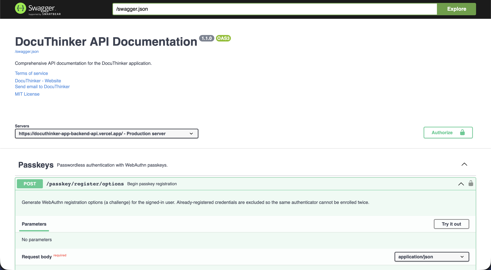
</p>

Additionally, we also offer API file generation using **OpenAPI**. You can generate API files using the **OpenAPI** specification. Here is how:

```bash
npx openapi-generator-cli generate -i http://localhost:5000/api-docs -g typescript-fetch -o ./api
```

This will generate TypeScript files for the API endpoints in the `api` directory. Feel free to replace or modify the command as needed.

### **API Architecture**

- We use **Node.js** and **Express** to build the backend server for **DocuThinker**.
- The backend API is structured using **Express** and **Firebase Admin SDK** for user authentication and data storage.
- We use the MVC (Model-View-Controller) pattern to separate concerns and improve code organization.
  - **Models**: Schema definitions for interacting with the database.
  - **Controllers**: Handle the business logic and interact with the models.
  - **Views**: Format the output and responses for the API endpoints.
  - **Services**: Interact with the database and AI/ML services for document analysis and summarization.
  - **Middlewares**: Secure routes with Firebase authentication and JWT middleware.
- The API endpoints are designed to be RESTful and follow best practices for error handling and response formatting.
- The **Microservices Architecture** is also used to handle asynchronous tasks and improve scalability.
- The API routes are secured using Firebase authentication middleware to ensure that only authenticated users can access the endpoints.
- The API controllers handle the business logic for each route, interacting with the data models and formatting the responses.

### **API Testing**

- You can test the API endpoints using **Postman** or **Insomnia**. Simply make a POST request to the desired endpoint with the required parameters.
- For example, you can test the `/upload` endpoint by sending a POST request with the document file as a form-data parameter.
- Feel free to test all the API endpoints and explore the functionalities of the app.

#### Example Request to Register a User:

```bash
curl --location --request POST 'http://localhost:3000/register' \
--header 'Content-Type: application/json' \
--data-raw '{
    "email": "test@example.com",
    "password": "password123"
}'
```

#### Example Request to Upload a Document:

```bash
curl --location --request POST 'http://localhost:3000/upload' \
--header 'Authorization: Bearer <your-token>' \
--form 'File=@"/path/to/your/file.pdf"'
```

### **Error Handling**

The backend APIs uses centralized error handling to capture and log errors. Responses for failed requests are returned with a proper status code and an error message:

```json
{
  "error": "An internal error occurred",
  "details": "Error details go here"
}
```

<h2 id="ai-ml-agentic-platform">🤖 AI/ML Agentic Platform</h2>

DocuThinker employs a **two-layer agentic architecture** that separates orchestration concerns (Node.js) from AI/ML execution (Python), connected by a resilient bridge with circuit breakers, cost controls, and full observability.

### Architecture Overview

| Layer | Technology | Port | Responsibility |
|-------|-----------|------|----------------|
| **Orchestrator** | Node.js 18+ / Express | `4000` | Supervisor routing, agent loops, tool dispatch, cost tracking, MCP |
| **AI/ML Backend** | Python / FastAPI | `8000` | LLM inference, RAG pipelines, NER, CrewAI multi-agent, vector/graph stores |

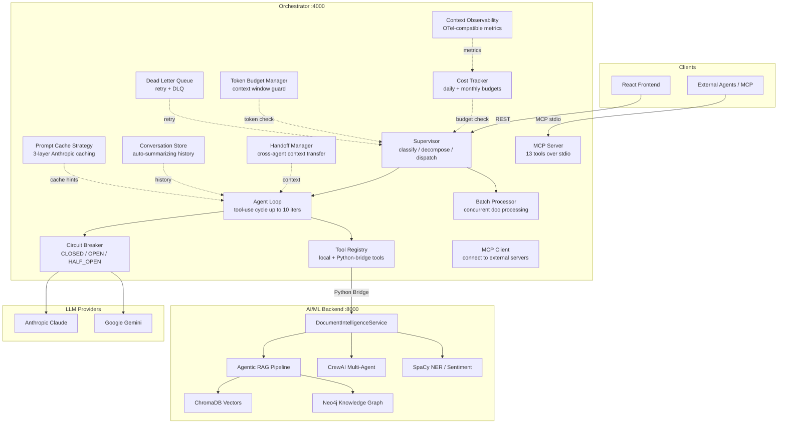
```mermaid
graph TB
    subgraph "Clients"
        WEB[React Frontend]
        EXT[External Agents / MCP]
    end

    subgraph "Orchestrator :4000"
        SUP[Supervisor<br/>classify / decompose / dispatch]
        AL[Agent Loop<br/>tool-use cycle up to 10 iters]
        CB[Circuit Breaker<br/>CLOSED / OPEN / HALF_OPEN]
        CT[Cost Tracker<br/>daily + monthly budgets]
        BP[Batch Processor<br/>concurrent doc processing]
        DLQ[Dead Letter Queue<br/>retry + DLQ]
        HO[Handoff Manager<br/>cross-agent context transfer]
        TR[Tool Registry<br/>local + Python-bridge tools]
        TB[Token Budget Manager<br/>context window guard]
        CS[Conversation Store<br/>auto-summarizing history]
        OBS[Context Observability<br/>OTel-compatible metrics]
        PC[Prompt Cache Strategy<br/>3-layer Anthropic caching]
        MCP_S[MCP Server<br/>13 tools over stdio]
        MCP_C[MCP Client<br/>connect to external servers]
    end

    subgraph "AI/ML Backend :8000"
        PY_SVC[DocumentIntelligenceService]
        RAG[Agentic RAG Pipeline]
        CREW[CrewAI Multi-Agent]
        NLP[SpaCy NER / Sentiment]
        VEC[ChromaDB Vectors]
        KG[Neo4j Knowledge Graph]
    end

    subgraph "LLM Providers"
        CLAUDE[Anthropic Claude]
        GEMINI[Google Gemini]
    end

    WEB -->|REST| SUP
    EXT -->|MCP stdio| MCP_S
    SUP --> AL
    SUP --> BP
    AL --> TR
    TR -->|Python Bridge| PY_SVC
    AL --> CB
    CB --> CLAUDE
    CB --> GEMINI
    CT -.->|budget check| SUP
    TB -.->|token check| SUP
    DLQ -.->|retry| SUP
    HO -.->|context| AL
    CS -.->|history| AL
    OBS -.->|metrics| CT
    PC -.->|cache hints| AL
    PY_SVC --> RAG
    PY_SVC --> CREW
    PY_SVC --> NLP
    RAG --> VEC
    RAG --> KG
```

### Orchestrator Components

The orchestrator (`orchestrator/`) is a standalone Node.js service providing:

- **Supervisor** -- Classifies incoming requests into 18+ intents via route matching or LLM classification, checks token budgets, decomposes multi-step tasks (e.g., upload = extract + summarize + store), dispatches to handlers with dependency resolution, and aggregates results. Includes automatic provider failover.
- **Circuit Breaker** -- Per-provider state machine (CLOSED / OPEN / HALF_OPEN) that trips after configurable failure thresholds and auto-recovers after a cooldown with a single probe request.
- **Agent Loop** -- Agentic tool-use cycle that iterates up to `maxIterations` (default 10), calling tools via the Tool Registry and feeding results back until the LLM produces a final response.
- **Handoff Manager** -- Transfers execution context between agents (Node-to-Node or Node-to-Python) with conversation summarization and task state serialization.
- **Batch Processor** -- Processes document arrays with configurable batch size (10) and concurrency (3), reporting per-document success/failure and overall success rate.
- **Cost Tracker** -- Records per-request costs using real token pricing for Claude, GPT-4, and Gemini models. Enforces daily and monthly budget limits with 80% threshold warnings.
- **Dead Letter Queue** -- Failed operations retry up to `maxRetries` (default 3) before moving to the DLQ for manual inspection.
- **Python Bridge** -- HTTP client to the Python AI/ML service with circuit breaker integration, configurable timeouts, and methods for RAG, NER, sentiment, graph queries, and vector search.
- **Tool Registry** -- Registers local tools (e.g., `analyze_document_text`) and Python-bridged tools (e.g., `extract_entities`, `rag_search`, `vector_search`, `knowledge_graph_query`, `python_sentiment`). Tools are exposed to the Agent Loop in Anthropic tool-use format.

### Context Management

- **Token Budget Manager** -- Estimates token usage across 7+ models, checks against context windows (200K for Claude, 2M for Gemini), and provides compaction via conversation summarization.
- **Conversation Store** -- In-memory store keyed by `userId:documentId`. Auto-summarizes history when messages exceed 20, evicts LRU conversations beyond 10,000, and builds context-injected message arrays with document context and summaries.
- **Context Observability** -- Records per-request utilization metrics, exposes OpenTelemetry-compatible metric format, tracks cache hit rates, and alerts on >80% context utilization.
- **Hybrid RAG** -- Combines keyword search (Redis) and semantic search (Python vector store) using Reciprocal Rank Fusion for re-ranking.

### Prompt Engineering

- **14 versioned system prompts** covering summarization, key ideas, discussion points, sentiment, bullet summary, rewrite, recommendations, categorization, translation, document chat, voice chat, general chat, batch coordination, and intent classification.
- **12 Zod schemas** validating all AI outputs (summary, keyIdeas, discussionPoints, sentiment, bulletSummary, rewrite, recommendations, category, chat, intent, batch, analytics).
- **3-layer prompt caching** using Anthropic's `cache_control: ephemeral` on system prompts, document context, and conversation history.

### MCP Integration

- **MCP Server** (`orchestrator/mcp/server.js`) -- Exposes 13 tools over stdio transport: `document_summarize`, `document_key_ideas`, `document_sentiment`, `document_discussion_points`, `document_analytics`, `document_bullet_summary`, `document_rewrite`, `document_recommendations`, `document_chat`, `system_health`, `system_costs`, `rag_query`, `knowledge_graph_query`.
- **MCP Client** (`orchestrator/mcp/client.js`) -- Connects to external MCP servers via stdio transport, enabling the orchestrator to consume tools from other agents.

### Orchestrator API Endpoints

| Method | Endpoint | Description |
|--------|----------|-------------|
| `GET` | `/health` | System health with circuit breaker, cost, cache, DLQ, and provider status |
| `GET` | `/api/costs` | Cost usage report by provider and intent |
| `GET` | `/api/circuits` | Circuit breaker state for all providers |
| `GET` | `/api/context-metrics` | Context utilization and cache hit rate metrics |
| `GET` | `/api/dlq` | Dead letter queue stats and recent messages |
| `GET` | `/api/tools` | Registered tool definitions and count |
| `POST` | `/api/tools/execute` | Execute a registered tool by name |
| `POST` | `/api/token-check` | Check token budget for a given model/prompt/messages |
| `POST` | `/api/supervisor/process` | Route a request through the supervisor pipeline |
| `POST` | `/api/agent/run` | Run the agentic tool-use loop with a message and context |
| `POST` | `/api/batch/process` | Batch process multiple documents (summarize, keyIdeas, sentiment) |
| `POST` | `/api/conversations/:userId/:documentId/message` | Add a message to a conversation |
| `GET` | `/api/conversations/:userId/:documentId` | Retrieve conversation history |
| `DELETE` | `/api/conversations/:userId/:documentId` | Clear a conversation |

> [!TIP]
> Visit the [`orchestrator/README.md`](orchestrator/README.md) for full API request/response examples and the [`ai_ml/README.md`](ai_ml/README.md) for the Python AI/ML layer.

<h2 id="beads-task-coordination">🧩 Beads Task Coordination</h2>

DocuThinker AI agents (and humans) use a **Beads** sub-architecture to coordinate work across multiple AI agents and humans operating on the same codebase. A *bead* is a self-contained, dependency-aware task unit that any agent can pick up, execute, and complete — enabling safe parallel development without merge conflicts.

### Why Beads?

When several AI agents (or human developers) work concurrently, they risk editing the same files and producing conflicting changes. Beads solve this with:

- **Atomic task definitions** — each bead specifies exactly which files to read, modify, or create.
- **File reservations** — agents claim files before editing, preventing concurrent writes.
- **Dependency graphs** — beads declare upstream/downstream dependencies so work executes in the correct order.
- **Acceptance criteria** — every bead includes testable conditions that must pass before the task is considered complete.

### Bead Lifecycle

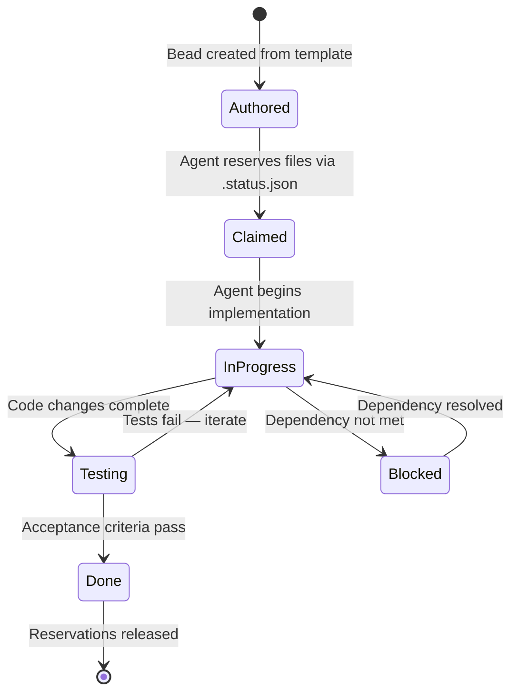
```mermaid
stateDiagram-v2
    [*] --> Authored: Bead created from template
    Authored --> Claimed: Agent reserves files via .status.json
    Claimed --> InProgress: Agent begins implementation
    InProgress --> Testing: Code changes complete
    Testing --> Done: Acceptance criteria pass
    Testing --> InProgress: Tests fail — iterate
    Done --> [*]: Reservations released
    InProgress --> Blocked: Dependency not met
    Blocked --> InProgress: Dependency resolved
```

### Directory Structure

```
.beads/
├── .status.json          # Live agent reservations & bead counters
├── README.md             # Quick-start guide for the beads workflow
└── templates/
    └── feature-bead.md   # Canonical bead template
```

### Status Tracking (`.beads/.status.json`)

The status file is the single source of truth for agent coordination:

```json
{
  "version": "1.0.0",
  "agents": {},
  "reservations": {},
  "lastUpdated": null,
  "beadsCompleted": 0,
  "beadsActive": 0
}
```

| Field | Purpose |
|-------|---------|
| `agents` | Map of active agent IDs to their metadata (name, start time, current bead) |
| `reservations` | Map of file paths to the agent ID that holds the reservation |
| `beadsCompleted` | Counter of successfully finished beads |
| `beadsActive` | Counter of beads currently in progress |

### Bead Template

Every bead follows a structured template (`.beads/templates/feature-bead.md`):

| Section | Description |
|---------|-------------|
| **Background** | Why the work exists |
| **Current State** | Files to read before starting |
| **Desired Outcome** | Specific, testable result |
| **Files to Touch** | Explicit list of files to read, enhance, or create |
| **Dependencies** | Upstream beads that must finish first and downstream beads this unblocks |
| **Acceptance Criteria** | Checklist including "all existing tests still pass" |

### Conflict Zones vs. Safe Parallel Zones

Certain files are **single-agent only** — only one agent may hold a reservation at a time:

| Conflict Zone File | Reason |
|--------------------|--------|
| `docker-compose.yml` | Shared service definitions |
| `ai_ml/services/orchestrator.py` | Central AI/ML entry point |
| `ai_ml/providers/registry.py` | LLM provider configuration |
| `orchestrator/index.js` | Orchestrator entry point |
| Shared config files | Cross-service settings |

**Safe parallel zones** (multiple agents can work simultaneously):
- Separate service directories (e.g., `ai_ml/providers/` vs. `orchestrator/context/`)
- Independent test files
- New files in new directories
- Documentation files (excluding shared configs)

### Agent Communication Protocol

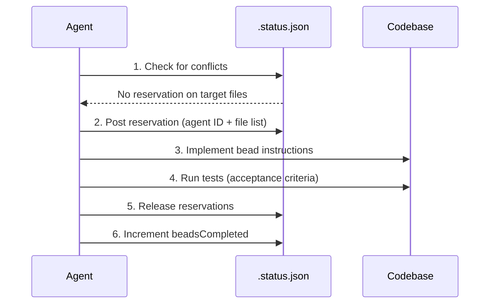
```mermaid
sequenceDiagram
    participant A as Agent
    participant S as .status.json
    participant C as Codebase

    A->>S: 1. Check for conflicts
    S-->>A: No reservation on target files
    A->>S: 2. Post reservation (agent ID + file list)
    A->>C: 3. Implement bead instructions
    A->>C: 4. Run tests (acceptance criteria)
    A->>S: 5. Release reservations
    A->>S: 6. Increment beadsCompleted
```

Agents must:
1. **Check** `.beads/.status.json` before starting any work.
2. **Reserve** files by posting their agent ID and claimed file paths.
3. **Update** status every 30 minutes while actively working.
4. **Release** all reservations upon completion or failure.
5. Use branch naming: `agent/<agent-name>/<bead-id>`.

> [!NOTE]
> For the full agent coordination protocol including conflict resolution and escalation, see [AGENTS.md](AGENTS.md). For how beads integrate with the AI/ML pipeline, see [AI_ML.md](AI_ML.md).

<h2 id="graphql-integration">🧰 GraphQL Integration</h2>

### Introduction to GraphQL in Our Application

Our application supports a fully-featured **GraphQL API** that allows clients to interact with the backend using flexible queries and mutations. This API provides powerful features for retrieving and managing data such as users, documents, and related information.

### Key Features of the GraphQL API

- Retrieve user details and associated documents.
- Query specific documents using their IDs.
- Perform mutations to create users, update document titles, and delete documents.
- Flexible query structure allows you to fetch only the data you need.

### Getting Started

1. **GraphQL Endpoint**:  
   The GraphQL endpoint is available at:
   ```
   https://docuthinker-app-backend-api.vercel.app/graphql
   ```
   Or, if you are running the backend locally, the endpoint will be:
   ```
   http://localhost:3000/graphql
   ```

2. **Testing the API**:  
   You can use the built-in **GraphiQL Interface** to test queries and mutations. Simply visit the endpoint in your browser.
   You should see the following interface:

   <p align="center">
     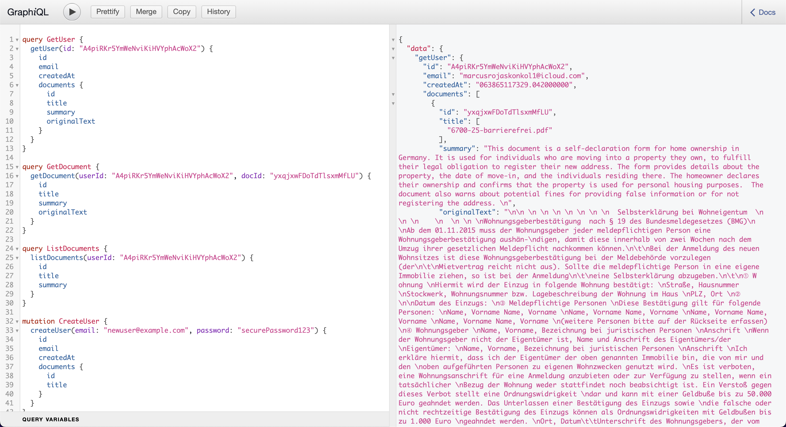
   </p>

   Now you can start querying the API using the available fields and mutations. Examples are below for your reference.

### Example Queries and Mutations

#### 1. Fetch a User and Their Documents

This query retrieves a user's email and their documents, including titles and summaries:

```graphql
query GetUser {
  getUser(id: "USER_ID") {
    id
    email
    documents {
      id
      title
      summary
    }
  }
}
```

#### 2. Fetch a Specific Document

Retrieve details of a document by its ID:

```graphql
query GetDocument {
  getDocument(userId: "USER_ID", docId: "DOCUMENT_ID") {
    id
    title
    summary
    originalText
  }
}
```

#### 3. Create a New User

Create a user with an email and password:

```graphql
mutation CreateUser {
  createUser(email: "example@domain.com", password: "password123") {
    id
    email
  }
}
```

#### 4. Update a Document Title

Change the title of a specific document:

```graphql
mutation UpdateDocumentTitle {
  updateDocumentTitle(userId: "USER_ID", docId: "DOCUMENT_ID", title: ["Updated Title.pdf"]) {
    id
    title
  }
}
```

#### 5. Delete a Document

Delete a document from a user's account:

```graphql
mutation DeleteDocument {
  deleteDocument(userId: "USER_ID", docId: "DOCUMENT_ID")
}
```

### Advanced Tips

- **Use Fragments**: To reduce redundancy in queries, you can use GraphQL fragments to fetch reusable fields across multiple queries.
- **Error Handling**: Properly handle errors in your GraphQL client by inspecting the `errors` field in the response.
- **GraphQL Client Libraries**: Consider using libraries like [Apollo Client](https://www.apollographql.com/docs/react/) or [Relay](https://relay.dev/) to simplify API integration in your frontend.

For more information about GraphQL, visit the [official documentation](https://graphql.org/). If you encounter any issues or have questions, feel free to open an issue in our repository.

<h2 id="mobile-app">📱 Mobile App</h2>

The **DocuThinker** mobile app is built using **React Native** and **Expo**. It provides a mobile-friendly interface for users to upload documents, generate summaries, and chat with an AI. The mobile app integrates with the backend API to provide a seamless experience across devices.

Currently, it is in development and will be released soon on both the **App Store** and **Google Play Store**.

Stay tuned for the release of the **DocuThinker** mobile app!

Below is a screenshot of the mobile app (in development):

<p align="center">
  
</p>

<h2 id="containerization">📦 Containerization</h2>

The **DocuThinker** app can be containerized using **Docker** for easy deployment and scaling. The `docker-compose.yml` defines all services including the new agentic orchestrator.

1. Run the following command to build and start all services:
   ```bash
   docker compose up --build
   ```

2. All services will start on their respective ports (see table below).

You can also view the image in the **Docker Hub** repository **[here](https://hub.docker.com/repository/docker/hoangsonw/docuthinker-ai-app/)**.

#### Docker Compose Services

| Service | Container | Port | Description |
|---------|-----------|------|-------------|
| `frontend` | `docuthinker-frontend` | `3001` | React frontend |
| `backend` | `docuthinker-backend` | `3000` | Express API server |
| `orchestrator` | `docuthinker-orchestrator` | `4000` | Agentic orchestration layer (Node.js) |
| `ai-ml` | `docuthinker-ai-ml` | `8000` | Python AI/ML services (FastAPI) |
| `redis` | `docuthinker-redis` | `6379` | In-memory cache (Redis 7 Alpine) |
| `firebase` | firebase | -- | Firebase emulator |

The orchestrator container includes a health check (`/health`), runs as a non-root user, and depends on Redis being healthy before starting.

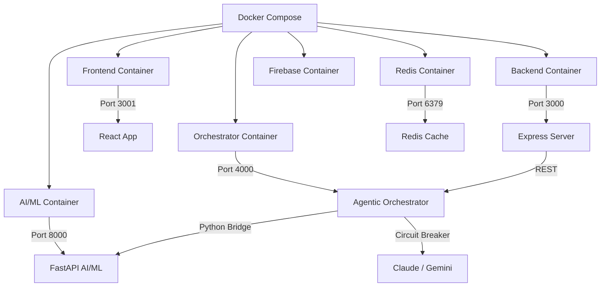
```mermaid
graph TB
    A[Docker Compose] --> B[Frontend Container]
    A --> C[Backend Container]
    A --> O[Orchestrator Container]
    A --> ML[AI/ML Container]
    A --> D[Redis Container]
    A --> F[Firebase Container]
    B -->|Port 3001| G[React App]
    C -->|Port 3000| H[Express Server]
    O -->|Port 4000| I[Agentic Orchestrator]
    ML -->|Port 8000| J[FastAPI AI/ML]
    D -->|Port 6379| K[Redis Cache]
    I -->|Python Bridge| J
    I -->|Circuit Breaker| L[Claude / Gemini]
    H -->|REST| I
```

<h2 id="deployment">🚧 Deployment</h2>

DocuThinker now ships primarily via **Kubernetes** with **blue/green promotion plus weighted canaries** driven by the updated **Jenkinsfile**. **Vercel/Render** remain as backup endpoints, and **AWS ECS Fargate** is still available as an alternative target.

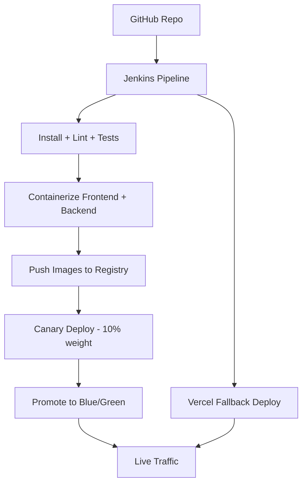
```mermaid
graph TB
    GIT[GitHub Repo] --> JENKINS[Jenkins Pipeline]
    JENKINS --> TEST[Install + Lint + Tests]
    TEST --> BUILD[Containerize Frontend + Backend]
    BUILD --> REG[Push Images to Registry]
    REG --> CANARY[Canary Deploy - 10% weight]
    CANARY --> BG[Promote to Blue/Green]
    BG --> USERS[Live Traffic]
    JENKINS --> VERCEL[Vercel Fallback Deploy]
    VERCEL --> USERS
```

### **Production Rollouts (Kubernetes blue/green + canary)**

- Stable traffic is routed by `backend-service`/`frontend-service` to the active `track` (`blue` by default). Canary traffic is handled by `*-canary-service` through the weighted ingress (`ingress.yaml`) using the `X-DocuThinker-Canary: always` header.
- Jenkins builds images tagged `${GIT_SHA}-${BUILD_NUMBER}`, pushes them to `$REGISTRY`, deploys the target color (scaled to 3 replicas), and rolls out canaries (1 replica each). Promotion is a gated manual input before the service selector flips to the new color and the previous color scales to `0`.
- To promote manually outside Jenkins:

  ```bash
  TARGET=green  # or blue
  kubectl -n <ns> scale deployment/backend-$TARGET --replicas=3
  kubectl -n <ns> scale deployment/frontend-$TARGET --replicas=3
  kubectl -n <ns> patch service backend-service -p "{\"spec\": {\"selector\": {\"app\": \"backend\", \"track\": \"$TARGET\"}}}"
  kubectl -n <ns> patch service frontend-service -p "{\"spec\": {\"selector\": {\"app\": \"frontend\", \"track\": \"$TARGET\"}}}"
  kubectl -n <ns> scale deployment/backend-$( [ "$TARGET" = "blue" ] && echo green || echo blue ) --replicas=0
  kubectl -n <ns> scale deployment/frontend-$( [ "$TARGET" = "blue" ] && echo green || echo blue ) --replicas=0
  ```

See `kubernetes/README.md` for the full rollout flow, ingress weighting, and rollback commands.

### **Frontend Deployment (Vercel)**

- Production hosting remains on **Vercel**. The Jenkins pipeline runs tests/builds and then calls `vercel --prod` using the `vercel-token` credential when the `main` branch updates.
- To deploy manually:

  ```bash
  npm install -g vercel
  vercel --prod
  ```

- The live site stays at **https://docuthinker.vercel.app** with Netlify retained as a static backup.

### **Backend & AI/ML Deployment**

- Primary API traffic now runs on the Kubernetes blue/green stack defined in `kubernetes/backend-*.yaml`, fronted by `backend-service` and the NGINX ingress canary (`ingress.yaml`). Vercel (`https://docuthinker-app-backend-api.vercel.app/`) and Render (`https://docuthinker-ai-app.onrender.com/`) remain as backup endpoints.
- Jenkins builds backend images, pushes them to the configured `$REGISTRY`, deploys the next color alongside canary pods, and flips the service selector after manual approval.
- AWS remains available as an alternate target. The stack in [`aws/`](aws/README.md) still provisions Fargate services if you prefer ECS over Kubernetes.
- To run the new rollout flow by hand:

  ```bash
  kubectl apply -f kubernetes/configmap.yaml
  kubectl apply -f kubernetes/backend-service.yaml kubernetes/backend-canary-service.yaml
  kubectl apply -f kubernetes/backend-deployment-blue.yaml kubernetes/backend-deployment-green.yaml kubernetes/backend-deployment-canary.yaml
  # See kubernetes/README.md for the promotion/rollback commands
  ```

<h2 id="load-balancing">⚖️ Load Balancing & Caching</h2>

- We are using **NGINX** for load balancing and caching to improve the performance and scalability of the app.
  - The **NGINX** configuration file is included in the repository for easy deployment. You can find the file in the `nginx` directory.
  - Feel free to explore the **NGINX** configuration file and deploy it on your own server for load balancing and caching.
  - **NGINX** can also be used for SSL termination, reverse proxying, and serving static files. More advanced configurations can be added to enhance the performance of the app.
  - You can also use **Cloudflare** or **AWS CloudFront** for content delivery and caching to improve the speed and reliability of the app, but we are currently using **NGINX** for load balancing and caching due to costs and simplicity.
  - For more information, refer to the **[NGINX Directory](nginx/README.md)**.
- We are also using **Docker** with **NGINX** to deploy the **NGINX** configuration file and run the server in a containerized environment. The server is deployed and hosted on **Render**.
- Additionally, we are using **Redis** for in-memory caching to store frequently accessed data and improve the performance of the app.
  - **Redis** can be used for caching user sessions, API responses, and other data to reduce the load on the database and improve response times.
  - You can set up your own **Redis** server or use a managed service like **Redis Labs** or **AWS ElastiCache** for caching.

<h2 id="jenkins">🔗 Jenkins Integration</h2>

- The refreshed **Jenkinsfile** now mirrors production rollouts: checkout → install (`npm ci`) → lint/test → build → docker build/push (`$REGISTRY`) → canary deploy → manual promotion to blue/green on Kubernetes, with an optional Vercel deploy as fallback.
- Credentials required by the pipeline:
  - `docuthinker-registry` – username/password for the container registry set in `REGISTRY`.
  - `kubeconfig-docuthinker` – kubeconfig file used for all `kubectl` invocations.
  - `vercel-token` – optional Vercel API token (keeps the legacy deploy available).
- For local Jenkins bootstrap:

  ```bash
  brew install jenkins-lts
  brew services start jenkins-lts
  open http://localhost:8080
  ```

- Create a Pipeline job pointing to this repository, set `REGISTRY`, `KUBE_CONTEXT`, and `KUBE_NAMESPACE` as job/env vars, and assign the credentials above. Jenkins will run automatically on every push to `main`.
- Promotion is gated with an input step during the canary stage; the pipeline patches `backend-service`/`frontend-service` to the new track and scales down the previous color after approval.
- See [`Jenkinsfile`](Jenkinsfile) for the full stage definitions and environment configuration.

If successful, you should see the Jenkins pipeline running tests, pushing images, rolling out the canary, and promoting blue/green automatically whenever changes are merged. Example dashboard:

<p align="center">
  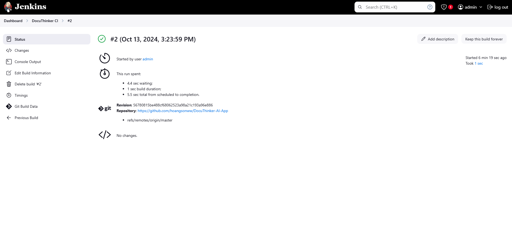
</p>

<h2 id="github-actions">🛠️ GitHub Actions Integration</h2>

In addition to Jenkins, we also have a **GitHub Actions** workflow set up for CI/CD. The workflow is defined in the `.github/workflows/ci.yml` file.

The GitHub Actions workflow includes the following steps:
- **Checkout Code**: Checks out the code from the repository.
- **Set up Node.js**: Sets up the Node.js environment.
- **Install Dependencies**: Installs the dependencies for the frontend, backend, and ai_ml packages.
- **Run Tests**: Runs the tests for the frontend, backend, and ai_ml packages.
- **Build Artifacts**: Builds the artifacts for the frontend, backend, and ai_ml packages.
- **Deploy to Vercel**: Deploys the frontend to Vercel using the `vercel-token` secret.
- **Build and Push Docker Images**: Builds and pushes the Docker images for the backend and ai_ml packages to Docker Hub using the `dockerhub-username` and `dockerhub-password` secrets, as well as to GHCR using the `ghcr-token` secret.
- **Notify on Failure**: Sends a notification to a Slack channel if any of the steps fail.
- **Notify on Success**: Sends a notification to a Slack channel if all the steps succeed.
- **Cleanup**: Cleans up the workspace after the workflow is complete.

<p align="center">
  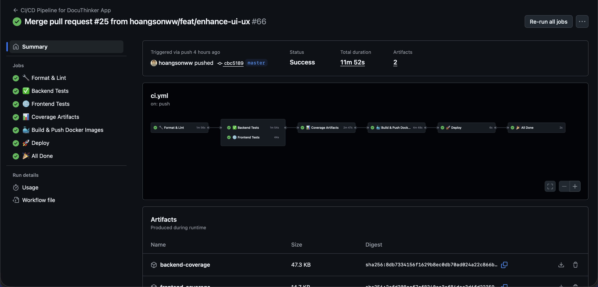
</p>

<h2 id="testing">🧪 Testing</h2>

DocuThinker includes a comprehensive suite of tests to ensure the reliability and correctness of the application. The tests cover various aspects of the app, including:

- **Unit Tests**: Individual components and functions are tested in isolation to verify their correctness.
- **Integration Tests**: Multiple components are tested together to ensure they work as expected when integrated.
- **End-to-End Tests**: The entire application flow is tested to simulate real user interactions and verify the overall functionality.
- **API Tests**: The API endpoints are tested to ensure they return the expected responses and handle errors correctly.

### Backend Unit & Integration Testing

To run the backend tests, follow these steps:

1. **Navigate to the backend directory**:
   ```bash
   cd backend
   ```
   
2. **Install the necessary dependencies**:
   ```bash
   # Run the tests in default mode
   npm run test
   
   # Run the tests in watch mode
   npm run test:watch
   
   # Run the tests with coverage report
   npm run test:coverage
   ```
   
This will run the unit tests and integration tests for the backend app using **Jest** and **Supertest**.

### Frontend Unit & E2E Testing

To run the frontend tests, follow these steps:

1. **Navigate to the frontend directory**:
   ```bash
   cd frontend
   ```
   
2. **Install the necessary dependencies**:
   ```bash
   # Run the tests in default mode
   npm run test
   
   # Run the tests in watch mode
   npm run test:watch
   
   # Run the tests with coverage report
   npm run test:coverage
   ```
   
This will run the unit tests and end-to-end tests for the frontend app using **Jest** and **React Testing Library**.

<h2 id="kubernetes">🚢 Kubernetes Integration</h2>

- We are using **Kubernetes** for container orchestration and scaling. The app can be deployed on a Kubernetes cluster for high availability and scalability.
- Blue/green deployments plus canary ingress are defined in `kubernetes/*.yaml`; see `kubernetes/README.md` for promotion/rollback commands.
- The Kubernetes configuration files are included in the repository for easy deployment. You can find the files in the `kubernetes` directory.
- Feel free to explore the Kubernetes configuration files and deploy the app on your own Kubernetes cluster.
- You can also use **Google Kubernetes Engine (GKE)**, **Amazon EKS**, or **Azure AKS** to deploy the app on a managed Kubernetes cluster.

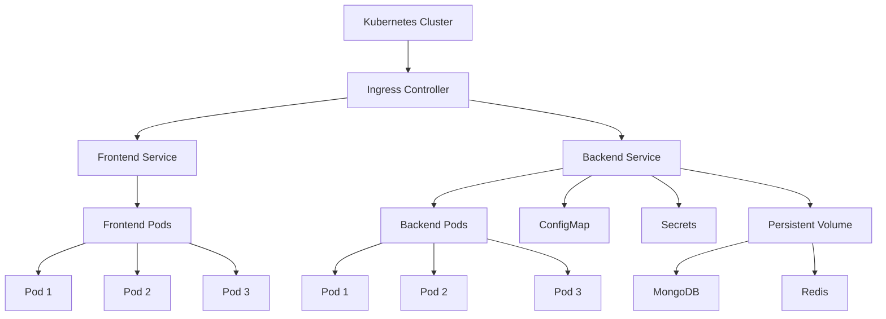
```mermaid
graph TB
    A[Kubernetes Cluster] --> B[Ingress Controller]
    B --> C[Frontend Service]
    B --> D[Backend Service]
    C --> E[Frontend Pods]
    D --> F[Backend Pods]
    E --> G[Pod 1]
    E --> H[Pod 2]
    E --> I[Pod 3]
    F --> J[Pod 1]
    F --> K[Pod 2]
    F --> L[Pod 3]
    D --> M[ConfigMap]
    D --> N[Secrets]
    D --> O[Persistent Volume]
    O --> P[MongoDB]
    O --> Q[Redis]
```

<h2 id="vscode-extension">⚛️ VS Code Extension</h2>

The **DocuThinker Viewer** extension brings your document upload, summarization and insight‑extraction workflow right into VS Code.

**Key Features**

* **Inline Upload & Summaries**: Drop PDFs or Word files into the panel and get instant AI‑generated summaries.
* **Insight Extraction**: Surface key discussion points and recommendations without leaving your editor.
* **Persistent Sessions**: Your upload history and AI session are preserved when you switch files or restart.
* **Panel Customization**: Configure title, column, iframe size, script permissions, and auto‑open behavior.
* **Secure Embedding**: Runs in a sandboxed iframe with a strict CSP - no extra backend needed.
* **No Extra Backend**: All processing happens in our existing DocuThinker web app.

To install the extension, follow these steps:
1. **Open VSCode**.
2. **Go to Extensions** (Ctrl+Shift+X).
3. **Search for "DocuThinker Viewer"**.
4. **Click Install**.
5. Open the Command Palette (Ctrl+Shift+P on Windows or Cmd+Shift+P on macOS) and type "DocuThinker". Then select "DocuThinker: Open Document Panel" to open the extension panel.
6. Start using the app normally!
7. If you want to further configure the extension, you can do so by going to the settings (Ctrl+,) and searching for "DocuThinker". Or, go to the extension settings by clicking on the gear icon next to the extension in the Extensions panel.

<p align="center">
  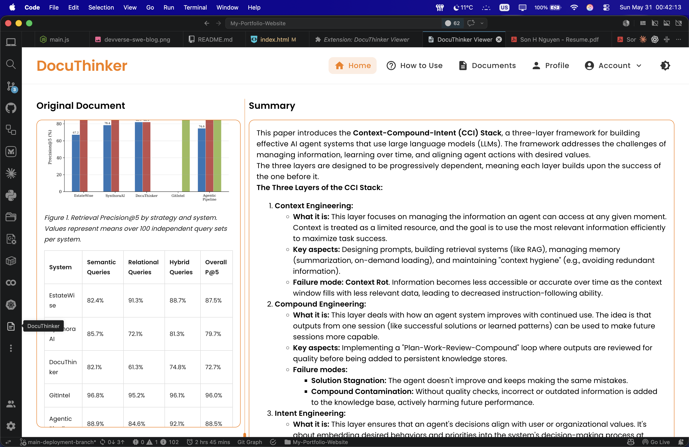
</p>

For full install and development steps, configuration options, and troubleshooting, see [extension/README.md](extension/README.md).

<h2 id="contributing">🔧 Contributing</h2>

We welcome contributions from the community! Follow these steps to contribute:

1. **Fork the repository**.

2. **Create a new branch**:
   ```bash
   git checkout -b feature/your-feature
   ```
   
3. **Commit your changes**:
   ```bash
   git commit -m "Add your feature"
   ```
   
4. **Push the changes**:
   ```bash
   git push origin feature/your-feature
   ```
   
5. **Submit a pull request**: Please submit a pull request from your forked repository to the main repository. I will review your changes and merge them into the main branch shortly.

Thank you for contributing to **DocuThinker**! 🎉

<h2 id="license">📝 License</h2>

This project is licensed under the **Creative Commons Attribution-NonCommercial License**. See the [LICENSE](LICENSE.md) file for details.

> [!IMPORTANT]
> The **DocuThinker** open-source project is for educational purposes only and should not be used for commercial applications. But free to use it for learning and personal projects!

<h2 id="alternative-docs">📚 Additional Documentation</h2>

For more information on the **DocuThinker** app, please refer to the following resources:
- **[Architecture Documentation](ARCHITECTURE.md)**
- **[AI/ML Documentation](ai_ml/README.md)**
- **[Backend README](backend/README.md)**
- **[API Documentation](https://docuthinker-app-backend-api.vercel.app/)**
- **[Deployment Documentation](DEVOPS.md)**
- **[Frontend README](frontend/README.md)**
- **[Mobile App README](mobile-app/README.md)**
- **[AWS Deployment Documentation](aws/README.md)**
- **[NGINX Documentation](nginx/README.md)**

However, this README file should already provide a comprehensive overview of the project ~

<h2 id="author">👨‍💻 Author</h2>

Here are some information about me - the project's humble creator:
- **[Son Nguyen](https://github.com/hoangsonww)** - An aspiring Software Developer & Data Scientist
- Feel free to connect with me on **[LinkedIn](https://www.linkedin.com/in/hoangsonw/)**.
- If you have any questions or feedback, please feel free to reach out to me at **[hoangson091104@gmail.com](mailto:hoangson091104@gmail.com)**.
- Also, check out my **[portfolio](https://sonnguyenhoang.com/)** for more projects and articles.
- If you find this project helpful, or if you have learned something from the source code, consider giving it a star ⭐️. I would greatly appreciate it! 🚀

---

**Happy Coding and Analyzing! 🚀**

**Created with ❤️ by [Son Nguyen](https://github.com/hoangsonww) in 2024-2025.** 
Licensed under the **[Creative Commons Attribution-NonCommercial License](LICENSE.md)**.

---

[🔝 Back to Top](#docuthinker---ai-powered-document-analysis-and-summarization-app)
