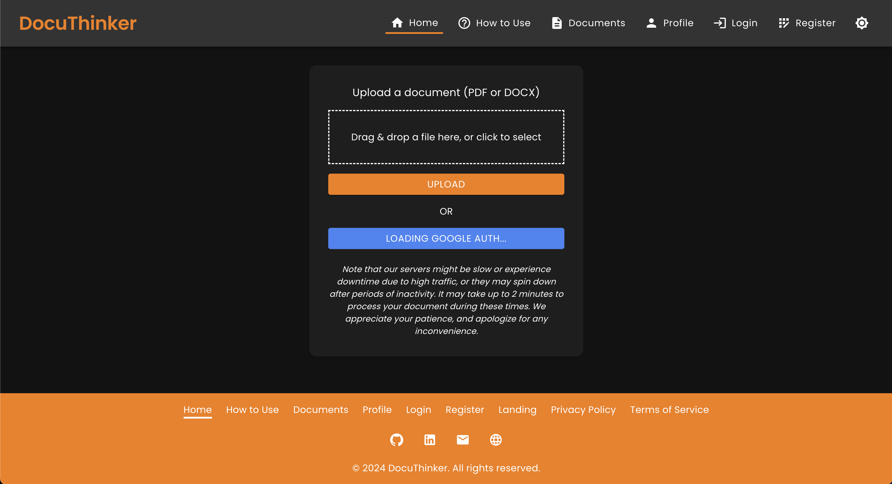
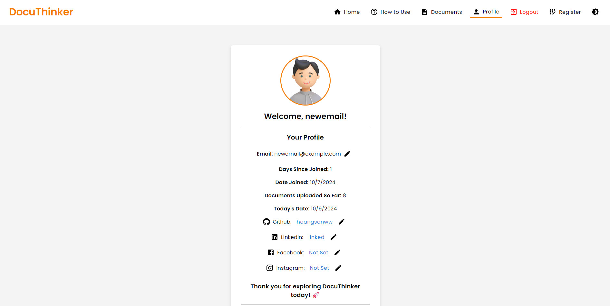
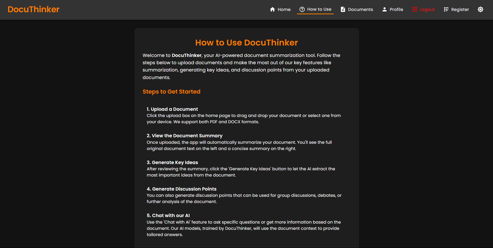
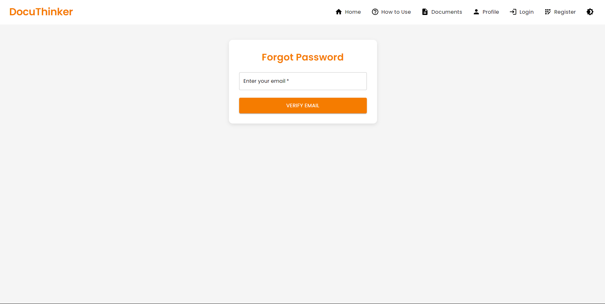

# **DocuThinker - AI-Powered Document Analysis and Summarization App**

Welcome to **DocuThinker**! This is a full-stack **(FERN-Stack)** application that integrates an AI-powered document processing backend with a React-based frontend. The app allows users to upload documents for summarization, generate key insights, and chat with an AI based on the document's content.

<p align="center">
  
</p>

## **📚 Table of Contents**

- [**📖 Overview**](#-overview)
- [**✨ Features**](#features)
- [**⚙️ Technologies**](#technologies)
- [**🖼️ User Interface**](#user-interface)
    - [**Landing Page**](#landing-page)
    - [**Landing Page - Dark Mode**](#landing-page---dark-mode)
    - [**Document Upload Page**](#document-upload-page)
    - [**Document Upload Page - Dark Mode**](#document-upload-page---dark-mode)
    - [**Home Page**](#home-page)
    - [**Home Page - Dark Mode**](#home-page---dark-mode)
    - [**Home Page - With Key Ideas**](#home-page---with-key-ideas)
    - [**Chat Modal**](#chat-modal)
    - [**Chat Modal - Dark Mode**](#chat-modal---dark-mode)
    - [**How To Use Page**](#how-to-use-page)
    - [**How To Use Page - Dark Mode**](#how-to-use-page---dark-mode)
    - [**Login Page**](#login-page)
    - [**Login Page - Dark Mode**](#login-page---dark-mode)
    - [**Registration Page**](#registration-page)
    - [**Registration Page - Dark Mode**](#registration-page---dark-mode)
    - [**Forgot Password Page**](#forgot-password-page)
    - [**Forgot Password Page - Dark Mode**](#forgot-password-page---dark-mode)
    - [**Responsive Design Example**](#responsive-design-example)
- [**📂 Complete File Structure**](#complete-file-structure)
- [**🛠️ Getting Started**](#getting-started)
    - [**Prerequisites**](#prerequisites)
    - [**Frontend Installation**](#frontend-installation)
    - [**Backend Installation**](#backend-installation)
- [**📋 API Endpoints**](#api-endpoints)
    - [**API Documentation**](#api-documentation)
    - [**API Architecture**](#api-architecture)
    - [**API Testing**](#api-testing)
    - [**Error Handling**](#error-handling)
- [**📦 Containerization**](#containerization)
- [**🚀 Deployment**](#deployment)
    - [**Frontend Deployment (Vercel)**](#frontend-deployment-vercel)
    - [**Live Deployments**](#live-deployments)
    - [**Backend Deployment (Render)**](#backend-deployment-render)
    - [**Important Note about Backend Deployment (Please Read)**](#important-note-about-backend-deployment)
- [**🔧 Contributing**](#contributing)
- [**📝 License**](#license)
- [**📚 Alternative Documentation**](#alternative-docs)
- [**👨‍💻 Author**](#author)

<h2 id="-overview">📖 Overview</h2>

The **DocuThinker** app is designed to provide users with a simple, AI-powered document management tool. Users can upload PDFs or Word documents and receive summaries, key insights, and discussion points. Additionally, users can chat with an AI using the document's content for further clarifications.

**DocuThinker** is created using the **FERN-Stack** architecture, which stands for **Firebase, Express, React, and Node.js**. The backend is built with Node.js and Express, integrating Firebase for user authentication and MongoDB for data storage. The frontend is built with React and Material-UI, providing a responsive and user-friendly interface.

It is currently deployed live on **Vercel** and **Render**. You can access the live app **[here](https://docuthinker-fullstack-app.vercel.app/)**.

[](https://vercel.com)
[](https://render.com)
[](https://www.netlify.com)
[](https://firebase.google.com)
[](https://www.mongodb.com)

<h2 id="features">✨ Features</h2>

- **Document Upload & Summarization**: Upload PDFs or Word documents for AI-generated summaries.
- **Key Insights & Discussion Points**: Generate important ideas and topics for discussion from your documents.
- **AI Chat Integration**: Chat with an AI using your document’s original context.
- **User Authentication**: Secure registration, login, and password reset functionality.
- **Responsive Design**: Seamless experience across both desktop and mobile devices.
- **Dark Mode Support**: Toggle between light and dark themes.
- **How To Use Guide**: Detailed instructions on how to use the app effectively.
- **API Documentation**: Swagger documentation for all API endpoints.
- **Error Handling**: Custom error messages and alerts for better user experience.
- **Loading Spinners**: Visual feedback during document processing and API calls.
- **Authentication Middleware**: Secure routes with Firebase authentication middleware.
- **Environment Variables**: Securely store sensitive data using environment variables.
- **Containerization**: Dockerize the app for easy deployment and scaling.
- **Continuous Integration**: Automated testing and deployment with GitHub Actions.

<h2 id="technologies">⚙️ Technologies</h2>

- **Frontend**:
  - **React**: JavaScript library for building user interfaces.
  - **Material-UI**: React components for faster and easier web development.
  - **Axios**: Promise-based HTTP client for making API requests.
  - **React Router**: Declarative routing for React applications.
  - **Context API**: State management for React applications.
  - **React Redux**: State container for JavaScript apps.
- **Backend**:
  - **Express**: Web application framework for Node.js.
  - **Firebase Admin SDK**: Firebase services for server-side applications.
  - **Node.js**: JavaScript runtime for building scalable network applications.
  - **Firebase Authentication**: Secure user authentication with Firebase.
  - **Firebase Auth JWT**: Generate custom tokens for Firebase authentication.
  - **RabbitMQ**: Message broker for handling asynchronous tasks.
- **Database**:
  - **MongoDB**: NoSQL database for storing user data and documents.
  - **Firestore**: Cloud Firestore for storing user data and documents.
  - **Redis**: In-memory data structure store for caching.
- **API Documentation**:
  - **Swagger**: OpenAPI documentation for all API endpoints.
- **Containerization**:
  - **Docker**: Containerization platform for building, shipping, and running applications.
- **Continuous Integration**:
  - **GitHub Actions**: Automated workflows for testing and deployment.
  - **Render**: Cloud platform for hosting and scaling web applications. (Used to deploy the backend)
  - **Vercel**: Cloud platform for hosting and deploying web applications. (Used to deploy the frontend)
  - **Netlify**: Cloud platform for hosting and deploying web applications. (Used as a backup)
  - **Firebase**: Cloud platform for building web and mobile applications.

<h2 id="user-interface">🖼️ User Interface</h2>

**DocuThinker** features a clean and intuitive user interface designed to provide a seamless experience for users. The app supports both light and dark themes, responsive design, and easy navigation. Here are some screenshots of the app:

### **Landing Page**

<p align="center">
  
</p>

### **Landing Page - Dark Mode**

<p align="center">
  
</p>

### **Document Upload Page**

<p align="center">
  
</p>

### **Document Upload Page - Dark Mode**

<p align="center">
  
</p>

### **Document Upload Page - Document Uploaded**

<p align="center">
  
</p>

### **Home Page**

<p align="center">
  
</p>

### **Home Page - Dark Mode**

<p align="center">
  
</p>

### **Home Page - With Key Ideas**

<p align="center">
  
</p>

### **Chat Modal**

<p align="center">
  
</p>

### **Chat Modal - Dark Mode**

<p align="center">
  
</p>

### **Documents Page**

<p align="center">
  
</p>

### **Documents Page - Dark Mode**

<p align="center">
  
</p>

### **Profile Page**

<p align="center">
  
</p>

### **Profile Page - Dark Mode**

<p align="center">
  
</p>

### **How To Use Page**

<p align="center">
  
</p>

### **How To Use Page - Dark Mode**

<p align="center">
  
</p>

### **Login Page**

<p align="center">
  
</p>

### **Login Page - Dark Mode**

<p align="center">
  
</p>

### **Registration Page**

<p align="center">
  
</p>

### **Registration Page - Dark Mode**

<p align="center">
  
</p>

### **Forgot Password Page**

<p align="center">
  
</p>

### **Forgot Password Page - Dark Mode**

<p align="center">
  
</p>

### **Responsive Design Example**

<p align="center">
  
</p>

### **Footer**

<p align="center">
  
</p>

<h2 id="complete-file-structure">📂 Complete File Structure</h2>

```
DocuThinker-AI-App/
├── backend/
│   ├── controllers.js                # Controls the flow of data and logic
│   ├── models.js                     # Models for interacting with database and AI/ML services
│   ├── views.js                      # Output formatting for success and error responses
│   ├── .env                          # Environment variables (git-ignored)
│   ├── index.js                      # Main entry point for the server
│   ├── Dockerfile                    # Docker configuration file
│   └── README.md                     # Backend README file
├── frontend/
│   ├── public/
│   │   ├── index.html                # Main HTML template
│   │   └── manifest.json             # Manifest for PWA settings
│   ├── src/
│   │   ├── assets/                   # Static assets like images and fonts
│   │   │   └── logo.png              # App logo or images
│   │   ├── components/
│   │   │   ├── ChatModal.js          # Chat modal component
│   │   │   ├── Spinner.js            # Loading spinner component
│   │   │   ├── UploadModal.js        # Document upload modal component
│   │   │   ├── Navbar.js             # Navigation bar component
│   │   │   ├── Footer.js             # Footer component
│   │   │   └── GoogleAnalytics.js    # Google Analytics integration component
│   │   ├── pages/
│   │   │   ├── Home.js               # Home page where documents are uploaded
│   │   │   ├── LandingPage.js        # Welcome and information page
│   │   │   ├── Login.js              # Login page
│   │   │   ├── Register.js           # Registration page
│   │   │   ├── ForgotPassword.js     # Forgot password page
│   │   │   └── HowToUse.js           # Page explaining how to use the app
│   │   ├── App.js                    # Main App component
│   │   ├── index.js                  # Entry point for the React app
│   │   ├── App.css                   # Global CSS 1
│   │   ├── index.css                 # Global CSS 2
│   │   ├── reportWebVitals.js        # Web Vitals reporting
│   │   ├── styles.css                # Custom styles for different components
│   │   └── config.js                 # Configuration file for environment variables
│   ├── .env                          # Environment variables file (e.g., REACT_APP_BACKEND_URL)
│   ├── package.json                  # Project dependencies and scripts
│   ├── Dockerfile                    # Docker configuration file
│   ├── README.md                     # Frontend README file
│   └── package.lock                  # Lock file for dependencies
├── images/                           # Images for the README
├── .env                              # Environment variables file for the whole app
├── docker-compose.yml                # Docker Compose file for containerization
├── jsconfig.json                     # JavaScript configuration file
├── package.json                      # Project dependencies and scripts
├── package-lock.json                 # Lock file for dependencies
├── postcss.config.js                 # PostCSS configuration file
├── tailwind.config.js                # Tailwind CSS configuration file
├── render.yaml                       # Render configuration file
├── vercel.json                       # Vercel configuration file
├── .gitignore                        # Git ignore file
├── LICENSE.md                        # License file for the project
└── README.md                         # Comprehensive README for the whole app
```

<h2 id="getting-started">🛠️ Getting Started</h2>

### **Prerequisites**

Ensure you have the following tools installed:

- **Node.js** (between v14 and v20)
- **npm** or **yarn**
- **Firebase Admin SDK** credentials
- **Redis** for caching
- **MongoDB** for data storage
- **.env** file with necessary API keys (You can contact me to get the `.env` file - but you should obtain your own API keys for production).

### **Frontend Installation**

1. **Clone the repository**:
    ```bash
    git clone https://github.com/hoangsonww/DocuThinker-AI-App.git
    cd DocuThinker-AI-App/backend
    ```

2. **Navigate to the frontend directory**:
   ```bash
   cd frontend
   ```

3. **Install dependencies**:
   ```bash
   npm install
   ```

4. **Start the Frontend React app**:
   ```bash
   npm start
   ```

### **Backend Installation**

Note that this is optional since we are deploying the backend on **Render**. However, you can (and should) run the backend locally for development purposes.

1. **Navigate to the backend directory**:
   ```bash
   cd backend
   ```

2. **Install dependencies**:
   ```bash
   npm install
   ```

3. **Start the backend server**:
   ```bash
   npm run dev
   ```
   
**Note:** Be sure to use Node v.20 or earlier to avoid compatibility issues with Firebase Admin SDK.

<h2 id="api-endpoints">📋 API Endpoints</h2>

The backend of **DocuThinker** provides several API endpoints for user authentication, document management, and AI-powered insights. These endpoints are used by the frontend to interact with the backend server:

| **Method** | **Endpoint**                         | **Description**                                                                                     |
|------------|--------------------------------------|-----------------------------------------------------------------------------------------------------|
| POST       | `/register`                          | Register a new user in Firebase Authentication and Firestore, saving their email and creation date. |
| POST       | `/login`                             | Log in a user and return a custom token along with the user ID.                                     |
| POST       | `/upload`                            | Upload a document for summarization. If the user is logged in, the document is saved in Firestore.  |
| POST       | `/generate-key-ideas`                | Generate key ideas from the document text.                                                          |
| POST       | `/generate-discussion-points`        | Generate discussion points from the document text.                                                  |
| POST       | `/chat`                              | Chat with AI using the original document text as context.                                           |
| POST       | `/forgot-password`                   | Reset a user's password in Firebase Authentication.                                                 |
| POST       | `/verify-email`                      | Verify if a user's email exists in Firestore.                                                       |
| GET        | `/documents/{userId}`                | Retrieve all documents associated with the given `userId`.                                          |
| GET        | `/documents/{userId}/{docId}`        | Retrieve a specific document by `userId` and `docId`.                                               |
| GET        | `/document-details/{userId}/{docId}` | Retrieve document details (title, original text, summary) by `userId` and `docId`.                  |
| DELETE     | `/delete-document/{userId}/{docId}`  | Delete a specific document by `userId` and `docId`.                                                 |
| DELETE     | `/delete-all-documents/{userId}`     | Delete all documents associated with the given `userId`.                                            |
| POST       | `/update-email`                      | Update a user's email in both Firebase Authentication and Firestore.                                |
| POST       | `/update-password`                   | Update a user's password in Firebase Authentication.                                                |
| GET        | `/days-since-joined/{userId}`        | Get the number of days since the user associated with `userId` joined the service.                  |
| GET        | `/document-count/{userId}`           | Retrieve the number of documents associated with the given `userId`.                                |
| GET        | `/user-email/{userId}`               | Retrieve the email of a user associated with `userId`.                                              |

### API Documentation

- **Swagger Documentation**: You can access the Swagger documentation for all API endpoints by running the backend server and navigating to `http://localhost:5000/api-docs`.
- **Redoc Documentation**: You can access the Redoc documentation for all API endpoints by running the backend server and navigating to `http://localhost:5000/api-docs/redoc`.

For example, our API endpoints documentation looks like this:

<p align="center">
  
</p>

### **API Architecture**

- The backend API is structured using **Express** and **Firebase Admin SDK** for user authentication and data storage.
- We use the MVC (Model-View-Controller) pattern to separate concerns and improve code organization.
- The API endpoints are designed to be RESTful and follow best practices for error handling and response formatting.
- The API routes are secured using Firebase authentication middleware to ensure that only authenticated users can access the endpoints.
- The API controllers handle the business logic for each route, interacting with the data models and formatting the responses.

### **API Testing**

- You can test the API endpoints using **Postman** or **Insomnia**. Simply make a POST request to the desired endpoint with the required parameters.

- For example, you can test the `/upload` endpoint by sending a POST request with the document file as a form-data parameter.

- Feel free to test all the API endpoints and explore the functionalities of the app.

#### Example Request to Register a User:

```bash
curl --location --request POST 'http://localhost:3000/register' \
--header 'Content-Type: application/json' \
--data-raw '{
    "email": "test@example.com",
    "password": "password123"
}'
```

#### Example Request to Upload a Document:

```bash
curl --location --request POST 'http://localhost:3000/upload' \
--header 'Authorization: Bearer <your-token>' \
--form 'File=@"/path/to/your/file.pdf"'
```

### **Error Handling**

The backend APIs uses centralized error handling to capture and log errors. Responses for failed requests are returned with a proper status code and an error message:

```json
{
  "error": "An internal error occurred",
  "details": "Error details go here"
}
```

<h2 id="containerization">📦 Containerization</h2>

The **DocuThinker** app can be containerized using **Docker** for easy deployment and scaling. Follow these steps to containerize the app:

1. Run the following command to build the Docker image:
   ```bash
   docker compose up --build
   ```
   
2. The app will be containerized and ready to run on port 3000.

<h2 id="deployment">🚀 Deployment</h2>

### **Frontend Deployment (Vercel)**

1. **Install the Vercel CLI**:
   ```bash
   npm install -g vercel
   ```

2. **Deploy the frontend**:
   ```bash
   vercel
   ```

3. **Follow the instructions in your terminal to complete the deployment**.

### **Live Deployments**

- We have deployed the app live on **Vercel** and **Render**. You can access the live app **[here](https://docuthinker-fullstack-app.vercel.app/)**.
- Additionally, we are also using **Netlify** for backups and testing. You can access the backup app **[here](https://docuthinker-ai-app.netlify.app/)**.

### **Backend Deployment (Render)**

- The backend can be deployed on platforms like **Heroku**, **Render**, or **Vercel**.

- Currently, we are using **Render** to host the backend. You can access the live backend **[here](https://docuthinker-ai-app.onrender.com/)**.

### **Important Note about Backend Deployment**

- Please note that we are currently on the **Free Tier** of **Render**. This means that the backend server may take a few seconds to wake up if it has been inactive for a while.

- Therefore, the first API call may take a bit longer to respond. Subsequent calls should be faster as the server warms up. It is completely normal to take up to 2 minutes for the first API call to respond.

<h2 id="contributing">🔧 Contributing</h2>

We welcome contributions from the community! Follow these steps to contribute:

1. **Fork the repository**.
2. **Create a new branch**:
   ```bash
   git checkout -b feature/your-feature
   ```
3. **Commit your changes**:
   ```bash
   git commit -m "Add your feature"
   ```
4. **Push the changes**:
   ```bash
   git push origin feature/your-feature
   ```
5. **Submit a pull request**.

We will review your changes and merge them into the main branch shortly.

<h2 id="license">📝 License</h2>

This project is licensed under the **Creative Commons Attribution-NonCommercial License**. See the [LICENSE](LICENSE.md) file for details.

The **DocuThinker** open-source project is for educational purposes only and should not be used for commercial applications. Feel free to use it for learning and personal projects!

<h2 id="alternative-docs">📚 Alternative Documentation</h2>

- **[Alternative General Documentations](https://hoangsonww.github.io/DocuThinker-AI-App/)**
- **[Backend README](backend/README.md)**
- **[Frontend README](frontend/README.md)**

<h2 id="author">👨‍💻 Author</h2>

- **[Son Nguyen](https://github.com/hoangsonww)**
- Feel free to connect with me on **[LinkedIn](https://www.linkedin.com/in/hoangsonw/)**.
- If you have any questions or feedback, please feel free to reach out to me at **[hoangson091104@gmail.com](mailto:hoangson091104@gmail.com)**.
- Also, check out my **[portfolio](https://sonnguyenhoang.com/)** for more projects and articles.

---

**Happy Coding and Analyzing! 🎶**

**Created with ❤️ by [Son Nguyen](https://github.com/hoangsonww) in 2024.**

---

[🔝 Back to Top](#docuthinker---ai-powered-document-analysis-and-summarization-app)
