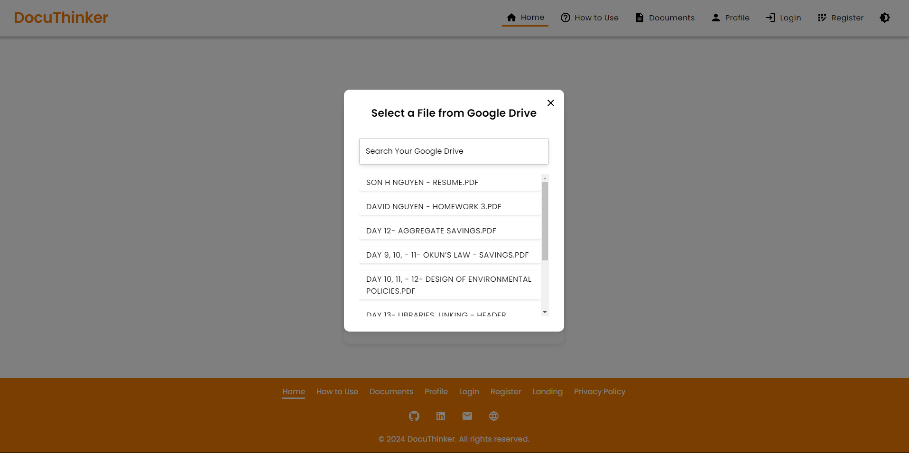
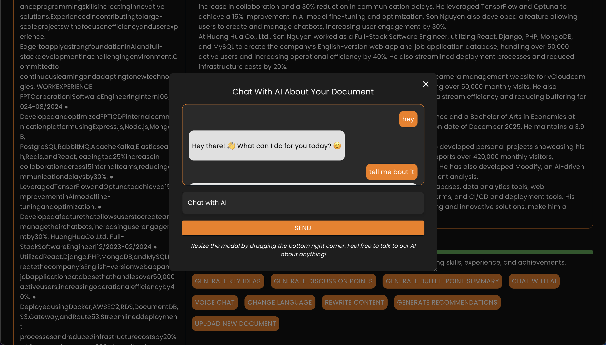
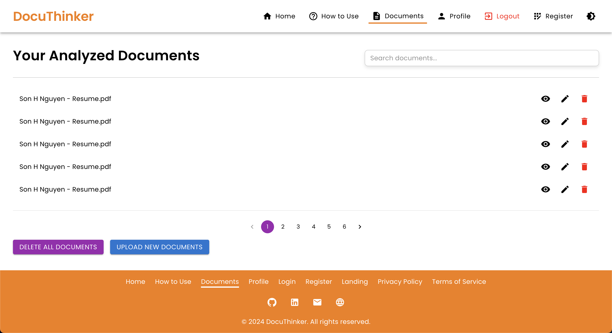
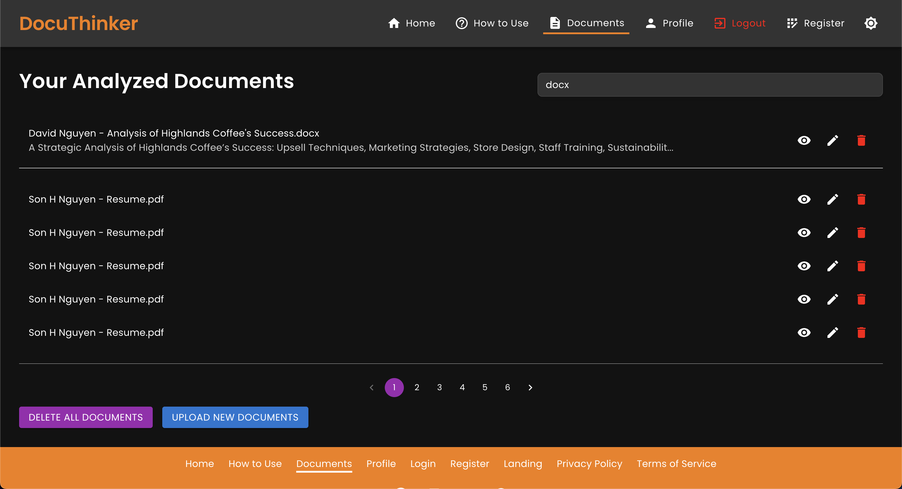

# **DocuThinker - AI-Powered Document Analysis and Summarization App**

Welcome to **DocuThinker**! This is a full-stack **(FERN-Stack)** application that integrates an AI-powered document processing backend, blue/green & canary deployment on an AWS infrastructure, and a React-based frontend. The app allows users to upload documents for summarization, generate key insights, chat with an AI, and do even more with the document's content.

<p align="center">
  <a href="https://docuthinker.vercel.app" style="cursor: pointer">
    
  </a>
</p>

## **📚 Table of Contents**

- [**📖 Overview**](#-overview)
- [**🚀 Live Deployments**](#live-deployments)
- [**✨ Features**](#features)
- [**⚙️ Technologies**](#technologies)
- [**🖼️ User Interface**](#user-interface)
- [**📂 Complete File Structure**](#complete-file-structure)
- [**🛠️ Getting Started**](#getting-started)
  - [**Prerequisites**](#prerequisites)
  - [**Frontend Installation**](#frontend-installation)
  - [**Backend Installation**](#backend-installation)
  - [**Running the Mobile App**](#running-the-mobile-app)
- [**📋 API Endpoints**](#api-endpoints)
  - [**API Documentation**](#api-documentation)
  - [**API Architecture**](#api-architecture)
  - [**API Testing**](#api-testing)
  - [**Error Handling**](#error-handling)
- [**🤖 AI/ML Agentic Platform**](#ai-ml-agentic-platform)
- [**🧰 GraphQL Integration**](#graphql-integration)
- [**📱 Mobile App**](#mobile-app)
- [**📦 Containerization**](#containerization)
- [**🚧 Deployment**](#deployment)
  - [**Frontend Deployment (Vercel)**](#frontend-deployment-vercel)
  - [**Backend & AI/ML Deployment**](#backend--aiml-deployment)
- [**⚖️ Load Balancing & Caching**](#load-balancing)
- [**🔗 Jenkins Integration**](#jenkins)
- [**🛠️ GitHub Actions Integration**](#github-actions)
- [**🧪 Testing**](#testing)
  - [**Backend Unit & Integration Testing**](#backend-unit--integration-testing)
  - [**Frontend Unit & E2E Testing**](#frontend-unit--e2e-testing)
- [**🚢 Kubernetes Integration**](#kubernetes)
- [**⚛️ VS Code Extension**](#vscode-extension)
- [**🔧 Contributing**](#contributing)
- [**📝 License**](#license)
- [**📚 Additional Documentation**](#alternative-docs)
- [**👨‍💻 Author**](#author)

<h2 id="-overview">📖 Overview</h2>

The **DocuThinker** app is designed to provide users with a simple, AI-powered document management tool. Users can upload PDFs or Word documents and receive summaries, key insights, and discussion points. Additionally, users can chat with an AI using the document's content for further clarification.

**DocuThinker** is created using the **FERN-Stack** architecture, which stands for **Firebase, Express, React, and Node.js**. The backend is built with Node.js and Express, integrating Firebase for user authentication and MongoDB for data storage. The frontend is built with React and Material-UI, providing a responsive and user-friendly interface.


> [!IMPORTANT]
> It is currently deployed live on **Vercel** and **Render**. You can access the live app **[here](https://docuthinker-fullstack-app.vercel.app/)**.

Feel free to explore the app, upload documents, and interact with the AI! For architecture details, setup instructions, and more, please refer to the sections below, as well as the [ARCHITECTURE.md](ARCHITECTURE.md) file.

<h2 id="live-deployments">🚀 Live Deployments</h2>

> [!TIP]
> Access the live app at **[https://docuthinker.vercel.app/](https://docuthinker.vercel.app/) by clicking on the link or copying it into your browser! 🚀**

We have deployed the entire app on **Vercel** and **AWS**. You can access the live app **[here](https://docuthinker.vercel.app)**.

- **Frontend**: Deployed on **Vercel**. Access the live frontend **[here](https://docuthinker.vercel.app/)**. 
  - **Backup Frontend**: We have a backup of the frontend on **Netlify**. You can access the backup app **[here](https://docuthinker-ai-app.netlify.app/)**.
- **Backend**: Deployed on **Vercel**. You can access the live backend **[here](https://docuthinker-app-backend-api.vercel.app/)**. This will take you to the Swagger API documentation that allows you to test the API endpoints directly from the browser.
  - **Backup Backend API**: Deployed on **Render**. You can access the backup backend **[here](https://docuthinker-ai-app.onrender.com/)**.
  - **Optional AWS Deployment**: If you wish to deploy the backend on AWS, you can use the provided CloudFormation and CDK scripts in the `aws/` directory. It's a one-click deployment using AWS Fargate.
- **AI/ML Services**: Deployed on **AWS**, which are then used by the backend for document processing and analysis. To use the AI/ML services, simply visit the backend URL **[here](https://docuthinker-app-backend-api.vercel.app/)**.

> [!IMPORTANT]
> The backend server may take a few seconds to wake up if it has been inactive for a while. The first API call may take a bit longer to respond. Subsequent calls should be faster as the server warms up.

<h2 id="features">✨ Features</h2>

**DocuThinker** offers a wide range of features to help users manage and analyze their documents effectively. Here are some of the key features of the app:

- **Document Upload & Summarization**: Upload PDFs or Word documents for AI-generated summaries.
- **Key Insights & Discussion Points**: Generate important ideas and topics for discussion from your documents.
- **AI Chat Integration**: Chat with an AI using your document’s original context.
- **Voice Chat with AI**: Chat with an AI using voice commands for a more interactive experience.
- **Sentiment Analysis**: Analyze the sentiment of your document text for emotional insights.
- **Multiple Language Support**: Summarize documents in different languages for global users.
- **Content Rewriting**: Rewrite or rephrase document text based on a specific style or tone.
- **Actionable Recommendations**: Get actionable recommendations based on your document content.
- **Bullet Point Summaries**: Generate bullet point summaries for quick insights and understanding.
- **Document Categorization**: Categorize documents based on their content for easy organization.
- **Document Analytics**: View interactive and charts-powered analytics such as word count, reading time, sentiment distribution, and more!
- **Profile Management**: Update your profile information, social media links, and theme settings.
- **User Authentication**: Secure registration, login, and password reset functionality.
- **Document History**: View all uploaded documents and their details.
- **Mobile App Integration**: React Native mobile app for on-the-go document management.
- **Dark Mode Support**: Toggle between light and dark themes for better accessibility.
- **API Documentation**: Swagger (OpenAPI) documentation for all API endpoints.
- **Authentication Middleware**: Secure routes with JWT and Firebase authentication middleware.
- **Containerization**: Dockerized the app with Docker & K8s for easy deployment and scaling.
- **Continuous Integration**: Automated testing and deployment with GitHub Actions & Jenkins.
- **Load Balancing & Caching**: NGINX for load balancing and Redis for caching.
- **Zero Downtime Deployment**: Blue/Green & Canary deployment strategies on AWS.
- _and many more!_

<h2 id="technologies">⚙️ Technologies</h2>

- **Frontend**:
  - **React**: JavaScript library for building user interfaces.
  - **Material-UI**: React components for faster and easier web development.
  - **Axios**: Promise-based HTTP client for making API requests.
  - **React Router**: Declarative routing for React applications.
  - **Context API**: State management for React applications.
  - **TailwindCSS**: Utility-first CSS framework for styling.
  - **Craco**: Create React App Configuration Override for customizing Webpack.
  - **Webpack**: Module bundler for JavaScript applications.
  - **Jest**: JavaScript testing framework for unit and integration tests.
  - **React Testing Library**: Testing utilities for React components.
- **Backend**:
  - **Express**: Web application framework for Node.js.
  - **Redis**: In-memory data structure store for caching.
  - **Firebase Admin SDK**: Firebase services for server-side applications.
  - **Node.js**: JavaScript runtime for building scalable network applications.
  - **Firebase Authentication**: Secure user authentication with Firebase.
  - **Firebase Auth JWT**: Generate custom tokens for Firebase authentication.
  - **Middlewares**: Firebase authentication middleware for securing routes and JWT middleware for token verification.
  - **REST APIs**: Representational State Transfer for building APIs.
  - **GraphQL**: Query language for APIs and runtime for executing queries.
  - **RabbitMQ**: Message broker for handling asynchronous tasks and background jobs.
  - **Swagger/OpenAPI**: API documentation for all endpoints.
- **AI/ML Services**:
  - **Google Cloud Natural Language API**: Machine learning models for text analysis.
  - **Google Speech-to-Text API**: Speech recognition for voice chat integration & text extraction from audio.
  - **Google AI Studio**: Tools for building and deploying machine learning models.
  - **OpenAI GPT-4 & GPT-3.5**: Language models for text generation and summarization.
  - **Anthropic Claude**: Language model for text generation and summarization.
  - **NLP**: Natural Language Processing for customized chat/text analysis and summarization models.
  - **NLTK**: Natural Language Toolkit for text processing and analysis.
  - **NER**: Named Entity Recognition for identifying entities in text.
  - **POS Tagging**: Part-of-Speech Tagging for analyzing word types in text.
  - **RAG**: Retrieval-Augmented Generation for generating responses in chat.
  - **DocumentIntelligenceService**: Central LangGraph-driven facade that orchestrates ingestion, retrieval, CrewAI validation, multi-provider LLM calls, and downstream utilities.
  - **LangChain & LangGraph**: LangChain handles chunking/embeddings; LangGraph coordinates the agentic state machine powering RAG and tool routing.
  - **CrewAI**: Multi-agent collaboration (analyst/researcher/reviewer) combining OpenAI, Anthropic, and Gemini providers for grounded insights.
  - **Neo4j & Chroma**: Optional knowledge graph and vector-memory layers that persist analyses for cross-session recall and graph queries.
- **Database**:
  - **MongoDB**: NoSQL database for storing user data and documents.
  - **Firestore**: Cloud Firestore for storing user data and documents.
  - **Redis**: In-memory data structure store for caching.
  - **Mongoose**: MongoDB object modeling for Node.js.
- **Mobile App**:
  - **React Native**: JavaScript framework for building mobile applications.
  - **Expo**: Framework and platform for universal React applications.
  - **Firebase SDK**: Firebase services for mobile applications.
  - **React Navigation**: Routing and navigation for React Native apps.
- **API Documentation**:
  - **Swagger**: OpenAPI documentation for all API endpoints.
  - **OpenAPI**: Specification for building APIs with RESTful architecture.
- **Containerization**:
  - **Docker**: Containerization platform for building, shipping, and running applications.
  - **Kubernetes**: Container orchestration for automating deployment, scaling, and management.
- **Load Balancing & Caching**:
  - **NGINX**: Web server for load balancing, reverse proxying, and caching.
- **CI/CD & Deployment**:
  - **GitHub Actions**: Automated workflows for testing and deployment.
  - **Jenkins**: Automation server for continuous integration and deployment.
  - **AWS**: Cloud computing platform for hosting and deploying applications.
  - **Render**: Cloud platform for hosting and scaling web applications. (Used to deploy the backend)
  - **Vercel**: Cloud platform for hosting and deploying web applications. (Used to deploy the frontend)
  - **Netlify**: Cloud platform for hosting and deploying web applications. (Used as a backup)
- _and many more!_

<p align="center">
  <!-- Frontend -->
  
  
  
  
  
  
  
  

  <!-- Backend -->
  
  
  
  
  
  
  
  
  

  <!-- AI/ML -->
  
  
  
  
  
  
  
  
  
  
  
  

  <!-- Containerization, Deployment, CI/CD -->
  
  
  
  
  
  
  
  

  <!-- API Documentation -->
  
  
  
  
  

  <!-- Testing & Tools -->
  
  
  
  
  
  
  
</p>

<h2 id="user-interface">🖼️ User Interface</h2>

**DocuThinker** features a clean and intuitive user interface designed to provide a seamless experience for users. The app supports both light and dark themes, responsive design, and easy navigation. Here are some screenshots of the app:

### **Landing Page**

<p align="center">
  
</p>

### **Document Upload Page**

<p align="center">
  
</p>

### **Document Upload Page - Dark Mode**

<p align="center">
  
</p>

### **Document Upload Page - Document Uploaded**

<p align="center">
  
</p>

### **Google Drive Document Selection**

<p align="center">
  
</p>

### **Home Page**

<p align="center">
  
</p>

### **Home Page - Dark Mode**

<p align="center">
  
</p>

### **Chat Modal**

<p align="center">
  
</p>

### **Chat Modal - Dark Mode**

<p align="center">
  
</p>

### **Document Analytics**

<p align="center">
  
</p>

### **Documents Page**

<p align="center">
  
</p>

### **Documents Page - Dark Mode**

<p align="center">
  
</p>

### **Document Page - Search Results**

<p align="center">
  
</p>

### **Profile Page**

<p align="center">
  
</p>

### **Profile Page - Dark Mode**

<p align="center">
  
</p>

### **How To Use Page**

<p align="center">
  
</p>

### **Login Page**

<p align="center">
  
</p>

### **Registration Page**

<p align="center">
  
</p>

### **Forgot Password Page**

<p align="center">
  
</p>

### **Mobile App's View**

<p align="center">
  
</p>

<p align="center">
  
</p>

<h2 id="complete-file-structure">📂 Complete File Structure</h2>

The **DocuThinker** app is organized into separate subdirectories for the frontend, backend, and mobile app. Each directory contains the necessary files and folders for the respective components of the app. Here is the complete file structure of the app:

```
DocuThinker-AI-App/
├── ai_ml/                            # AI/ML pipelines & services directory
├── backend/
│   ├── middleware/
│   │   └── jwt.js                    # Authentication middleware with JWT for the app's backend
│   ├── controllers/
│   │   └── controllers.js            # Controls the flow of data and logic
│   ├── graphql/
│   │   ├── resolvers.js              # Resolvers for querying data from the database
│   │   └── schema.js                 # GraphQL schema for querying data from the database
│   ├── models/
│   │   └── models.js                 # Data models for interacting with the database
│   ├── services/
│   │   └── services.js               # Models for interacting with database and AI/ML services
│   ├── views/
│   │   └── views.js                  # Output formatting for success and error responses
│   ├── redis/
│   │   └── redisClient.js            # Redis client for caching data in-memory
│   ├── swagger/
│   │   └── swagger.js                # Swagger documentation for API endpoints
│   ├── .env                          # Environment variables (git-ignored)
│   ├── firebase-admin-sdk.json       # Firebase Admin SDK credentials (git-ignored)
│   ├── index.js                      # Main entry point for the server
│   ├── Dockerfile                    # Docker configuration file
│   ├── manage_server.sh              # Shell script to manage and start the backend server
│   └── README.md                     # Backend README file
│
├── frontend/
│   ├── public/
│   │   ├── index.html                # Main HTML template
│   │   └── manifest.json             # Manifest for PWA settings
│   ├── src/
│   │   ├── assets/                   # Static assets like images and fonts
│   │   │   └── logo.png              # App logo or images
│   │   ├── components/
│   │   │   ├── ChatModal.js          # Chat modal component
│   │   │   ├── Spinner.js            # Loading spinner component
│   │   │   ├── UploadModal.js        # Document upload modal component
│   │   │   ├── Navbar.js             # Navigation bar component
│   │   │   ├── Footer.js             # Footer component
│   │   │   └── GoogleAnalytics.js    # Google Analytics integration component
│   │   ├── pages/
│   │   │   ├── Home.js               # Home page where documents are uploaded
│   │   │   ├── LandingPage.js        # Welcome and information page
│   │   │   ├── Login.js              # Login page
│   │   │   ├── Register.js           # Registration page
│   │   │   ├── ForgotPassword.js     # Forgot password page
│   │   │   └── HowToUse.js           # Page explaining how to use the app
│   │   ├── App.js                    # Main App component
│   │   ├── index.js                  # Entry point for the React app
│   │   ├── App.css                   # Global CSS 1
│   │   ├── index.css                 # Global CSS 2
│   │   ├── reportWebVitals.js        # Web Vitals reporting
│   │   ├── styles.css                # Custom styles for different components
│   │   └── config.js                 # Configuration file for environment variables
│   ├── .env                          # Environment variables file (e.g., REACT_APP_BACKEND_URL)
│   ├── package.json                  # Project dependencies and scripts
│   ├── craco.config.js               # Craco configuration file
│   ├── Dockerfile                    # Docker configuration file
│   ├── manage_frontend.sh            # Shell script for managing and starting the frontend
│   ├── README.md                     # Frontend README file
│   └── package.lock                  # Lock file for dependencies
│
├── mobile-app/                       # Mobile app directory
│   ├── app/                          # React Native app directory
│   ├── .env                          # Environment variables file for the mobile app
│   ├── app.json                      # Expo configuration file
│   ├── components/                   # Reusable components for the mobile app
│   ├── assets/                       # Static assets for the mobile app
│   ├── constants/                    # Constants for the mobile app
│   ├── hooks/                        # Custom hooks for the mobile app
│   ├── scripts/                      # Scripts for the mobile app
│   ├── babel.config.js               # Babel configuration file
│   ├── package.json                  # Project dependencies and scripts
│   └── tsconfig.json                 # TypeScript configuration file
│
├── aws/                              # AWS deployment assets (ECR/ECS/CloudFormation/CDK)
│   ├── README.md
│   ├── cloudformation/
│   │   └── fargate-service.yaml      # Reference Fargate stack for backend + ai_ml services
│   ├── infrastructure/
│   │   ├── cdk-app.ts                # CDK entrypoint
│   │   └── lib/docuthinker-stack.ts  # CDK stack definition
│   └── scripts/
│       └── local-env.sh              # Helper to mirror production env vars locally
│ 
├── kubernetes/                       # Kubernetes configuration files
│   ├── manifests/                    # Kubernetes manifests for deployment, service, and ingress
│   ├── backend-deployment.yaml       # Deployment configuration for the backend
│   ├── backend-service.yaml          # Service configuration for the backend
│   ├── frontend-deployment.yaml      # Deployment configuration for the frontend
│   ├── frontend-service.yaml         # Service configuration for the frontend
│   ├── firebase-deployment.yaml      # Deployment configuration for Firebase
│   ├── firebase-service.yaml         # Service configuration for Firebase
│   └── configmap.yaml                # ConfigMap configuration for environment variables
│
├── nginx/
│   ├── nginx.conf                    # NGINX configuration file for load balancing and caching
│   └── Dockerfile                    # Docker configuration file for NGINX
│
├── images/                           # Images for the README
├── .env                              # Environment variables file for the whole app
├── docker-compose.yml                # Docker Compose file for containerization
├── jsconfig.json                     # JavaScript configuration file
├── package.json                      # Project dependencies and scripts
├── package-lock.json                 # Lock file for dependencies
├── postcss.config.js                 # PostCSS configuration file
├── tailwind.config.js                # Tailwind CSS configuration file
├── render.yaml                       # Render configuration file
├── vercel.json                       # Vercel configuration file
├── openapi.yaml                      # OpenAPI specification for API documentation
├── manage_docuthinker.sh             # Shell script for managing and starting the app (both frontend & backend)
├── .gitignore                        # Git ignore file
├── LICENSE.md                        # License file for the project
├── README.md                         # Comprehensive README for the whole app
└── (and many more files...)          # Additional files and directories not listed here
```

<h2 id="getting-started">🛠️ Getting Started</h2>

### **Prerequisites**

Ensure you have the following tools installed:

- **Node.js** (between v14 and v20)
- **npm** or **yarn**
- **Firebase Admin SDK** credentials
- **Redis** for caching
- **MongoDB** for data storage
- **RabbitMQ** for handling asynchronous tasks
- **Docker** for containerization (optional)
- **Postman** for API testing (optional)
- **Expo CLI** for running the mobile app
- **Jenkins** for CI/CD (optional)
- **Kubernetes** for container orchestration (optional)
- **React Native CLI** for building the mobile app
- **Firebase SDK** for mobile app integration
- **Firebase API Keys and Secrets** for authentication
- **Expo Go** app for testing the mobile app on a physical device
- **Tailwind CSS** for styling the frontend
- **.env** file with necessary API keys (You can contact me to get the `.env` file - but you should obtain your own API keys for production).

Additionally, **basic fullstack development knowledge and AI/ML concepts** are recommended to understand the app's architecture and functionalities.

### **Frontend Installation**

1. **Clone the repository**:

   ```bash
   git clone https://github.com/hoangsonww/DocuThinker-AI-App.git
   cd DocuThinker-AI-App/backend
   ```

2. **Navigate to the frontend directory**:

   ```bash
   cd frontend
   ```

3. **Install dependencies**:

   ```bash
   npm install
   ```

   Or `npm install --legacy-peer-deps` if you face any peer dependency issues.

4. **Start the Frontend React app**:
   ```bash
   npm start
   ```
5. **Build the Frontend React app (for production)**:

   ```bash
   npm run build
   ```

6. **Alternatively, you can use `yarn` to install dependencies and run the app**:
   ```bash
   yarn install
   yarn start
   ```
7. **Or, for your convenience, if you have already installed the dependencies, you can directly run the app in the root directory using**:

   ```bash
   npm run frontend
   ```

   This way, you don't have to navigate to the `frontend` directory every time you want to run the app.

8. **The app's frontend will run on `http://localhost:3000`**. You can now access it in your browser.

### **Backend Installation**

> [!NOTE]
> Note that this is optional since we are deploying the backend on **Render**. However, you can (and should) run the backend locally for development purposes.

1. **Navigate to the root (not `backend`) directory**:
   ```bash
   cd backend
   ```
   
2. **Install dependencies**:
   ```bash
   npm install
   ```

   Or `npm install --legacy-peer-deps` if you face any peer dependency issues.

3. **Start the backend server**:
   ```bash
   npm run server
   ```
   
4. **The backend server will run on `http://localhost:3000`**. You can access the API endpoints in your browser or **Postman**.
5. **Additionally, the backend code is in the `backend` directory**. Feel free to explore the API endpoints and controllers.

> [!CAUTION]
> **Note:** Be sure to use Node v.20 or earlier to avoid compatibility issues with Firebase Admin SDK.

### **Running the Mobile App**

1. **Navigate to the mobile app directory**:
   ```bash
   cd mobile-app
   ```
2. **Install dependencies**:
   ```bash
    npm install
   ```
3. **Start the Expo server**:
   ```bash
   npx expo start
   ```
4. **Run the app on an emulator or physical device**: Follow the instructions in the terminal to run the app on an emulator or physical device.

<h2 id="api-endpoints">📋 API Endpoints</h2>

The backend of **DocuThinker** provides several API endpoints for user authentication, document management, and AI-powered insights. These endpoints are used by the frontend to interact with the backend server:

| **Method** | **Endpoint**                         | **Description**                                                                                     |
|------------|--------------------------------------|-----------------------------------------------------------------------------------------------------|
| POST       | `/register`                          | Register a new user in Firebase Authentication and Firestore, saving their email and creation date. |
| POST       | `/login`                             | Log in a user and return a custom token along with the user ID.                                     |
| POST       | `/upload`                            | Upload a document for summarization. If the user is logged in, the document is saved in Firestore.  |
| POST       | `/generate-key-ideas`                | Generate key ideas from the document text.                                                          |
| POST       | `/generate-discussion-points`        | Generate discussion points from the document text.                                                  |
| POST       | `/chat`                              | Chat with AI using the original document text as context.                                           |
| POST       | `/forgot-password`                   | Reset a user's password in Firebase Authentication.                                                 |
| POST       | `/verify-email`                      | Verify if a user's email exists in Firestore.                                                       |
| GET        | `/documents/{userId}`                | Retrieve all documents associated with the given `userId`.                                          |
| GET        | `/documents/{userId}/{docId}`        | Retrieve a specific document by `userId` and `docId`.                                               |
| GET        | `/document-details/{userId}/{docId}` | Retrieve document details (title, original text, summary) by `userId` and `docId`.                  |
| DELETE     | `/delete-document/{userId}/{docId}`  | Delete a specific document by `userId` and `docId`.                                                 |
| DELETE     | `/delete-all-documents/{userId}`     | Delete all documents associated with the given `userId`.                                            |
| POST       | `/update-email`                      | Update a user's email in both Firebase Authentication and Firestore.                                |
| POST       | `/update-password`                   | Update a user's password in Firebase Authentication.                                                |
| GET        | `/days-since-joined/{userId}`        | Get the number of days since the user associated with `userId` joined the service.                  |
| GET        | `/document-count/{userId}`           | Retrieve the number of documents associated with the given `userId`.                                |
| GET        | `/user-email/{userId}`               | Retrieve the email of a user associated with `userId`.                                              |
| POST       | `/update-document-title`             | Update the title of a document in Firestore.                                                        |
| PUT        | `/update-theme`                      | Update the theme of the app.                                                                        |
| GET        | `/user-joined-date/{userId}`         | Get date when the user associated with `userId` joined the service.                                 |
| GET        | `/social-media/{userId}`             | Get the social media links of the user associated with `userId`.                                    |
| POST       | `/update-social-media`               | Update the social media links of the user associated with `userId`.                                 |
| POST       | `/update-profile`                    | Update the user's profile information.                                                              |
| POST       | `/update-document/{userId}/{docId}`  | Update the document details in Firestore.                                                           |
| POST       | `/update-document-summary`           | Update the summary of a document in Firestore.                                                      |
| POST       | `/sentiment-analysis`                | Analyzes the sentiment of the provided document text                                                |
| POST       | `/bullet-summary`                    | Generates a summary of the document text in bullet points                                           |
| POST       | `/summary-in-language`               | Generates a summary in the specified language                                                       |
| POST       | `/content-rewriting`                 | Rewrites or rephrases the provided document text based on a style                                   |
| POST       | `/actionable-recommendations`        | Generates actionable recommendations based on the document text                                     |
| GET        | `/graphql`                           | GraphQL endpoint for querying data from the database                                                |

More API endpoints will be added in the future to enhance the functionality of the app. Feel free to explore the existing endpoints and test them using **Postman** or **Insomnia**.

> [!NOTE]
> This list is not exhaustive. For a complete list of API endpoints, please refer to the **Swagger** or **Redoc** documentation of the backend server.

### API Documentation

- **Swagger Documentation**: You can access the Swagger documentation for all API endpoints by running the backend server and navigating to `http://localhost:5000/api-docs`.
- **Redoc Documentation**: You can access the Redoc documentation for all API endpoints by running the backend server and navigating to `http://localhost:5000/api-docs/redoc`.

For example, our API endpoints documentation looks like this:

<p align="center">
  
</p>

Additionally, we also offer API file generation using **OpenAPI**. You can generate API files using the **OpenAPI** specification. Here is how:

```bash
npx openapi-generator-cli generate -i http://localhost:5000/api-docs -g typescript-fetch -o ./api
```

This will generate TypeScript files for the API endpoints in the `api` directory. Feel free to replace or modify the command as needed.

### **API Architecture**

- We use **Node.js** and **Express** to build the backend server for **DocuThinker**.
- The backend API is structured using **Express** and **Firebase Admin SDK** for user authentication and data storage.
- We use the MVC (Model-View-Controller) pattern to separate concerns and improve code organization.
  - **Models**: Schema definitions for interacting with the database.
  - **Controllers**: Handle the business logic and interact with the models.
  - **Views**: Format the output and responses for the API endpoints.
  - **Services**: Interact with the database and AI/ML services for document analysis and summarization.
  - **Middlewares**: Secure routes with Firebase authentication and JWT middleware.
- The API endpoints are designed to be RESTful and follow best practices for error handling and response formatting.
- The **Microservices Architecture** is also used to handle asynchronous tasks and improve scalability.
- The API routes are secured using Firebase authentication middleware to ensure that only authenticated users can access the endpoints.
- The API controllers handle the business logic for each route, interacting with the data models and formatting the responses.

### **API Testing**

- You can test the API endpoints using **Postman** or **Insomnia**. Simply make a POST request to the desired endpoint with the required parameters.
- For example, you can test the `/upload` endpoint by sending a POST request with the document file as a form-data parameter.
- Feel free to test all the API endpoints and explore the functionalities of the app.

#### Example Request to Register a User:

```bash
curl --location --request POST 'http://localhost:3000/register' \
--header 'Content-Type: application/json' \
--data-raw '{
    "email": "test@example.com",
    "password": "password123"
}'
```

#### Example Request to Upload a Document:

```bash
curl --location --request POST 'http://localhost:3000/upload' \
--header 'Authorization: Bearer <your-token>' \
--form 'File=@"/path/to/your/file.pdf"'
```

### **Error Handling**

The backend APIs uses centralized error handling to capture and log errors. Responses for failed requests are returned with a proper status code and an error message:

```json
{
  "error": "An internal error occurred",
  "details": "Error details go here"
}
```

<h2 id="ai-ml-agentic-platform">🤖 AI/ML Agentic Platform</h2>

Our `ai_ml/` package wraps LangGraph, CrewAI, and multi-provider LLMs inside a reusable `DocumentIntelligenceService`. It now supports:

- **Agentic RAG pipeline** combining semantic retrieval, structured JSON generation, and CrewAI review (`ai_ml/services/orchestrator.py`, `ai_ml/pipelines/rag_graph.py`).
- **Multi-LLM registry** with drop-in OpenAI, Anthropic Claude, Google Gemini, or Hugging Face embeddings (`ai_ml/providers/registry.py`).
- **Optional persistence**: enable Neo4j knowledge graphs (`ai_ml/graph/neo4j_client.py`) and Chroma vector memory (`ai_ml/vectorstores/chroma_store.py`) via `DOCUTHINKER_SYNC_GRAPH` / `DOCUTHINKER_SYNC_VECTOR` env flags.
- **Expanded tooling**: FastAPI, CLI, and MCP tools tap a single facade for sentiment, translation, recommendations, graph sync, and vector search.
- **Extensible architecture**: easily add new LLMs, tools, or pipelines.
- **NER and POS tagging** with SpaCy.
- **Robust error handling** and logging.
- **Modular design** for easy integration into other projects.
- **Comprehensive tests** with 90%+ coverage.
- **Detailed documentation** and examples.
- and more!


> [!TIP]
> Set `DOCUTHINKER_SYNC_GRAPH=true` and `DOCUTHINKER_SYNC_VECTOR=true` to persist analyses; the MCP tools expose `vector_upsert`, `vector_search`, `graph_upsert`, and `graph_query` for external agents.


> [!TIP]
> Visit the [`ai_ml/README.md`](ai_ml/README.md) file for more details on the AI/ML architecture.

<h2 id="graphql-integration">🧰 GraphQL Integration</h2>

### Introduction to GraphQL in Our Application

Our application supports a fully-featured **GraphQL API** that allows clients to interact with the backend using flexible queries and mutations. This API provides powerful features for retrieving and managing data such as users, documents, and related information.

### Key Features of the GraphQL API

- Retrieve user details and associated documents.
- Query specific documents using their IDs.
- Perform mutations to create users, update document titles, and delete documents.
- Flexible query structure allows you to fetch only the data you need.

### Getting Started

1. **GraphQL Endpoint**:  
   The GraphQL endpoint is available at:
   ```
   https://docuthinker-app-backend-api.vercel.app/graphql
   ```
   Or, if you are running the backend locally, the endpoint will be:
   ```
   http://localhost:3000/graphql
   ```

2. **Testing the API**:  
   You can use the built-in **GraphiQL Interface** to test queries and mutations. Simply visit the endpoint in your browser.
   You should see the following interface:

   <p align="center">
     
   </p>

   Now you can start querying the API using the available fields and mutations. Examples are below for your reference.

### Example Queries and Mutations

#### 1. Fetch a User and Their Documents

This query retrieves a user's email and their documents, including titles and summaries:

```graphql
query GetUser {
  getUser(id: "USER_ID") {
    id
    email
    documents {
      id
      title
      summary
    }
  }
}
```

#### 2. Fetch a Specific Document

Retrieve details of a document by its ID:

```graphql
query GetDocument {
  getDocument(userId: "USER_ID", docId: "DOCUMENT_ID") {
    id
    title
    summary
    originalText
  }
}
```

#### 3. Create a New User

Create a user with an email and password:

```graphql
mutation CreateUser {
  createUser(email: "example@domain.com", password: "password123") {
    id
    email
  }
}
```

#### 4. Update a Document Title

Change the title of a specific document:

```graphql
mutation UpdateDocumentTitle {
  updateDocumentTitle(userId: "USER_ID", docId: "DOCUMENT_ID", title: ["Updated Title.pdf"]) {
    id
    title
  }
}
```

#### 5. Delete a Document

Delete a document from a user's account:

```graphql
mutation DeleteDocument {
  deleteDocument(userId: "USER_ID", docId: "DOCUMENT_ID")
}
```

### Advanced Tips

- **Use Fragments**: To reduce redundancy in queries, you can use GraphQL fragments to fetch reusable fields across multiple queries.
- **Error Handling**: Properly handle errors in your GraphQL client by inspecting the `errors` field in the response.
- **GraphQL Client Libraries**: Consider using libraries like [Apollo Client](https://www.apollographql.com/docs/react/) or [Relay](https://relay.dev/) to simplify API integration in your frontend.

For more information about GraphQL, visit the [official documentation](https://graphql.org/). If you encounter any issues or have questions, feel free to open an issue in our repository.

<h2 id="mobile-app">📱 Mobile App</h2>

The **DocuThinker** mobile app is built using **React Native** and **Expo**. It provides a mobile-friendly interface for users to upload documents, generate summaries, and chat with an AI. The mobile app integrates with the backend API to provide a seamless experience across devices.

Currently, it is in development and will be released soon on both the **App Store** and **Google Play Store**.

Stay tuned for the release of the **DocuThinker** mobile app!

Below is a screenshot of the mobile app (in development):

<p align="center">
  
</p>

<h2 id="containerization">📦 Containerization</h2>

The **DocuThinker** app can be containerized using **Docker** for easy deployment and scaling. Follow these steps to containerize the app:

1. Run the following command to build the Docker image:
   ```bash
   docker compose up --build
   ```

2. The app will be containerized and ready to run on port 3000.

You can also view the image in the **Docker Hub** repository **[here](https://hub.docker.com/repository/docker/hoangsonw/docuthinker-ai-app/)**.


<h2 id="deployment">🚧 Deployment</h2>

DocuThinker now ships primarily via **Kubernetes** with **blue/green promotion plus weighted canaries** driven by the updated **Jenkinsfile**. **Vercel/Render** remain as backup endpoints, and **AWS ECS Fargate** is still available as an alternative target.


### **Production Rollouts (Kubernetes blue/green + canary)**

- Stable traffic is routed by `backend-service`/`frontend-service` to the active `track` (`blue` by default). Canary traffic is handled by `*-canary-service` through the weighted ingress (`ingress.yaml`) using the `X-DocuThinker-Canary: always` header.
- Jenkins builds images tagged `${GIT_SHA}-${BUILD_NUMBER}`, pushes them to `$REGISTRY`, deploys the target color (scaled to 3 replicas), and rolls out canaries (1 replica each). Promotion is a gated manual input before the service selector flips to the new color and the previous color scales to `0`.
- To promote manually outside Jenkins:

  ```bash
  TARGET=green  # or blue
  kubectl -n <ns> scale deployment/backend-$TARGET --replicas=3
  kubectl -n <ns> scale deployment/frontend-$TARGET --replicas=3
  kubectl -n <ns> patch service backend-service -p "{\"spec\": {\"selector\": {\"app\": \"backend\", \"track\": \"$TARGET\"}}}"
  kubectl -n <ns> patch service frontend-service -p "{\"spec\": {\"selector\": {\"app\": \"frontend\", \"track\": \"$TARGET\"}}}"
  kubectl -n <ns> scale deployment/backend-$( [ "$TARGET" = "blue" ] && echo green || echo blue ) --replicas=0
  kubectl -n <ns> scale deployment/frontend-$( [ "$TARGET" = "blue" ] && echo green || echo blue ) --replicas=0
  ```

See `kubernetes/README.md` for the full rollout flow, ingress weighting, and rollback commands.

### **Frontend Deployment (Vercel)**

- Production hosting remains on **Vercel**. The Jenkins pipeline runs tests/builds and then calls `vercel --prod` using the `vercel-token` credential when the `main` branch updates.
- To deploy manually:

  ```bash
  npm install -g vercel
  vercel --prod
  ```

- The live site stays at **https://docuthinker.vercel.app** with Netlify retained as a static backup.

### **Backend & AI/ML Deployment**

- Primary API traffic now runs on the Kubernetes blue/green stack defined in `kubernetes/backend-*.yaml`, fronted by `backend-service` and the NGINX ingress canary (`ingress.yaml`). Vercel (`https://docuthinker-app-backend-api.vercel.app/`) and Render (`https://docuthinker-ai-app.onrender.com/`) remain as backup endpoints.
- Jenkins builds backend images, pushes them to the configured `$REGISTRY`, deploys the next color alongside canary pods, and flips the service selector after manual approval.
- AWS remains available as an alternate target. The stack in [`aws/`](aws/README.md) still provisions Fargate services if you prefer ECS over Kubernetes.
- To run the new rollout flow by hand:

  ```bash
  kubectl apply -f kubernetes/configmap.yaml
  kubectl apply -f kubernetes/backend-service.yaml kubernetes/backend-canary-service.yaml
  kubectl apply -f kubernetes/backend-deployment-blue.yaml kubernetes/backend-deployment-green.yaml kubernetes/backend-deployment-canary.yaml
  # See kubernetes/README.md for the promotion/rollback commands
  ```

<h2 id="load-balancing">⚖️ Load Balancing & Caching</h2>

- We are using **NGINX** for load balancing and caching to improve the performance and scalability of the app.
  - The **NGINX** configuration file is included in the repository for easy deployment. You can find the file in the `nginx` directory.
  - Feel free to explore the **NGINX** configuration file and deploy it on your own server for load balancing and caching.
  - **NGINX** can also be used for SSL termination, reverse proxying, and serving static files. More advanced configurations can be added to enhance the performance of the app.
  - You can also use **Cloudflare** or **AWS CloudFront** for content delivery and caching to improve the speed and reliability of the app, but we are currently using **NGINX** for load balancing and caching due to costs and simplicity.
  - For more information, refer to the **[NGINX Directory](nginx/README.md)**.
- We are also using **Docker** with **NGINX** to deploy the **NGINX** configuration file and run the server in a containerized environment. The server is deployed and hosted on **Render**.
- Additionally, we are using **Redis** for in-memory caching to store frequently accessed data and improve the performance of the app.
  - **Redis** can be used for caching user sessions, API responses, and other data to reduce the load on the database and improve response times.
  - You can set up your own **Redis** server or use a managed service like **Redis Labs** or **AWS ElastiCache** for caching.

<h2 id="jenkins">🔗 Jenkins Integration</h2>

- The refreshed **Jenkinsfile** now mirrors production rollouts: checkout → install (`npm ci`) → lint/test → build → docker build/push (`$REGISTRY`) → canary deploy → manual promotion to blue/green on Kubernetes, with an optional Vercel deploy as fallback.
- Credentials required by the pipeline:
  - `docuthinker-registry` – username/password for the container registry set in `REGISTRY`.
  - `kubeconfig-docuthinker` – kubeconfig file used for all `kubectl` invocations.
  - `vercel-token` – optional Vercel API token (keeps the legacy deploy available).
- For local Jenkins bootstrap:

  ```bash
  brew install jenkins-lts
  brew services start jenkins-lts
  open http://localhost:8080
  ```

- Create a Pipeline job pointing to this repository, set `REGISTRY`, `KUBE_CONTEXT`, and `KUBE_NAMESPACE` as job/env vars, and assign the credentials above. Jenkins will run automatically on every push to `main`.
- Promotion is gated with an input step during the canary stage; the pipeline patches `backend-service`/`frontend-service` to the new track and scales down the previous color after approval.
- See [`Jenkinsfile`](Jenkinsfile) for the full stage definitions and environment configuration.

If successful, you should see the Jenkins pipeline running tests, pushing images, rolling out the canary, and promoting blue/green automatically whenever changes are merged. Example dashboard:

<p align="center">
  
</p>

<h2 id="github-actions">🛠️ GitHub Actions Integration</h2>

In addition to Jenkins, we also have a **GitHub Actions** workflow set up for CI/CD. The workflow is defined in the `.github/workflows/ci.yml` file.

The GitHub Actions workflow includes the following steps:
- **Checkout Code**: Checks out the code from the repository.
- **Set up Node.js**: Sets up the Node.js environment.
- **Install Dependencies**: Installs the dependencies for the frontend, backend, and ai_ml packages.
- **Run Tests**: Runs the tests for the frontend, backend, and ai_ml packages.
- **Build Artifacts**: Builds the artifacts for the frontend, backend, and ai_ml packages.
- **Deploy to Vercel**: Deploys the frontend to Vercel using the `vercel-token` secret.
- **Build and Push Docker Images**: Builds and pushes the Docker images for the backend and ai_ml packages to Docker Hub using the `dockerhub-username` and `dockerhub-password` secrets, as well as to GHCR using the `ghcr-token` secret.
- **Notify on Failure**: Sends a notification to a Slack channel if any of the steps fail.
- **Notify on Success**: Sends a notification to a Slack channel if all the steps succeed.
- **Cleanup**: Cleans up the workspace after the workflow is complete.

<p align="center">
  
</p>

<h2 id="testing">🧪 Testing</h2>

DocuThinker includes a comprehensive suite of tests to ensure the reliability and correctness of the application. The tests cover various aspects of the app, including:

- **Unit Tests**: Individual components and functions are tested in isolation to verify their correctness.
- **Integration Tests**: Multiple components are tested together to ensure they work as expected when integrated.
- **End-to-End Tests**: The entire application flow is tested to simulate real user interactions and verify the overall functionality.
- **API Tests**: The API endpoints are tested to ensure they return the expected responses and handle errors correctly.

### Backend Unit & Integration Testing

To run the backend tests, follow these steps:

1. **Navigate to the backend directory**:
   ```bash
   cd backend
   ```
   
2. **Install the necessary dependencies**:
   ```bash
   # Run the tests in default mode
   npm run test
   
   # Run the tests in watch mode
   npm run test:watch
   
   # Run the tests with coverage report
   npm run test:coverage
   ```
   
This will run the unit tests and integration tests for the backend app using **Jest** and **Supertest**.

### Frontend Unit & E2E Testing

To run the frontend tests, follow these steps:

1. **Navigate to the frontend directory**:
   ```bash
   cd frontend
   ```
   
2. **Install the necessary dependencies**:
   ```bash
   # Run the tests in default mode
   npm run test
   
   # Run the tests in watch mode
   npm run test:watch
   
   # Run the tests with coverage report
   npm run test:coverage
   ```
   
This will run the unit tests and end-to-end tests for the frontend app using **Jest** and **React Testing Library**.

<h2 id="kubernetes">🚢 Kubernetes Integration</h2>

- We are using **Kubernetes** for container orchestration and scaling. The app can be deployed on a Kubernetes cluster for high availability and scalability.
- Blue/green deployments plus canary ingress are defined in `kubernetes/*.yaml`; see `kubernetes/README.md` for promotion/rollback commands.
- The Kubernetes configuration files are included in the repository for easy deployment. You can find the files in the `kubernetes` directory.
- Feel free to explore the Kubernetes configuration files and deploy the app on your own Kubernetes cluster.
- You can also use **Google Kubernetes Engine (GKE)**, **Amazon EKS**, or **Azure AKS** to deploy the app on a managed Kubernetes cluster.


<h2 id="vscode-extension">⚛️ VS Code Extension</h2>

The **DocuThinker Viewer** extension brings your document upload, summarization and insight‑extraction workflow right into VS Code.

**Key Features**

* **Inline Upload & Summaries**: Drop PDFs or Word files into the panel and get instant AI‑generated summaries.
* **Insight Extraction**: Surface key discussion points and recommendations without leaving your editor.
* **Persistent Sessions**: Your upload history and AI session are preserved when you switch files or restart.
* **Panel Customization**: Configure title, column, iframe size, script permissions, and auto‑open behavior.
* **Secure Embedding**: Runs in a sandboxed iframe with a strict CSP - no extra backend needed.
* **No Extra Backend**: All processing happens in our existing DocuThinker web app.

To install the extension, follow these steps:
1. **Open VSCode**.
2. **Go to Extensions** (Ctrl+Shift+X).
3. **Search for "DocuThinker Viewer"**.
4. **Click Install**.
5. Open the Command Palette (Ctrl+Shift+P on Windows or Cmd+Shift+P on macOS) and type "DocuThinker". Then select "DocuThinker: Open Document Panel" to open the extension panel.
6. Start using the app normally!
7. If you want to further configure the extension, you can do so by going to the settings (Ctrl+,) and searching for "DocuThinker". Or, go to the extension settings by clicking on the gear icon next to the extension in the Extensions panel.

<p align="center">
  
</p>

For full install and development steps, configuration options, and troubleshooting, see [extension/README.md](extension/README.md).

<h2 id="contributing">🔧 Contributing</h2>

We welcome contributions from the community! Follow these steps to contribute:

1. **Fork the repository**.

2. **Create a new branch**:
   ```bash
   git checkout -b feature/your-feature
   ```
   
3. **Commit your changes**:
   ```bash
   git commit -m "Add your feature"
   ```
   
4. **Push the changes**:
   ```bash
   git push origin feature/your-feature
   ```
   
5. **Submit a pull request**: Please submit a pull request from your forked repository to the main repository. I will review your changes and merge them into the main branch shortly.

Thank you for contributing to **DocuThinker**! 🎉

<h2 id="license">📝 License</h2>

This project is licensed under the **Creative Commons Attribution-NonCommercial License**. See the [LICENSE](LICENSE.md) file for details.

> [!IMPORTANT]
> The **DocuThinker** open-source project is for educational purposes only and should not be used for commercial applications. But free to use it for learning and personal projects!

<h2 id="alternative-docs">📚 Additional Documentation</h2>

For more information on the **DocuThinker** app, please refer to the following resources:
- **[Architecture Documentation](ARCHITECTURE.md)**
- **[AI/ML Documentation](ai_ml/README.md)**
- **[Backend README](backend/README.md)**
- **[API Documentation](https://docuthinker-app-backend-api.vercel.app/)**
- **[Deployment Documentation](DEVOPS.md)**
- **[Frontend README](frontend/README.md)**
- **[Mobile App README](mobile-app/README.md)**
- **[AWS Deployment Documentation](aws/README.md)**
- **[NGINX Documentation](nginx/README.md)**

However, this README file should already provide a comprehensive overview of the project ~

<h2 id="author">👨‍💻 Author</h2>

Here are some information about me - the project's humble creator:
- **[Son Nguyen](https://github.com/hoangsonww)** - An aspiring Software Developer & Data Scientist
- Feel free to connect with me on **[LinkedIn](https://www.linkedin.com/in/hoangsonw/)**.
- If you have any questions or feedback, please feel free to reach out to me at **[hoangson091104@gmail.com](mailto:hoangson091104@gmail.com)**.
- Also, check out my **[portfolio](https://sonnguyenhoang.com/)** for more projects and articles.
- If you find this project helpful, or if you have learned something from the source code, consider giving it a star ⭐️. I would greatly appreciate it! 🚀

---

**Happy Coding and Analyzing! 🚀**

**Created with ❤️ by [Son Nguyen](https://github.com/hoangsonww) in 2024-2025.** 
Licensed under the **[Creative Commons Attribution-NonCommercial License](LICENSE.md)**.

---

[🔝 Back to Top](#docuthinker---ai-powered-document-analysis-and-summarization-app)
