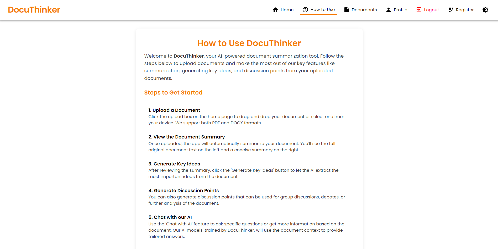
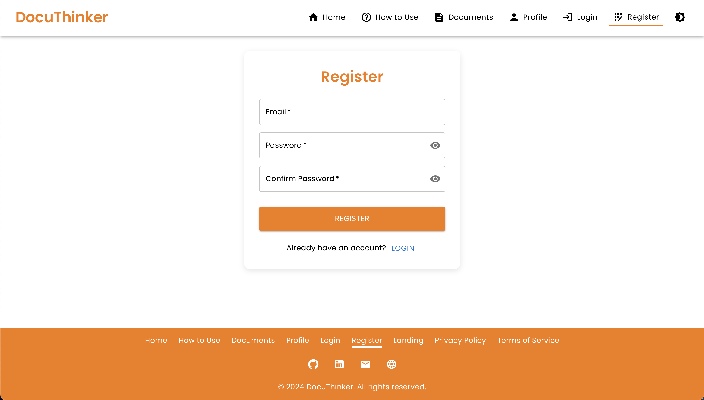

# **DocuThinker - AI-Powered Document Analysis and Summarization App**

Welcome to **DocuThinker**! This is a full-stack **(FERN-Stack)** application that integrates an AI-powered document processing backend with a React-based frontend. The app allows users to upload documents for summarization, generate key insights, and chat with an AI based on the document's content.

## **📚 Table of Contents**

- [**🎵 Overview**](#-overview)
- [**🌟 Features**](#-features)
- [**🛠️ Technologies**](#-technologies)
- [**🖼️ User Interface**](#-user-interface)
    - [**Landing Page**](#landing-page)
    - [**Document Upload Page**](#document-upload-page)
    - [**Home Page**](#home-page)
    - [**Chat Modal**](#chat-modal)
    - [**Login Page**](#login-page)
    - [**Registration Page**](#registration-page)
    - [**Forgot Password Page**](#forgot-password-page)
    - [**Responsive Design Example**](#responsive-design-example)
- [**📂 Complete File Structure**](#-complete-file-structure)
- [**🛠️ Getting Started**](#-getting-started)
    - [**Prerequisites**](#prerequisites)
    - [**Frontend Installation**](#frontend-installation)
    - [**Backend Installation**](#backend-installation)
- [**📋 API Endpoints**](#-api-endpoints)
    - [**User Endpoints**](#user-endpoints)
    - [**Document Endpoints**](#document-endpoints)
    - [**AI Interaction Endpoints**](#ai-interaction-endpoints)
- [**🚀 Deployment**](#-deployment)
- [**🔧 Contributing**](#-contributing)
- [**📝 License**](#-license)

---

<h2 id="-overview">🎵 Overview</h2>

The **DocuThinker** app is designed to provide users with a simple, AI-powered document management tool. Users can upload PDFs or Word documents and receive summaries, key insights, and discussion points. Additionally, users can chat with an AI using the document's content for further clarifications.

---

## **🌟 Features**

- **Document Upload & Summarization**: Upload PDFs or Word documents for AI-generated summaries.
- **Key Insights & Discussion Points**: Generate important ideas and topics for discussion from your documents.
- **AI Chat Integration**: Chat with an AI using your document’s original context.
- **User Authentication**: Secure registration, login, and password reset functionality.
- **Responsive Design**: Seamless experience across both desktop and mobile devices.
- **Dark Mode Support**: Toggle between light and dark themes.

---

## **🛠️ Technologies**

- **Frontend**: React, Material-UI, Axios
- **Backend**: Node.js, Express, Firebase (Authentication), Google Generative AI (Document Processing)
- **Database**: Firebase, MongoDB
- **API Documentation**: Swagger

---

## **🖼️ User Interface**

### **Landing Page**

<p align="center">
  
</p>

### **Landing Page - Dark Mode**

<p align="center">
  
</p>

### **Document Upload Page**

<p align="center">
  
</p>

### **Document Upload Page - Dark Mode**

<p align="center">
  
</p>

### **Home Page**

<p align="center">
  
</p>

### **Home Page - Dark Mode**

<p align="center">
  
</p>

### **Home Page - With Key Ideas**

<p align="center">
  
</p>

### **Chat Modal**

<p align="center">
  
</p>

### **Chat Modal - Dark Mode**

<p align="center">
  
</p>

### **How To Use Page**

<p align="center">
  
</p>

### **How To Use Page - Dark Mode**

<p align="center">
  
</p>

### **Login Page**

<p align="center">
  
</p>

### **Login Page - Dark Mode**

<p align="center">
  
</p>

### **Registration Page**

<p align="center">
  
</p>

### **Registration Page - Dark Mode**

<p align="center">
  
</p>

### **Forgot Password Page**

<p align="center">
  
</p>

### **Forgot Password Page - Dark Mode**

<p align="center">
  
</p>

### **Responsive Design Example**

<p align="center">
  
</p>

## **📂 Complete File Structure**

```
DocuThinker-AI-App/
├── backend/
│   ├── controllers.js          # API controllers for business logic
│   ├── models.js               # Data models and interaction with Firebase and AI
│   ├── views.js                # Helper functions for formatting API responses
│   ├── index.js                # Main server entry point
│   ├── .env                    # Environment variables for backend
│   ├── README.md               # Backend documentation
├── frontend/
│   ├── public/
│   │   ├── index.html          # Main HTML template
│   │   └── manifest.json       # Manifest for PWA settings
│   ├── src/
│   │   ├── assets/             # Static assets such as images and fonts
│   │   ├── components/         # Reusable components like ChatModal, Navbar, Footer
│   │   ├── pages/              # Pages such as Home, Login, Register
│   │   ├── App.js              # Main App component
│   │   ├── index.js            # Entry point for the React app
│   │   ├── styles.css          # Custom styles
│   ├── .env                    # Environment variables for frontend
│   ├── package.json            # Frontend dependencies
│   ├── README.md               # Frontend documentation
├── README.md                   # Comprehensive README for the whole app
```

## **🛠️ Getting Started**

### **Prerequisites**

Ensure you have the following tools installed:

- **Node.js** (v14 or higher)
- **npm** or **yarn**
- **Firebase Admin SDK** credentials
- **Google Generative AI** credentials

### **Frontend Installation**

1. **Navigate to the frontend directory**:
   ```bash
   cd frontend
   ```

2. **Install dependencies**:
   ```bash
   npm install
   ```

3. **Start the React app**:
   ```bash
   npm start
   ```

### **Backend Installation**

1. **Navigate to the backend directory**:
   ```bash
   cd backend
   ```

2. **Install dependencies**:
   ```bash
   npm install
   ```

3. **Start the backend server**:
   ```bash
   npm run dev
   ```

---

## **📋 API Endpoints**

| HTTP Method | Endpoint                      | Description                                   | Auth Required |
|-------------|-------------------------------|-----------------------------------------------|---------------|
| POST        | `/register`                   | Register a new user                           | No            |
| POST        | `/login`                      | Login a user and generate a custom token      | No            |
| POST        | `/upload`                     | Upload a document for summarization           | Yes           |
| POST        | `/generate-key-ideas`         | Generate key ideas from document text         | Yes           |
| POST        | `/generate-discussion-points` | Generate discussion points from document text | Yes           |
| POST        | `/chat`                       | Chat with AI using document context           | Yes           |
| POST        | `/forgot-password`            | Reset a user's password                       | No            |
| POST        | `/verify-email`               | Verify if a user's email exists               | No            |

---

## **🚀 Deployment**

### **Frontend Deployment (Vercel)**

1. **Install the Vercel CLI**:
   ```bash
   npm install -g vercel
   ```

2. **Deploy the frontend**:
   ```bash
   vercel
   ```

3. **Follow the instructions in your terminal to complete the deployment**.

### **Backend Deployment**

- The backend can be deployed on platforms like **Heroku**, **Render**, or **Vercel**.

---

## **🔧 Contributing**

We welcome contributions from the community! Follow these steps to contribute:

1. **Fork the repository**.
2. **Create a new branch**:
   ```bash
   git checkout -b feature/your-feature
   ```
3. **Commit your changes**:
   ```bash
   git commit -m "Add your feature"
   ```
4. **Push the changes**:
   ```bash
   git push origin feature/your-feature
   ```
5. **Submit a pull request**.

---

## **📝 License**

This project is licensed under the **MIT License**. See the [LICENSE](LICENSE.md) file for details.

---

Happy coding! 🚀