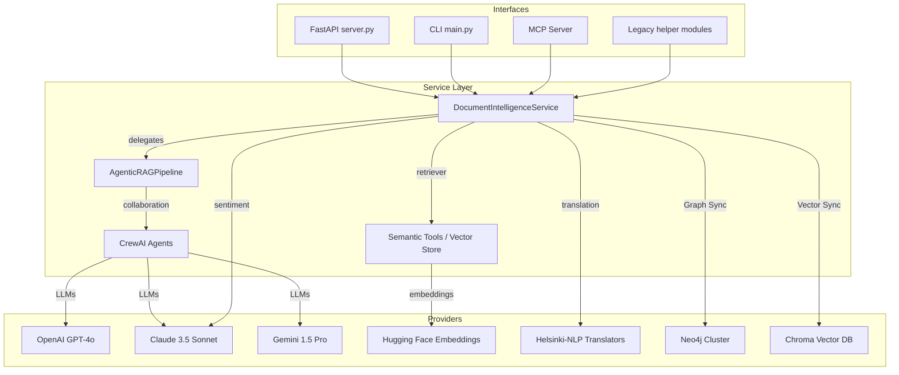

# DocuThinker AI/ML Agentic Platform

The `ai_ml` package orchestrates a production-ready RAG platform that blends **LangGraph**, **LangChain**, **CrewAI**, and a **DocumentIntelligenceService** facade on top of multiple model providers (OpenAI, Anthropic Claude, Google Gemini, and Hugging Face). The same capabilities are exposed to the wider DocuThinker application, a local CLI, and an MCP (Model Context Protocol) server for external tool consumers.



## Highlights

- **DocumentIntelligenceService Facade** – Centralizes agentic RAG, semantic search, translation, sentiment, recommendations, and rewriting in a reusable service.
- **LangGraph Agentic Flow** – `AgenticRAGPipeline` composes ingestion, RAG JSON generation, CrewAI validation, and report formatting as a state machine with configurable chunking and embeddings.
- **CrewAI Teaming** – Three specialised agents (OpenAI analyst, Gemini researcher, Claude reviewer) collaborate via shared document tools with consistent provider settings.
- **Multi-Provider Ready** – Swap models by environment variables; embeddings default to Hugging Face; translations powered by Helsinki-NLP pipelines.
- **MCP Server & CLI Enhancements** – Unified analysis, semantic search, and topic extraction available through FastMCP plus a CLI that prints summaries, insights, recommendations, and translations.
- **Persistent Knowledge & Recall** – Optional Neo4j sync captures insights as a knowledge graph, while Chroma stores rich semantic vectors for cross-session retrieval.

## Key Modules

| Path | Description |
| --- | --- |
| `core/settings.py` | Declarative runtime configuration (providers, embeddings, translation models, chunk sizes). |
| `services/orchestrator.py` | `DocumentIntelligenceService` facade exposing analysis, summarization, semantic search, rewriting, and recommendations. |
| `pipelines/rag_graph.py` | LangGraph wiring for ingest → RAG → CrewAI → report with pluggable chunk/embedding configs. |
| `agents/crew_agents.py` | CrewAI roles and tasks collaborating on document intelligence. |
| `tools/document_tools.py` | Vector store helpers reused across LangGraph, CrewAI, and MCP with configurable chunking. |
| `backend.py` | Thin FastAPI/CLI façade delegating to the shared service. |
| `mcp/server.py` | FastMCP server exporting analysis/search/topics as tools. |
| `graph/neo4j_client.py` | Optional Neo4j driver wrapper for knowledge-graph sync. |
| `vectorstores/chroma_store.py` | Optional Chroma client for persistent semantic search. |
| `extended_features/` | Bullet summaries, key ideas, recommendations, rewrites, and voice chat stubs powered by the service layer. |
| `continuous_learning.py` | Persistent FAISS memory compatible with the new embedding settings. |

## Running the Pipeline

### 1. Install Dependencies

```bash
pip install -r ai_ml/requirements.txt
```

### 2. Configure Environment

Set API keys for the providers you plan to use. Only the keys you supply will be exercised.

```bash
export OPENAI_API_KEY=...
export ANTHROPIC_API_KEY=...
export GOOGLE_API_KEY=...
# Optional overrides
export DOCUTHINKER_OPENAI_MODEL=gpt-4o-mini
export DOCUTHINKER_CLAUDE_MODEL=claude-3-5-sonnet-20241022
export DOCUTHINKER_GEMINI_MODEL=gemini-1.5-pro
# Enable persistent knowledge graph + vector storage (optional)
export DOCUTHINKER_SYNC_GRAPH=true
export DOCUTHINKER_NEO4J_URI=bolt://localhost:7687
export DOCUTHINKER_NEO4J_USER=neo4j
export DOCUTHINKER_NEO4J_PASSWORD=secret
export DOCUTHINKER_NEO4J_DATABASE=neo4j
export DOCUTHINKER_SYNC_VECTOR=true
export DOCUTHINKER_CHROMA_DIR=.chroma
export DOCUTHINKER_CHROMA_COLLECTION=docuthinker
```

### 3. CLI Usage

```bash
python -m ai_ml.main docs/sample.txt \
  --question "What are the key risks?" \
  --translate_lang es \
  --doc_id policy-2024-001 \
  --title "Policy Whitepaper"
```

The CLI prints:
- Raw agentic payload (`rag` JSON)
- Narrative summary + bullet summary
- Extracted topics and insights
- Q&A when a question is supplied
- Sentiment diagnostics
- Discussion prompts and actionable recommendations
- Translation into the requested language

### 4. FastAPI Sandbox

```bash
uvicorn ai_ml.server:app --reload
```

### 5. MCP Server

```bash
python -m ai_ml.mcp.server
```

Register `docuthinker-agentic` with any MCP-compatible client and you will see these tools:

- `agentic_document_brief(document, question?, translate_lang=fr)`
- `semantic_document_search(document, query)`
- `quick_topics(document)`
- `vector_upsert(document, doc_id?, metadata?)`
- `vector_search(query, n_results=5)`
- `graph_upsert(document, metadata?)`
- `graph_query(query, params?)`

## Agentic RAG Walkthrough

1. **Ingest & Embed** – Text is chunked via `ChunkConfig` and stored in FAISS with Hugging Face embeddings specified in `core/settings.py`.
2. **Primary RAG Pass** – OpenAI GPT-4o (configurable) answers the question and returns structured JSON (overview, topics, supporting context).
3. **Crew Validation** – CrewAI agents review the analysis:
   - Analyst (OpenAI) drafts the brief.
   - Researcher (Gemini) cross-checks with semantic search.
   - Reviewer (Claude) synthesises exec-ready insights.
4. **Finalisation** – The pipeline aggregates topics, citations, and crew output into a normalized payload consumed by the service.
5. **Augmentations** – The service layer adds translation, sentiment (Claude), bullet summaries, recommendations, and cached semantic search utilities before exposing results to upstream interfaces.

## Knowledge Graph & Vector Store

- **Neo4j Sync** – Enable by providing `DOCUTHINKER_SYNC_GRAPH=true` and Neo4j credentials. The service creates/updates `Document` nodes, links `Topic` nodes, and exposes `graph_query` for custom Cypher.
- **Chroma Persistence** – Enable via `DOCUTHINKER_SYNC_VECTOR=true` and `DOCUTHINKER_CHROMA_DIR`. Documents analysed (or added via MCP) are embedded and stored for low-latency semantic recall.
- **Service APIs** – `sync_to_knowledge_graph`, `run_graph_query`, `upsert_vector_document`, and `query_vector_index` expose the new capabilities to Python callers and the FastAPI layer.

## Service APIs

```python
from ai_ml.services import get_document_service

svc = get_document_service()
svc.analyze_document(document, question="Key risks?", translate_lang="de")
svc.summarize(document)
svc.bullet_summary(document)
svc.extract_topics(document)
svc.semantic_search(document, "compliance")
svc.recommendations(document)
svc.rewrite(document, tone="executive")
```

## Extending

- Swap models via environment overrides without touching code.
- Add new CrewAI tasks or tools in `agents/crew_agents.py`—all tools should route through `ai_ml.tools` so the MCP server can expose them.
- Extend the MCP server with additional `@app.tool` methods that wrap new service capabilities.
- Persist FAISS indices to an external vector DB by swapping the implementation in `tools/document_tools.py`.

## Testing Ideas

- Mock LangChain LLMs with `langchain_core.language_models.fake.FakeListChatModel` for deterministic unit tests.
- Inject a stub `LLMProviderRegistry` into `DocumentIntelligenceService` to validate node transitions without hitting real APIs.
- Add contract tests that confirm the MCP tools return JSON-serialisable data structures.
- Use a local Neo4j instance with test data to validate graph sync and queries.
- Benchmark end-to-end latency with different chunk sizes and embedding models.
