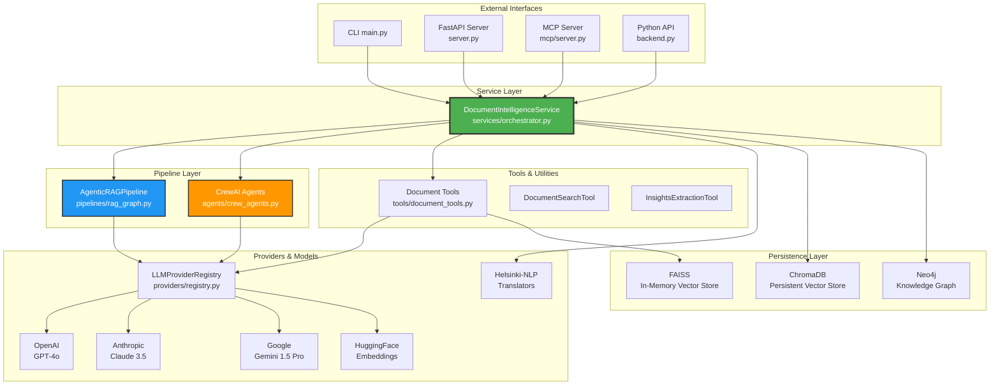
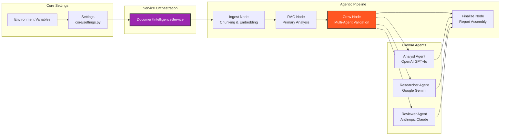
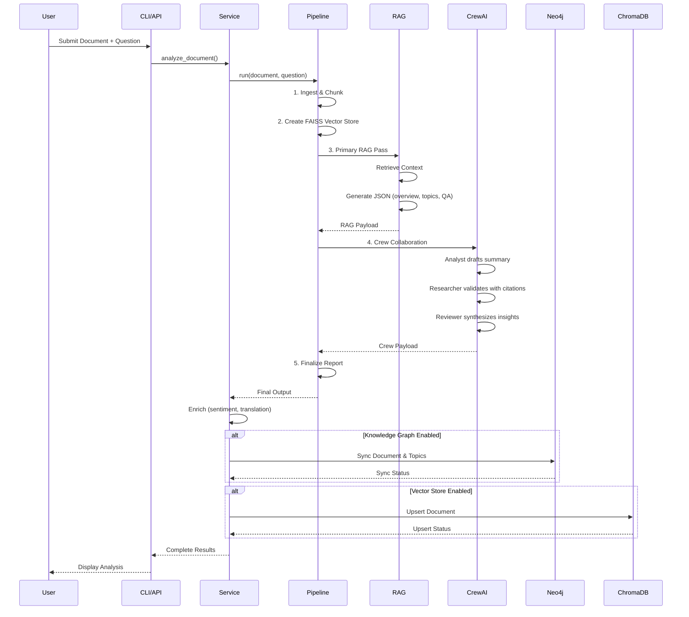
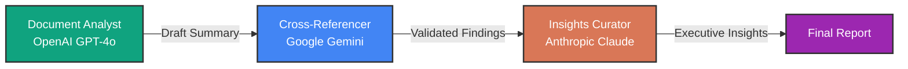

# DocuThinker AI/ML Agentic Platform

[](https://www.python.org/downloads/)
[](https://langchain.com/)
[](https://www.crewai.com/)
[](LICENSE)

> **A production-ready, multi-agent RAG platform orchestrating LangGraph, LangChain, CrewAI, and multiple LLM providers for comprehensive document intelligence.**

---

## 📋 Table of Contents

- [Overview](#overview)
- [Architecture](#architecture)
  - [High-Level Architecture](#high-level-architecture)
  - [Component Diagram](#component-diagram)
  - [Data Flow](#data-flow)
- [Core Components](#core-components)
- [Features](#features)
- [Getting Started](#getting-started)
  - [Prerequisites](#prerequisites)
  - [Installation](#installation)
  - [Configuration](#configuration)
- [Usage](#usage)
  - [CLI Usage](#cli-usage)
  - [Python API](#python-api)
  - [FastAPI Server](#fastapi-server)
  - [MCP Server](#mcp-server)
- [Advanced Features](#advanced-features)
  - [Knowledge Graph Integration](#knowledge-graph-integration)
  - [Vector Store Persistence](#vector-store-persistence)
  - [Multi-Agent Collaboration](#multi-agent-collaboration)
- [API Reference](#api-reference)
- [Configuration Reference](#configuration-reference)
- [Performance & Optimization](#performance--optimization)
- [Deployment](#deployment)
- [Troubleshooting](#troubleshooting)
- [Development](#development)
- [Testing](#testing)
- [Contributing](#contributing)
- [License](#license)

---

## Overview

The `ai_ml` package is a sophisticated, production-ready **Retrieval-Augmented Generation (RAG)** platform that seamlessly integrates:

- 🔗 **LangGraph** for stateful agentic workflows
- 🦜 **LangChain** for LLM orchestration and prompt engineering
- 🤖 **CrewAI** for multi-agent collaboration
- 🧠 Multiple LLM providers: **OpenAI GPT-4o**, **Anthropic Claude 3.5**, **Google Gemini 1.5 Pro**
- 🔍 **Vector stores** (FAISS, ChromaDB) for semantic search
- 📊 **Knowledge graphs** (Neo4j) for relationship mapping
- 🌐 **MCP (Model Context Protocol)** for tool exposure
- 🚀 Multiple interfaces: **CLI**, **Python API**, **FastAPI**, **MCP Server**

### Key Capabilities

✅ **Comprehensive Document Analysis** - Extract summaries, topics, insights, and sentiments
✅ **Multi-Agent Reasoning** - Three specialized agents collaborate for thorough analysis
✅ **Semantic Search** - Vector-based retrieval with configurable embeddings
✅ **Q&A System** - Context-aware question answering
✅ **Multi-Language Translation** - Helsinki-NLP models for 7+ languages
✅ **Knowledge Graph Sync** - Persistent document relationships in Neo4j
✅ **Persistent Memory** - ChromaDB for cross-session semantic recall
✅ **Flexible Deployment** - CLI, API server, MCP server, or Python library

---

## Architecture

### High-Level Architecture



### Component Diagram



### Data Flow



---

## Core Components

### 📂 Module Structure

```mermaid
flowchart TB
    root[ai_ml/]

    root --> core_dir[core/]
    core_dir --> settings[settings.py<br/>Runtime configuration]
    core_dir --> core_init[__init__.py]

    root --> services_dir[services/]
    services_dir --> orchestrator[orchestrator.py<br/>DocumentIntelligenceService facade]
    services_dir --> services_init[__init__.py]

    root --> pipelines_dir[pipelines/]
    pipelines_dir --> rag_graph[rag_graph.py<br/>LangGraph agentic RAG pipeline]
    pipelines_dir --> pipelines_init[__init__.py]

    root --> agents_dir[agents/]
    agents_dir --> crew_agents[crew_agents.py<br/>CrewAI collaboration]
    agents_dir --> agents_init[__init__.py]

    root --> providers_dir[providers/]
    providers_dir --> registry[registry.py<br/>LLM & embedding registry]
    providers_dir --> providers_init[__init__.py]

    root --> tools_dir[tools/]
    tools_dir --> document_tools[document_tools.py<br/>Semantic search & insights]
    tools_dir --> tools_init[__init__.py]

    root --> graph_dir[graph/]
    graph_dir --> neo4j_client[neo4j_client.py<br/>Knowledge graph client]
    graph_dir --> graph_init[__init__.py]

    root --> vectorstores_dir[vectorstores/]
    vectorstores_dir --> chroma_store[chroma_store.py<br/>ChromaDB persistence]
    vectorstores_dir --> vectorstores_init[__init__.py]

    root --> mcp_dir[mcp/]
    mcp_dir --> mcp_server[server.py<br/>MCP tool exposure]
    mcp_dir --> mcp_init[__init__.py]

    root --> processing_dir[processing/]
    processing_dir --> summarizer[summarizer.py<br/>Summarization]
    processing_dir --> sentiment[sentiment.py<br/>Sentiment analysis]
    processing_dir --> topic_extractor[topic_extractor.py<br/>Topic extraction]
    processing_dir --> translator[translator.py<br/>Translation utilities]

    root --> extended_dir[extended_features/]
    extended_dir --> chat_interface[chat_interface.py<br/>Conversational interface]
    extended_dir --> bullet_summary[bullet_summary_generator.py]
    extended_dir --> key_ideas[key_ideas_extractor.py]
    extended_dir --> recommendations[recommendations_generator.py]
    extended_dir --> refine_summary[refine_summary.py]
    extended_dir --> rewriter[rewriter.py]
    extended_dir --> voice_chat[voice_chat.py]

    root --> models_dir[models/]
    models_dir --> hf_model[hf_model.py<br/>HF model loaders]
    models_dir --> model_utils[model_utils.py<br/>Model utilities]
    models_dir --> onnx_helper[onnx_helper.py<br/>ONNX helpers]

    root --> backend_file[backend.py<br/>API facade]
    root --> server_file[server.py<br/>FastAPI REST server]
    root --> main_file[main.py<br/>CLI entry point]
    root --> config_file[config.py<br/>Legacy configuration]
    root --> requirements[requirements.txt<br/>Python dependencies]
    root --> readme[README.md<br/>This file]
```



### 🔑 Key Classes

| Class | Location | Purpose |
|-------|----------|---------|
| `DocumentIntelligenceService` | `services/orchestrator.py` | **Main facade** - Orchestrates all AI/ML capabilities |
| `AgenticRAGPipeline` | `pipelines/rag_graph.py` | **LangGraph pipeline** - Stateful RAG workflow |
| `LLMProviderRegistry` | `providers/registry.py` | **Provider registry** - Lazy-load LLMs & embeddings |
| `Neo4jGraphClient` | `graph/neo4j_client.py` | **Knowledge graph** - Neo4j operations |
| `ChromaVectorClient` | `vectorstores/chroma_store.py` | **Vector store** - Persistent semantic search |
| `DocumentSearchTool` | `tools/document_tools.py` | **Semantic search** - FAISS-backed retrieval |
| `InsightsExtractionTool` | `tools/document_tools.py` | **Topic extraction** - Heuristic-based insights |

---

## Features

### 🎯 Document Intelligence

| Feature | Description | Module |
|---------|-------------|--------|
| **Comprehensive Analysis** | Full document intelligence with multi-agent validation | `services/orchestrator.py` |
| **Summarization** | Narrative and bullet-point summaries | `processing/summarizer.py` |
| **Topic Extraction** | AI-powered theme identification | `services/orchestrator.py:140` |
| **Q&A System** | Context-aware question answering | `pipelines/rag_graph.py` |
| **Sentiment Analysis** | JSON-based sentiment with confidence scores | `services/orchestrator.py:211` |
| **Semantic Search** | Vector-based document retrieval | `tools/document_tools.py` |
| **Translation** | Multi-language support (7+ languages) | `models/hf_model.py` |
| **Recommendations** | Actionable next steps generation | `extended_features/recommendations_generator.py` |
| **Discussion Points** | Debate prompts generation | `discussion/discussion_generator.py` |
| **Rewriting** | Tone-based document rewriting | `extended_features/rewriter.py` |

### 🤖 Multi-Agent System

The platform employs **three specialized CrewAI agents** that collaborate sequentially:



#### Agent Roles

1. **📊 Document Analyst** (OpenAI GPT-4o)
   - **Role**: Lead summarizer
   - **Goal**: Create faithful synopsis and highlight structure
   - **Tools**: DocumentSearchTool, InsightsExtractionTool
   - **Output**: Structured markdown summary with citations

2. **🔍 Cross-Referencer** (Google Gemini)
   - **Role**: Research agent verifying facts
   - **Goal**: Validate claims with direct citations
   - **Tools**: DocumentSearchTool
   - **Output**: Verified statements with flagged uncertainties

3. **💡 Insights Curator** (Anthropic Claude)
   - **Role**: Executive reviewer
   - **Goal**: Distill strategic recommendations and risks
   - **Tools**: DocumentSearchTool, InsightsExtractionTool
   - **Output**: Executive-ready action items and follow-ups

### 🗄️ Persistence Layers

#### Vector Store (ChromaDB)

- **Purpose**: Persistent semantic search across sessions
- **Configuration**: `DOCUTHINKER_SYNC_VECTOR=true`
- **Storage**: Local directory (configurable via `DOCUTHINKER_CHROMA_DIR`)
- **Embedding Model**: Configurable (default: `sentence-transformers/all-MiniLM-L6-v2`)
- **Use Cases**:
  - Cross-document semantic search
  - Historical document retrieval
  - RAG augmentation with past knowledge

#### Knowledge Graph (Neo4j)

- **Purpose**: Document relationships and topic networks
- **Configuration**: `DOCUTHINKER_SYNC_GRAPH=true`
- **Schema**:
  ```cypher
  (Document {id, title, summary, updated_at, metadata})
  (Topic {name})
  (Document)-[:COVERS]->(Topic)
  ```
- **Use Cases**:
  - Topic trend analysis
  - Document similarity by shared topics
  - Custom Cypher queries via `graph_query` tool

---

## Getting Started

### Prerequisites

- **Python**: 3.10 or higher
- **pip**: Latest version
- **Optional**:
  - **Neo4j**: 5.11+ (for knowledge graph)
  - **Docker**: For containerized deployment

### Installation

#### 1. Clone Repository

```bash
git clone https://github.com/hoangsonww/DocuThinker-AI-App.git
cd DocuThinker-AI-App/ai_ml
```

#### 2. Create Virtual Environment

```bash
python -m venv venv
source venv/bin/activate  # On Windows: venv\Scripts\activate
```

#### 3. Install Dependencies

```bash
pip install -r requirements.txt
```

#### 4. Install Optional Dependencies

For specific features:

```bash
# For Neo4j knowledge graph
pip install neo4j

# For ChromaDB vector store
pip install chromadb

# For ONNX model optimization
pip install onnx onnxruntime optimum[onnxruntime]
```

### Configuration

#### Environment Variables

Create a `.env` file in the `ai_ml/` directory:

```bash
# Required: At least one LLM provider
OPENAI_API_KEY=sk-...
ANTHROPIC_API_KEY=sk-ant-...
GOOGLE_API_KEY=...

# Optional: Model overrides
DOCUTHINKER_OPENAI_MODEL=gpt-4o-mini
DOCUTHINKER_CLAUDE_MODEL=claude-3-5-sonnet-20241022
DOCUTHINKER_GEMINI_MODEL=gemini-1.5-pro
DOCUTHINKER_SENTIMENT_MODEL=claude-3-haiku-20240307
DOCUTHINKER_QA_MODEL=gpt-4o-mini

# Embedding configuration
DOCUTHINKER_EMBEDDING_PROVIDER=huggingface
DOCUTHINKER_EMBEDDING_MODEL=sentence-transformers/all-MiniLM-L6-v2

# Chunking configuration
DOCUTHINKER_CHUNK_SIZE=900
DOCUTHINKER_CHUNK_OVERLAP=120

# RAG configuration
DOCUTHINKER_RAG_QUESTION="Provide a comprehensive intelligence brief for this document."
DOCUTHINKER_BULLET_STYLE="Use concise bullet points and preserve key metrics or figures."

# Neo4j configuration (optional)
DOCUTHINKER_SYNC_GRAPH=true
DOCUTHINKER_NEO4J_URI=bolt://localhost:7687
DOCUTHINKER_NEO4J_USER=neo4j
DOCUTHINKER_NEO4J_PASSWORD=your-password
DOCUTHINKER_NEO4J_DATABASE=neo4j

# ChromaDB configuration (optional)
DOCUTHINKER_SYNC_VECTOR=true
DOCUTHINKER_CHROMA_DIR=.chroma
DOCUTHINKER_CHROMA_COLLECTION=docuthinker
DOCUTHINKER_VECTOR_TOP_K=6

# Knowledge base path (optional)
DOCUTHINKER_KB_PATH=/path/to/knowledge/base
```

#### Minimal Configuration

For quick start with OpenAI only:

```bash
export OPENAI_API_KEY=sk-...
```

The system will automatically fallback to OpenAI for all agents if other providers are unavailable.

---

## Usage

### CLI Usage

The CLI provides a comprehensive document analysis interface.

#### Basic Analysis

```bash
python -m ai_ml.main documents/sample.txt
```

#### With Question

```bash
python -m ai_ml.main documents/sample.txt \
  --question "What are the key risks mentioned?"
```

#### With Translation

```bash
python -m ai_ml.main documents/sample.txt \
  --question "Summarize the main findings" \
  --translate_lang es
```

#### With Metadata

```bash
python -m ai_ml.main documents/sample.txt \
  --doc_id policy-2024-001 \
  --title "Q4 Policy Whitepaper" \
  --translate_lang de
```

#### CLI Output

The CLI displays:

1. **Agentic RAG Overview** - Structured JSON payload
2. **Summary** - Narrative summary
3. **Bullet Summary** - Concise bullet points
4. **Topics** - Extracted themes
5. **Insights** - Key findings
6. **Q&A** - Answer to question (if provided)
7. **Sentiment** - Sentiment analysis (label, confidence, rationale)
8. **Discussion** - Discussion prompts
9. **Recommendations** - Actionable next steps
10. **Translation** - Translated version (if requested)
11. **Sync Report** - Neo4j/ChromaDB sync status (if enabled)

### Python API

#### Basic Usage

```python
from ai_ml.services import get_document_service

# Get singleton service instance
service = get_document_service()

# Analyze document
results = service.analyze_document(
    document="Your document text here...",
    question="What are the key takeaways?",
    translate_lang="fr",
    metadata={"id": "doc-001", "title": "Sample Document"}
)

# Access results
print(results["summary"])
print(results["topics"])
print(results["qa"])
print(results["sentiment"])
print(results["translation"])
```

#### Individual Features

```python
from ai_ml.services import get_document_service

service = get_document_service()
document = "Your document text..."

# Summarization
summary = service.summarize(document)
bullet_summary = service.bullet_summary(document)

# Topic extraction
topics = service.extract_topics(document)

# Q&A
answer = service.answer_question(document, "What is the main conclusion?")

# Sentiment analysis
sentiment = service.sentiment(document)

# Translation
translation = service.translate(document, "es")

# Semantic search
results = service.semantic_search(document, "risk assessment")

# Recommendations
recommendations = service.recommendations(document)

# Discussion points
discussion = service.discussion_points(document)

# Rewriting
rewritten = service.rewrite(document, tone="executive")

# Refine summary
refined = service.refine_summary("Draft summary...", document)
```

#### Vector Store Operations

```python
from ai_ml.services import get_document_service

service = get_document_service()

# Upsert document to vector store
result = service.upsert_vector_document(
    document="Document text...",
    metadata={"source": "research_paper", "year": 2024},
    doc_id="doc-123"
)

# Query vector store
hits = service.query_vector_index("machine learning trends", n_results=10)
for hit in hits:
    print(f"ID: {hit['id']}, Score: {hit['distance']}")
    print(f"Snippet: {hit['document'][:200]}...")
```

#### Knowledge Graph Operations

```python
from ai_ml.services import get_document_service

service = get_document_service()

# Sync to knowledge graph
result = service.sync_to_knowledge_graph(
    document="Document text...",
    agentic_payload={"overview": "...", "key_topics": [...]},
    metadata={"id": "doc-456", "title": "Research Paper"}
)

# Run Cypher query
results = service.run_graph_query(
    query="""
    MATCH (d:Document)-[:COVERS]->(t:Topic)
    WHERE t.name = $topic
    RETURN d.title, d.summary
    LIMIT 10
    """,
    params={"topic": "artificial intelligence"}
)
```

#### Conversation Chain

```python
from ai_ml.services import get_document_service

service = get_document_service()

# Create conversation chain
chain = service.create_conversation_chain()

# Interactive conversation
response1 = chain.run(input="What is machine learning?")
response2 = chain.run(input="Can you give me an example?")
response3 = chain.run(input="How does it relate to AI?")
```

### FastAPI Server

#### Start Server

```bash
uvicorn ai_ml.server:app --reload --host 0.0.0.0 --port 8000
```

#### API Endpoint

**POST** `/analyze`

**Request Body:**

```json
{
  "document": "Your document text here...",
  "question": "What are the main findings?",
  "translate_lang": "fr",
  "metadata": {
    "id": "doc-001",
    "title": "Sample Document",
    "source": "research"
  }
}
```

**Response:**

```json
{
  "rag": {
    "overview": "...",
    "key_topics": ["topic1", "topic2"],
    "qa_answer": "...",
    "supporting_context": ["quote1", "quote2"],
    "crew_analysis": {...},
    "citations": [...]
  },
  "summary": "...",
  "topics": ["topic1", "topic2"],
  "qa": "...",
  "discussion": "...",
  "insights": "...",
  "sentiment": {
    "label": "positive",
    "confidence": 0.85,
    "rationale": "..."
  },
  "translation": "...",
  "document_id": "doc-001",
  "metadata": {...},
  "sync": {
    "graph": {"status": "ok", "document_id": "doc-001"},
    "vector_store": {"status": "ok", "document_id": "doc-001"}
  }
}
```

#### cURL Example

```bash
curl -X POST http://localhost:8000/analyze \
  -H "Content-Type: application/json" \
  -d '{
    "document": "Artificial intelligence is transforming industries...",
    "question": "What industries are affected?",
    "translate_lang": "es"
  }'
```

#### Python Client Example

```python
import requests

response = requests.post(
    "http://localhost:8000/analyze",
    json={
        "document": "Your document text...",
        "question": "What are the key findings?",
        "translate_lang": "fr"
    }
)

results = response.json()
print(results["summary"])
```

### MCP Server

The MCP server exposes DocuThinker capabilities as standardized tools for external consumption.

#### Start MCP Server

```bash
python -m ai_ml.mcp.server
```

#### Available MCP Tools

| Tool | Description | Parameters |
|------|-------------|------------|
| `agentic_document_brief` | Full agentic analysis pipeline | `document`, `question?`, `translate_lang` |
| `semantic_document_search` | Semantic search within document | `document`, `query` |
| `quick_topics` | Extract bullet topics | `document` |
| `vector_upsert` | Persist to vector store | `document`, `doc_id?`, `metadata?` |
| `vector_search` | Search vector store | `query`, `n_results` |
| `graph_upsert` | Sync to knowledge graph | `document`, `metadata?` |
| `graph_query` | Execute Cypher query | `query`, `params?` |

#### MCP Configuration

Add to your MCP client configuration (e.g., Claude Desktop, Cline):

```json
{
  "mcpServers": {
    "docuthinker-agentic": {
      "command": "python",
      "args": ["-m", "ai_ml.mcp.server"],
      "env": {
        "OPENAI_API_KEY": "sk-...",
        "ANTHROPIC_API_KEY": "sk-ant-...",
        "GOOGLE_API_KEY": "..."
      }
    }
  }
}
```

#### MCP Usage Example

From an MCP-compatible client:

```
Use the docuthinker-agentic tool agentic_document_brief with:
- document: "Quarterly earnings report shows 15% revenue growth..."
- question: "What are the key financial metrics?"
- translate_lang: "de"
```

---

## Advanced Features

### Knowledge Graph Integration

#### Setup Neo4j

##### Using Docker

```bash
docker run -d \
  --name neo4j \
  -p 7474:7474 -p 7687:7687 \
  -e NEO4J_AUTH=neo4j/your-password \
  -v $HOME/neo4j/data:/data \
  neo4j:5.11
```

##### Using Neo4j Desktop

1. Download from [neo4j.com/download](https://neo4j.com/download/)
2. Create a new database
3. Start the database
4. Note the connection details

#### Configure DocuThinker

```bash
export DOCUTHINKER_SYNC_GRAPH=true
export DOCUTHINKER_NEO4J_URI=bolt://localhost:7687
export DOCUTHINKER_NEO4J_USER=neo4j
export DOCUTHINKER_NEO4J_PASSWORD=your-password
export DOCUTHINKER_NEO4J_DATABASE=neo4j
```

#### Query Examples

##### Find Documents by Topic

```python
from ai_ml.services import get_document_service

service = get_document_service()

results = service.run_graph_query(
    query="""
    MATCH (d:Document)-[:COVERS]->(t:Topic)
    WHERE t.name CONTAINS $keyword
    RETURN d.id, d.title, d.summary, t.name
    ORDER BY d.updated_at DESC
    LIMIT 20
    """,
    params={"keyword": "machine learning"}
)
```

##### Find Related Documents

```python
results = service.run_graph_query(
    query="""
    MATCH (d1:Document)-[:COVERS]->(t:Topic)<-[:COVERS]-(d2:Document)
    WHERE d1.id = $doc_id AND d1 <> d2
    RETURN DISTINCT d2.id, d2.title, COUNT(t) AS shared_topics
    ORDER BY shared_topics DESC
    LIMIT 10
    """,
    params={"doc_id": "doc-123"}
)
```

##### Topic Network Analysis

```python
results = service.run_graph_query(
    query="""
    MATCH (t:Topic)<-[:COVERS]-(d:Document)
    RETURN t.name, COUNT(d) AS document_count
    ORDER BY document_count DESC
    LIMIT 20
    """
)
```

### Vector Store Persistence

#### Setup ChromaDB

ChromaDB is file-based and requires no separate server:

```bash
export DOCUTHINKER_SYNC_VECTOR=true
export DOCUTHINKER_CHROMA_DIR=.chroma
export DOCUTHINKER_CHROMA_COLLECTION=docuthinker
```

#### Upsert Documents

```python
from ai_ml.services import get_document_service

service = get_document_service()

# Upsert multiple documents
documents = [
    {"text": "Document 1 content...", "id": "doc-1", "metadata": {"year": 2024}},
    {"text": "Document 2 content...", "id": "doc-2", "metadata": {"year": 2023}},
    {"text": "Document 3 content...", "id": "doc-3", "metadata": {"year": 2024}},
]

for doc in documents:
    service.upsert_vector_document(
        document=doc["text"],
        doc_id=doc["id"],
        metadata=doc["metadata"]
    )
```

#### Semantic Search

```python
# Search across all documents
results = service.query_vector_index(
    query="What are the latest trends in AI?",
    n_results=10
)

for result in results:
    print(f"Document: {result['id']}")
    print(f"Similarity Score: {result['distance']}")
    print(f"Snippet: {result['document'][:200]}...")
    print(f"Metadata: {result['metadata']}")
    print()
```

### Multi-Agent Collaboration

The CrewAI integration provides sophisticated multi-agent reasoning.

#### Agent Configuration

Agents are configured in `agents/crew_agents.py` and can be customized:

```python
from crewai import Agent, Crew, Process, Task
from ai_ml.providers.registry import LLMProviderRegistry, LLMConfig

registry = LLMProviderRegistry()

# Create custom agent
custom_agent = Agent(
    name="Data Analyst",
    role="Statistical data analyzer",
    goal="Extract quantitative insights and trends",
    backstory="You are a data scientist specializing in statistical analysis...",
    llm=registry.chat(LLMConfig(provider="openai", model="gpt-4o-mini")),
    tools=[search_tool, insights_tool],
    verbose=True
)

# Create custom task
custom_task = Task(
    name="Statistical Analysis",
    description="Perform statistical analysis on the document data...",
    agent=custom_agent,
    expected_output="Statistical report with key metrics and trends"
)
```

#### Custom Crew

```python
from ai_ml.agents import build_document_crew
from ai_ml.tools import DocumentSearchTool, InsightsExtractionTool, build_vector_store
from ai_ml.providers.registry import LLMProviderRegistry

# Build tools
retriever = build_vector_store(document)
search_tool = DocumentSearchTool(retriever)
insights_tool = InsightsExtractionTool(chunks)

# Build crew with custom context
registry = LLMProviderRegistry()
crew = build_document_crew(
    registry,
    retriever_tool=search_tool,
    insights_tool=insights_tool,
    additional_context={
        "openai_model": "gpt-4o",  # Use more powerful model
        "gemini_model": "gemini-1.5-pro",
        "claude_model": "claude-3-5-sonnet-20241022"
    }
)

# Run crew
result = crew.kickoff(inputs={
    "question": "Analyze the financial projections",
    "rag_overview": "...",
    "rag_topics": [...]
})
```

---

## API Reference

### DocumentIntelligenceService

The main service facade for all document intelligence operations.

#### `analyze_document(document, question=None, translate_lang='fr', metadata=None)`

Run the full agentic pipeline with enrichments.

**Parameters:**
- `document` (str): Document text to analyze
- `question` (str, optional): Question for Q&A
- `translate_lang` (str, optional): Target language code (default: 'fr')
- `metadata` (dict, optional): Document metadata

**Returns:**
- `dict`: Complete analysis results

**Example:**
```python
results = service.analyze_document(
    document="Your text...",
    question="What are the risks?",
    translate_lang="es",
    metadata={"id": "doc-001"}
)
```

#### `summarize(document, style=None)`

Generate narrative summary.

**Parameters:**
- `document` (str): Document text
- `style` (str, optional): Summary style hint

**Returns:**
- `str`: Summary text

#### `bullet_summary(document)`

Generate bullet-point summary.

**Parameters:**
- `document` (str): Document text

**Returns:**
- `str`: Bullet summary

#### `extract_topics(document)`

Extract main topics/themes.

**Parameters:**
- `document` (str): Document text

**Returns:**
- `list[str]`: List of topics

#### `answer_question(document, question)`

Answer question about document.

**Parameters:**
- `document` (str): Document text
- `question` (str): Question to answer

**Returns:**
- `str`: Answer

#### `sentiment(document)`

Analyze sentiment.

**Parameters:**
- `document` (str): Document text

**Returns:**
- `dict`: Sentiment result with keys: `label`, `confidence`, `rationale`

#### `translate(document, target_lang)`

Translate document.

**Parameters:**
- `document` (str): Document text
- `target_lang` (str): Target language code

**Returns:**
- `str | None`: Translated text or None if failed

#### `semantic_search(document, query)`

Perform semantic search.

**Parameters:**
- `document` (str): Document text
- `query` (str): Search query

**Returns:**
- `list[dict]`: List of results with keys: `source`, `snippet`, `score`, `id`

#### `recommendations(document)`

Generate actionable recommendations.

**Parameters:**
- `document` (str): Document text

**Returns:**
- `str`: Recommendations

#### `discussion_points(document)`

Generate discussion prompts.

**Parameters:**
- `document` (str): Document text

**Returns:**
- `str`: Discussion points

#### `rewrite(document, tone='professional')`

Rewrite document in specified tone.

**Parameters:**
- `document` (str): Document text
- `tone` (str, optional): Target tone (default: 'professional')

**Returns:**
- `str`: Rewritten text

#### `refine_summary(draft_summary, document)`

Refine draft summary.

**Parameters:**
- `draft_summary` (str): Draft summary
- `document` (str): Original document

**Returns:**
- `str`: Refined summary

#### `sync_to_knowledge_graph(document, agentic_payload, metadata)`

Sync document to Neo4j.

**Parameters:**
- `document` (str): Document text
- `agentic_payload` (dict): Analysis results
- `metadata` (dict): Document metadata

**Returns:**
- `dict`: Sync status

#### `run_graph_query(query, params=None)`

Execute Cypher query.

**Parameters:**
- `query` (str): Cypher query
- `params` (dict, optional): Query parameters

**Returns:**
- `list[dict]`: Query results

#### `upsert_vector_document(document, metadata=None, doc_id=None)`

Upsert document to vector store.

**Parameters:**
- `document` (str): Document text
- `metadata` (dict, optional): Document metadata
- `doc_id` (str, optional): Document ID

**Returns:**
- `dict`: Upsert status

#### `query_vector_index(query, n_results=None)`

Query vector store.

**Parameters:**
- `query` (str): Search query
- `n_results` (int, optional): Number of results

**Returns:**
- `list[dict]`: Search results

#### `create_conversation_chain()`

Create conversation chain.

**Returns:**
- `ConversationChain`: LangChain conversation chain

---

## Configuration Reference

### Core Settings

Defined in `core/settings.py` and configurable via environment variables.

| Setting | Environment Variable | Default | Description |
|---------|---------------------|---------|-------------|
| **LLM Models** |
| Analyst Model | `DOCUTHINKER_OPENAI_MODEL` | `gpt-4o-mini` | OpenAI model for analysis |
| Researcher Model | `DOCUTHINKER_GEMINI_MODEL` | `gemini-1.5-pro` | Google model for research |
| Reviewer Model | `DOCUTHINKER_CLAUDE_MODEL` | `claude-3-5-sonnet-20241022` | Anthropic model for review |
| Sentiment Model | `DOCUTHINKER_SENTIMENT_MODEL` | `claude-3-haiku-20240307` | Model for sentiment analysis |
| Q&A Model | `DOCUTHINKER_QA_MODEL` | Same as analyst | Model for Q&A |
| **Embeddings** |
| Embedding Provider | `DOCUTHINKER_EMBEDDING_PROVIDER` | `huggingface` | Provider for embeddings |
| Embedding Model | `DOCUTHINKER_EMBEDDING_MODEL` | `sentence-transformers/all-MiniLM-L6-v2` | Embedding model name |
| **Chunking** |
| Chunk Size | `DOCUTHINKER_CHUNK_SIZE` | `900` | Characters per chunk |
| Chunk Overlap | `DOCUTHINKER_CHUNK_OVERLAP` | `120` | Overlap between chunks |
| **RAG** |
| Default Question | `DOCUTHINKER_RAG_QUESTION` | `"Provide a comprehensive intelligence brief..."` | Default RAG question |
| Bullet Style | `DOCUTHINKER_BULLET_STYLE` | `"Use concise bullet points..."` | Bullet summary style |
| **Neo4j** |
| Enable Sync | `DOCUTHINKER_SYNC_GRAPH` | `false` | Enable Neo4j sync |
| URI | `DOCUTHINKER_NEO4J_URI` | `None` | Neo4j connection URI |
| User | `DOCUTHINKER_NEO4J_USER` | `None` | Neo4j username |
| Password | `DOCUTHINKER_NEO4J_PASSWORD` | `None` | Neo4j password |
| Database | `DOCUTHINKER_NEO4J_DATABASE` | `None` | Neo4j database name |
| **ChromaDB** |
| Enable Sync | `DOCUTHINKER_SYNC_VECTOR` | `false` | Enable vector store sync |
| Directory | `DOCUTHINKER_CHROMA_DIR` | `None` | ChromaDB persist directory |
| Collection | `DOCUTHINKER_CHROMA_COLLECTION` | `docuthinker` | Collection name |
| Top K | `DOCUTHINKER_VECTOR_TOP_K` | `6` | Number of results |
| **Other** |
| Knowledge Base Path | `DOCUTHINKER_KB_PATH` | `None` | Path to knowledge base |
| Fallback Summarizer | `DOCUTHINKER_FALLBACK_SUMMARIZER` | `facebook/bart-large-cnn` | HuggingFace summarizer |

### Provider Specifications

Each agent model is configured as a `ProviderSpec`:

```python
ProviderSpec(
    provider="openai",  # "openai", "anthropic", "google"
    model="gpt-4o-mini",
    temperature=0.15,
    max_tokens=900,
    extra={}  # Provider-specific kwargs
)
```

### Translation Models

Default Helsinki-NLP models by language:

| Language | Code | Model |
|----------|------|-------|
| French | `fr` | `Helsinki-NLP/opus-mt-en-fr` |
| German | `de` | `Helsinki-NLP/opus-mt-en-de` |
| Spanish | `es` | `Helsinki-NLP/opus-mt-en-es` |
| Italian | `it` | `Helsinki-NLP/opus-mt-en-it` |
| Portuguese | `pt` | `Helsinki-NLP/opus-mt-en-pt` |
| Chinese | `zh` | `Helsinki-NLP/opus-mt-en-zh` |
| Japanese | `ja` | `Helsinki-NLP/opus-mt-en-ja` |

---

## Performance & Optimization

### Benchmarks

Typical performance metrics (M1 MacBook Pro, 16GB RAM):

| Operation | Input Size | Time | Notes |
|-----------|-----------|------|-------|
| Full Analysis | 5K tokens | ~15-25s | With CrewAI collaboration |
| Summary Only | 5K tokens | ~3-5s | Single LLM call |
| Topic Extraction | 5K tokens | ~2-4s | Single LLM call |
| Semantic Search | 10K docs | ~100-200ms | FAISS in-memory |
| Vector Upsert | 1 doc | ~50-100ms | ChromaDB persist |
| Translation | 5K tokens | ~5-10s | HuggingFace model |

### Optimization Tips

#### 1. Model Selection

```python
# Faster models for lower latency
export DOCUTHINKER_OPENAI_MODEL=gpt-4o-mini  # Instead of gpt-4o
export DOCUTHINKER_CLAUDE_MODEL=claude-3-haiku-20240307  # Instead of sonnet
```

#### 2. Chunking Strategy

```python
# Smaller chunks = faster embedding, less context
export DOCUTHINKER_CHUNK_SIZE=600
export DOCUTHINKER_CHUNK_OVERLAP=60
```

#### 3. Caching

The service uses singleton pattern and caches:
- LLM instances (per provider/model/config)
- Embedding models (per provider/model)
- Translation models (per language)
- Vector stores (FAISS in-memory)

#### 4. Parallel Processing

```python
# Use asyncio for concurrent document processing
import asyncio
from ai_ml.services import get_document_service

async def analyze_batch(documents):
    service = get_document_service()
    tasks = [
        asyncio.to_thread(service.analyze_document, doc)
        for doc in documents
    ]
    return await asyncio.gather(*tasks)

# Process 10 documents concurrently
results = asyncio.run(analyze_batch(documents))
```

#### 5. ONNX Optimization

Convert HuggingFace models to ONNX for faster inference:

```bash
python -m ai_ml.convert_to_onnx \
  --model_name sentence-transformers/all-MiniLM-L6-v2 \
  --output_dir models/onnx/
```

---

## Deployment

### Docker Deployment

#### Dockerfile

```dockerfile
FROM python:3.10-slim

WORKDIR /app

# Install system dependencies
RUN apt-get update && apt-get install -y \
    build-essential \
    && rm -rf /var/lib/apt/lists/*

# Copy requirements
COPY requirements.txt .
RUN pip install --no-cache-dir -r requirements.txt

# Copy application
COPY . .

# Expose ports
EXPOSE 8000

# Set environment variables
ENV PYTHONUNBUFFERED=1

# Run FastAPI server
CMD ["uvicorn", "ai_ml.server:app", "--host", "0.0.0.0", "--port", "8000"]
```

#### Docker Compose

```yaml
version: '3.8'

services:
  docuthinker-api:
    build: .
    ports:
      - "8000:8000"
    environment:
      - OPENAI_API_KEY=${OPENAI_API_KEY}
      - ANTHROPIC_API_KEY=${ANTHROPIC_API_KEY}
      - GOOGLE_API_KEY=${GOOGLE_API_KEY}
      - DOCUTHINKER_SYNC_GRAPH=true
      - DOCUTHINKER_NEO4J_URI=bolt://neo4j:7687
      - DOCUTHINKER_NEO4J_USER=neo4j
      - DOCUTHINKER_NEO4J_PASSWORD=${NEO4J_PASSWORD}
      - DOCUTHINKER_SYNC_VECTOR=true
      - DOCUTHINKER_CHROMA_DIR=/data/chroma
    volumes:
      - chroma-data:/data/chroma
    depends_on:
      - neo4j

  neo4j:
    image: neo4j:5.11
    ports:
      - "7474:7474"
      - "7687:7687"
    environment:
      - NEO4J_AUTH=neo4j/${NEO4J_PASSWORD}
    volumes:
      - neo4j-data:/data

volumes:
  chroma-data:
  neo4j-data:
```

#### Build & Run

```bash
# Set environment variables
export OPENAI_API_KEY=sk-...
export ANTHROPIC_API_KEY=sk-ant-...
export GOOGLE_API_KEY=...
export NEO4J_PASSWORD=your-password

# Build and start
docker-compose up -d

# View logs
docker-compose logs -f docuthinker-api

# Stop
docker-compose down
```

### Heroku Deployment

```bash
# Install Heroku CLI
brew install heroku/brew/heroku

# Login
heroku login

# Create app
heroku create docuthinker-api

# Set environment variables
heroku config:set OPENAI_API_KEY=sk-...
heroku config:set ANTHROPIC_API_KEY=sk-ant-...
heroku config:set GOOGLE_API_KEY=...

# Deploy
git push heroku main

# View logs
heroku logs --tail
```

### AWS Lambda Deployment

Use **AWS Lambda + API Gateway** for serverless deployment:

```python
# lambda_handler.py
import json
from ai_ml.services import get_document_service

service = get_document_service()

def lambda_handler(event, context):
    body = json.loads(event['body'])

    results = service.analyze_document(
        document=body['document'],
        question=body.get('question'),
        translate_lang=body.get('translate_lang', 'fr'),
        metadata=body.get('metadata')
    )

    return {
        'statusCode': 200,
        'body': json.dumps(results),
        'headers': {'Content-Type': 'application/json'}
    }
```

Package and deploy using **AWS SAM** or **Serverless Framework**.

---

## Troubleshooting

### Common Issues

#### 1. Missing API Keys

**Error:**
```
MissingAPIKeyError: OPENAI_API_KEY environment variable is required
```

**Solution:**
```bash
export OPENAI_API_KEY=sk-...
# Or add to .env file
```

#### 2. Missing Dependencies

**Error:**
```
MissingDependencyError: Install langchain-anthropic to use the Anthropic provider
```

**Solution:**
```bash
pip install langchain-anthropic
```

#### 3. Neo4j Connection Failed

**Error:**
```
Neo4jNotConfigured: Neo4j credentials are not configured
```

**Solution:**
```bash
# Ensure Neo4j is running
docker ps | grep neo4j

# Check connection
export DOCUTHINKER_NEO4J_URI=bolt://localhost:7687
export DOCUTHINKER_NEO4J_USER=neo4j
export DOCUTHINKER_NEO4J_PASSWORD=your-password
```

#### 4. ChromaDB Persistence Issues

**Error:**
```
ChromaNotConfigured: Chroma persist directory is not configured
```

**Solution:**
```bash
# Create directory
mkdir -p .chroma

# Set environment variable
export DOCUTHINKER_CHROMA_DIR=.chroma
```

#### 5. Model Loading Timeout

**Error:**
```
TimeoutError: Model loading exceeded timeout
```

**Solution:**
```bash
# Pre-download models
python -c "from sentence_transformers import SentenceTransformer; SentenceTransformer('sentence-transformers/all-MiniLM-L6-v2')"
```

#### 6. Memory Issues with Large Documents

**Error:**
```
MemoryError: Unable to allocate array
```

**Solution:**
```python
# Reduce chunk size
export DOCUTHINKER_CHUNK_SIZE=500

# Or split document before processing
def split_large_document(text, max_size=50000):
    return [text[i:i+max_size] for i in range(0, len(text), max_size)]

parts = split_large_document(large_document)
results = [service.analyze_document(part) for part in parts]
```

### Debug Mode

Enable verbose logging:

```python
import logging

logging.basicConfig(level=logging.DEBUG)
logger = logging.getLogger('ai_ml')
logger.setLevel(logging.DEBUG)
```

### Health Check

```python
from ai_ml.services import get_document_service

service = get_document_service()

# Test basic functionality
try:
    result = service.summarize("This is a test document.")
    print(f"✅ Service operational: {result[:50]}...")
except Exception as e:
    print(f"❌ Service error: {e}")
```

---

## Development

### Development Setup

```bash
# Clone repository
git clone https://github.com/hoangsonww/DocuThinker-AI-App.git
cd DocuThinker-AI-App/ai_ml

# Create virtual environment
python -m venv venv
source venv/bin/activate

# Install development dependencies
pip install -r requirements.txt
pip install -r requirements-dev.txt  # If available

# Install pre-commit hooks
pre-commit install
```

### Code Style

The project follows **PEP 8** with **Black** formatting:

```bash
# Format code
black ai_ml/

# Check formatting
black --check ai_ml/

# Lint
flake8 ai_ml/

# Type checking
mypy ai_ml/
```

### Project Structure Guidelines

- **`core/`** - Configuration and settings
- **`services/`** - High-level service facades
- **`pipelines/`** - LangGraph workflows
- **`agents/`** - CrewAI agent definitions
- **`providers/`** - LLM provider abstractions
- **`tools/`** - Reusable tools for agents
- **`graph/`** - Knowledge graph clients
- **`vectorstores/`** - Vector store clients
- **`processing/`** - Document processing utilities
- **`extended_features/`** - Additional features
- **`models/`** - Model loading utilities

### Adding New Features

#### 1. Add Service Method

```python
# services/orchestrator.py

def new_feature(self, document: str) -> str:
    """New feature description."""
    prompt = ChatPromptTemplate.from_template("...")
    llm = self._resolve_llm(self.settings.agent_models["analyst"])
    chain = prompt | llm | StrOutputParser()
    return chain.invoke({"document": document})
```

#### 2. Add Backend Wrapper

```python
# backend.py

def new_feature(document: str) -> str:
    return SERVICE.new_feature(document)
```

#### 3. Add MCP Tool

```python
# mcp/server.py

@app.tool()
def new_feature_tool(document: str) -> str:
    """Tool description for MCP."""
    return SERVICE.new_feature(document)
```

#### 4. Update CLI

```python
# main.py

print("\n=== New Feature ===")
print(backend.new_feature(document))
```

---

## Testing

### Unit Tests

```bash
# Run all tests
pytest ai_ml/tests/

# Run specific test
pytest ai_ml/tests/test_services.py

# Run with coverage
pytest --cov=ai_ml --cov-report=html
```

### Integration Tests

```bash
# Test with live APIs (requires API keys)
pytest ai_ml/tests/integration/
```

### Mock Tests

```python
from langchain_core.language_models.fake import FakeListChatModel
from ai_ml.services import DocumentIntelligenceService
from ai_ml.providers.registry import LLMProviderRegistry

# Create mock LLM
fake_llm = FakeListChatModel(responses=["Test summary"])

# Create mock registry
class MockRegistry(LLMProviderRegistry):
    def chat(self, config):
        return fake_llm

# Test with mock
service = DocumentIntelligenceService(registry=MockRegistry())
result = service.summarize("Test document")
assert result == "Test summary"
```

### End-to-End Test

```python
from ai_ml.services import get_document_service

service = get_document_service()

# Test full pipeline
results = service.analyze_document(
    document="Artificial intelligence is rapidly transforming industries...",
    question="What industries are affected?"
)

assert "summary" in results
assert "topics" in results
assert "qa" in results
assert results["qa"] is not None
```

---

## Contributing

We welcome contributions! Please follow these guidelines:

### Contribution Workflow

1. **Fork** the repository
2. **Create** a feature branch: `git checkout -b feature/amazing-feature`
3. **Commit** your changes: `git commit -m 'Add amazing feature'`
4. **Push** to the branch: `git push origin feature/amazing-feature`
5. **Open** a Pull Request

### Pull Request Guidelines

- ✅ **Code Style**: Follow PEP 8 and Black formatting
- ✅ **Tests**: Add tests for new features
- ✅ **Documentation**: Update README and docstrings
- ✅ **Type Hints**: Use type hints for all functions
- ✅ **Commit Messages**: Use clear, descriptive commit messages
- ✅ **No Breaking Changes**: Maintain backward compatibility

### Code Review Checklist

- [ ] Code follows project style guidelines
- [ ] All tests pass
- [ ] New features have tests
- [ ] Documentation updated
- [ ] Type hints added
- [ ] No security vulnerabilities introduced
- [ ] Performance impact considered
- [ ] Backward compatibility maintained

---

## License

This project is licensed under the **MIT License** - see the [LICENSE](../LICENSE) file for details.

---

## Acknowledgments

### Technologies

- [LangChain](https://langchain.com/) - LLM orchestration framework
- [LangGraph](https://langchain-ai.github.io/langgraph/) - Stateful multi-agent workflows
- [CrewAI](https://www.crewai.com/) - Multi-agent collaboration framework
- [OpenAI](https://openai.com/) - GPT-4o models
- [Anthropic](https://anthropic.com/) - Claude 3.5 models
- [Google AI](https://ai.google/) - Gemini 1.5 Pro models
- [HuggingFace](https://huggingface.co/) - Open-source models and embeddings
- [Neo4j](https://neo4j.com/) - Graph database
- [ChromaDB](https://www.trychroma.com/) - Vector database
- [FAISS](https://github.com/facebookresearch/faiss) - Efficient similarity search
- [FastAPI](https://fastapi.tiangolo.com/) - Web framework
- [Uvicorn](https://www.uvicorn.org/) - ASGI server
- [Docker](https://www.docker.com/) - Containerization
- [Pre-commit](https://pre-commit.com/) - Git hooks for code quality

---

**Made with ❤️ by [Son Nguyen](https://sonnguyenhoang.com)**
