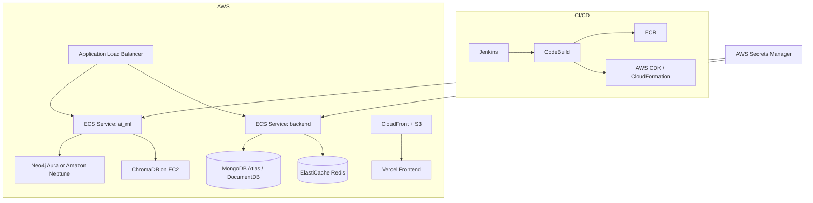

# AWS Deployment Overview

DocuThinker is primarily deployed on Vercel (frontend) and Render (backend) today, but the refreshed AI/ML platform is ready for an AWS footprint. The reference architecture below assumes:

- **Frontend** remains on Vercel (SSR Next.js) while we add a CloudFront distribution for static fallbacks.
- **Backend API** containerized on **AWS ECS Fargate** behind an Application Load Balancer.
- **AI/ML service** runs as a separate ECS task with access to Neo4j Aura or Amazon Neptune and a managed ChromaDB instance on EC2 (or Aurora if migrating).
- **CI/CD** orchestrated via Jenkins -> AWS CodeBuild for image builds, pushing to ECR, then ECS deploy.
- **Optional managed services**: Amazon OpenSearch for logs, Amazon S3 for artifacts, AWS Secrets Manager for provider API keys.

Key deployment steps:

1. **Build & Push Images** via Jenkins pipeline to Amazon ECR (frontend preview not needed due to Vercel). CI config is in `Jenkinsfile`.
2. **Provision infrastructure** using the CloudFormation templates in `aws/cloudformation/` or the CDK app in `aws/infrastructure/`.
3. **Deploy Services** by updating the ECS task definitions with new images and restarting your services.
4. **Configure Secrets** (OpenAI, Anthropic, Gemini, Neo4j, Chroma) in Secrets Manager; the AI/ML container reads them at runtime.
5. **Route Traffic**: ALB handles backend traffic, while CloudFront caches static assets and falls back to the Vercel deployment.

For local development parity, see `aws/scripts/local-env.sh` to export the required environment variables.
