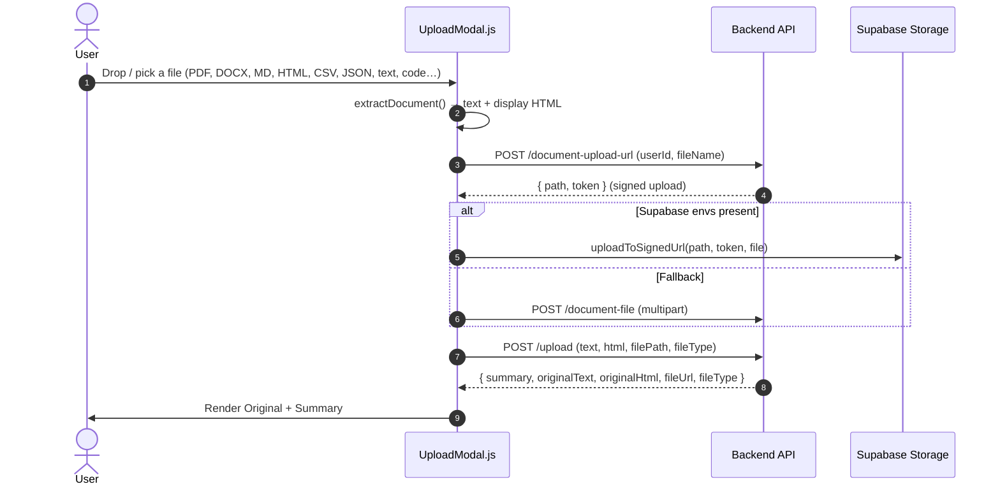
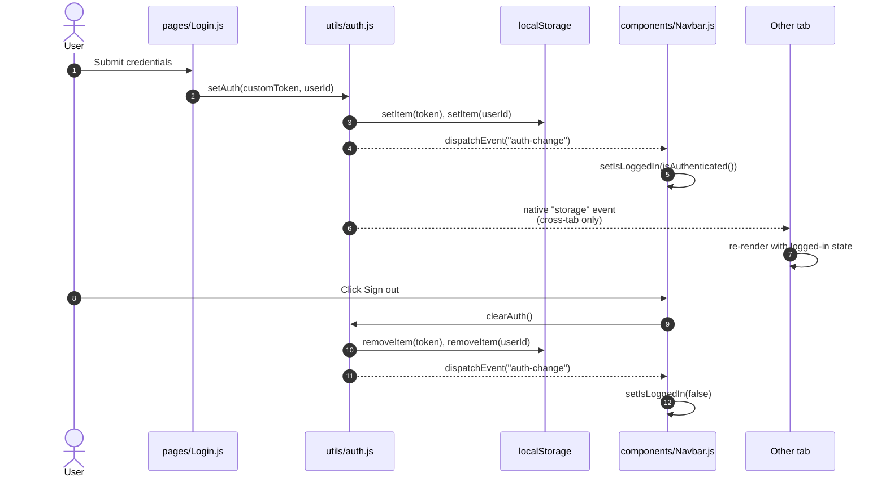
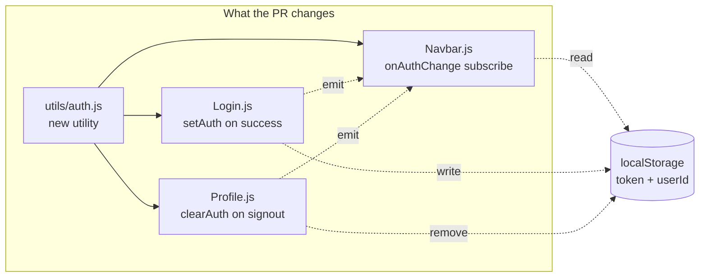

# DocuThinker Frontend

Welcome to the **Frontend** of the **DocuThinker** application! This React-based frontend integrates with the DocuThinker backend, allowing users to upload documents, chat with an AI, and extract key insights from their documents. The frontend also provides various authentication functionalities such as registration, login, and password recovery.

Documents in **many formats** — PDF, Word (DOCX), Markdown, HTML, CSV/TSV, JSON, plain text, and a broad set of code/config files — are parsed **in the browser**: clean text is extracted for the AI and a faithful display rendering is produced for the viewer, while the **original file** is uploaded directly to **Supabase Storage** so the real document can be re-rendered later — for both live uploads and reopened history.

## Table of Contents

- [Overview](#overview)
- [Tech Stack](#tech-stack)
- [Pages](#pages)
- [Key Features](#key-features)
- [Supported Upload Formats](#supported-upload-formats)
- [Document Upload & Storage Flow](#document-upload--storage-flow)
- [Original Document Viewer](#original-document-viewer)
- [AI Tools](#ai-tools)
- [File Structure](#file-structure)
- [Client-side Auth (`src/utils/auth.js`)](#client-side-auth-srcutilsauthjs)
- [Passkeys (WebAuthn)](#passkeys-webauthn)
- [Prerequisites](#prerequisites)
- [Installation](#installation)
- [Environment Variables](#environment-variables)
- [Running the App](#running-the-app)
- [Testing](#testing)
- [Screenshots](#screenshots)
- [Deployment](#deployment)
- [Contributing](#contributing)
- [License](#license)

## Overview

The **DocuThinker Frontend** is built using **React 18** and **Material-UI** to create a clean and responsive interface. It allows users to:

- Upload documents in **many formats** — PDF, Word (DOCX), Markdown, HTML, CSV/TSV, JSON, plain text, and dozens of code/config files — for AI-based summarization and key-insight generation.
- View the **original document** side-by-side with the AI summary, in **drag-resizable** columns, with each format rendered appropriately.
- Highlight any text on the results view to pop a **selection action menu** — Copy, Summarize, Rewrite, Ask Chat, or Search the web.
- Run a suite of **AI tools** on the document: key ideas, discussion points, bullet summary, translation, sentiment analysis, recommendations, rewrite, voice chat, and AI chat.
- Browse, search, sort, filter, rename, and delete previously analyzed documents.
- Register, log in, and reset their passwords.
- Sign in passwordlessly with **passkeys** (WebAuthn) and manage them from a dedicated Passkeys page.
- Toggle **dark mode** across the whole app.

> **Backend:** the app talks to the deployed backend at `https://docuthinker-app-backend-api.vercel.app`. The original file bytes are stored in **Supabase Storage** via a backend-minted signed-upload token.

## Tech Stack

| Area | Technology |
|---|---|
| **UI framework** | [React 18](https://react.dev/) (functional components + hooks) |
| **Component library** | [Material-UI (MUI) v6](https://mui.com/) with [Emotion](https://emotion.sh/) styling |
| **Font** | [Poppins](https://fontsource.org/fonts/poppins) (`@fontsource/poppins`) |
| **Routing** | [react-router-dom v6](https://reactrouter.com/) |
| **HTTP** | [axios](https://axios-http.com/) |
| **Build tooling** | [Create React App](https://create-react-app.dev/) compiled via [CRACO](https://craco.js.org/) (`craco.config.js`) |
| **Storage client** | [`@supabase/supabase-js`](https://supabase.com/docs/reference/javascript) (direct-to-Storage signed uploads) |
| **Client-side extraction** | A single `extractDocument()` dispatcher over [`pdfjs-dist`](https://github.com/mozilla/pdf.js) (PDF), [`mammoth`](https://github.com/mwilliamson/mammoth.js) (DOCX), `DOMPurify` (HTML), `file.text()` (Markdown/text/code), and a custom CSV/TSV→table + JSON pretty-printer |
| **PDF text extraction** | [`pdfjs-dist`](https://github.com/mozilla/pdf.js) (legacy build, line/paragraph reconstruction) |
| **DOCX conversion** | [`mammoth`](https://github.com/mwilliamson/mammoth.js) → plain text + display HTML |
| **HTML sanitizing** | [`dompurify`](https://github.com/cure53/DOMPurify) for the original-document viewer |
| **Markdown & summary rendering** | [`react-markdown`](https://github.com/remarkjs/react-markdown) + `remark-gfm` / `remark-math` / `rehype-katex` (KaTeX math) |
| **Drag-and-drop upload** | [`react-dropzone`](https://react-dropzone.js.org/) |
| **Google Drive import** | [`gapi-script`](https://github.com/cohaolain/gapi-script) (Drive read-only) |
| **Passkeys** | [`@simplewebauthn/browser`](https://simplewebauthn.dev/) |
| **Analytics** | Google Analytics + `@vercel/analytics` / `@vercel/speed-insights` |

## Pages

| Route | Page | Description |
|---|---|---|
| `/` | **Landing** | Marketing / welcome page with light & dark variants. |
| `/home` | **Home** | Upload a document, then view the original + summary and run all AI tools. Shows a sign-in card when logged out. |
| `/documents` | **Documents** | Instant client-side **search** (by title or summary), **sort** (newest / oldest / title A–Z / Z–A), **type filter** (PDF / Word / Markdown / HTML / CSV / JSON / Text, each with its own icon + colored chip), paginated (5 per page), plus a spinner while a doc opens. Rename, delete, or re-open any document. |
| `/profile` | **Profile** | Avatar, email, account stats (days since joined, document count), social links, and a hero card. Sign-in gated. |
| `/passkeys` | **Passkeys** | WebAuthn management — add, rename, and delete passkeys (auth-only). |
| `/how-to-use` | **How to Use** | Step-by-step guide to every feature. |
| `/login` | **Login** | Email/password, Google OAuth, and "Sign in with a passkey". |
| `/register` | **Register** | Account creation, followed by an optional "create a passkey" prompt. |
| `/forgot-password` | **Forgot Password** | Password reset flow. |

## User Interfaces

The frontend consists of several pages and components that make up the user interface. Here are the main pages:

### **Landing Page**

<p align="center">
  
</p>

### **Document Upload Page**

<p align="center">
  
</p>

### **Document Upload Page - Document Uploaded**

<p align="center">
  
</p>

### **Home Page**

<p align="center">
  
</p>

### **Home Page - Dark Mode**

<p align="center">
  
</p>

### **Chat Modal**

<p align="center">
  
</p>

### **Document Analytics**

<p align="center">
  
</p>

### **Documents Page**

<p align="center">
  
</p>

### **Profile Page**

<p align="center">
  
</p>

### **How To Use Page**

<p align="center">
  
</p>

### **Passkeys Management Page**

<p align="center">
  
</p>

### **Privacy Policy Page**

<p align="center">
  
</p>

### **Terms of Service Page**

<p align="center">
  
</p>

### **Login Page**

<p align="center">
  
</p>

### **Registration Page**

<p align="center">
  
</p>

### **Reset Password Page**

<p align="center">
  
</p>

<p align="center">
  
</p>

## Key Features

- **Document Upload**: Drag-and-drop or click-to-select (via `react-dropzone`), or import straight from **Google Drive** (`gapi-script`). Supports **PDF, Word (DOCX), Markdown, HTML, CSV/TSV, JSON, plain text, and many code/config files** — see [Supported Upload Formats](#supported-upload-formats).
- **Animated upload modal**: a hero header with format chips, a drag-active dropzone, and a multi-step animated progress flow (**Reading → Storing → Analyzing → Ready**) with a gradient shimmer bar, followed by a smooth reveal into the results view.
- **Client-side extraction**: every format is parsed **in the browser** through a single `extractDocument()` dispatcher. `pdfjs-dist` reconstructs lines/paragraphs from each text item's vertical position (instead of collapsing into one blob); `mammoth` returns raw text + structured HTML from DOCX; CSV/TSV becomes an HTML table, JSON is pretty-printed, and code/text files render as monospace blocks. The original file uploads directly to Supabase while the AI receives clean text, keeping the request payload small and Vercel-serverless-friendly.
- **Original file storage**: the **original** file (whatever its type) is uploaded directly to **Supabase Storage** so the real document can be re-rendered later. See [Document Upload & Storage Flow](#document-upload--storage-flow).
- **Original Document viewer**: each type renders appropriately — real PDF pages in a native `<iframe>`, DOCX/HTML as sanitized HTML, Markdown via `react-markdown`, CSV as a table, JSON/code in a monospace `<pre>`, and plain text as `pre-wrap` — for live uploads **and** reopened history. See [Original Document Viewer](#original-document-viewer).
- **Drag-resizable columns**: the Original | Summary split is resizable via a draggable divider (double-click to reset).
- **Text-selection action menu**: on the results view, highlight any text to pop a menu — **Copy**, **Summarize**, **Rewrite**, **Ask Chat**, **Search web** — scoped to exactly what you selected. A custom overlay keeps the highlight visible across re-renders, and native selection is styled with an on-brand orange app-wide.
- **Document analytics**: a stats modal with a readability gauge, top-word bars, word-length / sentence-length distributions, punctuation analysis, and animated counters.
- **AI tools**: summary, key ideas, discussion points, bullet summary, translate, sentiment analysis, recommendations, content rewrite, voice chat, and AI chat. See [AI Tools](#ai-tools).
- **Documents page**: instant client-side **search** (title/summary), **sort** (newest/oldest/title A–Z/Z–A), **type filter** with per-type icons and colored chips (PDF/Word/Markdown/HTML/CSV/JSON/Text), pagination, a loading spinner while opening a doc, plus rename / delete / re-open.
- **Sign-in gating**: Home, Documents, and Profile show a sign-in card when logged out — only signed-in users can upload or summarize.
- **Authentication**: Email/password, Google OAuth, password reset, and **passkeys** (WebAuthn). Session state is event-driven via `utils/auth.js` — no polling, no prop drilling.
- **Dark mode**: theme toggle across the entire app; the navbar uses an orange-accent hover (no enlarge), an Account dropdown, and a mobile drawer. Login / Register / Forgot-password, Profile, Passkeys, 404, Privacy / Terms, and the Google Drive picker are all redesigned and dark-mode-aware.
- **Responsive design**: works on desktop and mobile-form-factor browsers; for native iOS/Android see [`mobile-app/`](../mobile-app/README.md).

## Supported Upload Formats

The upload modal (`components/UploadModal.js`) accepts a wide range of formats. A single `extractDocument()` dispatcher inspects the file's MIME type / extension and routes it to the right handler, returning clean **text** (for the AI), display **HTML** (for the viewer), and a resolved **fileType**. The original file is always stored as-is; the AI only ever sees the extracted text.

| Format | Extensions | How it's extracted | Viewer rendering |
|---|---|---|---|
| **PDF** | `.pdf` | `pdfjs-dist` (line/paragraph reconstruction) | Native `<iframe>` of the real PDF |
| **Word** | `.docx` | `mammoth` → raw text + structured HTML | Sanitized HTML |
| **Markdown** | `.md`, `.markdown` | `file.text()` | `react-markdown` (GFM + KaTeX) |
| **HTML** | `.html`, `.htm` | `file.text()`, tags stripped for the AI | `DOMPurify`-sanitized HTML |
| **CSV / TSV** | `.csv`, `.tsv` | `file.text()` → parsed delimited rows | HTML `<table>` (first row = header) |
| **JSON** | `.json` | `file.text()`, pretty-printed via `JSON.stringify(…, 2)` | Monospace `<pre>` |
| **Plain text** | `.txt`, `.text`, `.log` | `file.text()` | `pre-wrap` plaintext |
| **Code / config** | `.xml` `.yaml`/`.yml` `.js`/`.jsx`/`.mjs`/`.cjs` `.ts`/`.tsx` `.py` `.java` `.c`/`.cpp`/`.cc`/`.h`/`.hpp` `.cs` `.go` `.rs` `.rb` `.php` `.sql` `.sh`/`.bash` `.css`/`.scss`/`.less` `.ini`/`.toml`/`.conf`/`.env` `.kt` `.swift` `.r` `.lua` `.pl` | `file.text()` | Monospace `<pre>` |

Unsupported files surface a clear error listing the accepted formats; nothing is sent to the backend.

## Document Upload & Storage Flow

The upload pipeline (`components/UploadModal.js` + `utils/supabaseClient.js`) does three things: extract text/HTML for the AI and viewer, store the **original** file, then ask the backend to summarize.

1. **Extract** — `extractDocument()` dispatches on the file type: `extractFromPdf` (via `pdfjs-dist`) returns clean plaintext + reconstructed `<p>` HTML; `extractFromDocx` (via `mammoth`) returns raw text **and** structured HTML; Markdown/HTML/CSV/TSV/JSON/text/code are read with `file.text()` and turned into their display form (sanitized HTML, table, pretty-printed JSON, or monospace block). See [Supported Upload Formats](#supported-upload-formats).
2. **Store the original file** — the browser asks the backend to mint a short-lived **signed upload token** (`POST /document-upload-url`), then uploads the file bytes **directly** to Supabase Storage with `supabase.storage.from(BUCKET).uploadToSignedUrl(...)`. This bypasses the serverless body-size limit, so large PDFs upload fine. If the direct upload can't run (e.g. the frontend Supabase env vars aren't set), it **falls back** to a through-backend multipart upload (`POST /document-file`). Storage is non-fatal: if it fails entirely, the app still summarizes and falls back to the HTML/text view.
3. **Summarize** — the extracted text, display HTML, stored file path, and file type are sent to `POST /upload`, which returns the summary plus a signed `fileUrl` the viewer can render.


```mermaid
sequenceDiagram
    autonumber
    actor User
    participant Modal as UploadModal.js
    participant Backend as Backend API
    participant Storage as Supabase Storage

    User->>Modal: Drop / pick a file (PDF, DOCX, MD, HTML, CSV, JSON, text, code…)
    Modal->>Modal: extractDocument() → text + display HTML
    Modal->>Backend: POST /document-upload-url (userId, fileName)
    Backend-->>Modal: { path, token } (signed upload)
    alt Supabase envs present
        Modal->>Storage: uploadToSignedUrl(path, token, file)
    else Fallback
        Modal->>Backend: POST /document-file (multipart)
    end
    Modal->>Backend: POST /upload (text, html, filePath, fileType)
    Backend-->>Modal: { summary, originalText, originalHtml, fileUrl, fileType }
    Modal->>User: Render Original + Summary
```

The Supabase browser client is created in `utils/supabaseClient.js` from `REACT_APP_SUPABASE_*` env vars. The public **anon key** cannot read the private bucket on its own — every upload is authorized by the server-minted signed token (the `service_role` key stays on the backend). When the env vars are absent the client is `null`, and callers transparently use the through-backend fallback.

## Original Document Viewer

The Home page renders the left column based on the stored file type, so the viewer works identically for a fresh upload and a document reopened from history:

| Source | Rendering |
|---|---|
| **PDF** (`fileType` includes `pdf` and a signed `fileUrl` exists) | Native `<iframe>` pointing at the signed Supabase URL — **real, paginated PDF pages**. |
| **DOCX / HTML / CSV / TSV / code** (any `originalHtml` present) | The display HTML is sanitized with **DOMPurify** and styled for headings, bold, lists, tables, blockquotes, images, and `<pre>` code blocks. |
| **Markdown** | Rendered with **`react-markdown`** (GFM tables + KaTeX math). |
| **Anything else / no file** | Readable `pre-wrap` plaintext fallback. |

While dragging the column splitter, a transparent overlay sits above the iframe so the PDF doesn't swallow the mouse events and break the drag.

## AI Tools

All AI tools run against the deployed backend. The **document title** is prepended as extra context (`withTitle(...)`) on non-persisted payloads, giving the model a stronger signal without polluting the stored text.

| Tool | What it does |
|---|---|
| **Summary** | Generated on upload; rendered as Markdown with GFM tables + KaTeX math. |
| **Key Ideas** | Extracts the most important points. |
| **Discussion Points** | Prompts for debate / group analysis. |
| **Bullet-Point Summary** | A concise bulleted digest. |
| **Change Language** | Re-renders the summary in any of ~45 languages. |
| **Sentiment Analysis** | A positive/neutral/negative meter. **Cached per document in `localStorage`** (content-addressed key) so revisits and history switches don't recompute. |
| **Document Analytics** | A client-side stats modal: a Flesch **readability gauge**, **top-word bars**, word-length and sentence-length **distributions**, **punctuation** analysis, lexical diversity, reading & speaking time, and **animated counters** — all computed in the browser. |
| **Generate Recommendations** | Actionable next steps based on the content. |
| **Rewrite Content** | Rewrites the whole document — or just a highlighted passage — in a chosen tone/style. |
| **Refine Summary** | Re-summarizes with custom instructions. |
| **Voice Chat** | Upload or record audio (`mic-recorder-to-mp3`) and talk to the AI. |
| **AI Chat** | Ask questions grounded in the document. Shows a friendly greeting when the thread is empty, and prepends the **document title** as context so the model has a stronger signal (also aware of today's date). |

## File Structure

Here is the complete file structure for the **DocuThinker Frontend**. The frontend is located under `DocuThinker-AI-App/frontend`:

```
DocuThinker-AI-App/
├── frontend/
│   ├── public/
│   │   ├── index.html                     # Main HTML template
│   │   ├── manifest.json                  # Manifest for PWA settings
│   │   └── pdf.worker.min.mjs             # Local pdf.js worker (served for client-side extraction)
│   ├── src/
│   │   ├── assets/                        # Static assets like images and fonts
│   │   │   └── logo.png                   # App logo or images
│   │   ├── components/
│   │   │   ├── ChatModal.js               # AI chat modal
│   │   │   ├── Spinner.js                 # Loading spinner component
│   │   │   ├── UploadModal.js             # Upload + client-side extraction + Supabase storage
│   │   │   ├── GoogleDriveFileSelectorModal.js  # Google Drive file picker
│   │   │   ├── PasskeyPromptModal.js      # Post-sign-up "create a passkey" modal
│   │   │   ├── useErrorToast.js           # Reusable error-toast hook
│   │   │   ├── Navbar.js                  # Navigation bar (orange-accent hover, Account dropdown, mobile drawer)
│   │   │   ├── Footer.js                  # Footer component
│   │   │   └── GoogleAnalytics.js         # Google Analytics integration component
│   │   ├── pages/
│   │   │   ├── Home.js                    # Upload + original/summary viewer + all AI tools
│   │   │   ├── DocumentsPage.js           # History: search / sort / filter / paginate / rename / delete
│   │   │   ├── Profile.js                 # Avatar, email, stats, social links, hero card
│   │   │   ├── LandingPage.js             # Welcome and information page
│   │   │   ├── Login.js                   # Login page (incl. "Sign in with a passkey")
│   │   │   ├── Register.js                # Registration page
│   │   │   ├── Passkeys.js                # Passkey management page (add/rename/delete)
│   │   │   ├── ForgotPassword.js          # Forgot password page
│   │   │   ├── PrivacyPolicy.js           # Privacy Policy page (dark-mode-aware)
│   │   │   ├── TermsOfService.js          # Terms of Service page (dark-mode-aware)
│   │   │   ├── NotFoundPage.js            # 404 page (dark-mode-aware)
│   │   │   └── HowToUse.js                # Page explaining how to use the app
│   │   ├── utils/
│   │   │   ├── auth.js                    # Event-driven client session helper
│   │   │   ├── api.js                     # Centralized API base URL
│   │   │   ├── supabaseClient.js          # Browser Supabase client (REACT_APP_SUPABASE_*)
│   │   │   └── passkeys.js                # WebAuthn (passkey) client helpers
│   │   ├── App.js                         # Main App component
│   │   ├── index.js                       # Entry point for the React app
│   │   ├── App.css                        # Global CSS 1
│   │   ├── index.css                      # Global CSS 2
│   │   ├── reportWebVitals.js             # Web Vitals reporting
│   │   ├── styles.css                     # Custom styles for different components
│   │   └── config.js                      # Configuration file for environment variables
│   ├── craco.config.js                    # CRACO config (Node polyfill fallbacks for the browser bundle)
│   ├── .env                               # Environment variables file (REACT_APP_* only)
│   ├── package.json                       # Project dependencies and scripts
│   ├── README.md                          # This README file
│   └── package-lock.json                  # Lock file for dependencies
```

### Key Folders

- **assets/**: Contains static assets such as images, fonts, etc.
- **components/**: Reusable React components like `Navbar`, `Footer`, `UploadModal`, `ChatModal`, and `GoogleAnalytics`.
- **pages/**: React components representing the different pages of the app (e.g., `Home`, `DocumentsPage`, `Profile`, `LandingPage`, `Login`).
- **utils/**: Cross-cutting client utilities — `auth.js` (event-driven session helper shared by `Login`, `Profile`, and `Navbar`), `supabaseClient.js` (browser Supabase client), `api.js`, and `passkeys.js`.
- **public/**: Contains `index.html`, `manifest.json`, and the local `pdf.worker.min.mjs` used by client-side PDF extraction — files that aren't processed by Webpack.

## Client-side Auth (`src/utils/auth.js`)

Session state lives in `localStorage` under two keys (`token`, `userId`) and is broadcast through a custom `"auth-change"` event plus the native cross-tab `storage` event. Screens subscribe via `onAuthChange(handler)` and re-render the instant the keys change — there is no polling.


```mermaid
sequenceDiagram
    autonumber
    actor User
    participant Login as pages/Login.js
    participant Auth as utils/auth.js
    participant LS as localStorage
    participant Navbar as components/Navbar.js
    participant OtherTab as Other tab

    User->>Login: Submit credentials
    Login->>Auth: setAuth(customToken, userId)
    Auth->>LS: setItem(token), setItem(userId)
    Auth-->>Navbar: dispatchEvent("auth-change")
    Navbar->>Navbar: setIsLoggedIn(isAuthenticated())
    Auth-->>OtherTab: native "storage" event<br/>(cross-tab only)
    OtherTab->>OtherTab: re-render with logged-in state

    User->>Navbar: Click Sign out
    Navbar->>Auth: clearAuth()
    Auth->>LS: removeItem(token), removeItem(userId)
    Auth-->>Navbar: dispatchEvent("auth-change")
    Navbar->>Navbar: setIsLoggedIn(false)
```

Public surface:

| Export | Use |
|---|---|
| `isAuthenticated()` | Sync `!!localStorage.getItem("userId")` |
| `setAuth(token, userId)` | Write both keys + emit |
| `clearAuth()` | Remove both keys + emit |
| `onAuthChange(handler)` | Subscribe (same tab + cross-tab); returns unsubscribe |

### Notable refactors landed in the latest PR

- **`Navbar` keys its login state on `userId`, not JWT expiry.** Custom tokens have a 1-hour `exp`, but the user's actual session is gated by the presence of `userId` — using expiry caused the navbar to flip on/off during long sessions.
- **JWT expiry timer clamped to setTimeout's 32-bit max.** Tokens with an `exp` more than ~24.8 days out previously caused `setTimeout` overflow and fired immediately. The clamp keeps the timer dormant until the cap.
- **1-second JWT polling replaced with event-driven `onAuthChange`.** Removed the redundant `setInterval` that was reading `localStorage` every tick across multiple components.
- **Dead `isLoggedIn` prop drilling removed.** `Navbar` reads auth state through the utility directly; callers no longer pass it down.
- **`jest` + `jest-environment-jsdom` declared explicitly.** The test runner no longer relies on transitive resolution and runs `npm test` cleanly.


```mermaid
flowchart LR
    subgraph PR["What the PR changes"]
        A[utils/auth.js<br/>new utility]
        B[Login.js<br/>setAuth on success]
        C[Profile.js<br/>clearAuth on signout]
        D[Navbar.js<br/>onAuthChange subscribe]
    end

    A --> B
    A --> C
    A --> D

    B -.->|emit| D
    C -.->|emit| D
    D -.->|read| LS[(localStorage<br/>token + userId)]
    B -.->|write| LS
    C -.->|remove| LS
```

## Passkeys (WebAuthn)

Passwordless sign-in is implemented with [`@simplewebauthn/browser`](https://simplewebauthn.dev/), wrapped in
`src/utils/passkeys.js`. The browser library and the backend's `@simplewebauthn/server` are a matched pair: the
server emits the options JSON consumed here, and the response JSON produced here is verified verbatim by the
server.

| Surface | What it does |
|---|---|
| `pages/Login.js` | "Sign in with a passkey" button — discoverable (usernameless) or email-scoped. On success it calls the same `setAuth(token, userId)` as password login. |
| `components/PasskeyPromptModal.js` | Shown right after sign-up to invite the user to enroll their first passkey (a styled modal, **never** a native `alert`/`prompt`). |
| `pages/Passkeys.js` | Account-only page (guarded by `RequireAuth`) to add, rename, and delete multiple passkeys, with "Synced / This device" badges and themed dialogs. |
| `components/Navbar.js` | When signed in, the Logout button becomes an **Account** dropdown → **Passkeys** + **Log Out** (Log Out stays destructive-red); the mobile drawer gets a Passkeys entry. |

`utils/passkeys.js` exposes `isPasskeySupported()`, `registerPasskey()`, `authenticateWithPasskey()`,
`listPasskeys()`, `renamePasskey()`, and `deletePasskey()`. The backend origin comes from `utils/api.js`
(`REACT_APP_API_BASE_URL`, falling back to the deployed backend).

## Prerequisites

Before you begin, ensure you have the following installed on your machine:

- **Node.js** (v18 or higher recommended)
- **npm** or **yarn**
- **Backend API** — by default the app calls the deployed backend at `https://docuthinker-app-backend-api.vercel.app`, so no local backend is strictly required to run the UI. To point at a local backend, see the [backend setup guide](../backend/README.md).
- **(Optional) Supabase project** — for the original-document storage flow. Without it, uploads transparently fall back to the through-backend path. See [Environment Variables](#environment-variables).
- **(Optional) Google Cloud project** with the Drive API enabled — only needed for the "Select from Google Drive" import button.

## Installation

To get started, follow these steps:

1. **Clone the repository**:

   ```bash
   git clone https://github.com/hoangsonww/DocuThinker-AI-App.git
   cd DocuThinker-AI-App/frontend
   ```

2. **Install dependencies**:
   Using npm:
   ```bash
   npm install
   ```
   or using Yarn:
   ```bash
   yarn install
   ```

## Environment Variables

Create an `.env` file in the `frontend/` directory. Every variable **must** be prefixed with `REACT_APP_` — Create React App only exposes `REACT_APP_*` variables to the bundle, and they are **baked in at build time**, so you must rebuild after changing them (and never put secrets like a Supabase `service_role` key here — only browser-safe public values).

```bash
# --- Backend (optional; defaults to the deployed backend) ---
REACT_APP_BACKEND_URL=http://localhost:3000          # Backend URL for API requests
REACT_APP_API_BASE_URL=http://localhost:3000         # Backend origin for passkey/API calls

# --- Supabase Storage (original-document upload flow) ---
REACT_APP_SUPABASE_URL=https://<project>.supabase.co # Supabase project URL
REACT_APP_SUPABASE_ANON_KEY=<public-anon-key>        # Public anon key (browser-safe)
REACT_APP_SUPABASE_BUCKET=docuthinker                # Storage bucket name (default: docuthinker)

# --- Google Drive import (optional) ---
REACT_APP_GOOGLE_DRIVE_API_KEY=<api-key>             # Google API key with Drive API enabled
REACT_APP_GOOGLE_DRIVE_CLIENT_ID=<oauth-client-id>   # Google OAuth client ID

# --- Analytics (optional) ---
REACT_APP_GOOGLE_ANALYTICS_ID=G-XXXXXX               # Google Analytics ID
```

**Notes**

- **Supabase vars** power the direct-to-Storage upload in `utils/supabaseClient.js`. If `REACT_APP_SUPABASE_URL` or `REACT_APP_SUPABASE_ANON_KEY` is missing, the browser client is `null` and uploads **fall back** to the through-backend path automatically — the app still works. `REACT_APP_SUPABASE_BUCKET` defaults to `docuthinker` when unset. The anon key cannot read the private bucket on its own; uploads are authorized by a short-lived signed-upload token minted by the backend.
- **Google Drive vars** are only needed for the "Select from Google Drive" button in the upload modal. Leave them unset to use device upload only.
- All variables are **public** in the shipped bundle. Keep service-role / secret keys on the backend.

## Running the App

The app is built with **Create React App via CRACO** — the npm scripts call `craco start` / `craco build` (defined in `package.json`), and `craco.config.js` adds the Node polyfill fallbacks (`crypto`, `stream`, `buffer`, `util`, `vm`) that the browser bundle needs.

1. **Start the development server**:

   ```bash
   npm start      # alias: npm run dev  → runs `craco start`
   ```

   or if using **yarn**:

   ```bash
   yarn start
   ```

2. Open your browser and navigate to `http://localhost:3000` (or the port CRA assigns / the `PORT` you configured).

3. **Build for production**:

   ```bash
   npm run build  # runs `craco build` → outputs to build/
   ```

### Scripts

Here are the most important scripts available in `package.json`:

| Script | Command | Description |
|---|---|---|
| `npm start` / `npm run dev` | `craco start` | Starts the app in development mode. |
| `npm run build` | `craco build` | Builds the production bundle into `build/`. |
| `npm test` | `jest` | Runs the test suite. |
| `npm run test:watch` | `jest --watch` | Runs tests in watch mode. |
| `npm run test:coverage` | `jest --coverage` | Runs tests with a coverage report. |

## Testing

The test runner is `jest` with `jest-environment-jsdom`. Both are declared explicitly in `package.json` (no transitive-only resolution). The `npm test` script runs `jest` directly, which does not watch by default:

```bash
npm test                 # single run
npm run test:watch       # watch mode
npm run test:coverage    # with a coverage report
```

There are six suites under `src/__tests__/` covering structure, package metadata, source content, deps, runtime basics, and README presence.

## Screenshots

Here are some screenshots of the **DocuThinker Frontend**:

### Landing Page

[Placeholder for Landing Page Screenshot - Centered]

### Document Upload

[Placeholder for Document Upload Screenshot - Centered]

### Login Page

[Placeholder for Login Page Screenshot - Centered]

> **Note**: Replace the placeholders with actual screenshots once you have them. You can take screenshots using your browser or a screenshot tool.

## Deployment

### Deploying to Vercel

To deploy the app to **Vercel**, follow these steps:

1. Create an account on [Vercel](https://vercel.com/) if you don't have one.
2. Install the Vercel CLI:
   ```bash
   npm install -g vercel
   ```
3. Link your project:
   ```bash
   vercel
   ```
4. Deploy the project:
   ```bash
   vercel --prod
   ```

You can also configure the project in Vercel's dashboard and trigger deployments from your GitHub repository.

## Contributing

We welcome contributions from the community! If you'd like to contribute, please follow these steps:

1. Fork the repository.
2. Create a new branch:
   ```bash
   git checkout -b feature/your-feature
   ```
3. Make your changes and commit them:
   ```bash
   git commit -m "Add your feature"
   ```
4. Push the changes to your forked repository:
   ```bash
   git push origin feature/your-feature
   ```
5. Open a pull request to the main repository.

## License

This project is licensed under the MIT License. See the [LICENSE](LICENSE.md) file for details.

---

Happy coding! 🚀
