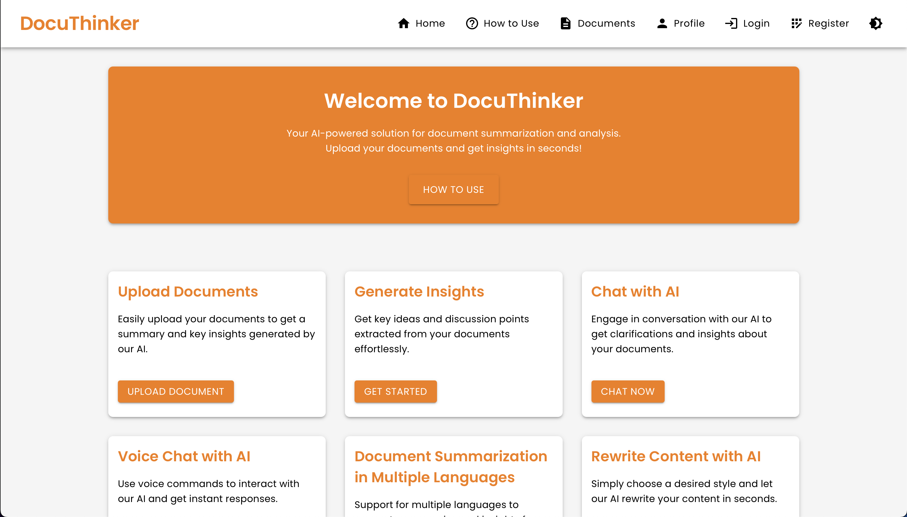

# DocuThinker Frontend

Welcome to the **Frontend** of the **DocuThinker** application! This React-based frontend integrates with the DocuThinker backend, allowing users to upload documents, chat with an AI, and extract key insights from their documents. The frontend also provides various authentication functionalities such as registration, login, and password recovery.

## Table of Contents

- [Overview](#overview)
- [File Structure](#file-structure)
- [Prerequisites](#prerequisites)
- [Installation](#installation)
- [Environment Variables](#environment-variables)
- [Running the App](#running-the-app)
- [Key Features](#key-features)
- [Screenshots](#screenshots)
- [Deployment](#deployment)
- [Contributing](#contributing)
- [License](#license)

## Overview

The **DocuThinker Frontend** is built using **React** and **Material-UI** to create a clean and responsive interface. It allows users to:

- Upload documents (PDF or Word) for AI-based summarization and key insights generation.
- Register, log in, and reset their passwords.
- View and interact with the document processing results in a user-friendly way.

## User Interfaces

The frontend consists of several pages and components that make up the user interface. Here are the main pages:

### Landing Page

<p align="center">
  
</p>

### Landing Page - Dark Mode

<p align="center">
  
</p>

### Document Upload Page

<p align="center">
  
</p>

### Document Upload Page - Dark Mode

<p align="center">
  
</p>

### Home Page

<p align="center">
  
</p>

### Home Page - Dark Mode

<p align="center">
  
</p>

### Home Page - With Key Ideas

<p align="center">
  
</p>

### Chat Modal

<p align="center">
  
</p>

### Chat Modal - Dark Mode

<p align="center">
  
</p>

### How To Use Page

<p align="center">
  
</p>

### How To Use Page - Dark Mode

<p align="center">
  
</p>

### Login Page

<p align="center">
  
</p>

### Login Page - Dark Mode

<p align="center">
  
</p>

### Register Page

<p align="center">
  
</p>

### Register Page - Dark Mode

<p align="center">
  
</p>

### Forgot Password Page

<p align="center">
  
</p>

### Forgot Password Page - Dark Mode

<p align="center">
  
</p>

### Responsive Design - Example

<p align="center">
  
</p>

## File Structure

Here is the complete file structure for the **DocuThinker Frontend**. The frontend is located under `DocuThinker-AI-App/frontend`:

```
DocuThinker-AI-App/
├── frontend/
│   ├── public/
│   │   ├── index.html                # Main HTML template
│   │   └── manifest.json             # Manifest for PWA settings
│   ├── src/
│   │   ├── assets/                   # Static assets like images and fonts
│   │   │   └── logo.png              # App logo or images
│   │   ├── components/
│   │   │   ├── ChatModal.js          # Chat modal component
│   │   │   ├── Spinner.js            # Loading spinner component
│   │   │   ├── UploadModal.js        # Document upload modal component
│   │   │   ├── Navbar.js             # Navigation bar component
│   │   │   ├── Footer.js             # Footer component
│   │   │   └── GoogleAnalytics.js    # Google Analytics integration component
│   │   ├── pages/
│   │   │   ├── Home.js               # Home page where documents are uploaded
│   │   │   ├── LandingPage.js        # Welcome and information page
│   │   │   ├── Login.js              # Login page
│   │   │   ├── Register.js           # Registration page
│   │   │   ├── ForgotPassword.js     # Forgot password page
│   │   │   └── HowToUse.js           # Page explaining how to use the app
│   │   ├── App.js                    # Main App component
│   │   ├── index.js                  # Entry point for the React app
│   │   ├── App.css                   # Global CSS 1
│   │   ├── index.css                 # Global CSS 2
│   │   ├── reportWebVitals.js        # Web Vitals reporting
│   │   ├── styles.css                # Custom styles for different components
│   │   └── config.js                 # Configuration file for environment variables
│   ├── .env                          # Environment variables file (e.g., REACT_APP_BACKEND_URL)
│   ├── package.json                  # Project dependencies and scripts
│   ├── README.md                     # This README file
│   └── package.lock                  # Lock file for dependencies
```

### Key Folders

- **assets/**: Contains static assets such as images, fonts, etc.
- **components/**: Reusable React components like `Navbar`, `Footer`, and `GoogleAnalytics`.
- **pages/**: React components representing the different pages of the app (e.g., `Home`, `LandingPage`, `Login`).
- **public/**: Contains the `index.html` and other public files that aren't processed by Webpack.

## Prerequisites

Before you begin, ensure you have the following installed on your machine:

- **Node.js** (v14 or higher)
- **npm** or **yarn**
- **Backend API** (Ensure that the backend is set up and running. You can find the backend setup guide in the [backend directory](../backend/README.md)).

## Installation

To get started, follow these steps:

1. **Clone the repository**:

   ```bash
   git clone https://github.com/hoangsonww/DocuThinker-AI-App.git
   cd DocuThinker-AI-App/frontend
   ```

2. **Install dependencies**:
   Using npm:
   ```bash
   npm install
   ```
   or using Yarn:
   ```bash
   yarn install
   ```

## Environment Variables

Ensure you have an `.env` file in the `frontend/` directory with the necessary environment variables:

```bash
REACT_APP_BACKEND_URL=http://localhost:3000       # Backend URL for API requests
REACT_APP_GOOGLE_ANALYTICS_ID=G-XXXXXX            # Google Analytics ID (optional)
```

## Running the App

1. **Start the development server**:

   ```bash
   npm start
   ```

   or if using **yarn**:

   ```bash
   yarn start
   ```

2. Open your browser and navigate to `http://localhost:3001` (or the port you configured).

### Scripts

Here are the most important scripts available in the `package.json`:

- **Start**:

  ```bash
  npm start
  ```

  Starts the React app in development mode.

- **Build**:

  ```bash
  npm run build
  ```

  Builds the app for production in the `build/` directory.

- **Test**:
  ```bash
  npm test
  ```
  Runs the test suite for the project.

## Key Features

- **Document Upload**: Users can upload documents (PDF, Word) and get real-time AI summaries and key insights.
- **Authentication**: Users can register, log in, and reset their passwords.
- **Google Analytics Integration**: User activity is tracked via Google Analytics.
- **Dark Mode Support**: Theme toggle between dark and light modes.
- **Responsive Design**: Works well on both desktop and mobile devices.

## Screenshots

Here are some screenshots of the **DocuThinker Frontend**:

### Landing Page

[Placeholder for Landing Page Screenshot - Centered]

### Document Upload

[Placeholder for Document Upload Screenshot - Centered]

### Login Page

[Placeholder for Login Page Screenshot - Centered]

> **Note**: Replace the placeholders with actual screenshots once you have them. You can take screenshots using your browser or a screenshot tool.

## Deployment

### Deploying to Vercel

To deploy the app to **Vercel**, follow these steps:

1. Create an account on [Vercel](https://vercel.com/) if you don't have one.
2. Install the Vercel CLI:
   ```bash
   npm install -g vercel
   ```
3. Link your project:
   ```bash
   vercel
   ```
4. Deploy the project:
   ```bash
   vercel --prod
   ```

You can also configure the project in Vercel's dashboard and trigger deployments from your GitHub repository.

## Contributing

We welcome contributions from the community! If you'd like to contribute, please follow these steps:

1. Fork the repository.
2. Create a new branch:
   ```bash
   git checkout -b feature/your-feature
   ```
3. Make your changes and commit them:
   ```bash
   git commit -m "Add your feature"
   ```
4. Push the changes to your forked repository:
   ```bash
   git push origin feature/your-feature
   ```
5. Open a pull request to the main repository.

## License

This project is licensed under the MIT License. See the [LICENSE](LICENSE.md) file for details.

---

Happy coding! 🚀
