# DocuThinker Mobile — React Native + Expo

The DocuThinker mobile app is a production-grade React Native (Expo SDK 51) client that talks directly to the deployed DocuThinker backend. It mirrors the web frontend's auth model and feature surface so users can sign in once and analyze, browse, and chat with their documents from iOS or Android.

---

## Table of Contents

- [Overview](#overview)
- [Architecture](#architecture)
- [Screen Map](#screen-map)
- [Auth Flow](#auth-flow)
- [API Client](#api-client)
- [State & Data Lifecycle](#state--data-lifecycle)
- [Project Structure](#project-structure)
- [Getting Started](#getting-started)
- [Running on Emulators](#running-on-emulators)
- [Environment & Backend](#environment--backend)
- [Upload Limitation](#upload-limitation)
- [Testing](#testing)
- [Troubleshooting](#troubleshooting)
- [Roadmap](#roadmap)
- [License](#license)

---

## Overview

| | |
|---|---|
| **Framework** | React Native 0.74 via Expo SDK 51 |
| **Language** | TypeScript |
| **Router** | `expo-router` (file-based routing, typed routes enabled) |
| **State** | React hooks + module-level event emitter (no Redux) |
| **Persistence** | `@react-native-async-storage/async-storage` |
| **Backend** | `https://docuthinker-app-backend-api.vercel.app` (shared with web) |
| **Auth model** | Firebase custom token + userId, identical to web client |
| **Runtime** | Expo Go (SDK 51) — `npx expo start` |
| **Min targets** | iOS 14+, Android 7+ |

The app **is not a shell or mock**. Every screen reads from the same Vercel backend the web frontend uses. Sample data is limited to static UI copy (the four feature tiles on the Home screen).

---

## Screenshots

Every screen, captured on real signed-in state (account `newemail@example.com`, ~37 docs, 590 days active). iOS shots are iPhone 16 Pro / iOS 18.5. Android shots are Pixel 6 / API 34. For deep dives and walkthroughs, see [MOBILE_APPS.md](../MOBILE_APPS.md).

### Unauthenticated

| Login | Register | Forgot password |
| --- | --- | --- |
| 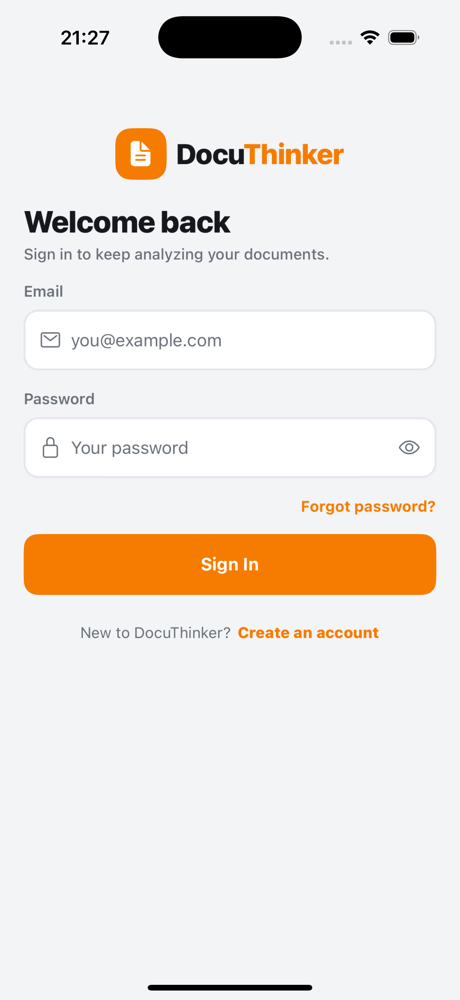 | 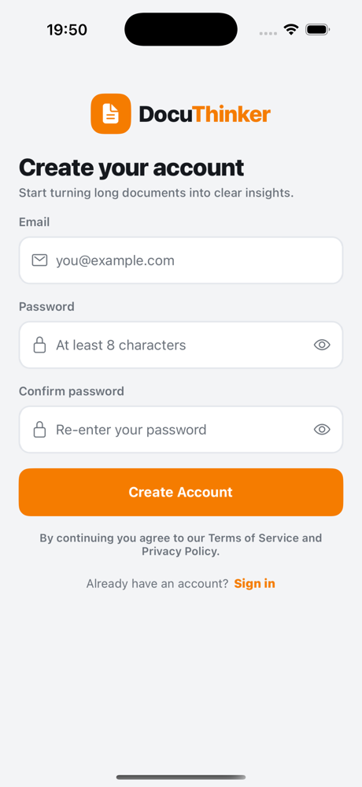 | 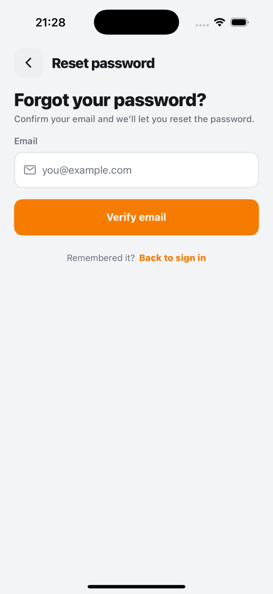 |
| 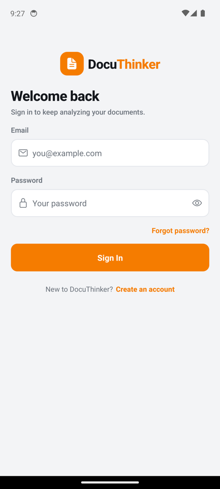 | 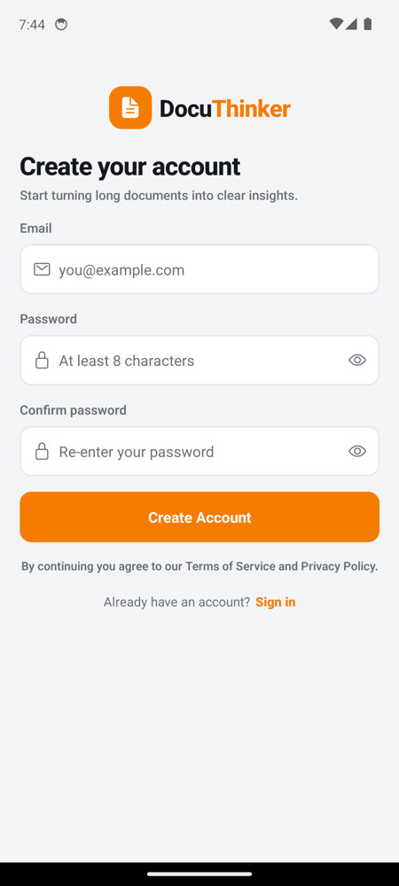 | 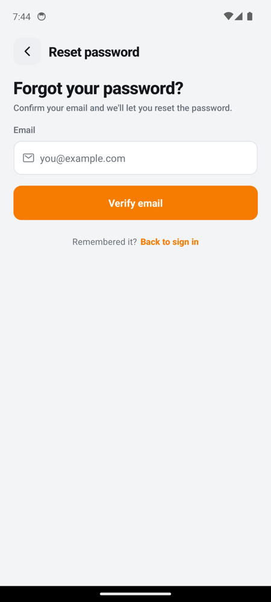 |

### Authenticated tabs

| Home | Library | Profile |
| --- | --- | --- |
|  | 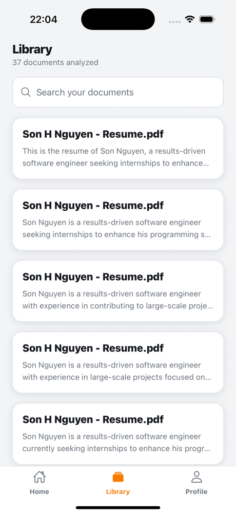 | 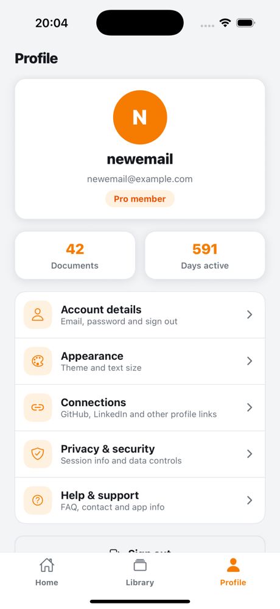 |
|  | 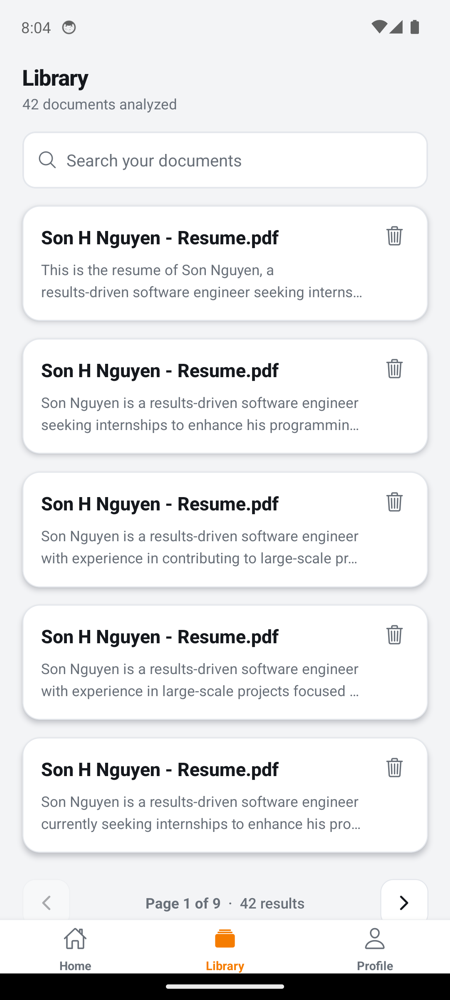 | 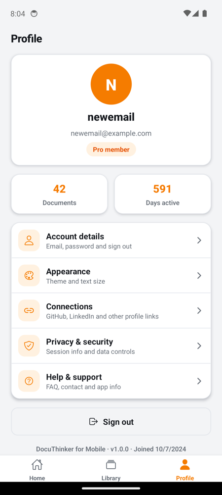 |

### Document flow

| Upload | Summary | Chat |
| --- | --- | --- |
| 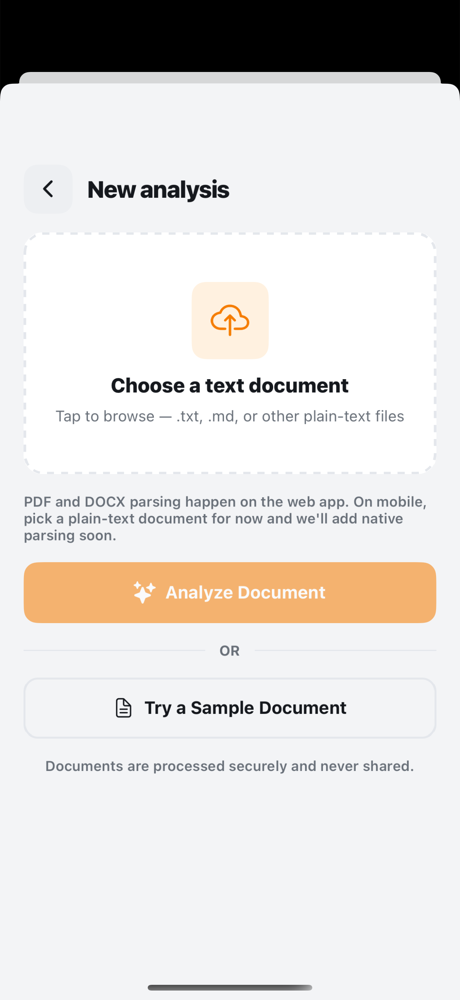 | 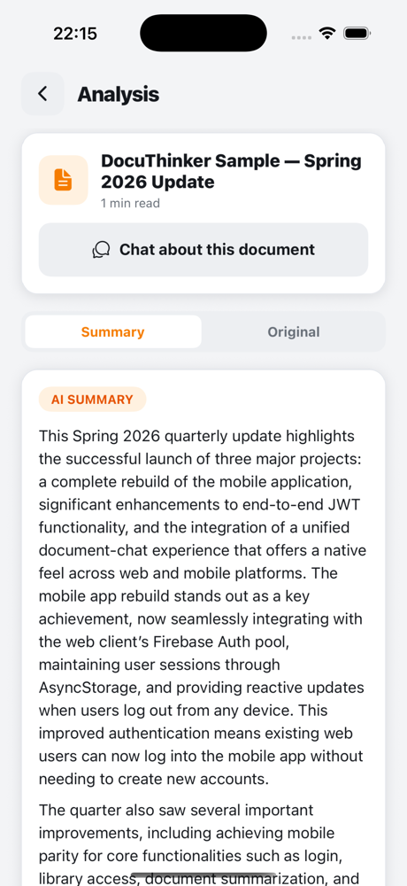 | 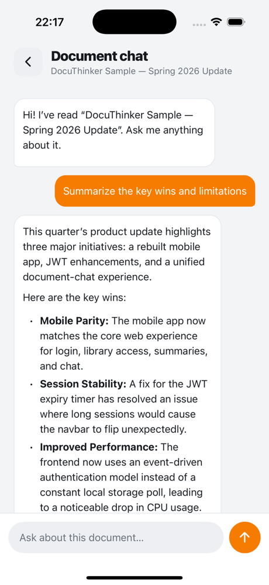 |
| 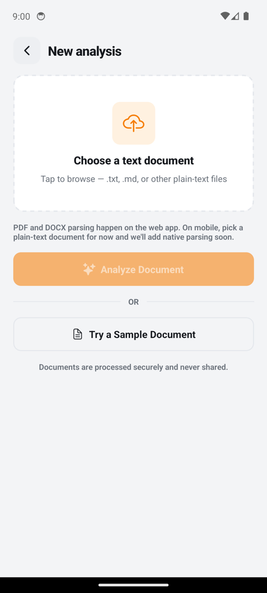 | 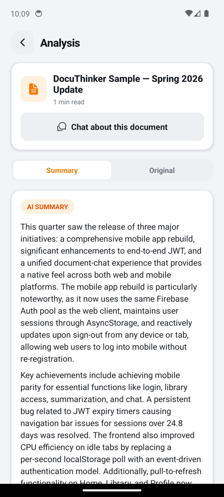 | 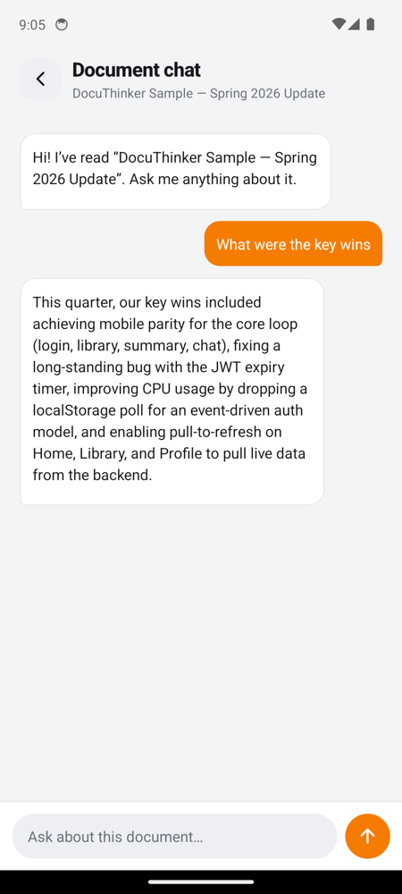 |

> Summary and Chat both render Markdown via `react-native-markdown-display` (see `components/MarkdownText.tsx`) so bold text, bullet lists, and code blocks show up the same way they do in the web app's `ReactMarkdown` output.

---

## Architecture

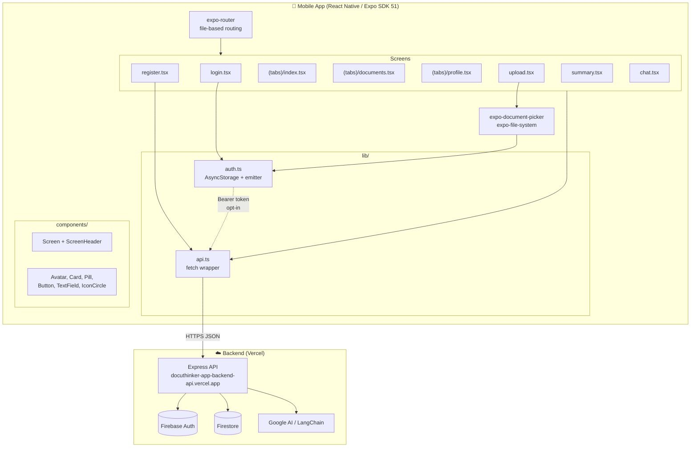
```mermaid
graph TB
    subgraph Mobile["📱 Mobile App (React Native / Expo SDK 51)"]
        direction TB
        Router["expo-router<br/>file-based routing"]
        subgraph Screens["Screens"]
            Login[login.tsx]
            Register[register.tsx]
            Home["(tabs)/index.tsx"]
            Docs["(tabs)/documents.tsx"]
            Profile["(tabs)/profile.tsx"]
            Upload[upload.tsx]
            Summary[summary.tsx]
            Chat[chat.tsx]
        end
        subgraph Lib["lib/"]
            Auth["auth.ts<br/>AsyncStorage + emitter"]
            API["api.ts<br/>fetch wrapper"]
        end
        subgraph UI["components/"]
            Screen["Screen + ScreenHeader"]
            UIKit["Avatar, Card, Pill,<br/>Button, TextField, IconCircle"]
        end
        Pickers["expo-document-picker<br/>expo-file-system"]
    end

    subgraph Backend["☁️ Backend (Vercel)"]
        REST["Express API<br/>docuthinker-app-backend-api.vercel.app"]
        FB[(Firebase Auth)]
        FS[(Firestore)]
        AI[Google AI / LangChain]
    end

    Router --> Screens
    Login --> Auth
    Register --> API
    Screens --> API
    Upload --> Pickers
    Pickers --> Auth
    Auth -.->|Bearer token<br/>opt-in| API
    API -->|HTTPS JSON| REST
    REST --> FB
    REST --> FS
    REST --> AI
```

The data plane is a single `fetch` wrapper (`lib/api.ts`) that all screens consume. The control plane is a tiny module-level emitter in `lib/auth.ts` that broadcasts login/logout — `app/_layout.tsx` subscribes to it and redirects between the auth stack (`/login`, `/register`) and the tabs group depending on whether a `userId` is present.

---

## Screen Map

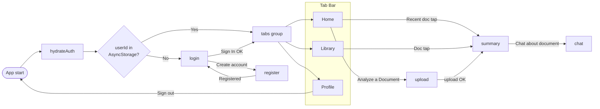
```mermaid
flowchart LR
    Boot(["App start"]) --> Hydrate["hydrateAuth"]
    Hydrate --> Authed{"userId in<br/>AsyncStorage?"}
    Authed -- "No" --> LoginRoute["login"]
    Authed -- "Yes" --> Tabs["tabs group"]

    LoginRoute -- "Sign In OK" --> Tabs
    LoginRoute -- "Create account" --> RegRoute["register"]
    RegRoute -- "Registered" --> LoginRoute

    subgraph TabBar["Tab Bar"]
        TabHome["Home"]
        TabLib["Library"]
        TabProf["Profile"]
    end

    Tabs --> TabHome
    Tabs --> TabLib
    Tabs --> TabProf

    TabHome -- "Analyze a Document" --> UploadRoute["upload"]
    TabHome -- "Recent doc tap" --> SummaryRoute["summary"]
    TabLib -- "Doc tap" --> SummaryRoute
    UploadRoute -- "upload OK" --> SummaryRoute
    SummaryRoute -- "Chat about document" --> ChatRoute["chat"]
    TabProf -- "Sign out" --> Boot
```

Every transition out of an authed route into `/login` flows through `clearAuth()`, which removes the AsyncStorage keys and broadcasts to the root layout — no hard refresh required.

---

## Auth Flow

Mobile auth is intentionally symmetric with `frontend/src/utils/auth.js`. The same backend endpoints, same `customToken` + `userId` storage keys, same event-driven re-render strategy.

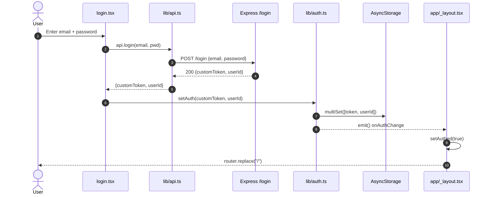
```mermaid
sequenceDiagram
    autonumber
    actor User
    participant Login as login.tsx
    participant API as lib/api.ts
    participant Backend as Express /login
    participant Auth as lib/auth.ts
    participant Storage as AsyncStorage
    participant Layout as app/_layout.tsx

    User->>Login: Enter email + password
    Login->>API: api.login(email, pwd)
    API->>Backend: POST /login {email, password}
    Backend-->>API: 200 {customToken, userId}
    API-->>Login: {customToken, userId}
    Login->>Auth: setAuth(customToken, userId)
    Auth->>Storage: multiSet([token, userId])
    Auth-->>Layout: emit() onAuthChange
    Layout->>Layout: setAuthed(true)
    Layout-->>User: router.replace("/")
```

Sign-out reverses the flow: `clearAuth()` → `AsyncStorage.multiRemove` → emit → layout redirects to `/login`.

`lib/auth.ts` API:

| Function | Purpose |
|---|---|
| `hydrateAuth()` | One-shot async read of stored credentials at boot; populates module cache |
| `isAuthenticated()` | Sync check against cached `userId` |
| `getToken()` / `getUserId()` | Sync accessors for `api.ts` and screens |
| `setAuth(token, userId)` | Persist + emit |
| `clearAuth()` | Wipe + emit |
| `onAuthChange(handler)` | Subscribe; returns unsubscribe |

---

## API Client

`lib/api.ts` wraps `fetch` with three concerns: JSON content-type defaults, optional `Authorization: Bearer <token>` when callers pass `auth: true`, and error normalization (server `error`/`message` body → thrown `Error.message`).

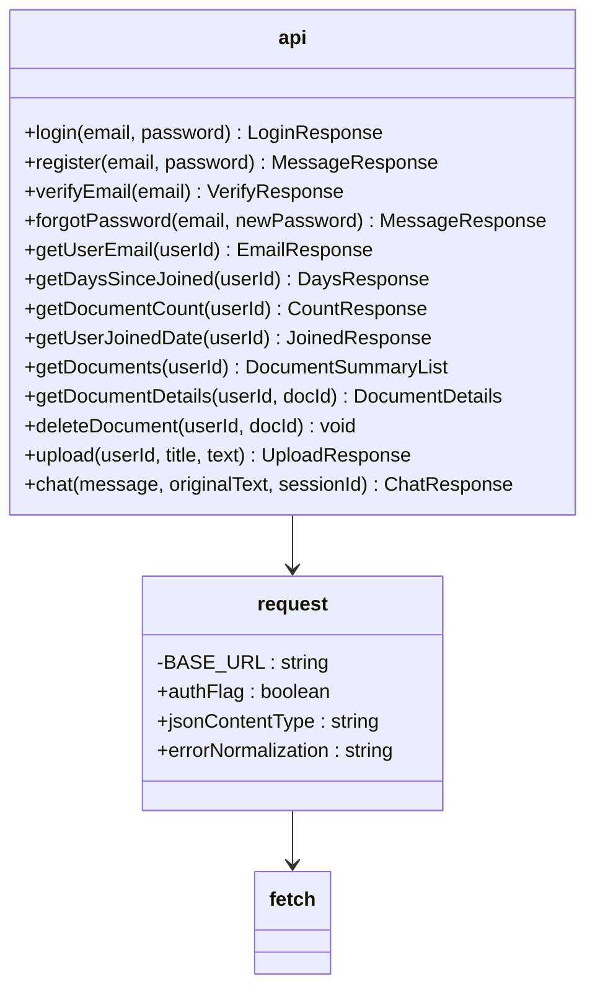
```mermaid
classDiagram
    class api {
        +login(email, password) LoginResponse
        +register(email, password) MessageResponse
        +verifyEmail(email) VerifyResponse
        +forgotPassword(email, newPassword) MessageResponse
        +getUserEmail(userId) EmailResponse
        +getDaysSinceJoined(userId) DaysResponse
        +getDocumentCount(userId) CountResponse
        +getUserJoinedDate(userId) JoinedResponse
        +getDocuments(userId) DocumentSummaryList
        +getDocumentDetails(userId, docId) DocumentDetails
        +deleteDocument(userId, docId) void
        +upload(userId, title, text) UploadResponse
        +chat(message, originalText, sessionId) ChatResponse
    }
    class request {
        -BASE_URL : string
        +authFlag : boolean
        +jsonContentType : string
        +errorNormalization : string
    }
    api --> request
    request --> fetch
```

### Screen → endpoint coverage

| Screen | Endpoints |
|---|---|
| `login.tsx` | `POST /login` |
| `register.tsx` | `POST /register` |
| `(tabs)/index.tsx` (Home) | `GET /users/:id`, `/document-count/:id`, `/days-since-joined/:id`, `/documents/:id` |
| `(tabs)/documents.tsx` (Library) | `GET /documents/:id` |
| `(tabs)/profile.tsx` | `GET /users/:id`, `/document-count/:id`, `/days-since-joined/:id`, `/user-joined-date/:id` |
| `upload.tsx` | `POST /upload` (plain-text body) |
| `summary.tsx` | `GET /document-details/:userId/:docId` (when navigating from list) |
| `chat.tsx` | `POST /chat` |

---

## State & Data Lifecycle

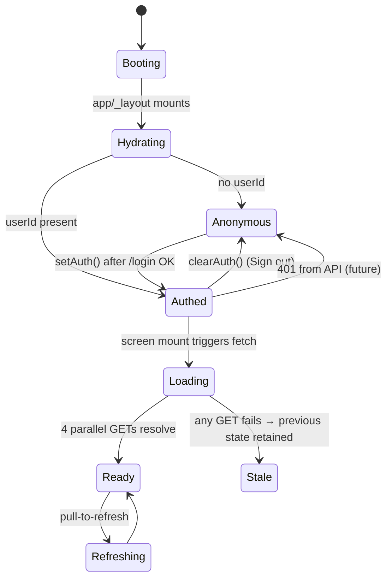
```mermaid
stateDiagram-v2
    [*] --> Booting
    Booting --> Hydrating: app/_layout mounts
    Hydrating --> Anonymous: no userId
    Hydrating --> Authed: userId present

    Anonymous --> Authed: setAuth() after /login OK
    Authed --> Loading: screen mount triggers fetch
    Loading --> Ready: 4 parallel GETs resolve
    Loading --> Stale: any GET fails → previous state retained
    Ready --> Refreshing: pull-to-refresh
    Refreshing --> Ready

    Authed --> Anonymous: clearAuth() (Sign out)
    Authed --> Anonymous: 401 from API (future)
```

Each tab is responsible for its own data. There is no global store — by design, since each screen needs only its own slice, and React Query / Redux would be overkill for this surface. Pull-to-refresh re-runs the `useCallback` loader on Home, Library, and Profile.

---

## Project Structure

```
mobile-app/
├── app/
│   ├── _layout.tsx              # Root stack + auth gate (hydrates, redirects)
│   ├── login.tsx                # Email/password sign-in; persists via setAuth
│   ├── register.tsx             # New account → redirects to /login
│   ├── upload.tsx               # Document picker + /upload + → /summary
│   ├── summary.tsx              # Renders summary from /upload OR /document-details
│   ├── chat.tsx                 # /chat round-tripping with originalText + sessionId
│   ├── +html.tsx
│   ├── +not-found.tsx
│   └── (tabs)/
│       ├── _layout.tsx          # Bottom tab bar (Home, Library, Profile)
│       ├── index.tsx            # Home: stats + recent docs + CTA
│       ├── documents.tsx        # Library: searchable real /documents list
│       └── profile.tsx          # Profile: real user data, settings rows, sign out
├── components/
│   ├── Screen.tsx               # Layout primitives + scrollProps RefreshControl
│   └── ui.tsx                   # Avatar, Card, Pill (with `align`), Button, …
├── constants/
│   ├── sampleData.ts            # Only homeFeatures (static UI copy)
│   ├── theme.ts                 # Brand tokens, spacing, radius, fontSize
│   └── Colors.ts
├── lib/
│   ├── auth.ts                  # AsyncStorage + module emitter (NEW)
│   └── api.ts                   # fetch wrapper + endpoint map (EXPANDED)
├── hooks/
│   └── useColorScheme.{ts,web.ts}
├── assets/
├── app.json                     # Expo config (scheme: docuthinker)
├── package.json
└── tsconfig.json
```

---

## Getting Started

### Prerequisites

- **Node.js 18+**
- **Expo CLI** via `npx expo` (no global install required)
- **Xcode 15+** with at least one iOS Simulator runtime + device (for iOS)
- **Android Studio** with an AVD (for Android)
- **Expo Go for SDK 51** on simulators/devices — `npx expo start` will offer to install it the first time

### Install

```bash
cd mobile-app
npm ci
```

### Start the dev server

```bash
npx expo start
```

The server listens on `http://localhost:8081`. Use Metro's `i` / `a` hotkeys to attach iOS / Android.

---

## Running on Emulators

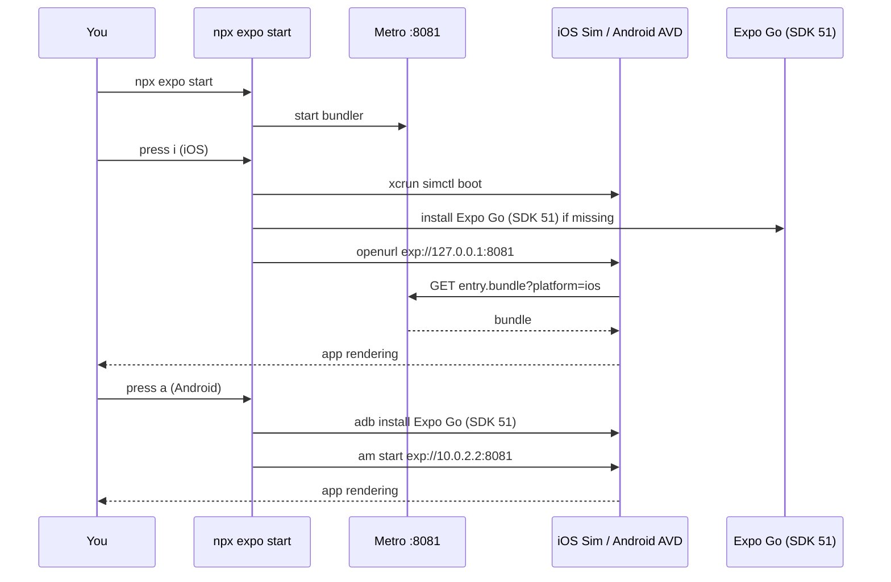
```mermaid
sequenceDiagram
    participant Dev as You
    participant CLI as npx expo start
    participant Metro as Metro :8081
    participant Sim as iOS Sim / Android AVD
    participant Go as Expo Go (SDK 51)

    Dev->>CLI: npx expo start
    CLI->>Metro: start bundler
    Dev->>CLI: press i (iOS)
    CLI->>Sim: xcrun simctl boot
    CLI->>Go: install Expo Go (SDK 51) if missing
    CLI->>Sim: openurl exp://127.0.0.1:8081
    Sim->>Metro: GET entry.bundle?platform=ios
    Metro-->>Sim: bundle
    Sim-->>Dev: app rendering
    Dev->>CLI: press a (Android)
    CLI->>Sim: adb install Expo Go (SDK 51)
    CLI->>Sim: am start exp://10.0.2.2:8081
    Sim-->>Dev: app rendering
```

### Manual deep-links (if hotkeys aren't available)

```bash
# iOS Simulator (host = 127.0.0.1)
xcrun simctl openurl booted "exp://127.0.0.1:8081"

# Android AVD (host = 10.0.2.2 because AVD's localhost is the device itself)
adb shell am start -a android.intent.action.VIEW -d "exp://10.0.2.2:8081" host.exp.exponent
```

### SDK 51 vs SDK 52 Expo Go

Expo Go pins one SDK runtime per device. If Go is already installed at a different SDK, `expo start` prompts you to reinstall. Reverting is symmetric — opening another SDK 52 project later will prompt to reinstall SDK 52 Go.

---

## Environment & Backend

`lib/api.ts` hard-codes:

```ts
export const BASE_URL = "https://docuthinker-app-backend-api.vercel.app";
```

There is no `.env` for mobile in this PR. To point at a local backend, edit `BASE_URL` (and remember Android emulators reach the host as `10.0.2.2`, not `localhost`). The deployed Vercel backend uses the same Firebase project the web frontend authenticates against — accounts created via [docuthinker.vercel.app](https://docuthinker.vercel.app) sign in on mobile without any extra step.

---

## Upload Limitation

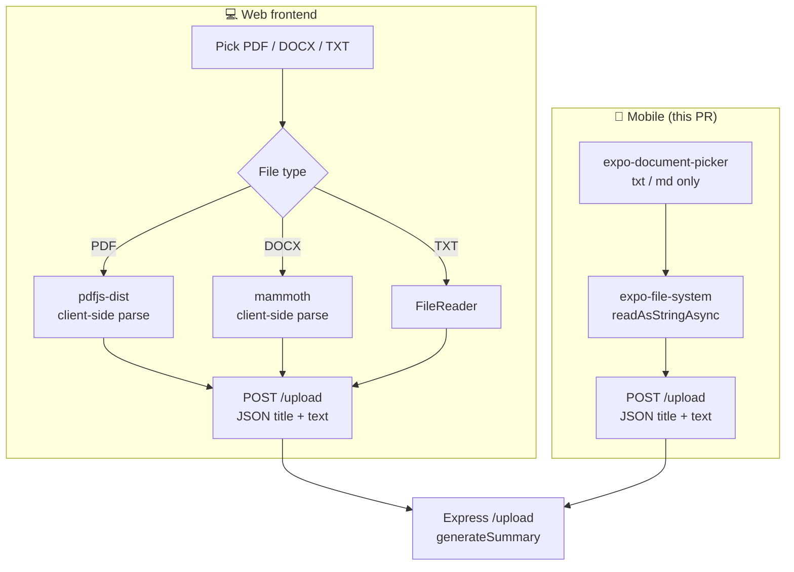
```mermaid
flowchart TB
    subgraph Web["💻 Web frontend"]
        WP["Pick PDF / DOCX / TXT"]
        WP --> WPdf{"File type"}
        WPdf -- "PDF" --> Pdfjs["pdfjs-dist<br/>client-side parse"]
        WPdf -- "DOCX" --> Mammoth["mammoth<br/>client-side parse"]
        WPdf -- "TXT" --> WTxt["FileReader"]
        Pdfjs --> WPost["POST /upload<br/>JSON title + text"]
        Mammoth --> WPost
        WTxt --> WPost
    end

    subgraph Mobile["📱 Mobile (this PR)"]
        MP["expo-document-picker<br/>txt / md only"]
        MP --> MRead["expo-file-system<br/>readAsStringAsync"]
        MRead --> MPost["POST /upload<br/>JSON title + text"]
    end

    WPost --> Backend["Express /upload<br/>generateSummary"]
    MPost --> Backend
```

The backend `/upload` endpoint expects `{userId, title, text}` JSON — it does not parse binary files. The web frontend handles PDF/DOCX by parsing **in the browser** before sending text. The mobile app does not currently ship a comparable RN PDF/DOCX parser because:

1. RN equivalents (`react-native-pdf`, mammoth + xmldom polyfill) require native modules and `expo prebuild`, which would drop the Expo Go workflow this app deliberately preserves.
2. Routing binary uploads through Vercel is not reliable — Vercel serverless functions have a small request-body limit (~4.5 MB) and short hobby-tier timeouts, which makes streaming larger PDFs through `/upload-file` fragile.

Net effect: **upload .txt/.md from mobile; upload PDF/DOCX from the web app**. Both clients then see the same documents in `/documents/:userId`, so the round-trip surface is consistent.

---

## Testing

There is no dedicated unit test suite in this PR — the screens are thin wrappers around `lib/api.ts`, and `lib/auth.ts` is exercised end-to-end on every dev cycle. To smoke-test:

```bash
# Type-check
npx tsc --noEmit

# Bundle (no devices required)
npx expo export --platform ios --output-dir /tmp/expo-export

# Lint
npx expo lint
```

End-to-end verification path:

1. Boot Metro and attach both emulators.
2. Sign in with an account created via the web app.
3. Home tab → confirm `documentCount` matches web.
4. Library tab → confirm documents listed.
5. Pull-to-refresh on Profile.
6. Upload a `.txt`, watch it land in Library.
7. Open a document → Summary → Chat → real Gemini round-trip.
8. Sign out → app should redirect to `/login` without restart.

---

## Troubleshooting

| Symptom | Cause | Fix |
|---|---|---|
| `Project is incompatible with this version of Expo Go` | Device has SDK ≠ 51 Go installed | Let `expo start` install matching Go, or uninstall via `adb uninstall host.exp.exponent` / `xcrun simctl uninstall booted host.exp.Exponent` and re-run |
| Login screen flashes then loops | Vercel backend cold-start returned 5xx | Wait ~10 s and retry — the backend warms up after the first hit |
| Android emulator can't reach Metro | App used `localhost:8081` from emulator | Use `10.0.2.2:8081` (AVD's loopback to the host) |
| "Could not connect to development server" on a stale URL | Go cached a sub-server URL from a prior `expo start --port` | `xcrun simctl terminate booted host.exp.Exponent` / `adb shell am force-stop host.exp.exponent`, then re-open with the current port |
| iOS Simulator has no devices available | Fresh Xcode install with no AVD-equivalent | `xcrun simctl create "iPhone 16 Pro" com.apple.CoreSimulator.SimDeviceType.iPhone-16-Pro com.apple.CoreSimulator.SimRuntime.iOS-18-5 && xcrun simctl boot <udid>` |

---

## Roadmap

- Native PDF/DOCX parsing (requires `expo prebuild` — tracked separately)
- Native Google sign-in (currently a UI stub on mobile)
- Push notifications via Expo Notifications + APNs/FCM
- Offline doc caching via SQLite
- Account-details / appearance / notifications settings panes (currently `Alert` stubs)
- App Store + Play Store distribution

---

## License

CC-BY-NC 4.0 — see [LICENSE.md](../LICENSE.md).

Built by [Son Nguyen](https://github.com/hoangsonww).
