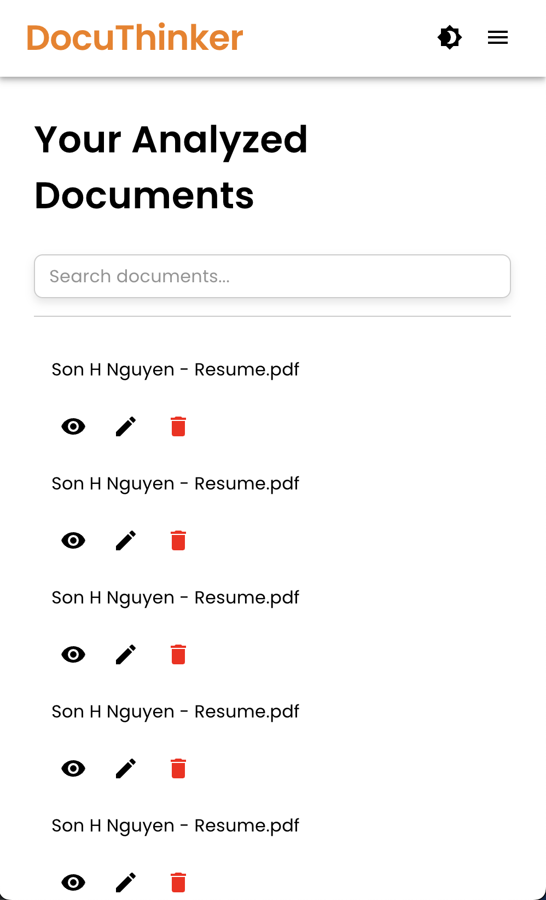

# Welcome to DocuThinker Mobile - A React Native, Expo App 👋

The DocuThinker Mobile app is a React Native app built with Expo. It's a mobile app that helps you manage your documents and notes on the go.

## Table of contents

- [Features](#features)
- [Technologies](#technologies)
- [User Interface](#user-interface)
- [Get Started](#get-started)
- [Get a fresh project](#get-a-fresh-project)
- [Future Plans](#future-plans)
- [Learn more](#learn-more)
- [Contributing](#contributing)
- [License](#license)

## Features

- **Document management**: Create, edit, and delete documents.
- **Note-taking**: Write and save notes.
- **Search**: Find documents and notes quickly.
- **Dark mode**: Switch between light and dark themes.
- **Offline support**: Use the app without an internet connection.
- **Cross-platform**: Run the app on Android, iOS, and the web.
- **Authentication**: Sign in with your Google account.
- **Real-time updates**: See changes in real-time with Firebase Firestore.
- **Push notifications**: Get notified when a document is shared with you.
- **Localization**: Use the app in multiple languages.
- **Accessibility**: Navigate the app with screen readers.

## Technologies

- **React Native**: Build mobile apps with JavaScript and React.
- **Expo**: Develop and build React Native apps quickly.
- **Firebase**: Use Firebase services like Firestore, Authentication, and Cloud Messaging.
- **React Navigation**: Navigate between screens in the app.
- **Redux Toolkit**: Manage app state with Redux Toolkit.
- **React Hook Form**: Handle form state and validation.

## User Interface

The app uses the [Material Design](https://material.io/design) system for its user interface. It follows the [Material Design guidelines](https://material.io/design) for components, typography, and color schemes.

### Landing Page

<p align="center">
  
</p>

### Navigation Drawer

<p align="center">
  
</p>

### Document List

<p align="center">
  
</p>

### How to Use Page

<p align="center">
  
</p>

## Get Started

1. Install dependencies

   ```bash
   npm install
   ```

2. Start the app

   ```bash
    npx expo start
   ```

In the output, you'll find options to open the app in a

- [development build](https://docs.expo.dev/develop/development-builds/introduction/)
- [Android emulator](https://docs.expo.dev/workflow/android-studio-emulator/)
- [iOS simulator](https://docs.expo.dev/workflow/ios-simulator/)
- [Expo Go](https://expo.dev/go), a limited sandbox for trying out app development with Expo

You can start developing by editing the files inside the **app** directory. This project uses [file-based routing](https://docs.expo.dev/router/introduction).

## Get a Fresh Project

When you're ready, run:

```bash
npm run reset-project
```

This command will move the starter code to the **app-example** directory and create a blank **app** directory where you can start developing.

## Future Plans

I am actively working to release on the Google Play Store and Apple App Store are in the works. Stay tuned for updates!

## Learn More

- [React Native documentation](https://reactnative.dev/docs/getting-started)
- [Expo documentation](https://docs.expo.dev)
- [Firebase documentation](https://firebase.google.com/docs)
- [React Navigation documentation](https://reactnavigation.org/docs/getting-started)
- [Redux Toolkit documentation](https://redux-toolkit.js.org/introduction/getting-started)

## Contributing

Contributions are welcome! Here's how you can help:

1. Clone the repository:
   ```bash
   # Clone the repository
   git clone git clone https://github.com/hoangsonww/DocuThinker-AI-App.git
   cd DocuThinker-AI-App/mobile-app
   ```
2. Create a new branch:
   ```bash
    git checkout -b feature/your-branch-name
   ```
3. Make your changes and commit them:
   ```bash
    git add .
    git commit -m 'Add some feature'
   ```
4. Push to the original branch:

   ```bash
   git push origin feature/your-branch-name
   ```

5. Create a pull request in GitHub.
6. Enjoy your contribution!

## License

This project is licensed under the CC-BY-NC 4.0 - see the [LICENSE](../LICENSE.md) file for details.

---

Made with ❤️ by [Son Nguyen](https://github.com/hoangsonww) in 2024.
