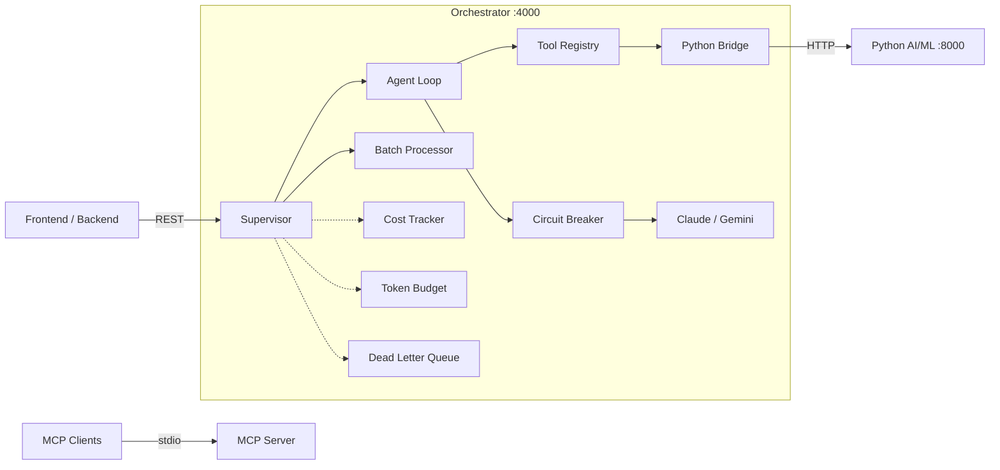

# DocuThinker Agentic Orchestrator

Standalone Node.js service that implements the agentic orchestration layer for DocuThinker. It sits between the frontend/backend and the Python AI/ML services, providing supervisor-driven intent routing, iterative agent loops, circuit breakers, cost tracking, MCP integration, and context management.

## Architecture



### Core Components

| Component | File | Description |
|-----------|------|-------------|
| Supervisor | `core/supervisor.js` | Intent classification (18+ intents), task decomposition into DAGs, parallel dispatch with dependency resolution, provider failover |
| Circuit Breaker | `core/circuit-breaker.js` | Per-provider state machine (CLOSED/OPEN/HALF_OPEN), configurable threshold and cooldown |
| Agent Loop | `core/agent-loop.js` | Iterative tool-use cycle (max 10 iterations), feeds tool results back to LLM until final response |
| Handoff Manager | `core/handoff.js` | Serializes execution context for cross-agent transfers, summarizes conversations for handoff |
| Batch Processor | `core/batch-processor.js` | Processes document arrays with batch size 10, max concurrency 3 |
| Cost Tracker | `core/cost-tracker.js` | Per-request cost calculation using real token pricing, daily/monthly budget enforcement |
| Dead Letter Queue | `core/dlq.js` | Failed operations retry up to 3 times, then move to DLQ for inspection |
| Python Bridge | `core/python-bridge.js` | HTTP client to Python AI/ML service with circuit breaker, abort-controller timeouts |
| Unified LLM Client | `core/providers.js` | Multi-provider client for Anthropic Claude and Google Gemini with automatic failover |
| Tool Registry | `core/tool-registry.js` | Registers local and Python-bridged tools, exposes them in Anthropic tool-use format |

### Context Management

| Component | File | Description |
|-----------|------|-------------|
| Token Budget Manager | `context/token-budget.js` | Estimates tokens, checks against 7+ model context windows, compacts via summarization |
| Conversation Store | `context/conversation-store.js` | In-memory per-user per-document conversations, auto-summarizes at 20 messages, LRU eviction at 10K |
| Context Observability | `context/observability.js` | Records utilization metrics, OpenTelemetry-compatible export, alerts on >80% utilization |
| Hybrid RAG | `context/hybrid-rag.js` | Keyword search (Redis) + semantic search (Python vectors), merged via Reciprocal Rank Fusion |

### Prompt Engineering

| Component | File | Description |
|-----------|------|-------------|
| System Prompts | `prompts/system-prompts.js` | 14 versioned prompts with temperature, maxTokens, and cache strategy per intent |
| Cache Strategy | `prompts/cache-strategy.js` | 3-layer Anthropic prompt caching (system, document, conversation history) |
| Output Schemas | `schemas/ai-outputs.js` | 12 Zod schemas validating all AI outputs (summary, keyIdeas, sentiment, etc.) |

### MCP Integration

| Component | File | Description |
|-----------|------|-------------|
| MCP Server | `mcp/server.js` | Exposes 13 tools over stdio transport for external agents |
| MCP Client | `mcp/client.js` | Connects to external MCP servers via stdio to consume their tools |

## Prerequisites

- **Node.js 18+** (tested with Node.js 20)
- **npm** or **yarn**
- API keys for at least one LLM provider:
  - `ANTHROPIC_API_KEY` for Claude
  - `GOOGLE_AI_API_KEY` for Gemini

## Installation

```bash
cd orchestrator
npm install
```

## Environment Variables

Create an `.env` file in the `orchestrator/` directory:

```env
# LLM Providers (at least one required)
ANTHROPIC_API_KEY=sk-ant-...
GOOGLE_AI_API_KEY=AI...

# Server
PORT=4000

# Python AI/ML service
AI_ML_SERVICE_URL=http://localhost:8000

# Circuit breaker
CIRCUIT_BREAKER_THRESHOLD=3
CIRCUIT_BREAKER_COOLDOWN_MS=60000

# Cost budgets (USD)
DAILY_BUDGET=10
MONTHLY_BUDGET=200
```

## Running

```bash
# Development
npm run dev

# Production
npm start
```

The server starts on `http://localhost:4000`. Verify with:

```bash
curl http://localhost:4000/health
```

## Docker

Build and run the orchestrator container:

```bash
docker build -t docuthinker-orchestrator .
docker run -p 4000:4000 --env-file .env docuthinker-orchestrator
```

Or use docker-compose from the project root to start all services:

```bash
docker compose up --build orchestrator
```

The Dockerfile uses `node:20-alpine`, runs as a non-root user, and includes a health check.

## API Endpoints

### `GET /health`

Full system health report.

**Response:**
```json
{
  "status": "healthy",
  "timestamp": "2026-03-24T12:00:00.000Z",
  "circuitBreakers": { "claude": { "state": "CLOSED", "failures": 0, "uptime": "100.0%" } },
  "pythonBridge": { "healthy": true },
  "costs": { "byProvider": {}, "byIntent": {}, "totalCost": 0, "totalRequests": 0 },
  "promptCache": { "cacheHits": 5, "cacheMisses": 1, "hitRate": "83.3%" },
  "contextObservability": { "totalRequests": 10, "avgUtilization": "12.5%" },
  "conversations": { "active": 3 },
  "dlq": { "dlqMessages": 0, "retryMessages": 0 },
  "providers": ["claude", "gemini"],
  "tools": ["analyze_document_text", "extract_entities", "rag_search", "knowledge_graph_query", "vector_search", "python_sentiment"]
}
```

### `GET /api/costs`

**Response:**
```json
{
  "byProvider": { "claude": { "cost": 0.0045, "requests": 3 } },
  "byIntent": { "document.summarize": { "cost": 0.002, "requests": 2 } },
  "totalCost": 0.0045,
  "totalRequests": 3
}
```

### `GET /api/circuits`

**Response:**
```json
{
  "claude": { "state": "CLOSED", "failures": 0, "uptime": "100.0%" },
  "gemini": { "state": "CLOSED", "failures": 0, "uptime": "98.5%" }
}
```

### `POST /api/supervisor/process`

Route a request through the full supervisor pipeline (classify, budget check, decompose, dispatch, aggregate).

**Request:**
```json
{
  "route": "/generate-key-ideas",
  "text": "Your document text here..."
}
```

**Response:**
```json
{
  "success": true,
  "data": {
    "content": "{\"ideas\": [\"First key idea...\", \"Second key idea...\", \"Third key idea...\"]}",
    "provider": "claude",
    "model": "claude-sonnet-4-20250514",
    "tokensUsed": { "input": 1200, "output": 350, "cacheRead": 800, "cacheCreation": 0 }
  },
  "traceId": "dt-1711288800000-a1b2c3d4"
}
```

### `POST /api/agent/run`

Run the agentic tool-use loop. The agent iterates, calling tools as needed, until it produces a final response or hits the max iteration limit.

**Request:**
```json
{
  "message": "Analyze this document and extract key entities",
  "context": {
    "documentText": "Your document text...",
    "documentTitle": "Q1 Report"
  },
  "provider": "claude"
}
```

**Response:**
```json
{
  "response": "I found the following key entities in your document...",
  "iterations": 3,
  "toolsUsed": 2,
  "tokensUsed": { "input": 3500, "output": 800, "cacheRead": 0, "cacheCreation": 1200 },
  "provider": "claude"
}
```

### `POST /api/batch/process`

Process multiple documents in batches.

**Request:**
```json
{
  "documents": [
    { "id": "doc-1", "text": "First document text..." },
    { "id": "doc-2", "text": "Second document text..." }
  ],
  "operation": "summarize",
  "provider": "claude"
}
```

**Response:**
```json
{
  "results": [
    { "documentId": "doc-1", "status": "success", "data": { "content": "Summary of doc 1..." } },
    { "documentId": "doc-2", "status": "success", "data": { "content": "Summary of doc 2..." } }
  ],
  "errors": [],
  "totalProcessed": 2,
  "totalFailed": 0,
  "successRate": "100.0%"
}
```

Supported operations: `summarize`, `keyIdeas`, `sentiment`.

### `POST /api/token-check`

Check whether a request fits within a model's context window.

**Request:**
```json
{
  "model": "claude-sonnet-4-20250514",
  "systemPrompt": "You are a helpful assistant.",
  "messages": [{ "role": "user", "content": "Hello" }]
}
```

**Response:**
```json
{
  "allowed": true,
  "used": 15,
  "available": 195904,
  "contextWindow": 200000,
  "utilization": "0.0%",
  "overflow": 0,
  "recommendation": null
}
```

### `POST /api/tools/execute`

Execute a registered tool directly.

**Request:**
```json
{
  "tool": "analyze_document_text",
  "input": { "text": "Your document text here..." }
}
```

**Response:**
```json
{
  "success": true,
  "result": {
    "wordCount": 156,
    "sentenceCount": 12,
    "paragraphCount": 3,
    "readingTimeMinutes": 1,
    "topKeywords": [{ "word": "document", "frequency": 5 }]
  }
}
```

### `GET /api/tools`

**Response:**
```json
{
  "tools": [
    { "name": "analyze_document_text", "description": "Analyze document text for word count, sentence count, reading time, keywords", "input_schema": { "type": "object", "properties": { "text": { "type": "string" } }, "required": ["text"] } }
  ],
  "count": 6
}
```

### `GET /api/context-metrics`

**Response:**
```json
{
  "totalRequests": 50,
  "avgUtilization": "15.2%",
  "maxUtilization": "72.3%",
  "cacheHitRate": "65.0%",
  "byProvider": {
    "claude": { "count": 35, "avgUtil": "18.1%", "totalTokens": 125000 },
    "gemini": { "count": 15, "avgUtil": "8.5%", "totalTokens": 45000 }
  }
}
```

### `GET /api/dlq`

**Response:**
```json
{
  "stats": { "dlqMessages": 1, "retryMessages": 0 },
  "messages": [
    {
      "id": "dlq-1711288800000-a1b2c3",
      "timestamp": "2026-03-24T12:00:00.000Z",
      "retryCount": 4,
      "operation": { "type": "summarize", "intent": "document.summarize", "provider": "claude" },
      "error": { "message": "Rate limited", "type": "rate_limited" },
      "context": { "traceId": "dt-...", "userId": "user-123" }
    }
  ]
}
```

### `POST /api/conversations/:userId/:documentId/message`

**Request:**
```json
{
  "role": "user",
  "content": "What are the main findings?"
}
```

**Response:**
```json
{
  "messageCount": 5,
  "hasSummary": false,
  "recentMessages": 5
}
```

### `GET /api/conversations/:userId/:documentId`

**Response:**
```json
{
  "messageCount": 5,
  "messages": [
    { "role": "user", "content": "What are the main findings?", "timestamp": "2026-03-24T12:00:00.000Z" }
  ],
  "hasSummary": false
}
```

### `DELETE /api/conversations/:userId/:documentId`

**Response:**
```json
{ "success": true }
```

## Testing

Run the full integration test suite:

```bash
npm test
```

Run with coverage:

```bash
npm run test:coverage
```

The test suite covers all components: CircuitBreaker, CostTracker, Supervisor, Schemas (12 Zod schemas), System Prompts (14 prompts), TokenBudgetManager, ToolRegistry, BatchProcessor, DeadLetterQueue, ConversationStore, ContextObservability, HybridRAG, AgentLoop, HandoffManager, PythonBridge, UnifiedLLMClient, MCPClient, PromptCacheStrategy, and end-to-end module wiring.

## MCP Server

Run the MCP server standalone (for use with Claude Desktop or other MCP clients):

```bash
node mcp/server.js
```

The server exposes 13 tools over stdio transport:

| Tool | Description |
|------|-------------|
| `document_summarize` | Generate AI summary of text |
| `document_key_ideas` | Extract 3-7 key ideas |
| `document_sentiment` | Analyze sentiment |
| `document_discussion_points` | Generate discussion questions |
| `document_analytics` | Word count, reading time, keywords (runs locally) |
| `document_bullet_summary` | Bullet-point summary |
| `document_rewrite` | Rewrite text in specified style |
| `document_recommendations` | Actionable recommendations |
| `document_chat` | Chat about a document |
| `system_health` | System health check |
| `system_costs` | Cost usage report |
| `rag_query` | RAG search across documents |
| `knowledge_graph_query` | Query knowledge graph |

## Project Structure

```
orchestrator/
├── index.js                    # Express server, routes, component wiring
├── package.json                # Dependencies (Express, Anthropic SDK, Gemini, Zod, MCP SDK)
├── Dockerfile                  # Production container (node:20-alpine, non-root)
├── core/
│   ├── supervisor.js           # Intent classification + task DAG + dispatch
│   ├── circuit-breaker.js      # CLOSED/OPEN/HALF_OPEN per provider
│   ├── agent-loop.js           # Iterative tool-use agent
│   ├── handoff.js              # Cross-agent context transfer
│   ├── batch-processor.js      # Batch document processing
│   ├── cost-tracker.js         # Token cost tracking + budgets
│   ├── dlq.js                  # Dead letter queue + retries
│   ├── python-bridge.js        # HTTP bridge to Python AI/ML
│   ├── providers.js            # Unified LLM client (Claude + Gemini)
│   └── tool-registry.js        # Tool registration + dispatch
├── context/
│   ├── token-budget.js         # Context window management
│   ├── conversation-store.js   # Auto-summarizing conversation memory
│   ├── observability.js        # OTel-compatible context metrics
│   └── hybrid-rag.js           # Keyword + semantic + RRF
├── prompts/
│   ├── system-prompts.js       # 14 versioned system prompts
│   └── cache-strategy.js       # 3-layer Anthropic caching
├── schemas/
│   └── ai-outputs.js           # 12 Zod validation schemas
├── mcp/
│   ├── server.js               # MCP server (13 tools, stdio)
│   └── client.js               # MCP client (stdio)
└── __tests__/
    └── orchestrator.test.js    # Integration tests (Jest)
```
